Налаштування панелі адміністратора WhiteDoc
###################################################################

.. есть картинки с главной инструкции сервиса

.. |account| image:: pics_WD_admin_panel/WD_admin_panel_009.png


.. |settings| image:: pics_WD_admin_panel/WD_admin_panel_011.png

.. |trash| image:: pics_Work_with_WD/Work_with_WD_066.png

.. |pencil| image:: pics_Work_with_WD/Work_with_WD_064.png


.. role:: red

.. role:: underline

.. contents:: Зміст:
   :depth: 7

---------

Вхід
================================================

WEB сервісом підтримуються **Google Chrome** та **Safari** браузери тому для роботи з документами рекомендовано використовувати саме їх. Для входу до сервісу платформи необхідно перейти за посиланням https://edo.whitedoc.ua .

При переході за вказаним посиланням відкриється вікно авторизації. Необхідно ввести Вашу електронну пошту, пароль користувача і натиснути **"Увійти"**:

.. image:: pics_Work_with_WD/Work_with_WD_002.png
   :align: center

За проставленої відмітки **"Запам'ятати мене"** вводити дані наступного разу самостійно вже не буде потреби (браузер це зробить автоматично).  

.. hint::
   Нові користувачі можуть самостійно пройти "Реєстрацію" і долучитись до сервісу (детальніше в нашій `інструкції <https://wiki.edin.ua/uk/latest/WhiteDoc/WD_registration.html>`__).

----------------------------------------------------

Для проведення адміністративних налаштувань на рівні акаунта потрібно клікнути лівою кнопкою мишки на іконку користувача та обрати **"Панель адміністратора"** (`налаштування профілю користувача <https://wiki.edin.ua/uk/latest/WhiteDoc/WD_Instructions/WD_user_profile.html>`__ описані в окремій інструкції):

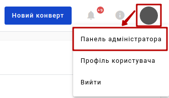

Панель адміністратора має своє окреме меню для зручного переходу між його розділами:

.. image:: pics_WD_admin_panel/WD_admin_panel_034.png
   :align: center

Для виходу з **"Панелі адміністратора"** передбачена кнопка в правому верхньому куті:

.. image:: pics_WD_admin_panel/WD_admin_panel_035.png
   :align: center

Всі налаштування проводяться на рівні акаунта і вибір обмежується лише основними мейлбоксами (до яких прив'язані акаунти), якщо у даного користувача є доступ до інших акаунтів та відповідні дозволи (права): 

.. image:: pics_WD_admin_panel/WD_admin_panel_037.png
   :align: center

.. image:: pics_WD_admin_panel/WD_admin_panel_036.png
   :align: center

.. _account-settings:

**1 Налаштування акаунта**
================================================

В цьому розділі проводяться налаштування облікового запису. В **"Налаштуваннях акаунта"** є три функціональні вкладки: **"Налаштування"** / **"Домени"** / **"SSO провайдери"** / **"Корисні посилання"** / **"Політика паролів"** / **"Хмарний підпис"** (за замовчуванням відкриваються **"Налаштування"**).

.. _settings:

**1.1 Налаштування**
------------------------------------------------------

В сервісі WhiteDoc є два типи акаунтів (тип вибирається при його створенні): **особистий акаунт** і **акаунт компанії**, що в налаштуваннях відрізняються наявністю у останнього поля для "Інформація про компанію":

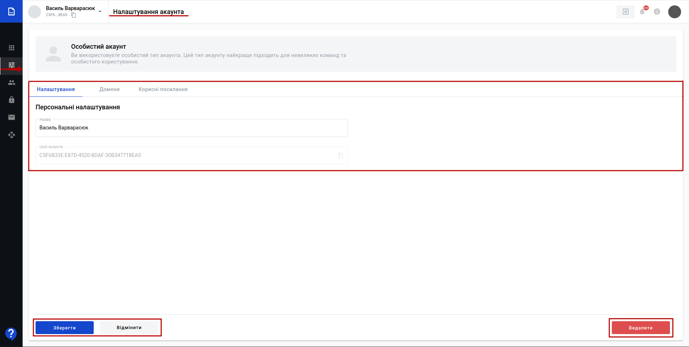

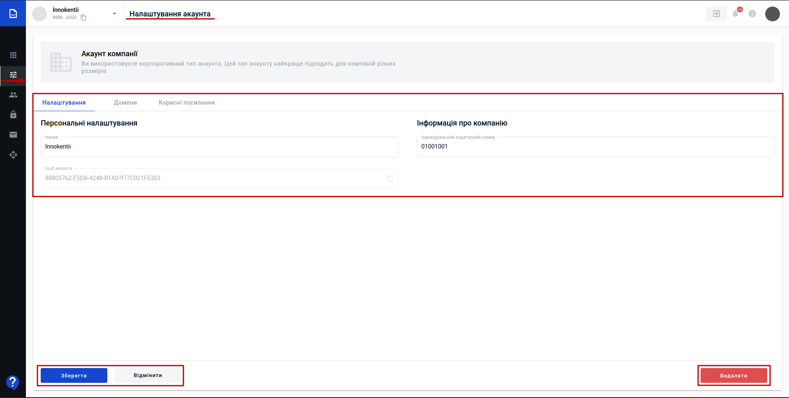

* **Персональні налаштування** - блок, що містить назву (доступно до редагування) та uuid акаунта.
* **Інформація про компанію** (лише для акаунта компанії) - блок, що містить код ІПН (доступно до редагування).

Після того, як в поля, що доступні до редагуваня були внесені зміни їх можливо **"Зберегти"** чи **"Відмінити"** за допомогою кнопок. За допомогою одноіменної кнопки можливо **"Видалити"** акаунт (дія видалення потребує підтвердження): 

.. image:: pics_WD_admin_panel/WD_admin_panel_040.png
   :align: center

.. _domain:

**1.2 Домени**
-----------------------------------------------

Конфігурація доменів дозволяє керувати власними доменанами, активувати та деактивувати домени всередині сервісу. Домени необхідні для додавання, перевірки чи створення користувачів на платформі з доменом, яким Ви володієте. Тобто всі користувачі сервісу WhiteDoc, що мають сказаний на цій сторінці поштовий домен автоматично підв'язуються під цей акаунт.

Для початку потрібно **"Додати домен"** в popo-up вікні вказати його назву та **"Додати"**:

.. image:: pics_WD_admin_panel/WD_admin_panel_042.png
   :align: center

Після чого потрібно верифікувати право власності вказаним доменом (Ви повинні бути власником цього домена):

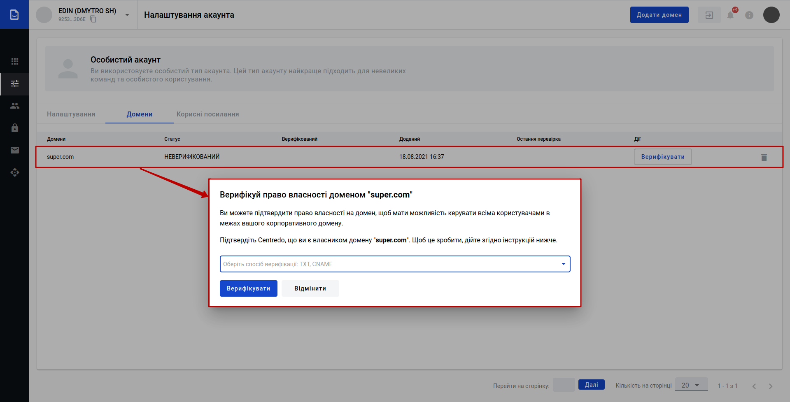

Можливо обрати зручний спосіб верифікації: за допомогою CNAME чи TXT запису. Після того, як формат буде обрано, потрібно підтвердити право власності, користуючись інструкцієїю та натиснувши **"Верифікувати"**:

.. image:: pics_WD_admin_panel/WD_admin_panel_044.png
   :align: center

Зміни додані до DNS налаштувань можуть зайняти деякий час. Як тільки сервіс WhiteDocEdin знайде текстовий запис в DNS налаштуваннях домену, він стане верифікованим у системі (змінить свій статус).

Всі записи завжди можливо **видалити** за допомогою кнопки |trash| (дія видалення потребує підтвердження):

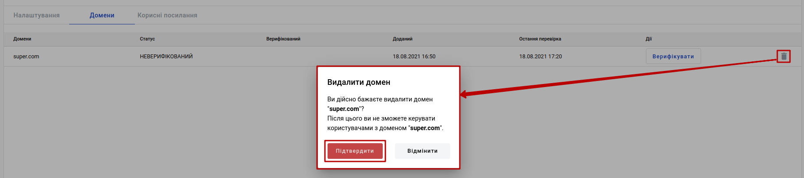

.. attention::
   Якщо Ви хочете, щоб домен залишався верифікованим у системі, не видаляйте запис з налаштувань DNS, навіть після успішної верифікації. Якщо ви видалите перевірений домен, ви втратите можливість керувати користувачем у своєму домені.

Як тільки домен буде підтверджено, ви можете активувати його, щоб скористатися функціями, пов’язаними з доменом, такими як створення користувачів із відповідним доменом.

Натисніть кнопку **"Активувати"**, яка з’являється після успішної перевірки домена:

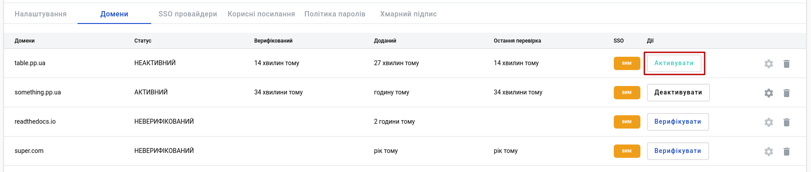

Після того, як домен активовано (статус "активний") за домогою кнопки налаштувань |settings| можливо обрати зі списку та **"Додати"** до активного домена SSO провайдера (провайдери додаються попередньо у вкладці **"SSO провайдери"** - детальніше за `посиланням <https://wiki.edin.ua/uk/latest/WhiteDoc/WD_Instructions/WD_admin_panel.html#sso-providers>`__):

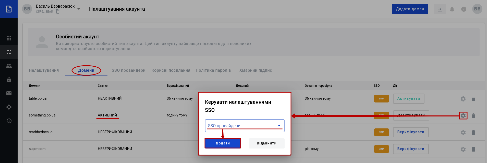

Після підключення SSO провайдера з'являється зелена відмітка "увімкнено" (обраного провайдера можливо **"Редагувати"** за домогою кнопки налаштувань |settings|): 

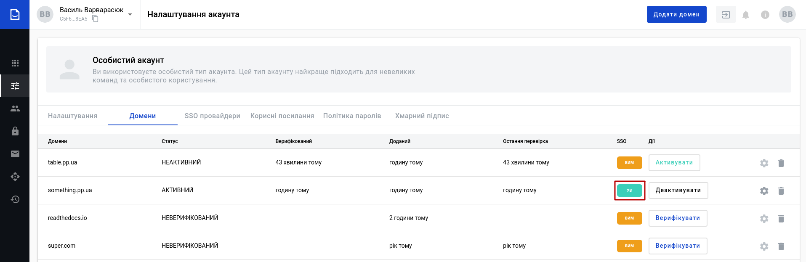

Після підключення SSO до домену ваші корпоративні користувачі зможуть увійти через SSO:

.. використовується в "реєстрації"

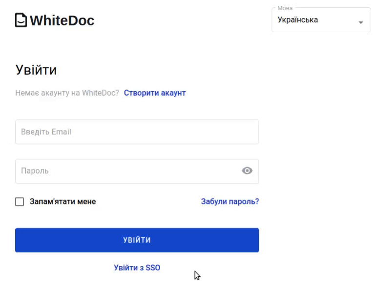

В правому нижньому куті розташований функціонал переходу між сторінками, на вказану сторінку журналу, вибір кількості користувачів на сторінці журналу, кількість елементів в журналі, пейджинг:


.. _sso-providers:

**1.3 SSO провайдери**
-----------------------------------------------

.. hint::
   Single Sign-On (SSO) або система єдиного входу - це метод автентифікації, який дозволяє користувачам безпечно авторизуватися до різних програм, платформ чивеб-сайтів, використовуючи лише один набір облікових даних. Система єдиного входу (SSO) працює на основі довірчих відносин між програмою відомою, як постачальник послуг і провайдером ідентифікаційної інформації (IdP), наприклад Google, Okta, OneLogin, Microsoft AD FS тощо. Ці довірчі відносини часто базуються на сертифікаті, яким обмінюються постачальник ідентифікаційної інформації та постачальник послуг:

   .. image:: pics_WD_admin_panel/WD_admin_panel_092.png
      :align: center

Використання SSO може надати кілька переваг:

* Ви забезпечуєте кращий досвід для користувачів, оскільки вони можуть використовувати свої наявні облікові дані для автентифікації та їм не потрібно вводити облікові дані так часто.
* Ви гарантуєте, що ваш існуючий IdP залишається системою запису для автентифікації користувачів.
* Вам не потрібно синхронізувати паролі з Вашим IdP-провайдером.

В WhiteDoc ви можете налаштувати систему єдиного входу (Single Sign-On), щоб надати співробітникам доступ до WhiteDoc через провайдера ідентифікаційної інформації (IdP), усуваючи паролі з процесу входу для безпечного та швидкого доступу.

Система єдиного входу в WhiteDoc базується на мові розмітки Security Assertion Markup Language 2.0 (SAML 2.0). Метою SAML є увімкнення єдиного входу для веб-додатків у різних доменах. SAML 2.0 є провідним галузевим стандартом для обміну даними автентифікації та авторизації.

У вкладці **"SSO провайдери"** можливо додати своїх SSO провайдерів для налаштування авторизації через SSO для своїх корпоративних користувачів. Для того, щоб **"Створити SSO провайдера"** потрібно натиснути на відповідну кнопку та заповнити поля модального вікна:

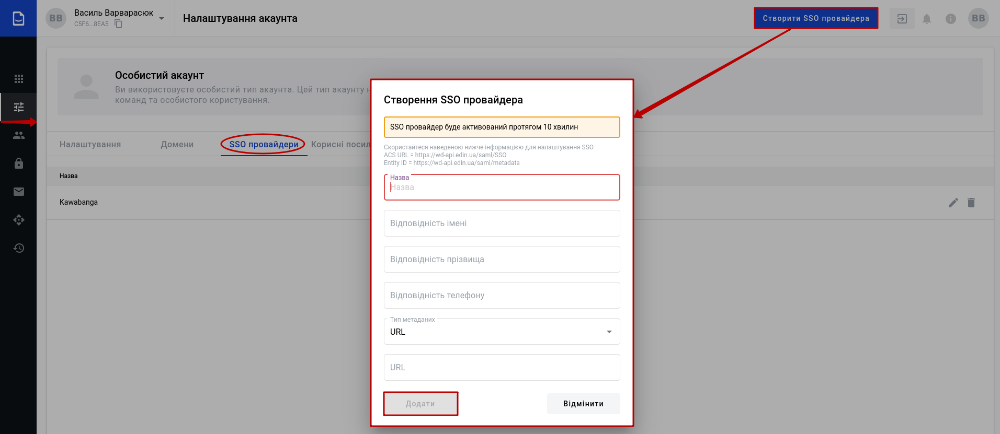

Ви можете вибрати тип метаданих (URL-адреса або XML). Після того, як всі дані будуть заповнені натисніть **"Додати"**.

Додані таким чином провайдерів можливо редагувати |pencil| чи видаляти |trash| (дія видалення потребує підтвердження):

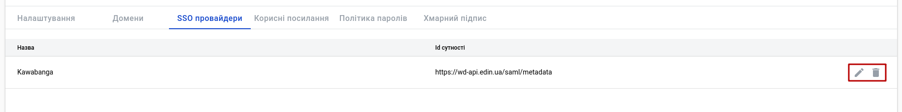

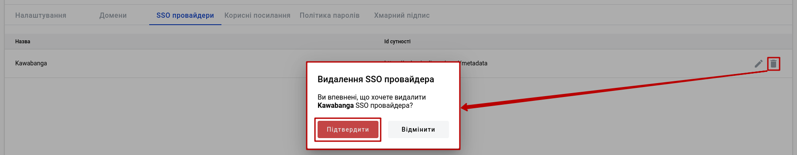

.. _google:

**1.3.1 Налаштування SSO з Google**
`````````````````````````````````````````````````````````````````

Для початку налаштувань увійдіть на сторінку **admin.google.com**, використовуючи обліковий запис адміністратора для керованих сервісів Google, наприклад Google Workspace або Cloud Identity:


Далі, використовуючи меню, потрібно перейти в **"Додатки"** -> **"Мобільні і веб-додатки"**:

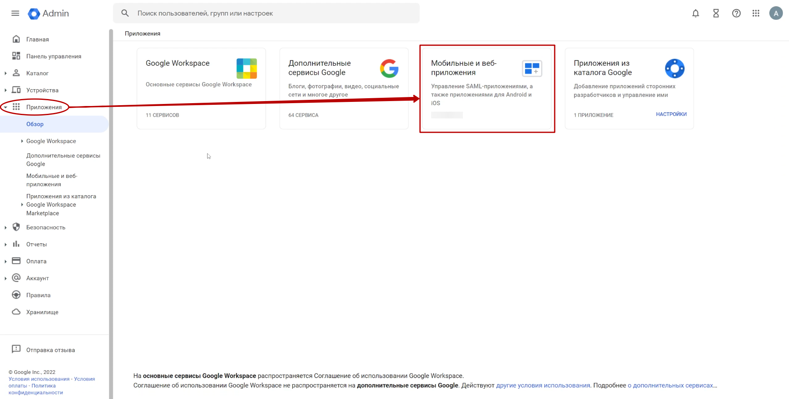

Якщо подібні SSO налаштування проводяться вперше, то SAML-додатку у Вашому списку не буде і його потрібно **"Додати"** -> **"Додати користувацький SAML-додаток"**:

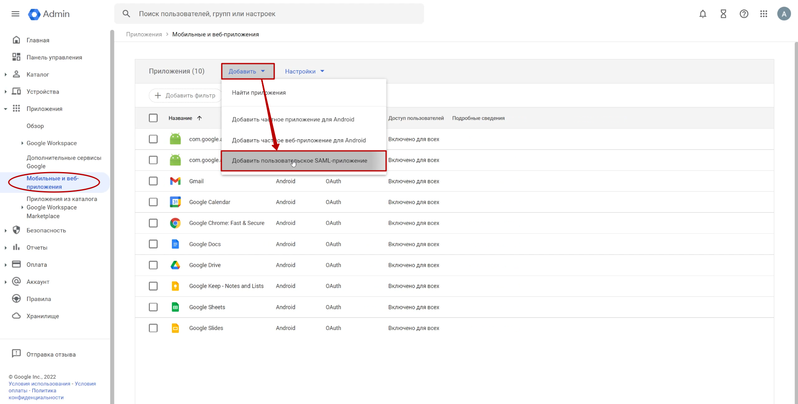

У відкритій формі потрібно вказати назву майбутнього додатку, за потреби прикріпити значок і **"Продовжити"**:

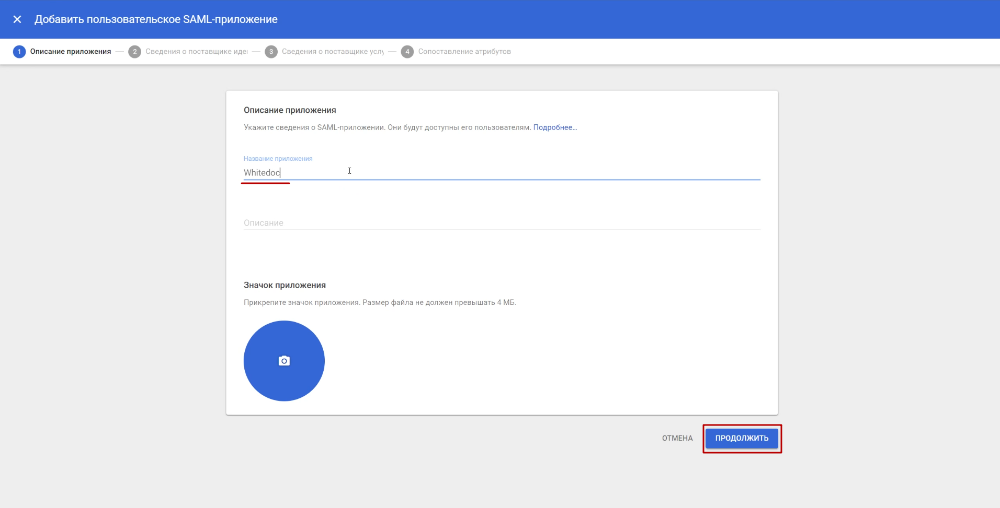

Далі Google надає дані для підключення в двох варіантах на вибір (ми рекомендуємо **"Завантажити метадані"** одним файлом) та **"Продовжити"** налаштування:

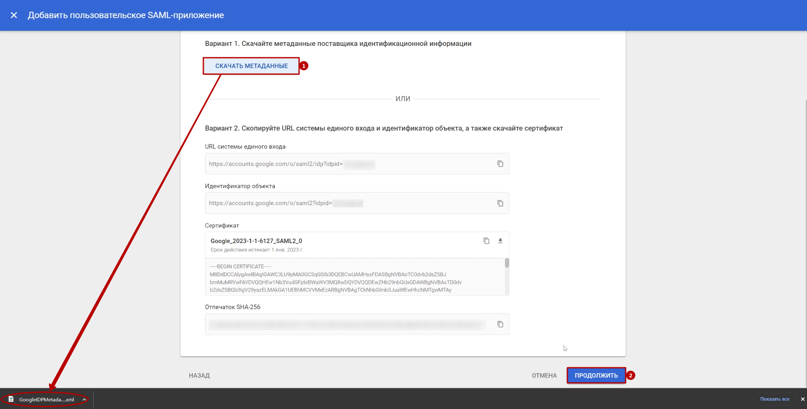

В наступному вікні заповнюються дані зв'язку з платформою WhiteDoc:

* ACS URL = https://api.whitedoc.ua/saml/SSO
* Entity ID = https://api.whitedoc.ua/saml/metadata

Також обирається ідентифікатор назв (в нашому випадку це e-mail) та **"Продовжуємо"** налаштування:

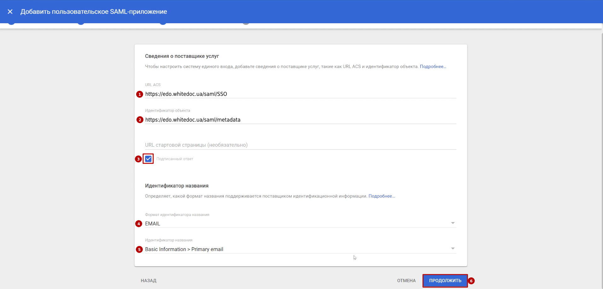

Для WhiteDoc, як постачальника послуг обов'язковими атрибутами є Ім'я та Прізвище, тож ці атрибути потрібно передбачити:

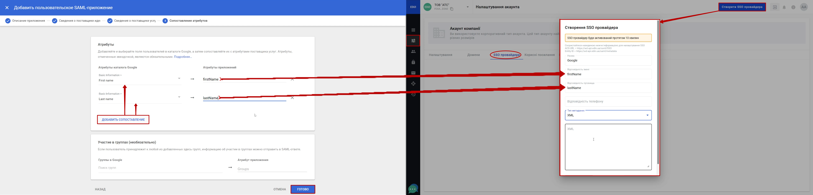

Налаштування на стороні Google, як провайдера ідентифікаційної інформації (IdP) завершено і додаток має відображатись у списку **"Мобільних і веб-додатків"**. При переході в додаток відображаються його налаштування:

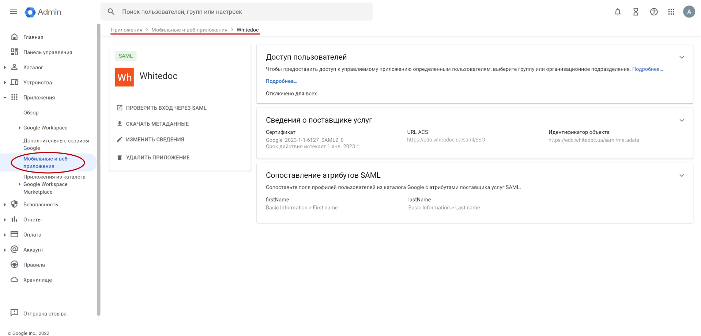

Для завершення налаштувань на стороні WhiteDoc при створенні SSO провайдера потрібно обрати тип метаданих "XML" скопіювати та вставити зміст з раніше завантаженого файлу метаданих Google (файл доступний в налаштуваннях додатка) та натиснути кнопку **"Додати"**: 

.. image:: pics_WD_admin_panel/WD_admin_panel_100.png
   :align: center

SSO провайдер успішно створений:

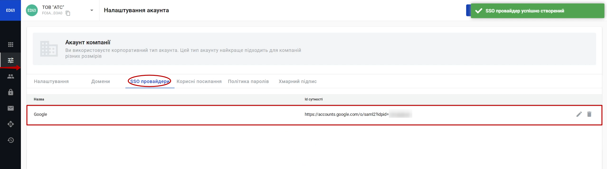

.. hint::
   Не забудьте включити доступ своїм користувачам на стороні Google:

   .. image:: pics_WD_admin_panel/WD_admin_panel_107.png
      :align: center

   .. image:: pics_WD_admin_panel/WD_admin_panel_103.png
      :align: center

.. _useful-links:

**1.4 Корисні посилання**
-----------------------------------------------

**Корисні посилання** - це зовнішні посилання, що можуть бути корисними для користувачів на рівні акаунта (всіх його мейлбоксів) чи окремого мейлбоска.

За допомого одноіменної кнопки можливо **"Додати посилання"** і в pop-up вікні потрібно вказати назву, адресу (url) посилання та рівень доступу (акаунт (всі його мейлбокси) чи окремий мейлбокс), де буде виводитись посилання:

.. image:: pics_WD_admin_panel/WD_admin_panel_048.png
   :align: center

Посилання в сформованому таким чином списку можливо редагувати |pencil| чи видаляти |trash| (дія видалення потребує підтвердження):

.. image:: pics_WD_admin_panel/WD_admin_panel_050.png
   :align: center

.. image:: pics_WD_admin_panel/WD_admin_panel_053.png
   :align: center

А порядок посилань змінювати:

.. image:: pics_WD_admin_panel/WD_admin_panel_051.gif
   :align: center

Саме в такому порядку виводяться ці посилання в назначених мейлбоксах. Результат:

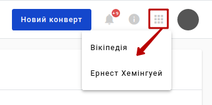

.. _users:

**2 Користувачі**
================================================

Розділ керування користувачами (створення / редагування / запрошення / видалення). У розіді відображаються список всіх користувачів, що були запрошені до акаунта чи його мейлбоксу/-ів.

.. image:: pics_WD_admin_panel/WD_admin_panel_008.png
   :align: center

На сторінці присутній рядок **"Пошуку за іменем"** користувача (1), а також фільтри, що дозволяють відсортувати список запрошених користувачів за доменом, одним з мейбоксів чи наданою роллю (ПОСИЛАННЯ НА РОЛІ І ПЕРМІШЕНИ). В правому нижньому куті (3) розташований функціонал переходу між сторінками, на вказану сторінку журналу, вибір кількості користувачів на сторінці журналу, кількість елементів в журналі, пейджинг. В журналі відображаються персональні дані користувачів (email, ім'я, прізвище), доступ до мейлбоків, що додатково візуалізується (2) іконками (|account| - користувач має права доступу до акаунта; |envelope| - користувач має права доступу до мейлбокса). Для детального перегляду налаштувань користувача потрібно натиснути на кнопку |settings| (детально описані в підрозділі нижче).


.. для того, щоб **"Створити"** користувача потрібно натиснути на одноіменну кнопку:

.. для видалення користувача/-ів потрібно відмітити їх в журналі та натиснути на кнопку **"Видалити користувача/-ів"**:

Увага, якщо у акаунта немає верифікованого домена, то дії **"Створення"** та **"Видалення"** користувачів неактивні і сервіс видає повідомлення над деактивованими кнопками: "У вас немає активованих верифікованих доменів. Додайте, верифікуйте та активуйте домен для того, щоб користуватися функціоналом."

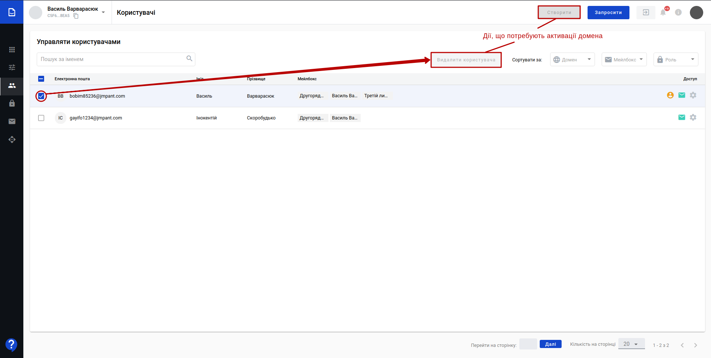

**2.1 Запрошення користувача**
-----------------------------------

Для того, щоб **"Запросити"** користувача потрібно натиснути на одноіменну кнопку та в pop-up вікні ввести його email, назву та підтвердити дію, ще раз натиснувши **"Запросити"**:

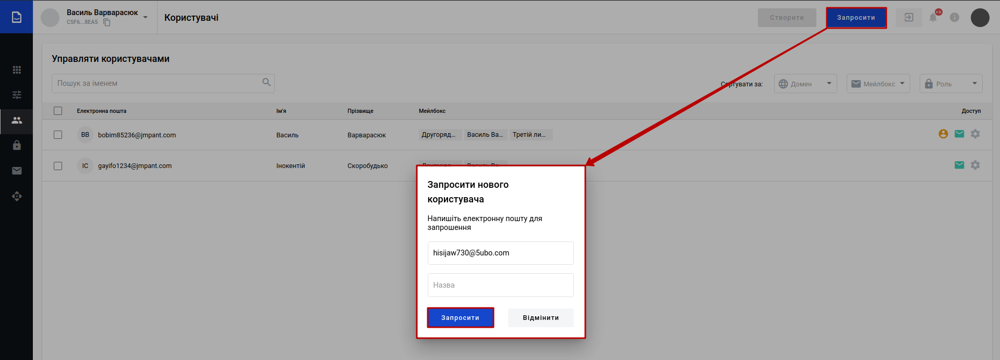

Після чого одразу відкриваються налаштування для майбутнього запрошеного користувача, що мають три основні вкладки: **"Акаунт"** / **"Мейлбокс"** / **"Небезпечна зона"** (за замовчуванням відкритий **"Акаунт"**):

.. image:: pics_WD_admin_panel/WD_admin_panel_019.png
   :align: center

**2.1.1 Акаунт**
''''''''''''''''''''''''''''''''''''''''''''''''''''''''''''''''''''''''''''''

**Акаунт** - налаштування доступу до акаунта (якщо доступ надавати НЕ потрібно, то налаштування не проводяться).

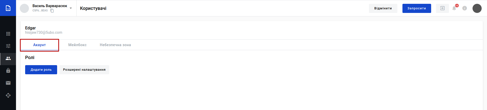

Можливо **"Додати роль"** (обрати зі списку), що вже була створена в "Панелі адміністратора" Ролі акаунтів ПОСИЛАННЯ:

.. image:: pics_WD_admin_panel/WD_admin_panel_017.png
   :align: center

(при цьому можливо переназначити роль, додати нову чи видалити обрану, однак окремі дозволи при цьому не редагуються):

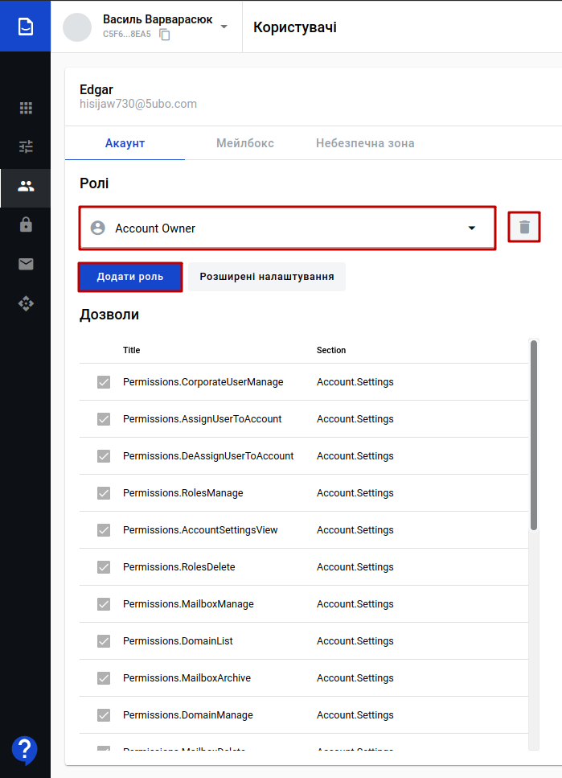

Також можливо обрати **"Розширені налаштування"** (обрати зі списку окремі дозволи на рівні акаунта ПОСИЛАННЯ) і застосувати їх:

.. image:: pics_WD_admin_panel/WD_admin_panel_015.png
   :align: center

(при цьому можливо "закривати" і "відкривати" ці дозволи присутністю/відсутністю відмітки в чекбоксі конкретного дозволу):

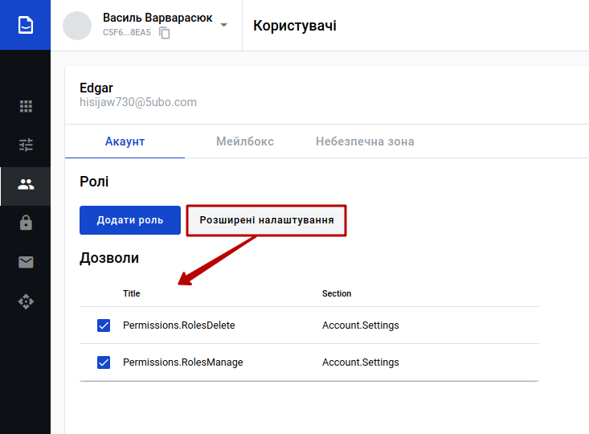

**2.1.2 Мейлбокс**
''''''''''''''''''''''''''''''''''''''''''''''''''''''''''''''''''''''''''''''

**Мейлбокс** - налаштування доступу до мейлбокса/-ів (якщо доступ надавати НЕ потрібно, то налаштування не проводяться).

.. image:: pics_WD_admin_panel/WD_admin_panel_019.png
   :align: center

Для початку налаштування доступу потрібно обрати зі списку "Мейлбоксів без доступу", той, до якого потрібно налаштовувати доступ за роллю чи окремими дозволами.

Можливо **"Додати роль"** (обрати зі списку), що вже була створена в "Панелі адміністратора" Ролі мейлбоксів ПОСИЛАННЯ:

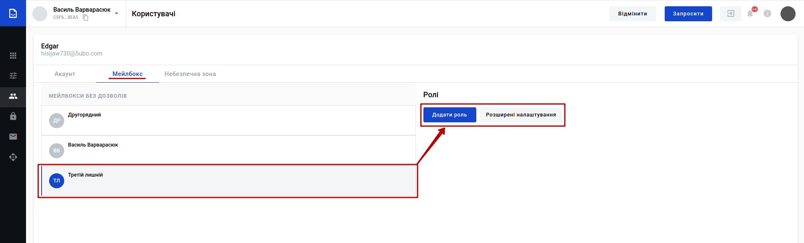

.. image:: pics_WD_admin_panel/WD_admin_panel_021.png
   :align: center

(при цьому можливо переназначити роль, додати нову чи видалити обрану, однак окремі дозволи при цьому не редагуються):

.. image:: pics_WD_admin_panel/WD_admin_panel_022.png
   :align: center

Також можливо обрати **"Розширені налаштування"** (обрати зі списку окремі дозволи на рівні мейлбокса ПОСИЛАННЯ) і застосувати їх:

.. image:: pics_WD_admin_panel/WD_admin_panel_023.png
   :align: center

(при цьому можливо "закривати" і "відкривати" ці дозволи присутністю/відсутністю відмітки в чекбоксі конкретного дозволу чи **"Видалити всі дозволи"** одразу):

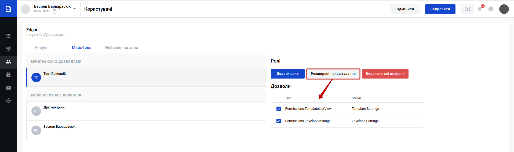

**2.1.3 Небезпечна зона**
''''''''''''''''''''''''''''''''''''''''''''''''''''''''''''''''''''''''''''''

**Небезпечна зона** - налаштування, що стосуються радикальних змін і в даному випадку ведуть до видалення всіх доступів конкретного користувача (**"Видалити всі дозволи до акаунта"**) та видалення цього користувача (**"Видалити користувача з акаунта"**).

.. image:: pics_WD_admin_panel/WD_admin_panel_025.png
   :align: center

Дії видалення потребують підтвердження, наприклад:

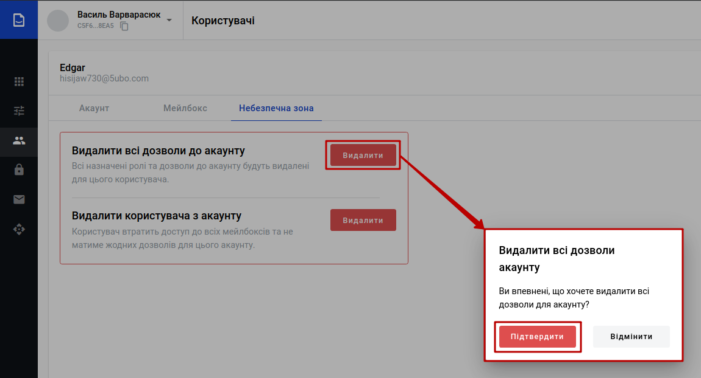

--------------------------------------------------

Після того, як всі налаштування доступу будуть виконані потрібно **"Запросити"** цього користувача:

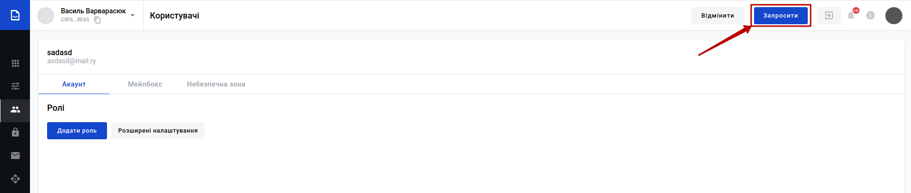

Сервіс проінформує повідомленням про успішність:

.. image:: pics_WD_admin_panel/WD_admin_panel_027.png
   :align: center

Якщо користувач, якого запросили уже користується сервісом, то йому згідно його налаштувань (ПОСИЛАННЯ) в сервіс WhiteDoc надійде повідомлення та email, а саме запрошення буде відображатись в Інформації профілю (вкладка `Запрошення <https://wiki.edin.ua/uk/latest/WhiteDoc/WD_Instructions/WD_user_profile.html#invite>`__):

.. image:: pics_WD_admin_panel/WD_admin_panel_029.png
   :align: center

Навпроти користувачів, що ще не відповіли на запрошення є можливість **"Відкликати"** (відміна зі сторони відправника запрошення) та **"Перевислати"** запрошення. При "перевисиланні" отримувач запрошення ще раз буде проінформований про запрошення згідно його налаштувань (ПОСИЛАННЯ):

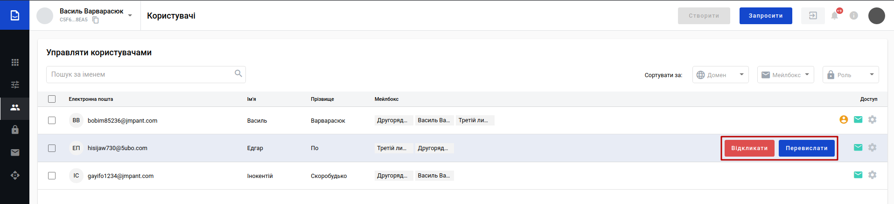

Ці кнопки також доступні при перегляді налаштувань |settings| цього користувача:

.. image:: pics_WD_admin_panel/WD_admin_panel_033.png
   :align: center

.. _roles:

**3 Ролі**
================================================

Розділ керування ролями та дозволами. В сервісі існує два типи дозволів: дозволи акаунта і дозволи мейлбокса, що окремо об'єднуються у відповідні ролі. Для ролей на рівні акаунта і мейлбокса передбачені окремі вкладки: **"Акаунт"** та **"Мейлбокс"**. 

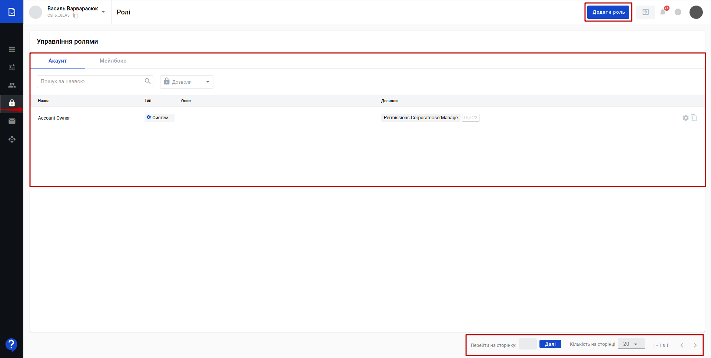

Кожна вкладка має рядок пошуку за назвою ролі, а також фільтр за дозволами. В правому нижньому куті розташований функціонал переходу між сторінками, на вказану сторінку журналу, вибір кількості користувачів на сторінці журналу, кількість елементів в журналі, пейджинг.

На рівні акаунта та мейлбокса вже присутні системні ролі (не доступна до видалення), що мають назви "Account Owner" і "mailbox Owner" відповідно та включають в себе всі дозволи на своєму рівні.

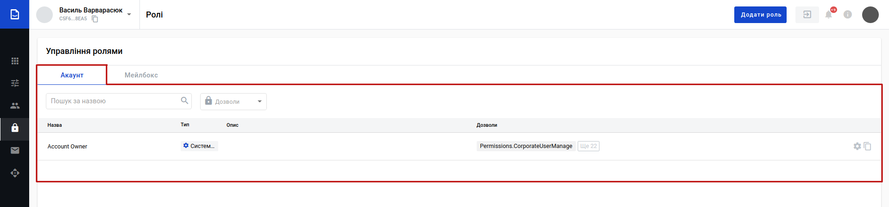

**3.1 Додавання ролі**
-----------------------------------

Для створення нової ролі потрібно натиснути на кнопку **"Додати роль"**:

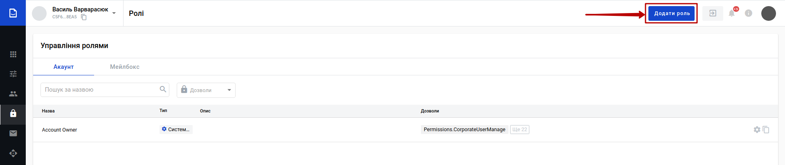

Після чого відкриється вікно створення нової ролі (для того, щоб повернутись до списку ролей можливо скористатись кнопкою **"До ролей"** (1)):

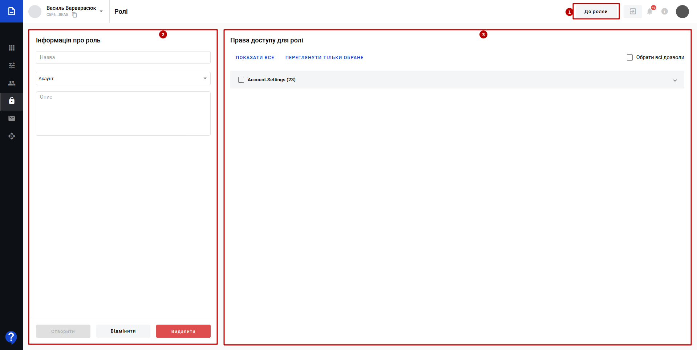

В блоці "Інформація про роль" (2) потрібно вказати "Назву", "Опис" за потреби та обрати рівень на якому буде створено роль (вибір рівня ролі впливає на список дозволів в блоці "Права доступу для ролі" (3), що буде включати майбутня роль):

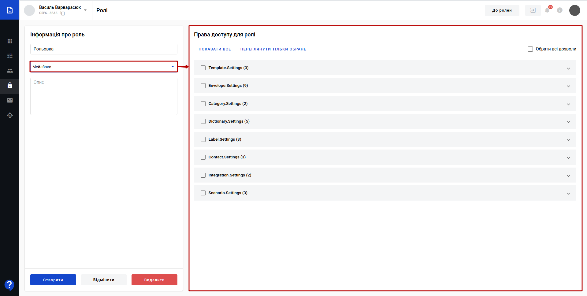

В блоці "Права доступу для ролі" потрібно обрати дозволи, що буде включати майбутня роль (всі дозволи детально описані в наступних підрозділах за посиланнями: `"Дозволи акаунта" <https://wiki.edin.ua/uk/latest/WhiteDoc/WD_Instructions/WD_admin_panel.html#account-permissions>`__ та `"Дозволи мейлбокса" <https://wiki.edin.ua/uk/latest/WhiteDoc/WD_Instructions/WD_admin_panel.html#mailbox-permissions>`__). Дозволи розділені на групи і для того аби відкрити/закрити список дозволів, що налічує група можливо скористатись кнопками |arrowD| / |arrowU| відповідно або відкрити/закрити всі групи за допомогою кнопки **"Показати все"**:

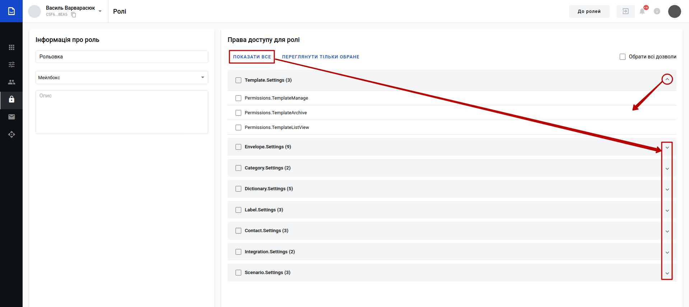

За допомогою відмітки **"Обрати всі дозволи"** можливо обрати всі дозволи у всіх групах:

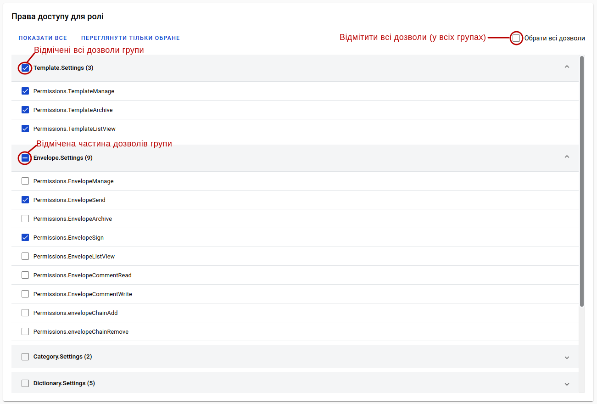

За допомогою кнопки **"Переглянути тільки обране"** список відфільтрується лише за відміченими дозволами:

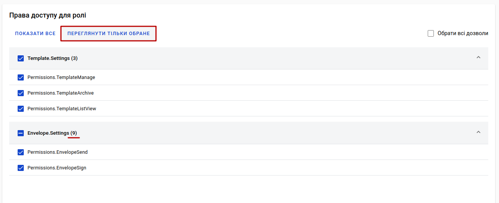

Після того, як всі необхідні дозволи будуть обрані потрібно **"Створити"** роль: 

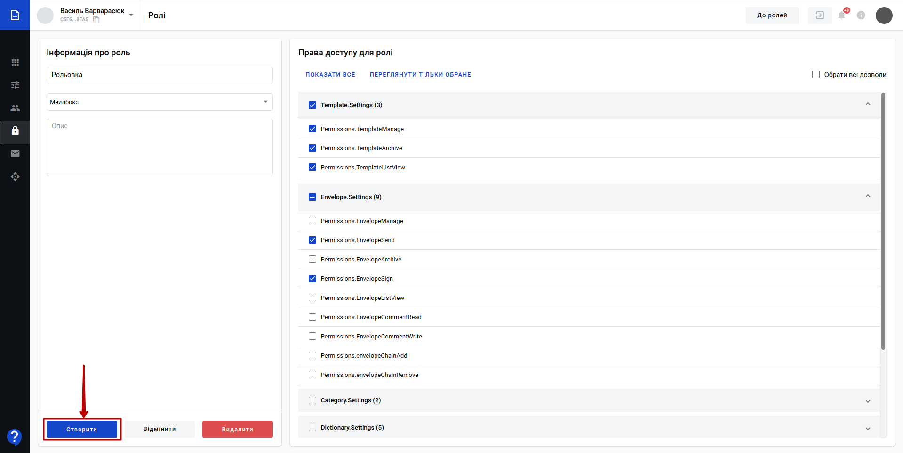

Успішно створена роль відображається в журналі ролей у відповідній вкладці. В колонці "Дозволи" відображається один дозвіл та кнопка **"Ще N"**, що відкриває список ще з N дозволами, доступними для цієї ролі: 

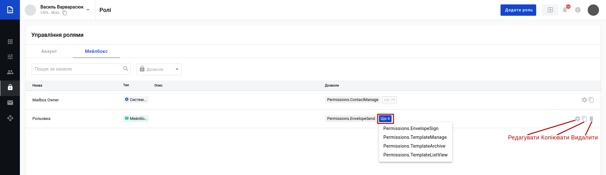

Всі створені ролі можливо редагувати, копіювати та видаляти (дія видалення потребує підтвердження):

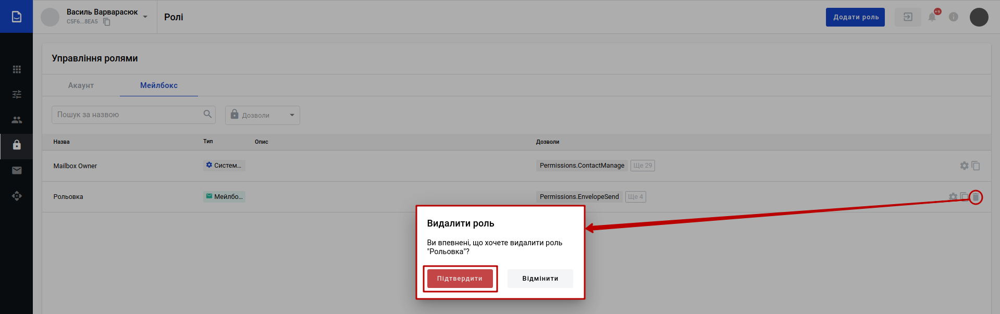

**3.2 Редагування ролі**
-----------------------------------

Для редагування будь-якої ролі (окрім системних) потрібно натиснути на кнопку з іконкою шестерні:

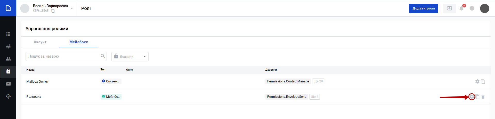

На відміну від створення, при редагуванні ролі не можливо змінити тип рівня ролі, а також після внесення усіх змін вони зберігаються кнопкою **"Оновити"**:

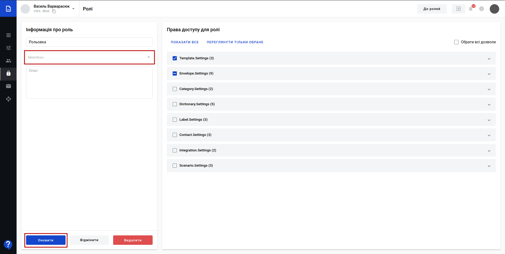

При редагуванні ролі її також можливо **"Видалити"** (дія видалення потребує підтвердження).

**3.3 Копіювання ролі**
-----------------------------------

Для копіювання будь-якої ролі потрібно натиснути на кнопку |copy|:

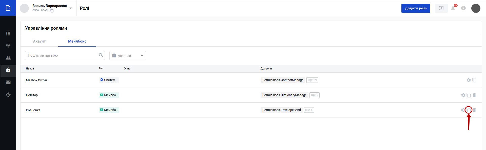

При копіюванні створюється нова роль без назви з уже заданим рівнем ролі і скопіюваним набором дозволів (як у обраної до копіювання ролі):

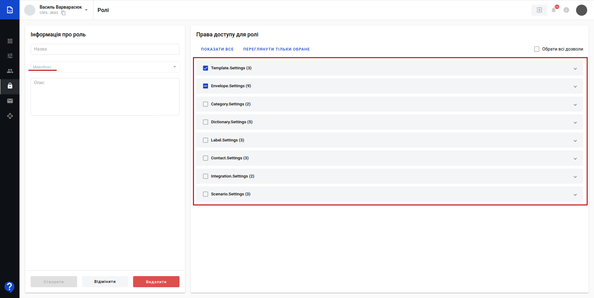

В цій ролі можливо змінювати всі параметри (окрім рівня ролі), а по завершенню внесення змін її можливо **"Створити"**, як при додаванні нової ролі. 

.. _account-permissions:

**3.4 Дозволи акаунта**
-----------------------------------

+------------------------------------------------------------------------------------+
|                             **Account.Settings (23)**                              |
+====================================================================================+
| **Permissions.AssignUserToAccount** - дозвіл призначати користувачів до акаунта    |
+------------------------------------------------------------------------------------+
| **Permissions.DeAssignUserToAccount** - дозвіл вилучати користувачів з акаунта     |
+------------------------------------------------------------------------------------+
| **Permissions.RolesManage** - дозвіл редагувати ролі                               |
+------------------------------------------------------------------------------------+
| **Permissions.RolesDelete** - дозвіл видаляти ролі                                 |
+------------------------------------------------------------------------------------+
| **Permissions.MailboxManage** - дозвіл керувати мейлбоксами                        |
+------------------------------------------------------------------------------------+
| **Permissions.MailboxArchive** - дозвіл на архівування                             |
+------------------------------------------------------------------------------------+
| **Permissions.MailboxDelete** - дозвіл на видалення мейлбоксів                     |
+------------------------------------------------------------------------------------+
| **Permissions.AccountDetailsEdit** - дозвіл на редагування акаунта                 |
+------------------------------------------------------------------------------------+
| **Permissions.AccountDelete** - дозвіл на видалення акаунта                        |
+------------------------------------------------------------------------------------+
| **Permissions.AliasCreate** - дозвіл на створення аліасів                          |
+------------------------------------------------------------------------------------+
| **Permissions.AliasDelete** - дозвіл на видалення аліасів                          |
+------------------------------------------------------------------------------------+
| **Permissions.UserAssign** - дозвіл на створення користувачів                      |
+------------------------------------------------------------------------------------+
| **Permissions.UserDeAssign** - дозвіл на видалення користувачів                    |
+------------------------------------------------------------------------------------+
| **Permissions.UserListView** - дозвіл на перегляд списку користувачів              |
+------------------------------------------------------------------------------------+
| **Permissions.RolesListView** - дозвіл на перегляд списку ролей                    |
+------------------------------------------------------------------------------------+
| **Permissions.MailboxListView** - дозвіл на перегляд списку мейлбоксів             |
+------------------------------------------------------------------------------------+
| **Permissions.DomainList** - дозвіл на перегляд списку доменів                     |
+------------------------------------------------------------------------------------+
| **Permissions.DomainManage** - дозвіл на керування доменами                        |
+------------------------------------------------------------------------------------+
| **Permissions.CorporateUserManage** - дозвіл на керування користувачами            |
+------------------------------------------------------------------------------------+
| **Permissions.AccountSettingsView** - дозвіл на перегляд налаштувань акаунта       |
+------------------------------------------------------------------------------------+
| **Permissions.ExternalLinkListView** - дозвіл на перегляд списку корисних посилань |
+------------------------------------------------------------------------------------+
| **Permissions.ExternalLinkManage** - дозвіл на керування корисними посиланнями     |
+------------------------------------------------------------------------------------+
| **Permissions.ExternalLinkDelete** - дозвіл на видалення корисних посилань         |
+------------------------------------------------------------------------------------+

.. _mailbox-permissions:

**3.5 Дозволи мейлбокса**
-----------------------------------

+------------------------------+
|  **Template.Settings (3)**   |
+==============================+
| Permissions.TemplateManage   |
+------------------------------+
| Permissions.TemplateArchive  |
+------------------------------+
| Permissions.TemplateListView |
+------------------------------+

+----------------------------------+
|    **Envelope.Settings (9)**     |
+==================================+
| Permissions.EnvelopeManage       |
+----------------------------------+
| Permissions.EnvelopeSend         |
+----------------------------------+
| Permissions.EnvelopeArchive      |
+----------------------------------+
| Permissions.EnvelopeSign         |
+----------------------------------+
| Permissions.EnvelopeListView     |
+----------------------------------+
| Permissions.EnvelopeCommentRead  |
+----------------------------------+
| Permissions.EnvelopeCommentWrite |
+----------------------------------+
| Permissions.envelopeChainAdd     |
+----------------------------------+
| Permissions.envelopeChainRemove  |
+----------------------------------+

+----------------------------+
| **Category.Settings (2)**  |
+============================+
| Permissions.CategoryManage |
+----------------------------+
| Permissions.CategoryDelete |
+----------------------------+

+---------------------------------+
|   **Dictionary.Settings (5)**   |
+=================================+
| Permissions.DictionaryManage    |
+---------------------------------+
| Permissions.DictionaryArchive   |
+---------------------------------+
| Permissions.DictionaryRowManage |
+---------------------------------+
| Permissions.DictionaryRowDelete |
+---------------------------------+
| Permissions.DictionaryListView  |
+---------------------------------+

+-------------------------------+
|    **Label.Settings (3)**     |
+===============================+
| Permissions.LabelManage       |
+-------------------------------+
| Permissions.LabelDelete       |
+-------------------------------+
| Permissions.LabelAssignManage |
+-------------------------------+

+-----------------------------+
|  **Contact.Settings (3)**   |
+=============================+
| Permissions.ContactManage   |
+-----------------------------+
| Permissions.ContactDelete   |
+-----------------------------+
| Permissions.ContactListView |
+-----------------------------+

+-------------------------------+
| **Integration.Settings (2)**  |
+===============================+
| Permissions.IntegrationView   |
+-------------------------------+
| Permissions.ManageIntegration |
+-------------------------------+

+------------------------------+
|  **Scenario.Settings (3)**   |
+==============================+
| Permissions.ScenarioListView |
+------------------------------+
| Permissions.ScenarioManage   |
+------------------------------+
| Permissions.ScenarioDelete   |
+------------------------------+

**4 Мейлбокси**
================================================

Розділ призначений для керування поточними мелбоксами та їх налаштуваннями:

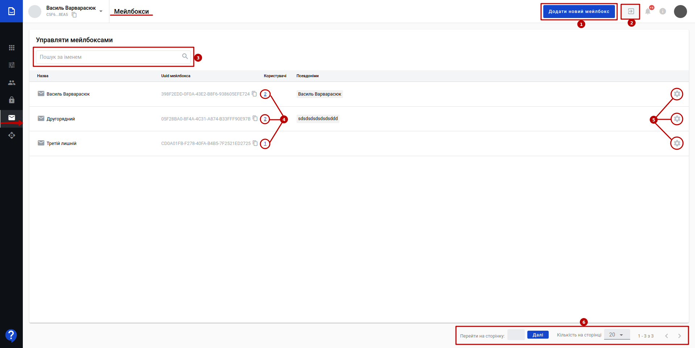

Розділ дозволяє створювати нові мейлбокси (1), переглядати і редагувати їх налаштування (5). Всі мейлбокси відображаються списком в журналі, де вказується їх назва, uuid, кількість користувачів, що мають до них доступ (4) та псевдоніми. На сторінці присутній рядок пошуку за назвою мейлбокса (3), а в правому нижньому куті розташований функціонал переходу між сторінками, на вказану сторінку журналу, вибір кількості користувачів на сторінці журналу, кількість елементів в журналі, пейджинг (6).

**4.1 Створення/редагування мейлбокса**
-----------------------------------------------------------

Для створення нового мейлбокса потрібно натиснути на кнопку **"Додати новий мейлбокс"** та в pop-up вікні вказати його назву (1-255 символів):

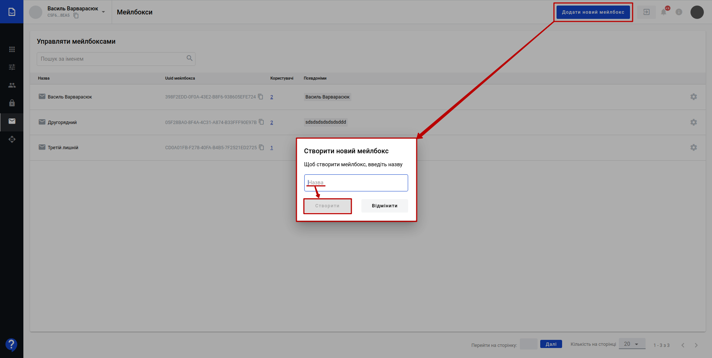

Після чого в журналі з'являється новий мейлбокс і для редагування налаштувань створеного чи будь-якого іншого мейлбокса потрібно натиснути на кнопку з іконкою шестерні:

.. image:: pics_WD_admin_panel/WD_admin_panel_074.png
   :align: center

Вікно налаштувань містить кнопку для швидкого повернення **"До мейлбоксів"** (списку) та інформацію мейлбоксу, що має вкаладки: **"Налаштування"** та **"Небезпечна зона"**.

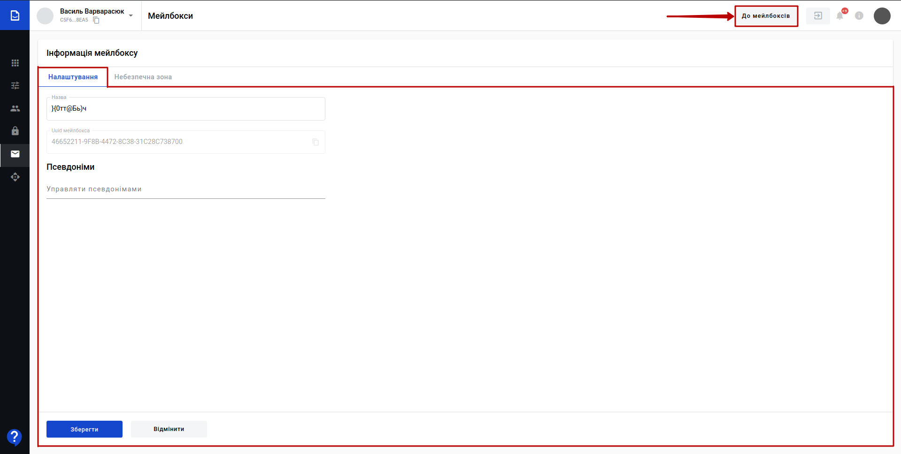

У вкладці **"Налаштувань"** (відкривається за замовчуванням) відображаються "Назва" (поле доступне до редагування), "uuid" мейлбокса та його псевдоніми/аліаси (задаються через кому):


Після введення всіх змін їх можливо **"Зберегти"** чи **"Відмінити"**.

У вкладці "Небезпечна зона" знаходяться налаштування, що стосуються радикальних змін і в даному випадку ведуть до видалення всіх користувачів з мейлбокса (**"Видалити користувачів з мейлбоксу"**) та видалення цього мейлбокса (**"Видалити мейлбокс"**) разом з доступом до його контенту (шаблонів, довідників, тощо):

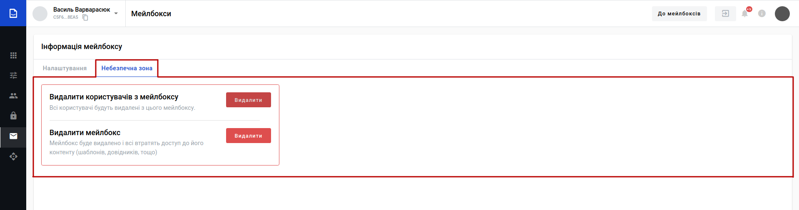

Дії видалення потребують підтвердження, наприклад:

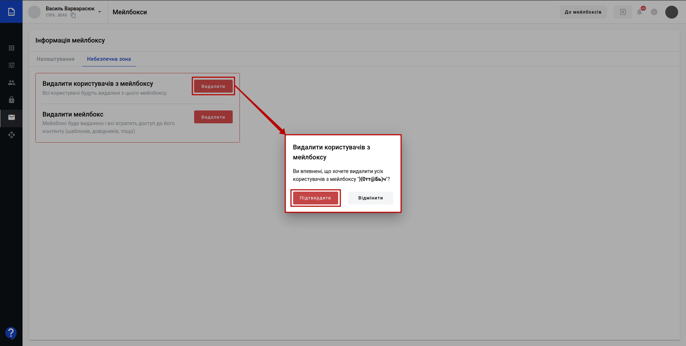

.. attention::
   Видалений мейлбокс не можливо відновити. Мейлбокс зникає зі списку і якщо користувач спробує використати видалений мейлбокс, то він отримає 410 помилку і буде перенаправлений на інший мейлбокс, до якого він має доступ. Якщо користувач не має доступу до будь-якого іншого мейлбокса, то він буде переспрямований у `профіль користувача <https://wiki.edin.ua/uk/latest/WhiteDoc/WD_Instructions/WD_user_profile.html>`__. 

**5 Інтеграції**
================================================

У розділі **Інтеграції** представлені налаштування інтеграції з сервісом WhiteDoc за такими протоколами передачі даних, як SFTP, AS2, SOAP. Як користувач цієї платформи ви вже можете використовувати інтеграцію через `API <https://wd-api.edin.ua/swagger-ui/#/>`__. `API <https://wd-api.edin.ua/swagger-ui/#/>`__ доступна за замовчуванням і може використовуватись разом з іншими інтеграціями.

.. note::
   Всі налаштування в даному розділі вступають в силу лише за умови, що дана інтеграція активована: |switcherOn| (перемикач (1) в активному положенні).

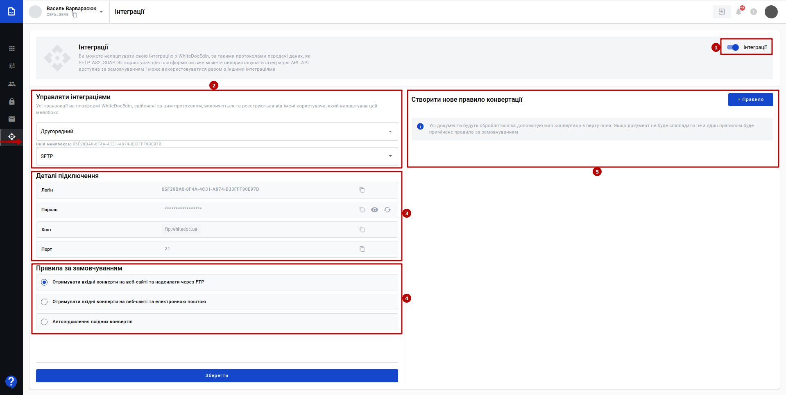

**Інтеграції** розділені на кілька функціональних блоків: **"Управляти інтеграціями"** (2), **"Деталі підключення"** (3), **"Правила за замовчуванням"** (4), **"Створити нове правило конвертації"** (5).

У блоці **"Управління інтеграцією"** (2) клієнт може налаштувати властивості інтеграції для конкретного мейлбокса за обраним протоколом з'єднання.

.. attention::
   **"Деталі підключення"** (3) генеруються автоматично відповідно до протоколу з'єднання (`детальніше <https://wiki.edin.ua/uk/latest/WhiteDoc/WD_Instructions/WD_admin_panel.html#ftp>`__) і є унікальними для кожного мейлбокса. Клієнт може скопіювати кожен з цих параметрів, натиснувши кнопку копіювання. Клієнт не може змінювати будь-які параметри, крім пароля. Для зміни пароля клієнт повинен натиснути кнопку "оновити пароль". 

.. important::
   **"Правила конвертації"** (5) завжди в пріоритеті, однак якщо вхідні конверти не підпадають під жодне наявне правило конвертації, то використовуються **"Правила за замовчуванням"**. Усі документи будуть оброблятися за допомогую карт конвертації з верху вниз. Якщо документ не буде співпадати з жодним правилом, то буде використано **"Правило за замовчуванням"**. Усі нові правила будуть відображені в цьому списку. Користувач може вмикати/вимикати кожне правило з цього списку. Кожне існуюче правило конвертації можна оновити, видалити або клонувати, тому клієнт повинен відкрити це правило, натиснувши на назву правила.

В **"Правилах за замовчуванням"** (4) можливо обрати один з варіантів (використовуються, якщо вхідний документ не буде співпадати з жодним правилом конвертації):

* "Отримувати вхідні конверти на веб-сайті та надсилати через FTP" - вхідні конверти додатково надсилаються на FTP сервер;
* "Отримувати вхідні конверти на веб-сайті та електронною поштою" - додаткова відправка вхідних конвертів на пошту;
* "Автовідхилення вхідних конвертів" - автоматичне "Відхилення" вхідних конвертів, що не підпадають під жодне наявне правило конвертації.

Якщо вхідні документи не відповідають жодним правилам конвертації або клієнт не створює жодних правил до документів, буде застосовано одне з правил за замовчуванням. Клієнт може вибрати лише одне з трьох правил за замовчуванням. Коли клієнт вибирає правило "Автовідхилення вхідних конвертів", то він може надати причину відхилення, і весь вхідний документ буде відхилено з цією причиною. 

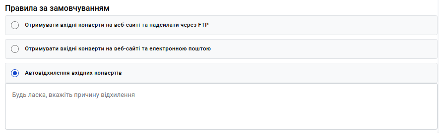

**5.1 Додати нове правило конвертації**
-----------------------------------------------------------

Правило конвертації дозволяє перетворювати документ із формату замовника (eancom/xml) у формат WhiteDoc і може здійснювати зворотне конвертації. Для цього клієнт повинен створити правило конвертації і в залежності від його вибору на цій сторінці він може створити правило конвертації для вхідних та вихідних документів. Крім того, якщо клієнт відкрив існуюче правило конвертації, він може оновити, видалити або клонувати це правило.

За замовчуванням список правил конвертації порожній. Для створення нового правила потрібно натиснути кнопку **"+Правило"**, після чого відкривається сторінка створення нового правила (повернутись **"До інтеграцій"** можливо за допомогою одноіменної кнопки):

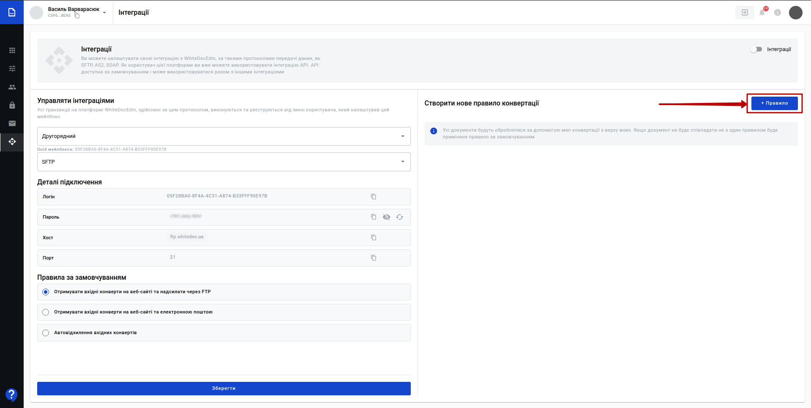

Процеси створення правил конвертації для вхідного та вихідного конверта дещо відрізняються. 

**5.1.1 Створення правил конвертації для вихідного конверта**
''''''''''''''''''''''''''''''''''''''''''''''''''''''''''''''''''''''''''''''

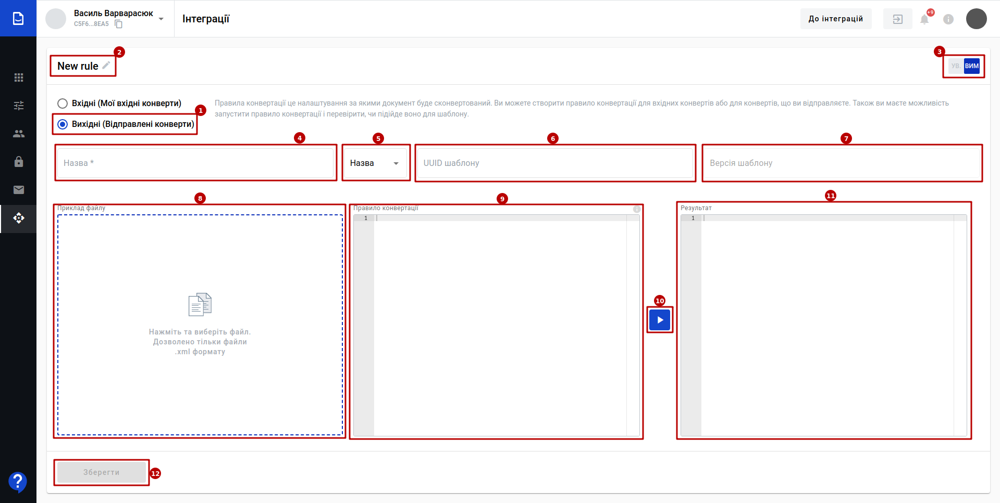

Для створення правила конвертації для вихідного документа потрібно встановити прапорець (1). У полі (2) клієнт може вказати назву правила або залишити назву за замовчуванням. У полі (4) замовник повинен надати **назву правила відповідності** (правила можливо створити за допомогою RegExp).

.. important::
   Наприклад, у Вас є пара файлів з різними іменами та схожою частиною імені: "example111.txt", "example222.txt" та "example333.txt". Щоб написати правило відповідності, яке підходить для всіх файлів, Ви можете написати наступний вираз: ``example.*.txt`` і всі файли будуть відповідати вашому шаблону відповідності. Як використовувати регулярний вирази, ви можете знайти за `посиланням <https://en.wikipedia.org/wiki/Regular_expression>`__.

У полі (5) клієнт повинен вибрати контент, що буде відповідати правилу відповідності:

* **Назва** - правило відповідності буде відповідати назві файлу;
* **Зміст** - правило відповідності буде відповідати вмісту файлу.

У полі (6) клієнт повинен надати UUID шаблону, який відповідає вихідному документу.

Поле (7) буде автоматично заповнено останньою версією шаблону. За потреби можливо обрати версію шаблону (7) з запропонованого списку. Після заповнення полів (6) та (7) поля (9) та (11) будуть заповнені автоматично створеними даними.

У поле (9) додається правило конвертації (клієнт може переглянути приклад правила конвертації, натиснувши на піктограму інформації всередині поля (9)), за потреби клієнт може оновити правило конвертації всередині цього поля (9). У полі (11) показаний автогенерований шаблон.

Для заповнення поля прикладу вихідного файлу (8) клієнт повинен натиснути на це поле, після чого відкриється провідник файлів, де клієнт може вибрати вихідний файл на локальній машині. Після вибору та відкриття файлу дані з цього файлу відображатимуться у цьому полі (8). Якщо клієнт хоче оновити дані в цьому полі, він повинен внести зміни у файл та завантажити оновлений файл у це поле.

Коли поля (8) та (9) заповнюються правильними даними, клієнт може перевірити результат конвертації, для цього необхідно натиснути кнопку "Запустити конвертацію" (10), після цього у блоці Результат (11) буде показано результуючий конверт.

Якщо виконання завершилося успішно, клієнт може зберегти нове правило конвертації, для цього потрібно натиснути кнопку **"Зберегти"** (12).

Клієнт може ввімкнути правило конвертації на цій сторінці, для цього потрібно перемістити перемикач (3) вліво і натиснути кнопку **"Зберегти"** (12). Після цього всі вихідні документи, що відповідають правилу відповідності, будуть застосовані до цього правила конвертації. 

**5.1.2 Створення правил конвертації для вхідного конверта**
''''''''''''''''''''''''''''''''''''''''''''''''''''''''''''''''''''''''''''''

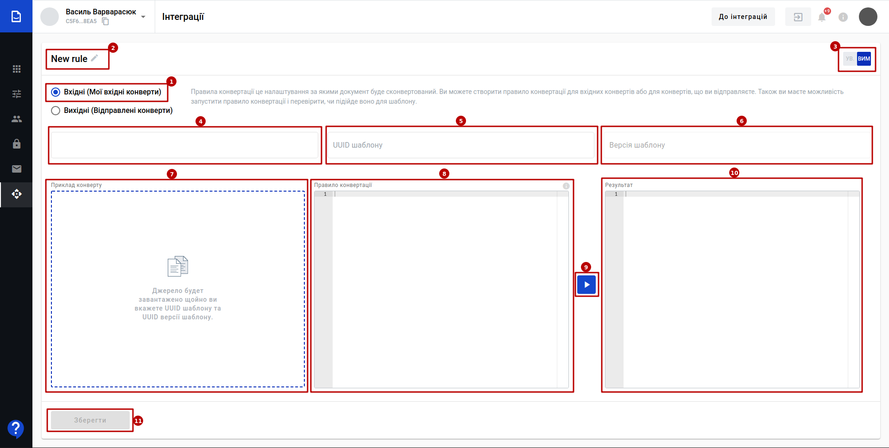

Для створення правила конвертації для вхідного документа потрібно встановити прапорець (1). У полі (2) клієнт може вказати назву правила або залишити назву за замовчуванням. У полі (4) клієнт повинен вказати ім'я, це ім'я буде частиною повного імені для всіх конвертованих документів. Повне ім'я буде складатися з імені з поля (4)+часу, коли цей документ був перетворений, якщо документ зі схожою назвою вже був створений. Ви можете налаштувати ім'я, використовуючи спеціальні змінні для шаблону іменування:

* {mailboxUuid} - UUID поштової скриньки, який використовує функціональні можливості інтеграції;
* {envelopeUuid} - UUID конверта, створеного на платформі;
* {randomNumber} - випадкове число;
* {templateUuid} - UUID шаблону на платформі, за допомогою якого було створено конверт;
* {date dateFormat} - дата отримання конверта у потрібному вам форматі (dateFormat може бути DDMMYYYY або будь-який із доступних форматів дати).

У полі (5) клієнт повинен надати UUID шаблону, який відповідає вхідному документу.

Поле (6) буде автоматично заповнене останньою версією шаблону. За потреби можливо обрати версію шаблону (6) з запропонованого списку. Після заповнення полів (5) та (6) поле (7) буде заповнено автоматично створеними даними. Якщо клієнт хоче змінити дані в полі (7), він повинен оновити певний шаблон і вибрати необхідну версію шаблону.

У полі (8) потрібно додати правило конвертації вхідних даних, яке буде використовуватися для конвертації всіх вхідних файлів, за потреби клієнт може оновити правило конвертації всередині цього поля (8).

Коли поля (7) та (8) заповнюються правильними даними, клієнт може перевірити результат конвертації, для цього необхідно натиснути кнопку "Запустити конвертацію" (9), після цього у блоці Результат (10) буде показаний приклад документа після конвертації.

Якщо виконання завершилося успішно, клієнт може зберегти нове правило конвертації, для цього потрібно натиснути кнопку **"Зберегти"** (11).

Клієнт може ввімкнути правило конвертації на цій сторінці, для цього потрібно перемістити перемикач (3) вліво і натиснути кнопку **"Зберегти"** (11). Після цього до всіх вхідних документів буде доступно це правило конвертації.

**5.1.3 Правила конвертації (додатково)**
''''''''''''''''''''''''''''''''''''''''''''''''''''''''''''''''''''''''''''''

**5.1.3.1 WdExtensions**
..............................................................................

**WdExtensions** - це довідковий клас Java для роботи зі словниками всередині карти XSLT. Щоб застосувати його, потрібно додати такий простір імен:

.. code:: xml

   <?xml version='1.0'?>
   <xsl:stylesheet version="1.0"
                   xmlns:xsl="http://www.w3.org/1999/XSL/Transform"
                   xmlns:saxon="http://saxon.sf.net/"
                   xmlns:wdExtensions="java:com.whitedoc.xslt.extensions.WdExtensions"
                   exclude-result-prefixes="saxon wdExtensions">

Існує 2 статичних методи:

1. wdExtensions:getValueFromDictionary(String dictionaryUuid, String columnByUuid, String valueToFind, String columnToFind)
Можна використовувати для пошуку значення у стовпці
2. wdExtensions:getRecordUuidByValueFromDictionary(String dictionaryUuid, String columnUuid, String valueToFind)
Може використовуватися для пошуку UUID запису словника 

**5.1.3.2 Приклад правила конвертації для вихідних документів**
..............................................................................

.. code:: xml

    <?xml version='1.0'?>
    <xsl:stylesheet version="1.0"
                    xmlns:xsl="http://www.w3.org/1999/XSL/Transform"
                    xmlns:saxon="http://saxon.sf.net/"
                    xmlns:wdExtensions="java:com.whitedoc.xslt.extensions.WdExtensions"
                    exclude-result-prefixes="saxon wdExtensions">
        <xsl:output indent="yes"/>

        <xsl:template match="/">
            <xsl:apply-templates select="EDIFACT/ORDERS"/>
            <xsl:apply-templates select="EANCOM/ORDERS"/>
        </xsl:template>

        <xsl:template match="ORDERS">
            <xsl:variable name="supplierGLN" select="../UNB/UNB03/UNB0301"/>
            <xsl:variable name="senderGLN" select="../UNB/UNB02/UNB0201"/>
            <xsl:variable name="supplierUuid" select="wdExtensions:getValueFromDictionary('a5390637-f3b5-49f3-b7f6-48132f6fe8bb', '7f9d20ab-71d8-45e0-9756-2887fd427cd6', $supplierGLN, 'f69ee017-1fb3-4ff1-a803-c4ade48ea65e')"/>
            <envelope templateUuid="579ba3f3-7e26-4c7a-845c-ffa0fdf78057" templateVersion="55809865-32df-4341-91b0-b8bc44451394">
                <info>
                    <subject>Замовлення на постачання № <xsl:choose><!--Dlya MTI-->
                        <xsl:when test="../UNB/UNB02/UNB0201=4820140450000"><xsl:value-of select="BGM/BGM02/BGM0201"/></xsl:when>
                        <xsl:otherwise><xsl:value-of select="BGM/BGM02"/></xsl:otherwise>
                    </xsl:choose>
                    </subject>
                    <message>Оригінал замовлення</message>
                </info>
                <state>
                  <message/>
                  <date>
                    2021-02-03T12:22:52.709Z
                  </date>
                  <roleId>

                  </roleId>
                </state>
                <documents>
                    <document id="cd511754-cfd1-49a3-aae4-aab212d83cea">
                        <field name="NUMBER">
                            <xsl:choose><!--Dlya MTI-->
                                <xsl:when test="../UNB/UNB02/UNB0201=4820140450000"><xsl:value-of select="BGM/BGM02/BGM0201"/></xsl:when>
                                <xsl:otherwise><xsl:value-of select="BGM/BGM02"/></xsl:otherwise>
                            </xsl:choose>
                        </field>
                        <xsl:apply-templates select="DTM"/>
                        <xsl:apply-templates select="GROUP_2" mode="YC1"/>
                        <xsl:if test="GROUP_7/CUX/CUX01/CUX0102 and ../UNB/UNB03/UNB0301!='4829900003227'">
                            <field name="CURRENCY"><xsl:value-of select="GROUP_7/CUX/CUX01/CUX0102"/></field>
                        </xsl:if>
                        <xsl:choose>
                            <xsl:when test="GROUP_1/RFF/RFF01/RFF0102 and ../UNB/UNB02/UNB0201='4820086630009'">
                                <field name="INFO">№ акции: <xsl:value-of select="GROUP_1/RFF/RFF01/RFF0102"/></field>
                            </xsl:when>
                            <xsl:when test="../UNB/UNB02/UNB0201='4823060600005'">
                                <field name="INFO"><xsl:value-of select="FTX/FTX04/FTX0401"/>, <xsl:value-of select="FTX/FTX04/FTX0402"/>, <xsl:value-of select="FTX/FTX04/FTX0403"/></field>
                            </xsl:when>
                        </xsl:choose>
                        <xsl:apply-templates select="GROUP_2" mode="NAD"/>
                        <fieldgroup name="POSITION">
                            <xsl:choose>
                                <xsl:when test="../UNB/UNB03/UNB0301='4829900003227'">
                                    <xsl:apply-templates select="GROUP_28" mode="LOREAL"/>
                                </xsl:when>
                                <xsl:when test="GROUP_28">
                                    <xsl:apply-templates select="GROUP_28"/>
                                </xsl:when>
                                <xsl:otherwise>
                                    <xsl:apply-templates select="GROUP_25"/>
                                </xsl:otherwise>
                            </xsl:choose>
                        </fieldgroup>
                        <field name="POSITIONSCOUNT"><xsl:value-of select="count(//GROUP_28)"/></field>
                        <field name="SUMORDEREDQUANTITY"><xsl:value-of select="sum(//QTY0102)"/></field>
                    </document>
                </documents>
                <flow>
                    <roles>
                        <role id="f9378c46-5dfe-484a-b985-5a157d238b5c" mailboxUuid="625d1530-8896-49a5-b53c-37e5ade5e750"/>
                        <role id="d59d8545-f1d2-4008-951f-2f43509d966e" mailboxUuid="{$supplierUuid}"/>
                    </roles>
                </flow>
            </envelope>
        </xsl:template>

        <xsl:template match="DTM">
            <xsl:choose>
                <xsl:when test="DTM01/DTM0101 = '137'">
                    <field name="DATE">
                        <xsl:value-of select="substring(DTM01/DTM0102, 7, 2)"/>-<xsl:value-of select="substring(DTM01/DTM0102, 5, 2)"/>-<xsl:value-of select="substring(DTM01/DTM0102, 1, 4)"/>
                    </field>
                </xsl:when>
                <xsl:when test="DTM01/DTM0101 = '2'">
                    <xsl:if test="string-length(DTM01/DTM0102) = '12'">
                        <field name="DELIVERYDATE">
                            <xsl:value-of select="substring(DTM01/DTM0102, 7, 2)"/>-<xsl:value-of select="substring(DTM01/DTM0102, 5, 2)"/>-<xsl:value-of select="substring(DTM01/DTM0102, 1, 4)"/>
                        </field>
                    </xsl:if>
                    <xsl:if test="string-length(DTM01/DTM0102) = '8'">
                        <field name="DELIVERYDATE">
                            <xsl:value-of select="substring(DTM01/DTM0102, 7, 2)"/>-<xsl:value-of select="substring(DTM01/DTM0102, 5, 2)"/>-<xsl:value-of select="substring(DTM01/DTM0102, 1, 4)"/>
                        </field>
                    </xsl:if>
                </xsl:when>
            </xsl:choose>
        </xsl:template>

        <xsl:template match="GROUP_2" mode="YC1">
            <xsl:choose>
                <xsl:when test="NAD/NAD01 = 'SU'">
                    <xsl:if test="NAD/NAD03">
                        <field name="CAMPAIGNNUMBER">
                            <xsl:value-of select="NAD/NAD03"/>
                        </field>
                    </xsl:if> <xsl:apply-templates select="GROUP_3" mode="YC1"/>
                </xsl:when>
            </xsl:choose>
        </xsl:template>

        <xsl:template match="GROUP_3" mode="YC1">
            <xsl:choose>
                <xsl:when test="RFF/RFF01/RFF0101='YC1'">
                    <field name="CAMPAIGNNUMBER">
                        <xsl:value-of select="RFF/RFF01/RFF0102"/>
                    </field>
                </xsl:when>
            </xsl:choose>
        </xsl:template>

        <xsl:template match="GROUP_2" mode="NAD">
            <xsl:choose>
                <xsl:when test="NAD/NAD01='SU'">
                    <xsl:variable name="supplierRecordValue" select="NAD/NAD02/NAD0201"></xsl:variable>
                    <field name="SUPPLIER" recordUuid="{wdExtensions:getRecordUuidByValueFromDictionary('a5390637-f3b5-49f3-b7f6-48132f6fe8bb', '7f9d20ab-71d8-45e0-9756-2887fd427cd6', $supplierRecordValue)}">
                        <xsl:value-of select="$supplierRecordValue"/>
                    </field>
                </xsl:when>
                <xsl:when test="NAD/NAD01='BY'">
                    <xsl:variable name="buyer" select="string-length(NAD/NAD02/NAD0201)"/>
                    <xsl:choose>
                        <xsl:when test="$buyer=13">
                            <xsl:variable name="buyerRecordValue" select="NAD/NAD02/NAD0201"></xsl:variable>
                            <field name="BUYER" recordUuid="{wdExtensions:getRecordUuidByValueFromDictionary('258a20bd-ffe5-47b4-a76a-5d440469e444', '592553ba-3e02-43c1-bff6-b7fa438b8fda', $buyerRecordValue)}">
                                <xsl:value-of select="$buyerRecordValue"/>
                            </field>
                        </xsl:when>
                        <xsl:otherwise>
                            <field name="BUYERCODE">
                                <xsl:value-of select="NAD/NAD02/NAD0201"/>
                            </field>
                        </xsl:otherwise>
                    </xsl:choose>
                </xsl:when>
                <xsl:when test="NAD/NAD01='DP'">
                    <xsl:variable name="deliveryPlaceValue" select="NAD/NAD02/NAD0201"></xsl:variable>
                    <field name="DELIVERYPLACE" recordUuid="{wdExtensions:getRecordUuidByValueFromDictionary('258a20bd-ffe5-47b4-a76a-5d440469e444', '592553ba-3e02-43c1-bff6-b7fa438b8fda', $deliveryPlaceValue)}">
                        <xsl:value-of select="$deliveryPlaceValue"/>
                    </field>
                </xsl:when>
                <xsl:when test="NAD/NAD01='IV'">
                    <xsl:variable name="invoicePartnerRecordValue" select="NAD/NAD02/NAD0201"></xsl:variable>
                    <field name="INVOICEPARTNER" recordUuid="{wdExtensions:getRecordUuidByValueFromDictionary('258a20bd-ffe5-47b4-a76a-5d440469e444', '592553ba-3e02-43c1-bff6-b7fa438b8fda', $invoicePartnerRecordValue)}">
                        <xsl:value-of select="$invoicePartnerRecordValue"/>
                    </field>
                </xsl:when>
                <xsl:when test="NAD/NAD01='CA'">
                    <xsl:if test="NAD/NAD02/NAD0201">
                        <xsl:if test="13>string-length(NAD/NAD02/NAD0201)">
                            <field name="RECIPIENTCODE">
                                <xsl:value-of select="NAD/NAD02/NAD0201"/>
                            </field>
                        </xsl:if>
                    </xsl:if>
                    <xsl:if test="NAD/NAD05">
                        <field name="RECIPIENTADRESS">
                            <xsl:value-of select="NAD/NAD05"/>
                        </field>
                    </xsl:if>
                    <xsl:if test="NAD/NAD06">
                        <field name="RECIPIENTCITY">
                            <xsl:value-of select="NAD/NAD06"/>
                        </field>
                    </xsl:if>
                    <xsl:if test="NAD/NAD04">
                        <field name="RECIPIENTNAME">
                            <xsl:value-of select="NAD/NAD04"/>
                        </field>
                    </xsl:if>
                </xsl:when>
                <xsl:when test="NAD/NAD01='CL'">
                    <field name="INVOICEPARTNER">
                        <xsl:value-of select="NAD/NAD02/NAD0201"/>
                    </field>
                </xsl:when>
            </xsl:choose>
        </xsl:template>

        <xsl:template match="GROUP_28">
            <fieldset index="{position() - 1}">
                <field name="POSITIONNUMBER">
                    <xsl:value-of select="position()"/>
                </field>
                <xsl:choose>
                    <xsl:when test="boolean(LIN/LIN03/LIN0301)">
                        <field name="PRODUCT">
                            <xsl:value-of select="LIN/LIN03/LIN0301"/>
                        </field>
                    </xsl:when>
                    <xsl:otherwise>
                        <field name="PRODUCT">4829090909095</field>
                    </xsl:otherwise>
                </xsl:choose>
                <xsl:apply-templates select="PIA"/>
                <xsl:apply-templates select="QTY"/>
                <xsl:choose>
                    <xsl:when test="GROUP_32/PRI/PRI01/PRI0101 = 'AAA' and boolean(substring-before(GROUP_32/PRI/PRI01/PRI0102, '.'))">
                        <field name="ORDERPRICE">
                            <xsl:value-of select="substring-before(GROUP_32/PRI/PRI01/PRI0102, '.')"/>.<xsl:value-of select="substring(substring-after(GROUP_32/PRI/PRI01/PRI0102, '.'), 1, 3)"/>
                        </field>
                    </xsl:when>
                    <xsl:otherwise>
                        <xsl:if test="GROUP_32/PRI/PRI01/PRI0101 = 'AAA'">
                            <field name="ORDERPRICE">
                                <xsl:value-of select="GROUP_32/PRI/PRI01/PRI0102"/>
                            </field>
                        </xsl:if>
                    </xsl:otherwise>
                </xsl:choose>
                <xsl:choose>
                    <xsl:when test="IMD/IMD03/IMD0304">
                        <field name="CHARACTERISTIC_DESCRIPTION">
                            <xsl:value-of select="translate(IMD/IMD03/IMD0304, '&amp;&lt;&gt;', '')"/><xsl:if test="boolean(IMD03/IMD0305)">(<xsl:value-of select="translate(IMD03/IMD0305, '&amp;&lt;&gt;', '')"/>)</xsl:if>
                        </field>
                    </xsl:when>
                </xsl:choose>
                <xsl:if test="FTX"><xsl:apply-templates select="FTX"/></xsl:if>
            </fieldset>
        </xsl:template>

        <xsl:template match="GROUP_28" mode="LOREAL">
            <fieldset index="{position() - 1}">
                <field name="POSITIONNUMBER">
                    <xsl:value-of select="position()"/>
                </field>
                <xsl:choose>
                    <xsl:when test="boolean(LIN/LIN03/LIN0301)">
                        <field name="PRODUCT">
                            <xsl:value-of select="LIN/LIN03/LIN0301"/>
                        </field>
                    </xsl:when>
                    <xsl:otherwise>
                        <field name="PRODUCT">4829090909095</field>
                    </xsl:otherwise>
                </xsl:choose>
                <xsl:apply-templates select="PIA" mode="LOREAL"/>
                <xsl:apply-templates select="QTY" mode="LOREAL"/>
            </fieldset>
        </xsl:template>

        <xsl:template match="GROUP_25">
            <fieldset index="{position() - 1}">
                <field name="POSITIONNUMBER">
                    <xsl:value-of select="position()"/>
                </field>
                <xsl:choose>
                    <xsl:when test="boolean(LIN/LIN03/LIN0301)">
                        <field name="PRODUCT">
                            <xsl:value-of select="LIN/LIN03/LIN0301"/>
                        </field>
                    </xsl:when>
                    <xsl:otherwise>
                        <field name="PRODUCT">4829090909095</field>
                    </xsl:otherwise>
                </xsl:choose>
                <xsl:apply-templates select="PIA"/>
                <xsl:apply-templates select="QTY"/>
                <xsl:choose>
                    <xsl:when test="GROUP_32/PRI/PRI01/PRI0101 = 'AAA' and boolean(substring-before(GROUP_32/PRI/PRI01/PRI0102, '.'))">
                        <field name="ORDERPRICE">
                            <xsl:value-of select="substring-before(GROUP_32/PRI/PRI01/PRI0102, '.')"/>.<xsl:value-of select="substring(substring-after(GROUP_32/PRI/PRI01/PRI0102, '.'), 1, 3)"/>
                        </field>
                    </xsl:when>
                    <xsl:when test="GROUP_28/PRI/PRI01/PRI0101 = 'AAA' and boolean(substring-before(GROUP_28/PRI/PRI01/PRI0102, '.'))">
                        <field name="ORDERPRICE">
                            <xsl:value-of select="substring-before(GROUP_28/PRI/PRI01/PRI0102, '.')"/>.<xsl:value-of select="substring(substring-after(GROUP_28/PRI/PRI01/PRI0102, '.'), 1, 3)"/>
                        </field>
                    </xsl:when>
                    <xsl:otherwise>
                        <xsl:if test="GROUP_32/PRI/PRI01/PRI0101 = 'AAA'">
                            <field name="ORDERPRICE">
                                <xsl:value-of select="GROUP_32/PRI/PRI01/PRI0102"/>
                            </field>
                        </xsl:if>
                        <xsl:if test="GROUP_28/PRI/PRI01/PRI0101 = 'AAA'">
                            <field name="ORDERPRICE">
                                <xsl:value-of select="GROUP_28/PRI/PRI01/PRI0102"/>
                            </field>
                        </xsl:if>
                    </xsl:otherwise>
                </xsl:choose>
                <xsl:choose>
                    <xsl:when test="IMD/IMD03/IMD0304">
                        <field name="CHARACTERISTIC_DESCRIPTION">
                            <xsl:value-of select="translate(IMD/IMD03/IMD0304, '&amp;&lt;&gt;', '')"/><xsl:if test="boolean(IMD/IMD03/IMD0305)">(<xsl:value-of select="translate(IMD/IMD03/IMD0305, '&amp;&lt;&gt;', '')"/>)</xsl:if>
                        </field>
                    </xsl:when>
                </xsl:choose>
            </fieldset>
        </xsl:template>

        <xsl:template match="PIA">
            <xsl:choose>
                <xsl:when test="PIA01 = '1'">
                    <xsl:if test="PIA02/PIA0202 = 'IN' or PIA02/PIA0202 = 'BP'">
                        <field name="PRODUCTIDBUYER">
                            <xsl:value-of select="PIA02/PIA0201"/>
                        </field>
                    </xsl:if>
                    <xsl:if test="PIA02/PIA0202 = 'SA'">
                        <field name="PRODUCTIDSUPPLIER">
                            <xsl:value-of select="PIA02/PIA0201"/>
                        </field>
                    </xsl:if>
                </xsl:when>
                <xsl:when test="PIA01 = '5'">
                    <xsl:if test="PIA02/PIA0202 = 'IN' or PIA02/PIA0202 = 'BP'">
                        <field name="BUYERPARTNUMBER">
                            <xsl:value-of select="PIA02/PIA0201"/>
                        </field>
                    </xsl:if>
                </xsl:when>
            </xsl:choose>
        </xsl:template>
        <xsl:template match="PIA" mode="LOREAL">
            <xsl:choose>
                <xsl:when test="PIA01 = '5'">
                    <xsl:if test="PIA02/PIA0202 = 'IN' or PIA02/PIA0202 = 'BP'">
                        <field name="PRODUCTIDBUYER">
                            <xsl:value-of select="PIA02/PIA0201"/>
                        </field>
                    </xsl:if>
                </xsl:when>
            </xsl:choose>
        </xsl:template>

        <xsl:template match="QTY">
            <xsl:choose>
                <xsl:when test="QTY01/QTY0101 = '21'">
                    <field name="ORDEREDQUANTITY">
                        <xsl:value-of select="QTY01/QTY0102"/>
                    </field>
                    <xsl:if test="boolean(QTY01/QTY0103)">
                        <field name="ORDERUNIT">
                            <xsl:variable name="orderUnitValue" select="QTY01/QTY0103"/>
                            <xsl:value-of select="wdExtensions:getValueFromDictionary('ee0aeb8e-ba06-41c7-8851-8ac38874fd4b', '52140044-da47-4cf9-90c6-988f44499d11', $orderUnitValue, '7aa2b0d9-bb42-4a4f-8588-46cfa4eda07c')"/>
                        </field>
                    </xsl:if>
                </xsl:when>
                <xsl:when test="QTY01/QTY0101 = '59'">
                    <field name="QUANTITYOFCUINTU">
                        <xsl:value-of select="QTY01/QTY0102"/>
                    </field>
                </xsl:when>
            </xsl:choose>
        </xsl:template>
        <xsl:template match="QTY" mode="LOREAL">
            <xsl:choose>
                <xsl:when test="QTY01/QTY0101 = '21'">
                    <field name="ORDEREDQUANTITY">
                        <xsl:value-of select="QTY01/QTY0102"/>
                    </field>
                    <xsl:if test="boolean(QTY01/QTY0103)">
                        <field name="ORDERUNIT">
                            <xsl:variable name="orderUnitValue" select="QTY01/QTY0103"/>
                            <xsl:value-of select="wdExtensions:getValueFromDictionary('ee0aeb8e-ba06-41c7-8851-8ac38874fd4b', '52140044-da47-4cf9-90c6-988f44499d11', $orderUnitValue, '7aa2b0d9-bb42-4a4f-8588-46cfa4eda07c')"/>
                        </field>
                    </xsl:if>
                </xsl:when>
            </xsl:choose>
        </xsl:template>

        <xsl:template match="FTX">
            <xsl:choose>
                <xsl:when test="FTX01='QQD'">
                    <field name="CONDITIONSTATUS">
                        <xsl:value-of select="FTX04"/>
                    </field>
                </xsl:when>
            </xsl:choose>
        </xsl:template>

        <xsl:template match="GROUP_2" mode="NADUP">
            <xsl:if test="NAD/NAD01='DP'">
                <xsl:choose>
                    <xsl:when test="NAD/NAD02/NAD0201 = 'xxxxxxxxxxxxx'">xxxxxxxxxxxxx</xsl:when>
                    <xsl:otherwise>9099999104043</xsl:otherwise>
                </xsl:choose>
            </xsl:if>
        </xsl:template>

    </xsl:stylesheet>


**5.1.3.2 Приклад правила конвертації для вхідних документів**
..............................................................................

.. code:: xml

    <?xml version="1.0" encoding="ISO-8859-5"?>
    <xsl:stylesheet version="1.0"
                    xmlns:xsl="http://www.w3.org/1999/XSL/Transform"
                    xmlns:uuid="java:java.util.UUID"
                    xmlns:saxon="http://saxon.sf.net/"
                    xmlns:wdExtensions="java:com.whitedoc.xslt.extensions.WdExtensions"
                    exclude-result-prefixes="saxon wdExtensions">
        <xsl:output indent="yes" omit-xml-declaration="yes" encoding="ISO-8859-5" method="text"/>
        <xsl:variable name="uid" select="uuid:randomUUID()"/>
        <xsl:param name="senderMailboxUuid" select="envelope/flow/roles/role[1]/@mailboxUuid"/>
        <xsl:param name="recipientMailboxUuid" select="envelope/flow/roles/role[2]/@mailboxUuid"/>
        <xsl:variable name="senderGLN" select="wdExtensions:getValueFromDictionary('5bc5be5a-751d-4ae3-8ad8-3a6ac1ab71c8', '1ddf9e46-49f5-41a2-b6f5-7c3015bc4505', $senderMailboxUuid, '4f68fbf0-d78d-4aef-9192-bccd0c8d6011')"/>
        <xsl:variable name="recipientGLN" select="wdExtensions:getValueFromDictionary('5bc5be5a-751d-4ae3-8ad8-3a6ac1ab71c8', '1ddf9e46-49f5-41a2-b6f5-7c3015bc4505', $recipientMailboxUuid, '4f68fbf0-d78d-4aef-9192-bccd0c8d6011')"/>
        <xsl:template match="/">
            <xsl:apply-templates select="envelope/documents/document"/>
        </xsl:template>
        <xsl:template match="document">
            <xsl:choose>
                <xsl:when test="$recipientGLN='4820086639637'">
                    <xsl:call-template name="DESADV"/>
                </xsl:when>
                <xsl:when test="$recipientGLN='4820086630009'">
                    <xsl:call-template name="DESADV"/>
                </xsl:when>
            </xsl:choose>
        </xsl:template>
        <xsl:template name="DESADV">
            <xsl:param name="date" select="field[@name='DATE']"/>
            <xsl:param name="Orderdate" select="field[@name='ORDERDATE']"/>
            <xsl:choose>
                <xsl:when test="$senderGLN=('4820110633693','4820110633785','9863521000093','9863521003131','9863521004022','9863521004015','9863521008150')">Lasynia wrong</xsl:when>
                <xsl:otherwise>
                    <xsl:choose>
                        <xsl:when test="$senderGLN='4824025030288'">UNB+UNOC:3+4829900005924</xsl:when>
                        <xsl:when test="$senderGLN='9863521027830'">UNB+UNOC:3+4829900006907</xsl:when>
                        <xsl:when test="$senderGLN='9863521030045'">UNB+UNOC:3+4829900006891</xsl:when>
                        <xsl:when test="$senderGLN='4820110631736'">UNB+UNOC:3+9863571155385</xsl:when>
                        <xsl:when test="$senderGLN='9864082514562'">UNB+UNOC:3+4829900015633</xsl:when>
                        <xsl:otherwise>UNA:+.? '
                        UNB+UNOE:3+<xsl:value-of select="$senderGLN"/></xsl:otherwise>
                            </xsl:choose>:14+<xsl:value-of select="$recipientGLN"/>:14+<xsl:value-of select="translate(substring($date, 3, 8), '-', '')"/>:0000+<xsl:value-of select="substring(translate($uid,'AaBbCcDdEeFfGgHhIiJjKkLlMmNnOoPpQqRrSsTtUuVvWwXxYyZz-',''),1,14)"/><xsl:call-template name="TESTFLAGREAL"/>'
                            UNH+<xsl:value-of select="substring(translate(field[@name='NUMBER'], '№ІіЙйЦцУуКкЕеНнГгШшЩщЗзХхЪъЭэЖжДдЛлОоРрПпАаВвЫыФфЯяЧчСсМмИиТтЬьБбЮюЁёЇїЄє AaBbCcDdEeFfGgHhIiJjKkLlMmNnOoPpQqRrSsTtUuVvWwXxYyZz-#!@$%^*№()-_=+:;', ''),1,14)"/>+DESADV:D:01B:UN:EAN007'
                            BGM+351+<xsl:value-of select="field[@name='NUMBER']"/>+9'
                            DTM+137:<xsl:value-of select="translate($date, '-', '')"/>:102'<xsl:choose><xsl:when test="$recipientGLN='4820086639637'">
                            DTM+17:<xsl:value-of select="translate(field[@name='DELIVERYDATE'], '-', '')"/><xsl:value-of select="translate(field[@name='DELIVERYTIME'], ':', '')"/>:203'</xsl:when><xsl:otherwise>
                            DTM+17:<xsl:value-of select="translate(field[@name='DELIVERYDATE'], '-', '')"/>:102'</xsl:otherwise></xsl:choose><xsl:if test="field[@name='ORDERNUMBER']">
                            RFF+ON:<xsl:value-of select="substring(field[@name='ORDERNUMBER'], 1, 15)"/>'</xsl:if>
                            DTM+171:<xsl:value-of select="translate($Orderdate, '-', '')"/>:102'<xsl:if test="boolean(field[@name='DELIVERYNOTENUMBER'])">
                            RFF+DQ:<xsl:value-of select="substring(field[@name='DELIVERYNOTENUMBER'], 1, 15)"/>'</xsl:if>
                            NAD+BY+<xsl:value-of select="normalize-space(field[@name='BUYER'])"/>::9'
                            NAD+SU+<xsl:value-of select="normalize-space(field[@name='SUPPLIER'])"/>::9'<xsl:if test="field[@name='CAMPAIGNNUMBER']">
                            RFF+YC1:<xsl:value-of select="field[@name='CAMPAIGNNUMBER']"/>'</xsl:if>
                            NAD+DP+<xsl:value-of select="normalize-space(field[@name='DELIVERYPLACE'])"/>::9'
                            CPS+1'<xsl:if test="field[@name='TOTALPALLETS']">
                            PAC+<xsl:value-of select="field[@name='TOTALPALLETS']"/>++201::9'</xsl:if><xsl:if test="field[@name='TOTALPACKAGES']">
                            PAC+<xsl:value-of select="field[@name='TOTALPACKAGES']"/>++PK'</xsl:if><xsl:apply-templates select="fieldgroup[@name='PACKINGSEQUENCE']/fieldset" mode="ALL"/></xsl:otherwise>
            </xsl:choose>
            <xsl:choose>
                <xsl:when test="field/@name='BUYER' and field='4824025000007'">UNT+<xsl:call-template name="KONTRCIFRABILLA"/>+<xsl:value-of select="substring(translate(field[@name='NUMBER'], '№ІіЙйЦцУуКкЕеНнГгШшЩщЗзХхЪъЭэЖжДдЛлОоРрПпАаВвЫыФфЯяЧчСсМмИиТтЬьБбЮюЁёЇїЄє AaBbCcDdEeFfGgHhIiJjKkLlMmNnOoPpQqRrSsTtUuVvWwXxYyZz-#!@$%^*()-_=+:;', ''), 1, 14)"/>'UNZ+1+<xsl:value-of select="substring(translate($uid,'AaBbCcDdEeFfGgHhIiJjKkLlMmNnOoPpQqRrSsTtUuVvWwXxYyZz-',''),1,14)"/>'</xsl:when>
                <xsl:when test="$senderGLN='4829900002626'">
                    <xsl:if test="field[@name='TOTALPACKAGES']">CNT+11:<xsl:value-of select="field[@name='TOTALPACKAGES']"/>'</xsl:if>UNT+<xsl:call-template name="KONTRCIFRA_MTI"/>+<xsl:value-of select="substring(translate(field[@name='NUMBER'], '№ІіЙйЦцУуКкЕеНнГгШшЩщЗзХхЪъЭэЖжДдЛлОоРрПпАаВвЫыФфЯяЧчСсМмИиТтЬьБбЮюЁёЇїЄє AaBbCcDdEeFfGgHhIiJjKkLlMmNnOoPpQqRrSsTtUuVvWwXxYyZz-#!@$%^*()-_=+:;', ''),1,14)"/>'
                    UNZ+1+<xsl:value-of select="substring(translate($uid,'AaBbCcDdEeFfGgHhIiJjKkLlMmNnOoPpQqRrSsTtUuVvWwXxYyZz-',''),1,14)"/>'</xsl:when>
                <xsl:otherwise>
                UNT+<xsl:if test="boolean(fieldgroup[@name='PACKINGSEQUENCE']/fieldset/field[@name='ORDEREDQUANTITY'])"><xsl:call-template name="KONTRCIFRA"/></xsl:if><xsl:if test="not(boolean(fieldgroup[@name='PACKINGSEQUENCE']/fieldset/field[@name='ORDEREDQUANTITY']))"><xsl:call-template name="KONTRCIFRA_BEZ_ORDEREDQUANTITY"/></xsl:if>+<xsl:value-of select="substring(translate(field[@name='NUMBER'], '№ІіЙйЦцУуКкЕеНнГгШшЩщЗзХхЪъЭэЖжДдЛлОоРрПпАаВвЫыФфЯяЧчСсМмИиТтЬьБбЮюЁёЇїЄє AaBbCcDdEeFfGgHhIiJjKkLlMmNnOoPpQqRrSsTtUuVvWwXxYyZz-#!@$%^*()-_=+:;', ''),1,14)"/>'
                UNZ+1+<xsl:value-of select="substring(translate($uid,'AaBbCcDdEeFfGgHhIiJjKkLlMmNnOoPpQqRrSsTtUuVvWwXxYyZz-',''),1,14)"/>'</xsl:otherwise>
            </xsl:choose>
        </xsl:template>

        <xsl:template match="fieldgroup[@name='PACKINGSEQUENCE']/fieldset" mode="BILLA">LIN+<xsl:value-of select="position()"/>++<xsl:value-of select="translate(field[@name='PRODUCT'], ' ','')"/>:SRV'<xsl:if test="boolean(field[@name='PRODUCTIDBUYER'])">PIA+1+<xsl:value-of select="field[@name='PRODUCTIDBUYER']"/>:IN::92'</xsl:if><xsl:if test="boolean(field[@name='PRODUCTIDSUPPLIER'])">PIA+1+<xsl:value-of select="field[@name='PRODUCTIDSUPPLIER']"/>:SU::92'</xsl:if>QTY+12:<xsl:value-of select="field[@name='DELIVEREDQUANTITY']"/><xsl:if test="field/@name='DELIVEREDUNIT' and field='KGM'">:KGM</xsl:if>'<xsl:if test="boolean(field[@name='ORDEREDQUANTITY'])">QTY+21:<xsl:value-of select="field[@name='ORDEREDQUANTITY']"/>'</xsl:if></xsl:template>

        <xsl:template match="fieldgroup[@name='PACKINGSEQUENCE']/fieldset" mode="ALL">
        LIN+<xsl:value-of select="position()"/>++<xsl:value-of select="translate(field[@name='PRODUCT'], ' ','')"/>:SRV'<xsl:if test="boolean(field[@name='PRODUCTIDBUYER'])">
        PIA+1+<xsl:value-of select="field[@name='PRODUCTIDBUYER']"/>:IN::92'</xsl:if><xsl:if test="field[@name='PACKAGEID']">
        PIA+1+<xsl:value-of select="field[@name='PACKAGEID']"/>:CG::92'</xsl:if><xsl:choose><xsl:when test="field[@name='DELIVERYQUANTITY']">
        QTY+12:<xsl:value-of select="field[@name='DELIVERYQUANTITY']"/><xsl:if test="field/@name='DELIVEREDUNIT' and field='KGM'">:KGM</xsl:if>'</xsl:when><xsl:otherwise>
        QTY+12:<xsl:value-of select="field[@name='DELIVEREDQUANTITY']"/><xsl:if test="field/@name='DELIVEREDUNIT' and field='KGM'">:KGM</xsl:if>'</xsl:otherwise></xsl:choose><xsl:choose><xsl:when test="string-length(field[@name='ORDEREDQUANTITY'])!=0">
        QTY+21:<xsl:value-of select="field[@name='ORDEREDQUANTITY']"/>'</xsl:when><xsl:otherwise>
        QTY+21:<xsl:value-of select="field[@name='DELIVEREDQUANTITY']"/>'</xsl:otherwise></xsl:choose><!--<xsl:if test="DESCRIPTION">
        FTX+DEL+1+002+<xsl:value-of select="DESCRIPTION"/>'</xsl:if>--><xsl:if test="field[@name='CONDITIONSTATUS']">
        FTX+QQD+1+002+<xsl:value-of select="field[@name='CONDITIONSTATUS']"/>'</xsl:if></xsl:template>


        <xsl:template name="KONTRCIFRA">

            <xsl:value-of select="10 + count(field[@name='CAMPAIGNNUMBER']) + count(field[@name='TOTALPACKAGES']) + count(field[@name='TOTALPALLETS']) +  count(field[@name='DELIVERYNOTENUMBER']) +   count(field[@name='DELIVERYPLACE']) +   count(fieldgroup[@name='PACKINGSEQUENCE']/fieldset/field[@name='PRODUCT']) +   count(fieldgroup[@name='PACKINGSEQUENCE']/fieldset/field[@name='PRODUCTIDBUYER']) +   count(fieldgroup[@name='PACKINGSEQUENCE']/fieldset/field[@name='DELIVEREDQUANTITY']) +   count(fieldgroup[@name='PACKINGSEQUENCE']/fieldset/field[@name='ORDEREDQUANTITY'])  "/>
        </xsl:template>

        <xsl:template name="KONTRCIFRA_BEZ_ORDEREDQUANTITY">
            <xsl:value-of select="10 +    count(field[@name='DELIVERYNOTENUMBER']) +   count(field[@name='DELIVERYPLACE']) +   count(fieldgroup[@name='PACKINGSEQUENCE']/fieldset/field[@name='PRODUCT']) +   count(fieldgroup[@name='PACKINGSEQUENCE']/fieldset/field[@name='PRODUCTIDBUYER']) +   count(fieldgroup[@name='PACKINGSEQUENCE']/fieldset/field[@name='DELIVEREDQUANTITY']) +   count(fieldgroup[@name='PACKINGSEQUENCE']/fieldset/field[@name='DELIVEREDQUANTITY'])   "/>
        </xsl:template>

        <xsl:template name="KONTRCIFRABILLA">

            <xsl:value-of select="11 +    count(field[@name='DELIVERYNOTENUMBER']) +   count(field[@name='DELIVERYPLACE']) +   count(fieldgroup[@name='PACKINGSEQUENCE']/fieldset/field[@name='PRODUCT']) +   count(fieldgroup[@name='PACKINGSEQUENCE']/fieldset/field[@name='PRODUCTIDBUYER']) +   count(fieldgroup[@name='PACKINGSEQUENCE']/fieldset/field[@name='DELIVEREDQUANTITY']) +   count(fieldgroup[@name='PACKINGSEQUENCE']/fieldset/field[@name='ORDEREDQUANTITY'])  "/>
        </xsl:template>

        <xsl:template name="KONTRCIFRA_MTI">

            <xsl:value-of select="3 +   count(field[@name='NUMBER']) +   count(field[@name='DATE']) +   count(field[@name='DELIVERYDATE']) +   count(field[@name='ORDERNUMBER']) +   count(field[@name='ORDERDATE']) +   count(field[@name='DELIVERYNOTENUMBER']) +   count(field[@name='BUYER']) +   count(field[@name='BUYERCODE']) +   count(field[@name='SUPPLIER']) +   count(field[@name='DELIVERYPLACE']) +   count($senderGLN) +   count(field[@name='SENDERNAME']) +   count(field[@name='SENDERPHONE']) +   count(field[@name='INFO']) +   count(field[@name='TRANSPORTID']) +    count(fieldgroup[@name='PACKINGSEQUENCE']/fieldset/field[@name='PRODUCT']) +   count(fieldgroup[@name='PACKINGSEQUENCE']/fieldset/field[@name='PRODUCTIDBUYER']) +   count(fieldgroup[@name='PACKINGSEQUENCE']/fieldset/field[@name='PRODUCTIDSUPPLIER']) +   count(fieldgroup[@name='PACKINGSEQUENCE']/fieldset/field[@name='DELIVEREDQUANTITY']) +   count(fieldgroup[@name='PACKINGSEQUENCE']/fieldset/field[@name='ORDEREDQUANTITY']) +   count(fieldgroup[@name='PACKINGSEQUENCE']/fieldset/field[@name='DESCRIPTION']) +   count(fieldgroup[@name='PACKINGSEQUENCE']/fieldset/field[@name='CONDITIONSTATUS']) +   count(fieldgroup[@name='PACKINGSEQUENCE']/fieldset/field[@name='PACKAGEID'])+    count(field[@name='TOTALPACKAGES'])   "/>
        </xsl:template>

        <xsl:template name="DATEPLUS1">
            <xsl:variable name="Date" select="field[@name='DATE']"/>
            <xsl:variable name="Plus" select="translate($Date, '-', '')"/>
            <xsl:choose>
                <xsl:when test="substring($Plus,5,4) = 0228">20100301</xsl:when>
                <xsl:when test="substring($Plus,5,4) = 0331">20100401</xsl:when>
                <xsl:when test="substring($Plus,5,4) = 0430">20100501</xsl:when>
                <xsl:when test="substring($Plus,5,4) = 0531">20100601</xsl:when>
                <xsl:when test="substring($Plus,5,4) = 0630">20100701</xsl:when>
                <xsl:when test="substring($Plus,5,4) = 0731">20100801</xsl:when>
                <xsl:when test="substring($Plus,5,4) = 0831">20100901</xsl:when>
                <xsl:when test="substring($Plus,5,4) = 0930">20101001</xsl:when>
                <xsl:when test="substring($Plus,5,4) = 1031">20101101</xsl:when>
                <xsl:when test="substring($Plus,5,4) = 1130">20101201</xsl:when>
                <xsl:when test="$Plus = 20091231">20100101</xsl:when>
                <xsl:when test="$Plus = 20101231">20110101</xsl:when>
                <xsl:otherwise>
                    <xsl:variable name="Char" select="$Plus+1"/>
                    <xsl:variable name="Transform" select="translate($Char,'.', '')"/>
                    <xsl:value-of select="substring($Transform,1,8)"/>
                </xsl:otherwise>
            </xsl:choose>
        </xsl:template>


        <xsl:template name="NUMB1">
            <xsl:variable name="literals">+?"'&amp;&lt;&gt;</xsl:variable>
            <xsl:value-of select="substring(translate(field[@name='NUMBER'], 'ІіЙйЦцУуКкЕеНнГгШшЩщЗзХхЪъЭэЖжДдЛлОоРрПпАаВвЫыФфЯяЧчСсМмИиТтЬьБбЮюЁёЇїЄє AaBbCcDdEeFfGgHhIiJjKkLlMmNnOoPpQqRrSsTtUuVvWwXxYyZz-№#!@$%^*№()-_=+:;', ''), $literals, '')"/>
        </xsl:template>

        <xsl:template name="NUMB">
            <xsl:value-of select="translate(field[@name='NUMBER'], 'ІіЙйЦцУуКкЕеНнГгШшЩщЗзХхЪъЭэЖжДдЛлОоРрПпАаВвЫыФфЯяЧчСсМмИиТтЬьБбЮюЁёЇїЄє AaBbCcDdEeFfGgHhIiJjKkLlMmNnOoPpQqRrSsTtUuVvWwXxYyZz-№#!@$%^*№()-_=+:;', '')"/>
        </xsl:template>

        <xsl:template name="DELIVERYNOTENUMBER">
            <xsl:value-of select="translate(field[@name='DELIVERYNOTENUMBER'], 'ІіЙйЦцУуКкЕеНнГгШшЩщЗзХхЪъЭэЖжДдЛлОоРрПпАаВвЫыФфЯяЧчСсМмИиТтЬьБбЮюЁёЇїЄє AaBbCcDdEeFfGgHhIiJjKkLlMmNnOoPpQqRrSsTtUuVvWwXxYyZz-№#!@$%^*№()-_=+:;', '')"/>
        </xsl:template>

        <xsl:template name="TESTFLAGREAL">
            <xsl:choose>
                <xsl:when test="$recipientGLN='4820086630009'"></xsl:when>
                <xsl:when test="$recipientGLN='4820086639637'"></xsl:when>
                <xsl:otherwise>++++++1</xsl:otherwise>
            </xsl:choose>
        </xsl:template>
    </xsl:stylesheet>

**5.1.4 Робота з існуючими правилами конвертації**
''''''''''''''''''''''''''''''''''''''''''''''''''''''''''''''''''''''''''''''

**Оновлення** - щоб оновити правило конвертації вихідного документа, клієнт повинен завантажити вихідний файл і успішно завершити виконання. Кнопка **"Зберегти"** буде недоступною, доки виконання не завершиться успішно. Для оновлення правила конвертації для вхідного документа також потрібно успішно завершити виконання правила конвертації.

**Клонування** - замовник клонування може створити нове правило конвертації за допомогою функції клонування. Щоб використовувати цю функцію (щоб клонувати правило конвертації) йому слід відкрити це правило зі списку правил конвертації. Якщо правило конвертації відкрито, клієнт повинен натиснути кнопку клонування, після цього клієнт може оновити правило клонування. Для збереження нового правила конвертації потрібно успішно завершити виконання і натиснути кнопку **"Зберегти"**.

**Видалити** - клієнт може видалити будь-які правила конвертації, для цього потрібно відкрити правило конвертації, натиснути кнопку **"Видалити"** і у відкритому модальному вікні підтвердити видалення.

.. _ftp:

**5.2 FTP/FTPS**
-----------------------------------------------------------

**1 Структура сервера**

* **cinbox/** - папка для вхідного документа зі спеціальними налаштуваннями (карти конвертації);
* **coutbox/** - папка для вихідних документів зі спеціальними налаштуваннями (карти конвертації);
* **error/** - папка для документа, який неможливо обробити (помилка);
* **inbox/** - папка для вхідного документа;
* **outbox/** - папка для вихідних документів.

**2 Властивості з'єднання**

Для підключення FTP-сервера клієнт повинен використовувати автогенеровані облікові дані зі сторінки інтеграції (https://edo.whitedoc.ua/admin/integrations/list): Логін, Пароль, Хост, Порт.

**Примітки щодо використання:** Клієнт може використовувати різні формати обміну даними. Якщо клієнт використовував формат обміну даними WhiteDoc, він повинен використовувати **/inbox** та **/outbox** як робочі папки, якщо він використовував інший формат, то робоча папка має бути **/cinbox** та **/coutbox**. 

------------------------------

.. include:: /_constant/kontakti.rst
