Реєстрація та відновлення пароля в сервісі WhiteDoc
#############################################################

.. сюда закину немного картинок для текста

.. |мінус| image:: pics_WD_registration/WD_registration_008.png

.. role:: red

.. role:: underline

.. contents:: Зміст:
   :depth: 3

---------

Для початку роботи в сервісі **WhiteDoc** потрібно здійснити авторизований вхід (https://edo.whitedoc.ua/login).

.. hint::
   Для зручності можливо одразу обрати мову інтерфейсу

   .. image:: pics_WD_registration/WD_registration_002.png
      :align: center

Нові користувачі мають можливість самостійно зареєструватись (кнопка **"Створити акаунт"** (1)). Зареєстровані користувачі для **"Входу"** на платформу використовують електронну пошту та пароль (2), а для тих, хто забув пароль передбачений функціонал для його відновлення (3):

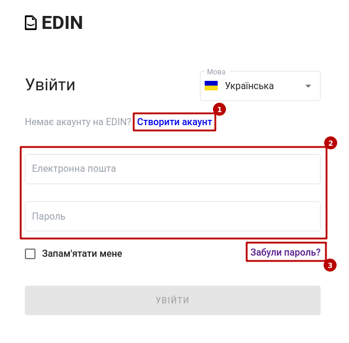

.. note::
   Для зручності можливо встановити авторизацію через SSO (систему єдиного входу) для своїх корпоративних користувачів (детальніше в описі `Налаштувань доменів акаунта <https://wiki.edin.ua/uk/latest/WhiteDoc/WD_Instructions/WD_admin_panel.html#domain>`__):

   .. image:: pics_WD_admin_panel/WD_admin_panel_088.gif
      :align: center

**1 Реєстрація**
================================================

Для самостійної реєстрації (https://edo.whitedoc.ua/login) потрібно натиснути на кнопку **"Створити акаунт"**:

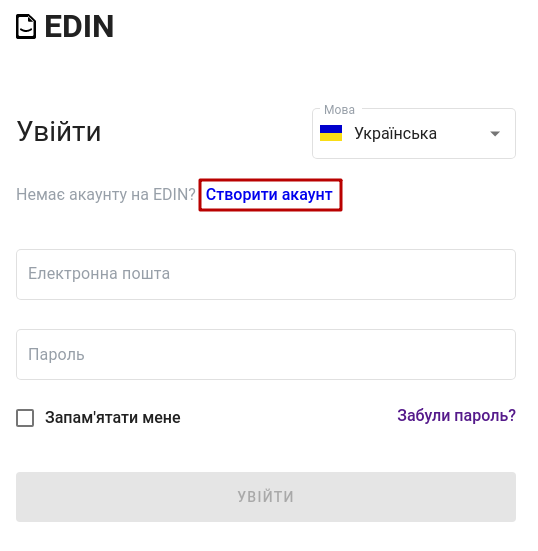

**1.1 Реєстрація особистого акаунта**
-----------------------------------------------------

При створенні (https://edo.whitedoc.ua/registration) особистого акаунта обов'язково потрібно ввести ім'я, прізвище, електронну пошту, пароль та натиснути кнопку **"Створити акаунт"**:

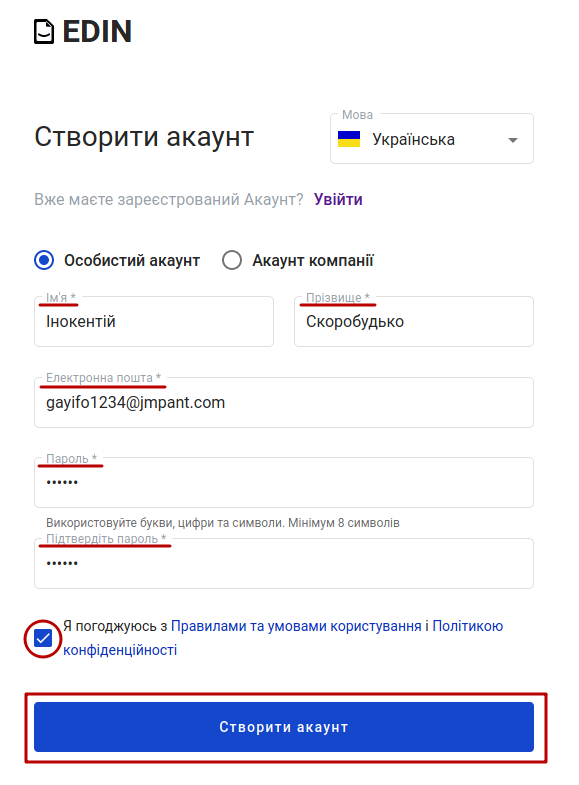

.. note::
   Для реєстрації також обов'язково ознайомитись з правилами користування сервісом (https://edo.whitedoc.ua/legal-information/terms).

Після чого на вказану електронну адресу вже буде відправлено код підтвердження:

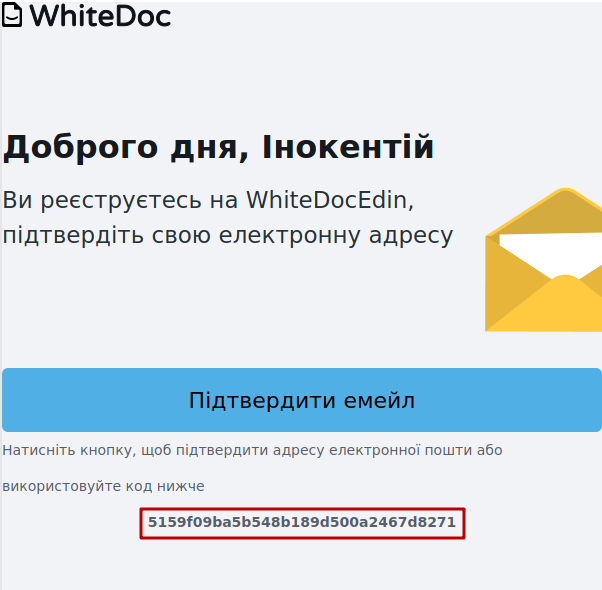

Код потрібно скопіювати та внести в поле "Код підтвердження" та натиснути кнопку **"Далі"** для завершення реєстрації: 

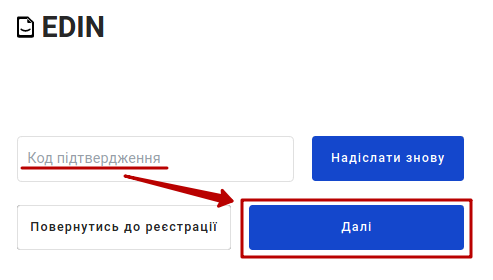

.. hint::
   Кнопка **"Надіслати знову"** повторно відправляє код підтвердження на вказану при реєстрації електронну адресу 

.. note::
   За допомогою кнопки **"Підтвердити емейл"**, що приходить в електронному листі, також можливо виконати процедуру підтвердження (без копіювання кодів):

   .. image:: pics_WD_registration/WD_registration_011.png
      :align: center

Сповіщення в правому верхньому куті проінформує про успішне підтвердження електронної пошти:

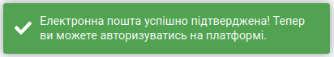

**1.2 Реєстрація акаунта компанії**
-----------------------------------------------------

При створенні (https://edo.whitedoc.ua/registration) акаунта компанії також обов'язково потрібно ввести ім'я, прізвище, електронну пошту, пароль та **додатково** вказати ЄДРПОУ/ІПН і назву компанії, що буде відображатись контрагентам та натиснути кнопку **"Продовжити"**:

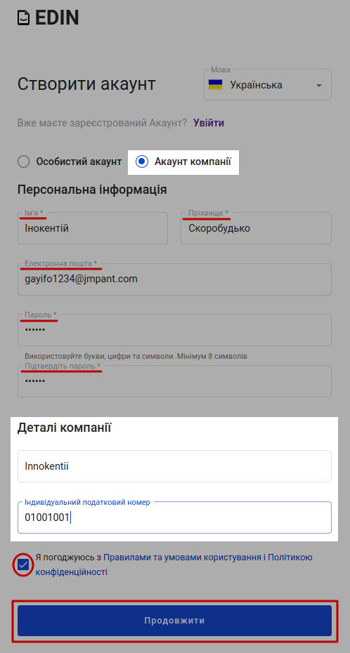

Далі для користування платформою система запропонує назвати Ваш перший мейлбокс [1]_:

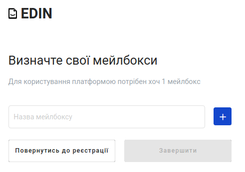

За допомогою кнопок |плюс| / |мінус| можливо додавати нові чи видаляти вже введені мейлбокси. Після того, як всі мейлбокси введені потрібно натиснути **"Завершити"**:

.. image:: pics_WD_registration/WD_registration_009.png
   :align: center

Після чого на вказану електронну адресу вже буде відправлено код підтвердження:

Код потрібно скопіювати та внести в поле "Код підтвердження" та натиснути кнопку **"Далі"** для завершення реєстрації: 

.. hint::
   Кнопка **"Надіслати знову"** повторно відправляє код підтвердження на вказану при реєстрації електронну адресу 

.. note::
   За допомогою кнопки **"Підтвердити емейл"**, що приходить в електронному листі, також можливо виконати процедуру підтвердження (без копіювання кодів):

   .. image:: pics_WD_registration/WD_registration_011.png
      :align: center

Сповіщення в правому верхньому куті проінформує про успішне підтвердження електронної пошти:

.. _pass-recovery:

**2 Відновлення пароля**
======================================

Для відновлення пароля потрібно натиснути на кнопку **"Забули пароль?"**:

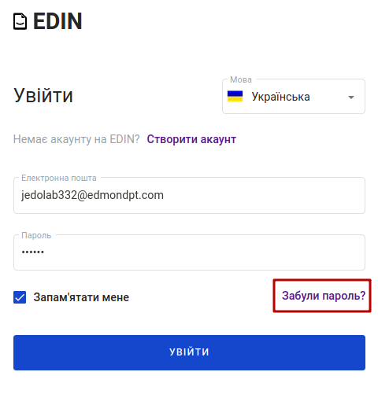

Далі в вікні ввести свою пошту (пошта повинна бути зареєстрована на платформі) та натиснути на кнопку **"Змінити пароль"** :

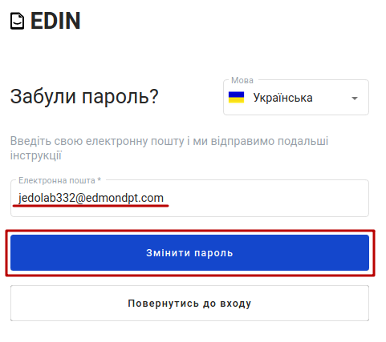

Після чого система проінформує, що відправила листа з унікальним посиланням на вказану адресу:

.. image:: pics_WD_registration/WD_registration_016.png
   :align: center

На пошту прийде лист з кнопкою **"Відновити пароль"** для переходу на форму введення нового пароля:

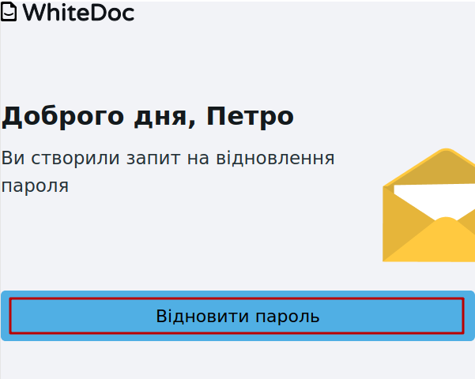

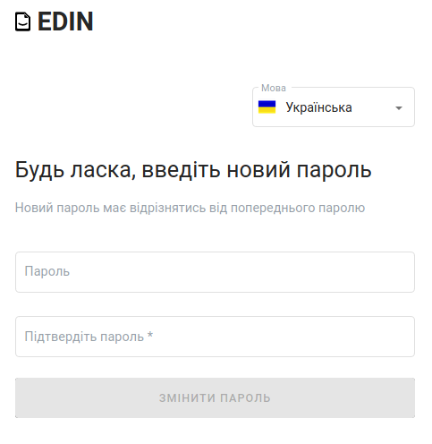

Після коректного введення нового пароля одразу можливо здійснювати авторизацію до сервісу WhiteDoc.

------------------------------

.. [#] Мейлбокс (mailbox) — сутність, що є вхідною/вихідною точкою документообігу в сервісі. Може бути особистим або спільним для кількох користувачів на рівні одного акаунта. 

------------------------------

.. include:: /_constant/kontakti.rst
