Робота з конвертами сервісу WhiteDoc
###################################################################

.. есть картинки с главной инструкции сервиса

.. |structed| image:: pics_Work_with_WD/Work_with_WD_039.png

.. |external| image:: pics_Work_with_WD/Work_with_WD_038.png

.. role:: red

.. role:: underline

.. contents:: Зміст:
   :depth: 7

---------

Вхід
================================================

WEB сервісом підтримуються **Google Chrome** та **Safari** браузери тому для роботи з документами рекомендовано використовувати саме їх. Для входу до сервісу платформи необхідно перейти за посиланням https://edo.whitedoc.ua/login .

При переході за вказаним посиланням відкриється вікно авторизації. Необхідно ввести Вашу електронну пошту, пароль користувача і натиснути **"Увійти"**:

.. image:: pics_Work_with_WD/Work_with_WD_002.png
   :align: center

За проставленої відмітки **"Запам'ятати мене"** вводити дані наступного разу самостійно вже не буде потреби (браузер це зробить автоматично).  

.. hint::
   Нові користувачі можуть самостійно пройти "Реєстрацію" і долучитись до сервісу (детальніше в нашій `інструкції <https://wiki.edin.ua/uk/latest/WhiteDoc/WD_registration.html>`__).

.. _envelope-statuses:

**1 Статуси конвертів**
================================================

В сервісі WhiteDoc для конвертів передбачені наступні статуси:

* **Чернетка** - створений, але ще не відправлений конверт (доступний до редагування);
* **В обробці** - відправлений конверт, що ще чекає на дії заповнення/підписання зі сторони контрагентів-учасників;
* **Очікує на вас** - відправлений конверт, очікує на дії заповнення/підписання з Вашої сторони;
* **Завершено** - кінцевий статус конверта; усі дії з документами (заповнення/підписання) виконано;
* **Скасовано** - кінцевий статус конверта; один з контрагентів-учасників відхилив конверт;
* **Прострочено** - кінцевий статус конверта; сплинув строк чинності конверта (налаштування шаблону).

.. _create-envelope:

**2 Формування та відправка конверта**
================================================

Для створення конверта потрібно мати підготовлений шаблон згідно якого і буде створено конверт.

.. tip::
    Перед початком роботи з конвертами рекомендовано ознайомитись з інструкцією по роботі з `шаблонами <https://wiki.edin.ua/uk/latest/WhiteDoc/WD_Instructions/Work_with_WD.html#template>`__.

Створюється конверт за допомогою кнопки **"Новий конверт"** (відображається в правому верхньому куті у всіх основних розділах сервісу):

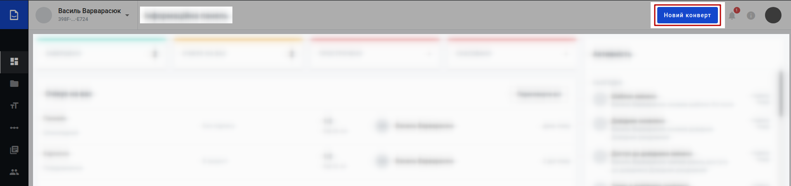

Після чого в попап вікні потрібно обрати шаблон в зручний для Вас спосіб:

* з нещодавно використаних;

.. image:: pics_Work_with_Envelope/Work_with_Envelope_002.png
   :align: center

* за номером UUID:

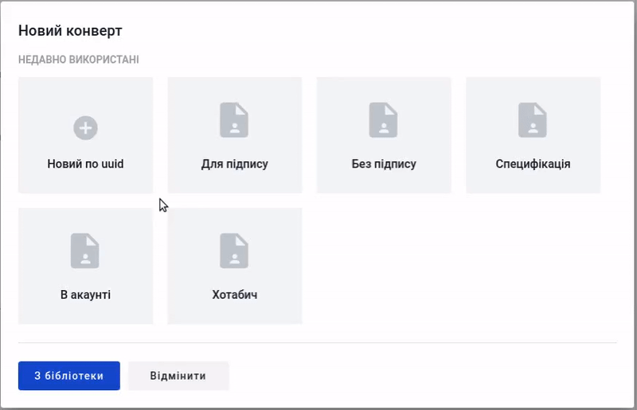

* з бібліотеки шаблонів:

.. image:: pics_Work_with_Envelope/Work_with_Envelope_004.png
   :align: center

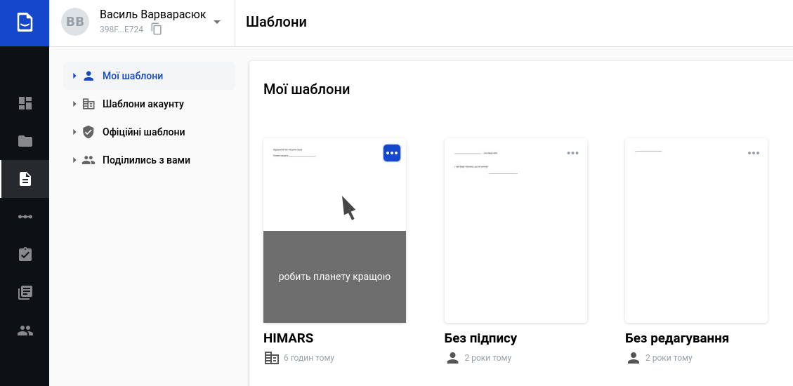

Після чого згідно шаблону автоматично створюється конверт (чернетка) разом з документами і відкривається форма для його заповнення (можуть бути випадки, коли створений конверт не потребує заповнення зі сторони відправника):

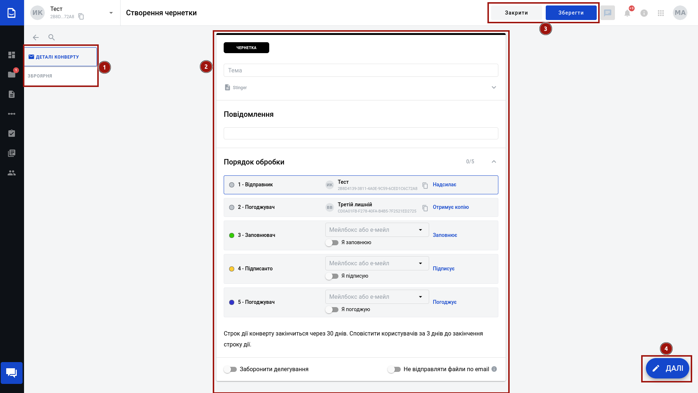

Форма конверта складається з деталей конверта та самих документів (2), що створюються згідно шаблону. В лівій частині екрану є зручний показчик перебування (1). Конверт-чернетку можливо **"Закрити"** в будь-який момент чи **"Зберегти"** (3), якщо в нього заповнені поля "Тема" та "Повідомлення". Після збереження чернетки з'являється кнопка для її видалення (**"Видалити"**).

.. hint::
    В збереженій чернетці можливо обмінюватись коментарями |comment| (`детальніше про функціонал Коментарів <https://wiki.edin.ua/uk/latest/WhiteDoc/WD_Instructions/Work_with_Envelope.html#comments>`__)

В правому нижньому куті відображається кнопка (4) (**"Далі"** чи **"Відправити"**), що одночасно інформує про заповненість конверта (готовність до відправки) та є підказкою, що вказує на необхідність заповнення конкретних полів в документах конверта.

В сервісі є два типи документів: **структуровані** [2]_ та **зовнішні** [1]_. Робота з наповненням **структурованого документа** [2]_ базується на:

1) роботі з текстом / таблицями / зображеннями за допомогою панелі візуального редактора - незмінна частина;
2) додаванні `Полів <https://wiki.edin.ua/uk/latest/WhiteDoc/WD_Instructions/Work_with_WD.html#fields>`__, що повинні чи можуть бути заповнені учасниками документообігу.

.. image:: pics_Work_with_WD/Work_with_WD_225.png
   :align: center

.. important::
   До **зовнішнього документа** [1]_, що вже містить область для додавання файлу можливо додати лише такі `Поля <https://wiki.edin.ua/uk/latest/WhiteDoc/WD_Instructions/Work_with_WD.html#fields>`__, як **Підпис** та **ЕЦП**. Сильна сторона **зовнішнього документа** [1]_ - це простота!

   .. image:: pics_Work_with_WD/Work_with_WD_226.png
      :align: center

Після того, як всі обов'язкові поля будуть заповнені і конверт буде готовий до відправки кнопка **"Далі"** міняється на **"Відправити"**:

.. image:: pics_Work_with_Envelope/Work_with_Envelope_007.png
   :align: center

При натисканні на **"Відправити"** потрібно підтвердити дію відправки:

.. image:: pics_Work_with_Envelope/Work_with_Envelope_008.png
   :align: center

Відправлений конверт змінює свій статус на "В обробці", показується наступний порядок обробки конверта, а також є можливість одразу начіпити на конверт **"Новий ярлик"**:

.. image:: pics_Work_with_Envelope/Work_with_Envelope_009.png
   :align: center

Також у формі відправленого конверта можливо ознайомитись і експортувати в PDF **"Протокол подій"** (|clock|) - усіх дій, виконаних контрагентами з цим конвертом:

.. image:: pics_Work_with_Envelope/Work_with_Envelope_012.png
   :align: center

Після того, як документообіг **"Завершено"** (статус конверта) в формі перегляду конверта відображається кнопка |arrow| **"Завантажити конверт"**.

.. _work-with-inbox:

**3 Робота з вхідними конвертами**
================================================

Для Учасника документообігу, що на даному етапі обробки конверта виконує дію, конверт відображається в статусі "Очікує на вас":

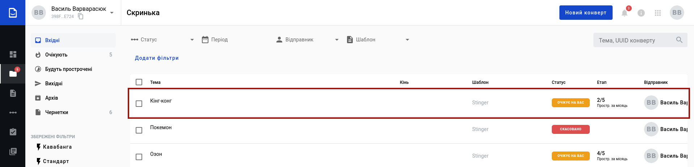

В залежності від назначеної на Учасника `Ролі <https://wiki.edin.ua/uk/latest/WhiteDoc/WD_Instructions/Work_with_WD.html#roles>`__, у відкритому конверті Учаснику будуть підсвічені червоні поля для Заповнення чи `Підписання <https://wiki.edin.ua/uk/latest/WhiteDoc/WD_Instructions/Work_with_WD.html#sign>`__:

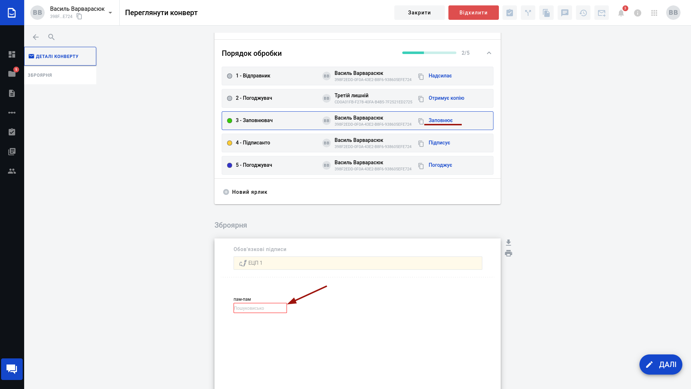

Або ж потреба в **Погодженні** / **Відхиленні** конверта:

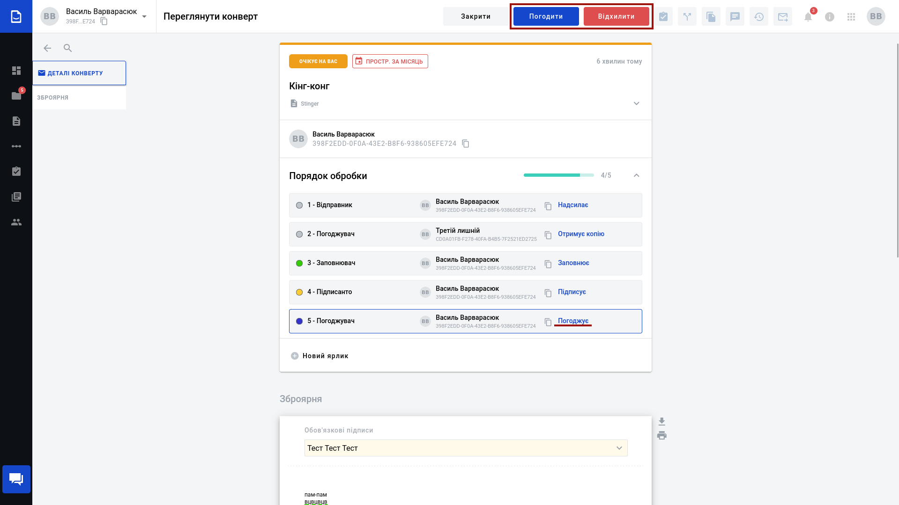

Конверт, що потребує **Погодження** при позитивному рішенні (**"Погодити"**) потрапляє на наступний етап обробки або переходить в статус "Завершено".

**Делегування** - функція, що дозволяє передати назначену відправником дію на іншого контрагента. Для використання цієї функції в шаблоні, за яким створювався конверт, мають бути вимкнені налаштування **"Заборонити делегування"** (детальніше про `налаштування шаблонів <https://wiki.edin.ua/uk/latest/WhiteDoc/WD_Instructions/Work_with_WD.html#template-details>`__).

Учасник, що має "активну" роль, на своєму етапі обробки може **"Делегувати"** свою дію на іншого Учасника:

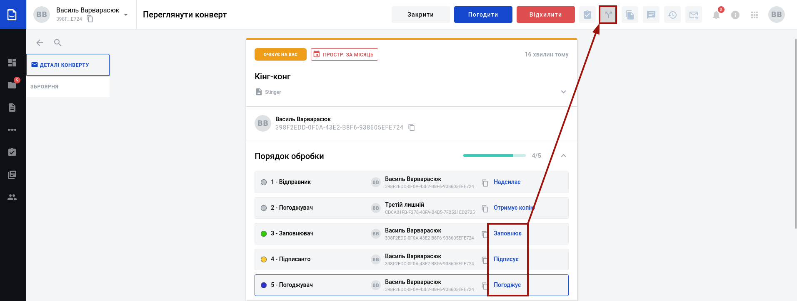

Для цього потрібно вказати назву чи UUID мейлбокса:

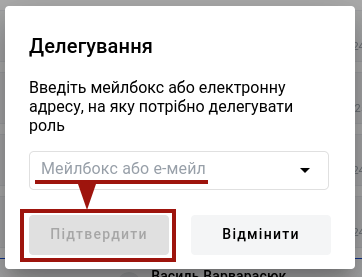

При цьому в шаблоні ствоюється помітка:

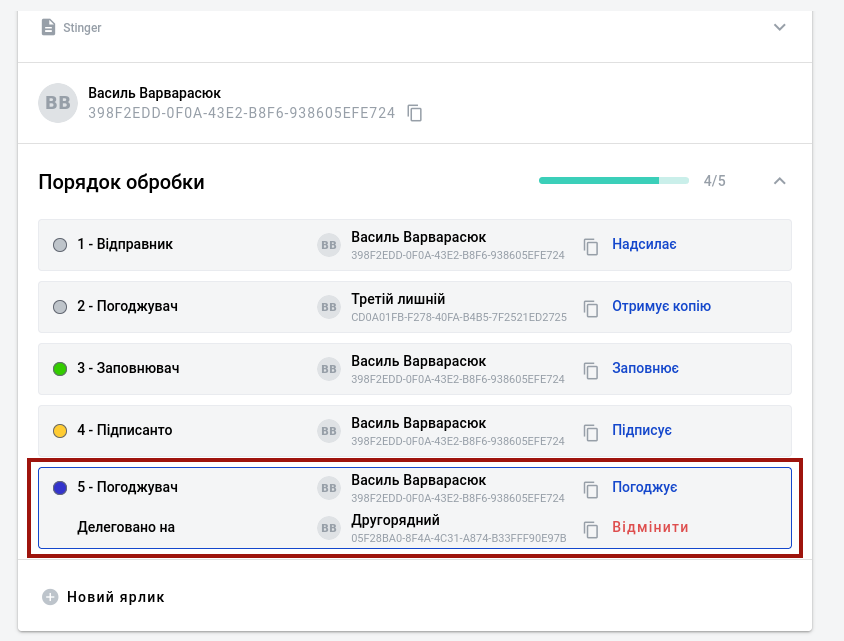

Тепер цю дію в цьому конверті має виконати новий вказаний Учасник (отримує конверт у "Вхідні"). Поки ця дія не виконана Учасник, який делегував цю дію, може **"Відмінити"** делегування.

.. _template-reject:

**3.1 Відхилення конверта**
-----------------------------------------------

Відправлений конверт в статусі "В обробці" чи "Очікує на вас" (на стороні поточного заповнювача/підписанта) можливо **"Відхилити"**:

.. image:: pics_Work_with_Envelope/Work_with_Envelope_013.png
   :align: center

Для відхилення конверта обов'язково потрібно вказати причину відхилення і підтвердити відхилення:

.. image:: pics_Work_with_Envelope/Work_with_Envelope_014.png
   :align: center

Після чого документ змінює свій статус на "Скасовано", а причина відхилення відображається учасникам в детялях конверта:

.. image:: pics_Work_with_Envelope/Work_with_Envelope_026.png
   :align: center

Документообіг завершено.

.. _envelope-download:

**4 Завантаження конвертів**
================================================

.. attention::
   **"Завантажити конверти чи окремі документи"** можливо лише після завершення документообігу!

Завантажити чи розрукувати окремі документи можливо при перегляді конверта (кнопки |arrow| та |print|):

.. image:: pics_Work_with_Envelope/Work_with_Envelope_027.png
   :align: center

доступне масове завантаження конвертів з журналу документів. Для цього потрібно відмітити потрібні документи і натиснути кнопку **"Завантажити"**:

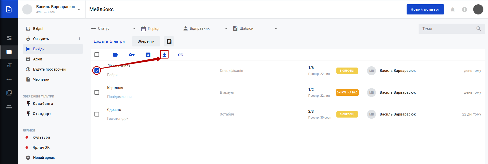

Конверти завантажуються у вигляді zip-архівів (найменування архіву = Темі конверта). Кожен з архівів містить каталоги (найменування=назві документа) для кожного документа, а також протокол подій конверта (AuditTrail.pdf).

* Кожен каталог стуктурованого документа |structed| містить:

   * Якщо документ не потребував підпису:
      
      * оригінал документа в xml форматі ({назва документа}.xml);
      * оригінал документа в pdf форматі ({назва документа}.pdf).

   * Якщо документ підписувався (ЕЦП чи електронно-чорнильним підписом):
      
      * оригінал документа в xml форматі ({назва документа}.xml);
      * оригінал документа в pdf форматі ({назва документа}.pdf);
      * сертифікат підписання документа ({назва документа}.підписи.pdf). Сертифікат містить детальну інформацію по електронному документу (ідентифікатори шаблону, конверта, документа, назви, кількість підписантів, дату, посилання на електронну версію документа) та дані про всі підписи і всіх підписантів;
      * форма для друку, що включає в себе оригінал документа + сертифікат підписання цього документа ({назва документа}.форма для друку.pdf). Якщо документ підписувався ЕЦП, то друкований макет додатково містить візуалізацію до всіх підписів в вигляді печаток на документі: |stamp|;
      * підписаний xml-документ ({назва документа}.xml.{номер підпису}.p7s). Кількість p7s-файлів відповідає кількості підписів;
      * підписаний pdf-документ ({назва документа}.pdf.{номер підпису}.p7s). Кількість p7s-файлів відповідає кількості підписів.

* Кожен каталог зовнішнього документа |external| містить:

   * Якщо документ не потребував підпису:

      * оригінал документа-вкладення.

   * Якщо документ підписувався ЕЦП:

      * оригінал документа-вкладення;
      * сертифікат підписання документа ({назва документа}.підписи.pdf). Сертифікат містить детальну інформацію по електронному документу (ідентифікатори шаблону, конверта, документа, назви, кількість підписантів, дату, посилання на електронну версію документа) та дані про всі підписи і всіх підписантів;
      * підписаний документ-вкладення ({назва документа}.{формат вкладення}.{номер підпису}.p7s). Кількість p7s-файлів відповідає кількості підписів.

.. _comments:

**5 Коментарі**
================================================

Функціонал дозволяє обмінюватись контрагентам повідомленнями, відповідати на уточнюючі питання, прикріпляючи коментарі до конкретної частини документа. Відкрити/закрити панель коментарів можливо за допомогою кнопки |comment| при перегляді конверта:

.. image:: pics_Work_with_Envelope/Work_with_Envelope_017.png
   :align: center

Для того аби додати коментар потрібно виділити частину відкритого документа і правою кнопкою миші натиснути **"Коментувати"**:

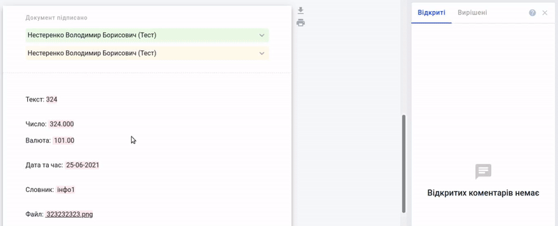

Коментар потрапляє у вкладку "Відкриті", де лише у його створювача є можливість його відредагувати / видалити / вирішити (коментар потрапляє у вкладку "Вирішених" питань):

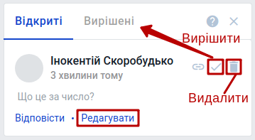

У кожного коментаря є прив'язка - посилання на абзац (кнопка |link|), за допомогою якого легко знайти частину потрібного документа, до якого був зроблений коментар:

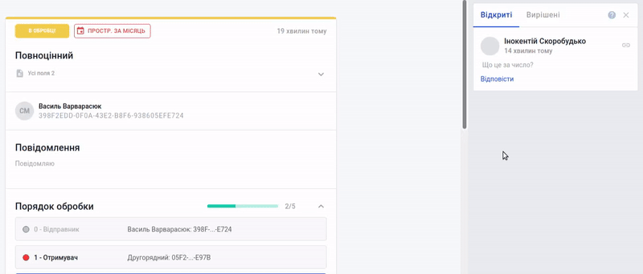

Учасники контрагенти можуть відповідати на коментарі за допомогою кнопки **"Відповісти"** та **"Зберегти"**. При цьому всі "відповіді" зберігаються під коментарем, до якого вони були сформовані в хронологічному порядку:

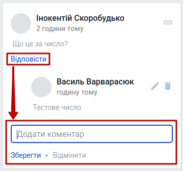

Для того аби була можливість переглянути всю переписку до конкретного коментаря чи згорнути її можливо скористатись відповідними кнопками **"Показати більше"** / **"Показати менше"**. Коментар потрапляє у "Вирішені" разом з усіма "відповідями" до нього. У створювача початкового вирішеного коментаря є можливість перенести коментар з відповідями з "Вирішених" у "Відкриті" кнопкою |roll_back| **"Відкрити знову"**:

.. image:: pics_Work_with_Envelope/Work_with_Envelope_019.png
   :align: center

------------------------------

.. [#] Зовнішній документ призначений для внесення файлу одним з учасників документообігу. Допускається додавання файлу-вкладення в форматі pdf, doc, docx, xls, xlsx, xml, dbf, txt, rtf, png, jpg, jpeg, zip не більше 5МБ (загальний розмір конверта при цьому не повинен перевищувати 25 МБ). В зовнішній документ можливо додати поля "ЕЦП" (інші поля не підтримуються).

.. [#] Структурований документ може включати в себе текст та `стандартні поля WhiteDoc <https://wiki.edin.ua/uk/latest/WhiteDoc/WD_Instructions/Work_with_WD.html#fields>`__ (детальніше за посиланням).

------------------------------

.. include:: /_constant/kontakti.rst
