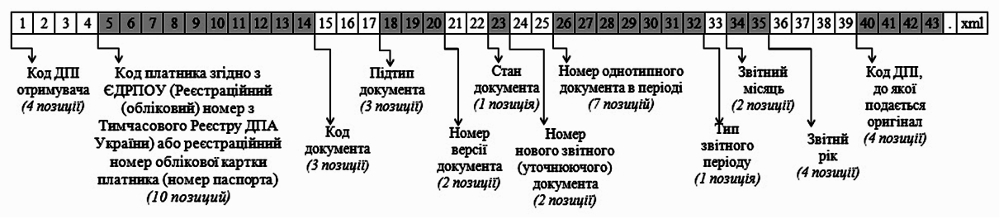

Специфікації документів
################################

.. role:: red

.. role:: underline

.. role:: green

**XML специфікації електронних документів**

У специфікації представлено опис полів XML-документів, які застосовуються в електронному обміні даними на платформі EDI-N.

---------

.. contents:: Зміст:

---------

Прайс-лист (PRICAT)
====================

.. csv-table:: Прайс-лист (PRICAT) служить для опису товарів і послуг. Даний документ відправляється постачальником замовнику і в ньому вказується штрих-код продукту, його опис, ціна, ставка ПДВ. За допомогою Прайс-листа можна також вказати чи зросла/зменшилась ціна або не змінилася.
  :file: files/PRICAT.csv
  :widths:  40, 7, 12, 41
  :header-rows: 1

:download:`Приклад PRICAT (XML)<examples/PRICAT_example.xml>`

:download:`Приклад PRICAT (JSON)<examples/PRICAT.json>`

---------

Замовлення (ORDER)
==========================

.. csv-table:: Замовлення (ORDER) на поставку відправляє покупець постачальнику, вказуючи штрих-код продукту, його опис, замовлену кількість, ціну та іншу необхідну інформацію.
  :file: files/ORDER.csv
  :widths:  40, 7, 12, 41
  :header-rows: 1

:download:`Приклад ORDER (XML)<examples/ORDER_example_n.xml>`

:download:`Приклад ORDER (JSON)<examples/ORDER.json>`

---------

Підтвердження замовлення (ORDRSP)
========================================

.. csv-table:: **Підтвердження замовлення (ORDRSP)** відправляється у відповідь на прийнятий документ **Замовлення (ORDER)**. Основною особливістю **Підтвердження замовлення** є уточнення про постачання по кожній товарній позиції: чи буде товар доставлений; чи змінилася кількість/ціна чи буде відмова від поставки товарної позиції?
  :file: files/ORDRSP.csv
  :widths:  40, 7, 12, 41
  :header-rows: 1

:download:`Приклад ORDRSP (XML)<examples/ORDRSP_example_n.xml>`

:download:`Приклад ORDRSP (JSON)<examples/ORDRSP.json>`

---------

Повідомлення про відвантаження (DESADV)
===============================================

.. csv-table:: **Повідомлення про відвантаження (DESADV)** відправляє постачальник у відповідь на **Замовлення (ORDER)**. При цьому постачальник може змінити кількість замовлених товарних позицій, що поставляються, дату і час поставки, додаткові відомості. Даний документ є аналогом товарно-транспортної накладної (ТТН)
  :file: files/DESADV.csv
  :widths:  40, 7, 12, 41
  :header-rows: 1

:download:`Приклад DESADV (XML)<examples/DESADV_example.xml>`

:download:`Приклад DESADV (JSON)<examples/DESADV.json>`

---------

Повідомлення про прийом (RECADV)
===============================

.. csv-table:: **Повідомлення про прийом (RECADV)** використовується для оповіщення постачальників про прийом товарів. Даний документ інформує про кількість отриманих товарних позицій і може вказувати на розбіжності між фактично отриманим товаром і зазначеним у документації.
  :file: files/RECADV.csv
  :widths:  40, 7, 12, 41
  :header-rows: 1

:download:`Приклад RECADV (XML)<examples/RECADV_example_n.xml>`

:download:`Приклад RECADV (JSON)<examples/RECADV.json>`

---------

Рахунок (INVOICE)
==============

.. csv-table:: **Рахунок (INVOICE)** є повідомленням; в якому містяться дані по оплаті наданих послуг і товарів. В **Рахунку** обов'язково вказується ціна продукту без ПДВ; ставка ПДВ для кожної товарної позиції і підраховується сумарна вартість **Замовлення**.
  :file: files/INVOICE.csv
  :widths:  40, 7, 12, 41
  :header-rows: 1

:download:`Приклад INVOICE (XML)<examples/INVOICE_example_n.xml>`

:download:`Приклад INVOICE (JSON)<examples/INVOICE.json>`

---------

Коригування рахунку (KORINVOICE)
================================

.. csv-table:: 
  :file: files/KORINVOICE.csv
  :widths:  40, 7, 12, 41
  :header-rows: 1

:download:`Приклад KORINVOICE (XML)<examples/KORINVOICE_example.xml>`

:download:`Приклад KORINVOICE (JSON)<examples/KORINVOICE.json>`

---------

Комерційний документ (COMDOC)
==============================

.. hint::
  **COMDOC** (ЕлектроннийДокумент) – загальна назва сімейства документів, призначених для обміну в електронному вигляді юридично значимими документами (за умови укладення між контрагентами договору «Про визнання електронних документів» та використання електронно-цифрового підпису). Нижче представлені специфікації підтипів комерційних документів. 

---------

Договір (COMDOC_001)
~~~~~~~~~~~~~~~~~~~~~~~~~~~~~~~~~~~~~~

.. csv-table:: Договір (COMDOC_001)
  :file: files/COMDOC_001.csv
  :widths:  40, 7, 12, 41
  :header-rows: 1

:download:`Приклад COMDOC_001 (XML)<examples/comdoc_001_example.xml>`

:download:`Приклад COMDOC_001 (JSON)<examples/COMDOC_001.json>`

---------

Акт про виявлені недоліки (COMDOC_005)
~~~~~~~~~~~~~~~~~~~~~~~~~~~~~~~~~~~~~~

.. csv-table:: Акт про виявлені недоліки (COMDOC_005)
  :file: files/COMDOC_005.csv
  :widths:  40, 7, 12, 41
  :header-rows: 1

:download:`Приклад COMDOC_005 (XML)<examples/comdoc_005_example_n.xml>`

:download:`Приклад COMDOC_005 (JSON)<examples/COMDOC_005.json>`

---------

Видаткова накладна (COMDOC_006)
~~~~~~~~~~~~~~~~~~~~~~~~~~~~~~~~

.. csv-table:: Видаткова накладна (COMDOC_006)
  :file: files/COMDOC_006.csv
  :widths:  40, 7, 12, 41
  :header-rows: 1

:download:`Приклад COMDOC_006 (XML)<examples/comdoc_006_example_n.xml>`

:download:`Приклад COMDOC_006 (JSON)<examples/COMDOC_006.json>`

---------

Прибуткова накладна (COMDOC_007)
~~~~~~~~~~~~~~~~~~~~~~~~~~~~~~~~

.. csv-table:: Прибуткова накладна (COMDOC_007)
  :file: files/COMDOC_007.csv
  :widths:  40, 7, 12, 41
  :header-rows: 1

:download:`Приклад COMDOC_007 (XML)<examples/comdoc_007_example.xml>`

:download:`Приклад COMDOC_007 (JSON)<examples/COMDOC_007.json>`

---------

Товарна специфікація (COMDOC_008)
~~~~~~~~~~~~~~~~~~~~~~~~~~~~~~~~~~~

.. csv-table:: Товарна специфікація (COMDOC_008)
  :file: files/COMDOC_008.csv
  :widths:  40, 7, 12, 41
  :header-rows: 1

:download:`Приклад COMDOC_008 (XML)<examples/comdoc_008_example_n.xml>`

:download:`Приклад COMDOC_008 (JSON)<examples/COMDOC_008.json>`

---------

Акт невідповідності (COMDOC_009)
~~~~~~~~~~~~~~~~~~~~~~~~~~~~~~~~~~~~~~

.. csv-table:: Акт невідповідності (COMDOC_009)
  :file: files/COMDOC_009.csv
  :widths:  40, 7, 12, 41
  :header-rows: 1

:download:`Приклад COMDOC_009 (XML)<examples/comdoc_009_example.xml>`

:download:`Приклад COMDOC_009 (JSON)<examples/COMDOC_009.json>`

---------

Повідомлення про повернення (COMDOC_011)
~~~~~~~~~~~~~~~~~~~~~~~~~~~~~~~~

.. csv-table:: Повідомлення про повернення (COMDOC_011)
  :file: files/COMDOC_011.csv
  :widths:  40, 7, 12, 41
  :header-rows: 1

:download:`Приклад COMDOC_011 (XML)<examples/comdoc_011_example_n.xml>`

:download:`Приклад COMDOC_011 (JSON)<examples/COMDOC_011.json>`

---------

Накладна на повернення (COMDOC_012)
~~~~~~~~~~~~~~~~~~~~~~~~~~~~~~~~~~~

.. csv-table:: Накладна на повернення (COMDOC_012)
  :file: files/COMDOC_012.csv
  :widths:  40, 7, 12, 41
  :header-rows: 1

:download:`Приклад COMDOC_012 (XML)<examples/comdoc_012_example.xml>`

:download:`Приклад COMDOC_012 (JSON)<examples/COMDOC_012.json>`

---------

Акт виконаних робіт (COMDOC_013)
~~~~~~~~~~~~~~~~~~~~~~~~~~~~~~~~

.. csv-table:: Акт виконаних робіт (COMDOC_013)
  :file: files/COMDOC_013.csv
  :widths:  40, 7, 12, 41
  :header-rows: 1

:download:`Приклад COMDOC_013 (XML)<examples/comdoc_013_example.xml>`

:download:`Приклад COMDOC_013 (JSON)<examples/COMDOC_013.json>`

---------

Акт взаємозаліку (COMDOC_015)
~~~~~~~~~~~~~~~~~~~~~~~~~~~~~~~~

.. csv-table:: Акт взаємозаліку (COMDOC_015)
  :file: files/COMDOC_015.csv
  :widths:  40, 7, 12, 41
  :header-rows: 1

:download:`Приклад COMDOC_015 (XML)<examples/comdoc_015_example_n.xml>`

:download:`Приклад COMDOC_015 (JSON)<examples/COMDOC_015.json>`

---------

Рахунок-фактура (COMDOC_016)
~~~~~~~~~~~~~~~~~~~~~~~~~~~~

.. csv-table:: Рахунок-фактура (COMDOC_016)
  :file: files/COMDOC_016.csv
  :widths:  40, 7, 12, 41
  :header-rows: 1

:download:`Приклад COMDOC_016 (XML)<examples/comdoc_016_example.xml>`

:download:`Приклад COMDOC_016 (JSON)<examples/COMDOC_016.json>`

---------

Акт наданих послуг (COMDOC_018)
~~~~~~~~~~~~~~~~~~~~~~~~~~~~~~~~~

.. csv-table:: Акт наданих послуг (COMDOC_018)
  :file: files/COMDOC_018.csv
  :widths:  40, 7, 12, 41
  :header-rows: 1

:download:`Приклад COMDOC_018 (XML)<examples/comdoc_018_example.xml>`

:download:`Приклад COMDOC_018 (JSON)<examples/COMDOC_018.json>`

---------

Анулювання (COMDOC_019)
~~~~~~~~~~~~~~~~~~~~~~~~~~~~~~~~~

.. csv-table:: Анулювання (COMDOC_019)
  :file: files/COMDOC_019.csv
  :widths:  40, 7, 12, 41
  :header-rows: 1

:download:`Приклад COMDOC_019 (XML)<examples/comdoc_019_example_n.xml>`

:download:`Приклад COMDOC_019 (JSON)<examples/COMDOC_019.json>`

---------

Звіт комітенту (COMDOC_020)
~~~~~~~~~~~~~~~~~~~~~~~~~~~~~~~~~~~~~~~~~~~~~~~~~~~~~~~~~~~~~~

.. csv-table:: Звіт комітенту (COMDOC_020)
  :file: files/COMDOC_020.csv
  :widths:  40, 7, 12, 41
  :header-rows: 1

:download:`Приклад COMDOC_020 (XML)<examples/comdoc_020_example_n.xml>`

:download:`Приклад COMDOC_020 (JSON)<examples/COMDOC_020.json>`

---------

Повідомлення про відмову від підписання документу (COMDOC_021)
~~~~~~~~~~~~~~~~~~~~~~~~~~~~~~~~~~~~~~~~~~~~~~~~~~~~~~~~~~~~~~

.. csv-table:: Повідомлення про відмову від підписання документу (COMDOC_021)
  :file: files/COMDOC_021.csv
  :widths:  40, 7, 12, 41
  :header-rows: 1

:download:`Приклад COMDOC_021 (XML)<examples/comdoc_021_example+.xml>`

:download:`Приклад COMDOC_021 (JSON)<examples/COMDOC_021.json>`

---------

Накладна на переміщення (COMDOC_022)
~~~~~~~~~~~~~~~~~~~~~~~~~~~~~~~~~~~~~~~~~~~~~~~~~~~~~~~~~~~~~~

.. csv-table:: Накладна на переміщення (COMDOC_022)
  :file: files/COMDOC_022.csv
  :widths:  40, 7, 12, 41
  :header-rows: 1

:download:`Приклад COMDOC_022 (XML)<examples/comdoc_022_example_n.xml>`

:download:`Приклад COMDOC_022 (JSON)<examples/COMDOC_022.json>`

---------

Специфікація послуг перевізника (COMDOC_023)
~~~~~~~~~~~~~~~~~~~~~~~~~~~~~~~~~~~~~~~~~~~~~~~~~~~~~~~~~~~~~~

.. csv-table:: Специфікація послуг перевізника (COMDOC_023)
  :file: files/COMDOC_023.csv
  :widths:  40, 7, 12, 41
  :header-rows: 1

:download:`Приклад COMDOC_023 (XML)<examples/comdoc_023_example_n.xml>`

:download:`Приклад COMDOC_023 (JSON)<examples/COMDOC_023.json>`

---------

Звіт комітенту по еквайрингу (COMDOC_024)
~~~~~~~~~~~~~~~~~~~~~~~~~~~~~~~~~~~~~~~~~~~~~~~~~~~~~~~~~~~~~~

.. csv-table:: Звіт комітенту по еквайрингу (COMDOC_024)
  :file: files/COMDOC_024.csv
  :widths:  40, 7, 12, 41
  :header-rows: 1

:download:`Приклад COMDOC_024 (XML)<examples/comdoc_024_example_n.xml>`

:download:`Приклад COMDOC_024 (JSON)<examples/COMDOC_024.json>`

---------

Рахунок по еквайрингу (COMDOC_025)
~~~~~~~~~~~~~~~~~~~~~~~~~~~~~~~~~~~~~~~~~~~~~~~~~~~~~~~~~~~~~~

.. csv-table:: Рахунок по еквайрингу (COMDOC_025)
  :file: files/COMDOC_025.csv
  :widths:  40, 7, 12, 41
  :header-rows: 1

:download:`Приклад COMDOC_025 (XML)<examples/comdoc_025_example_n.xml>`

:download:`Приклад COMDOC_025 (JSON)<examples/COMDOC_025.json>`

---------

Зведена специфікація послуг (COMDOC_026)
~~~~~~~~~~~~~~~~~~~~~~~~~~~~~~~~~~~~~~~~~~~~~~~~~~~~~~~~~~~~~~

.. csv-table:: Зведена специфікація послуг (COMDOC_026)
  :file: files/COMDOC_026.csv
  :widths:  40, 7, 12, 41
  :header-rows: 1

:download:`Приклад COMDOC_026 (XML)<examples/comdoc_026_example.xml>`

:download:`Приклад COMDOC_026 (JSON)<examples/COMDOC_026.json>`

---------

Товарна накладна (COMDOC_027)
~~~~~~~~~~~~~~~~~~~~~~~~~~~~~~~~~~~~~~~~~~~~~~~~~~~~~~~~~~~~~~

.. csv-table:: Товарна накладна (COMDOC_027)
  :file: files/COMDOC_027.csv
  :widths:  40, 7, 12, 41
  :header-rows: 1

:download:`Приклад COMDOC_027 (XML)<examples/comdoc_027_example.xml>`

:download:`Приклад COMDOC_027 (JSON)<examples/COMDOC_027.json>`

---------

Заявка на транспортно-експедиційне обслуговування (COMDOC_028)
~~~~~~~~~~~~~~~~~~~~~~~~~~~~~~~~~~~~~~~~~~~~~~~~~~~~~~~~~~~~~~

.. csv-table:: Заявка на транспортно-експедиційне обслуговування (COMDOC_028)
  :file: files/COMDOC_028.csv
  :widths:  40, 7, 12, 41
  :header-rows: 1

:download:`Приклад COMDOC_028 (XML)<examples/comdoc_028_example_n.xml>`

:download:`Приклад COMDOC_028 (JSON)<examples/COMDOC_028.json>`

---------

Акт звірки зведений (COMDOC_029)
~~~~~~~~~~~~~~~~~~~~~~~~~~~~~~~~~~~~~~~~~~~~~~~~~~~~~~~~~~~~~~

.. csv-table:: Акт звірки зведений (COMDOC_029)
  :file: files/COMDOC_029.csv
  :widths:  40, 7, 12, 41
  :header-rows: 1

:download:`Приклад COMDOC_029 (XML)<examples/comdoc_029_example_n.xml>`

:download:`Приклад COMDOC_029 (JSON)<examples/COMDOC_029.json>`

---------

Претензія (COMDOC_030)
~~~~~~~~~~~~~~~~~~~~~~~~~~~~~~~~~~~~~~~~~~~~~~~~~~~~~~~~~~~~~~

.. csv-table:: Претензія (COMDOC_030)
  :file: files/COMDOC_030.csv
  :widths:  40, 7, 12, 41
  :header-rows: 1

:download:`Приклад COMDOC_030 (XML)<examples/comdoc_030_example.xml>`

:download:`Приклад COMDOC_030 (JSON)<examples/COMDOC_030.json>`

---------

Накладна на зворотну тару (COMDOC_031)
~~~~~~~~~~~~~~~~~~~~~~~~~~~~~~~~~~~~~~~~~~~~~~~~~~~~~~~~~~~~~~

.. csv-table:: Накладна на зворотну тару (COMDOC_031)
  :file: files/COMDOC_031.csv
  :widths:  40, 7, 12, 41
  :header-rows: 1

:download:`Приклад COMDOC_031 (XML)<examples/comdoc_031_example.xml>`

:download:`Приклад COMDOC_031 (JSON)<examples/COMDOC_031.json>`

---------

Акт коригування (COMDOC_036)
~~~~~~~~~~~~~~~~~~~~~~~~~~~~~~~~~~~~~~~~~~~~~~~~~~~~~~~~~~~~~~

.. csv-table:: Акт коригування (COMDOC_036)
  :file: files/COMDOC_036.csv
  :widths:  40, 7, 12, 41
  :header-rows: 1

:download:`Приклад COMDOC_036 (XML)<examples/comdoc_036_example_n.xml>`

:download:`Приклад COMDOC_036 (JSON)<examples/COMDOC_036.json>`

---------

Акт наданих послуг (Логістика) (COMDOC_037)
~~~~~~~~~~~~~~~~~~~~~~~~~~~~~~~~~~~~~~~~~~~~~~~~~~~~~~~~~~~~~~

.. csv-table:: Акт наданих послуг (Логістика) (COMDOC_037)
  :file: files/COMDOC_037.csv
  :widths:  40, 7, 12, 41
  :header-rows: 1

:download:`Приклад COMDOC_037 (XML)<examples/comdoc_037_example.xml>`

:download:`Приклад COMDOC_037 (JSON)<examples/COMDOC_037.json>`

---------

Коригування видаткової накладної (COMDOC_038)
~~~~~~~~~~~~~~~~~~~~~~~~~~~~~~~~~~~~~~~~~~~~~~~~~~~~~~~~~~~~~~

.. csv-table:: Коригування видаткової накладної (COMDOC_038)
  :file: files/COMDOC_038.csv
  :widths:  40, 7, 12, 41
  :header-rows: 1

:download:`Приклад COMDOC_038 (XML)<examples/comdoc_038_example.xml>`

:download:`Приклад COMDOC_038 (JSON)<examples/COMDOC_038.json>`

---------

Податкова накладна (DECLAR)
============================

Імена файлів формуються відповідно до значення елементів заголовка документа (DECLARHEAD) за таким принципом:

- позиції з 1 по 4 включно містять код ДПІ отримувача, до якої подається оригінал або копія документа (4 символа), який складається з коду області, на території якої розташовується податкова інспекція (відділення) (значення елемента C_REG, доповненого зліва нулем до 2 символів), та коду адміністративного району, на території якого розташовується податкова інспекція (відділення) (значення елемента C_RAJ, доповненого зліва нулем до 2 символів);
- позиції з 5 по 14 включно містять код платника згідно з ЄДРПОУ (Реєстраційний (обліковий) номер з Тимчасового реєстру ДПА України) або реєстраційний номер облікової картки платника (номер паспорта) (значення елемента TIN, доповненого зліва нулями до 10 символів);
- позиції з 15 по 17 включно містять код документа (значення елемента C_DOC);
- позиції з 18 по 20 містять підтип документа (значення елемента C_DOC_SUB);
- позиції з 21 по 22 містять номер версії документа (значення елемента C_DOC_VER, доповненого зліва нулем до 2 символів);
- позиція 23 містить ознаку стану документа (значення елемента C_DOC_STAN);
- позиції з 24 по 25 містять номер нового звітного (уточнюючого) документа у звітному періоді (значення елемента C_DOC_TYPE, доповненого зліва нулем до 2 символів). Для звітного документа позиції 24…25 міститимуть значення 00;
- позиції з 26 по 32 містять порядковий номер документа, що може подаватись декілька разів в одному звітному періоді (значення елемента C_DOC_CNT, доповненого зліва нулями до 7 символів). Якщо звіт подається лише один раз, то позиції 26...32 міститимуть значення 0000001;
- позиція 33 містить числовий код типу звітного періоду (1-місяць, 2-квартал, 3-півріччя, 4-дев’ять місяців, 5-рік) (значення елемента PERIOD_TYPE);
- позиції з 34 по 35 містять значення звітного місяця (значення елемента PERIOD_MONTH доповненого зліва нулем до 2 символів);
- позиції з 36 по 39 містять значення звітного року (значення елемента PERIOD_YEAR);
- позиції з 40 по 43 містять код податкової інспекції, до якої подається оригінал документа (значення елемента C_STI_ORIG, доповненого зліва нулями до 4 символів). Якщо документ є оригіналом, а не копією, то позиції 40…43 будуть відповідати позиціям 1…4;

Файл має розширення xml., наприклад: 23010000223816J0100109100000000151220102301.xml

.. csv-table:: Податкова накладна (DECLAR)
  :file: files/DECLAR.csv
  :widths:  25, 25, 50
  :header-rows: 1

:download:`Приклад DECLAR (XML)<examples/DECLAR_example.xml>`

:download:`Приклад DECLAR (JSON)<examples/DECLAR.json>`

---------

Звіт про продажі (SLSRPT)
========================

.. csv-table:: Звіт про продажі (SLSRPT) відправляє покупець постачальнику, вказуючи місце продажу, період, ціну, продану кількість.
  :file: files/SLSRPT.csv
  :widths:  40, 7, 12, 41
  :header-rows: 1

---------

Звіт про інвентаризацію (INVRPT)
================================

.. csv-table:: Звіт про інвентаризацію (INVRPT) відправляє покупець постачальнику, вказуючи кількість товару в конкретному магазині
  :file: files/INVRPT.csv
  :widths:  40, 7, 12, 41
  :header-rows: 1

---------

Інформація про контрагента для постачальника (PARTIN)
================================================================

.. csv-table:: Інформація про контрагента для постачальника (PARTIN) відправляється покупцем (роздрібною мережею) постачальнику. Вказується додаткова інформація, яка може бути запрошена постачальником
  :file: files/PARTIN_P.csv
  :widths:  40, 7, 12, 41
  :header-rows: 1

---------

Інформація про контрагента для роздрібної мережі (PARTIN)
===========================================================

.. csv-table:: Інформація про контрагента для роздрібної мережі (PARTIN) відправляється постачальником покупцеві (роздрібної мережі). Вказується додаткова інформація, яка може бути запрошена торговельною мережею
  :file: files/PARTIN_TS.csv
  :widths:  40, 7, 12, 41
  :header-rows: 1

---------

Комерційна дискусія (COMDIS)
================================

.. csv-table:: Комерційну дискусію (COMDIS) відправляє покупець постачальнику на основі Рахунка (INVOICE), вказуючи прийнятий або не прийнятий рахунок, і якщо не прийнятий, то з якої причини
  :file: files/COMDIS.csv
  :widths:  40, 7, 12, 41
  :header-rows: 1

:download:`Приклад COMDIS (XML)<examples/COMDIS_example_n.xml>`

:download:`Приклад COMDIS (JSON)<examples/COMDIS.json>`

---------

Інструкція з доставки (INSDES)
================================

.. csv-table:: Інструкція з доставки (INSDES) відправляється покупцем постачальнику із зазначенням того, яку продукцію і її кількість необхідно доставити в зазначений термін
  :file: files/INSDES.csv
  :widths:  40, 7, 12, 41
  :header-rows: 1

:download:`Приклад INSDES (XML)<examples/INSDES_example_n.xml>`

:download:`Приклад INSDES (JSON)<examples/INSDES.json>`

---------

Акт звірки взаєморозрахунків (COACSU)
==============================================================

.. csv-table:: Акт звірки взаєморозрахунків (COACSU) використовується для звірки взаєморозрахунків з контрагентом (постачальником) і дозволяє оперативно і точно звіряти сальдо з контрагентом за певний період
  :file: files/COACSU.csv
  :widths:  40, 7, 12, 41
  :header-rows: 1

:download:`Приклад COACSU (XML)<examples/COACSU_example_n.xml>`

:download:`Приклад COACSU (JSON)<examples/COACSU.json>`

---------

Інструкція з транспортування (IFTMIN)
==============================================

.. csv-table:: Інструкція з транспортування (IFTMIN) відправляється замовником оператору логістичних послуг. В даному документі вказуються остаточні деталі поставки
  :file: files/IFTMIN.csv
  :widths:  40, 7, 12, 41
  :header-rows: 1

:download:`Приклад IFTMIN (XML)<examples/IFTMIN_example_n.xml>`

:download:`Приклад IFTMIN (JSON)<examples/IFTMIN.json>`

---------

Повідомлення про повернення (RETANN)
=========================================

.. csv-table:: Повідомлення про повернення (RETANN) використовується для повідомлення постачальника про товари, які не були прийняті і з якої причини
  :file: files/RETANN.csv
  :widths:  40, 7, 12, 41
  :header-rows: 1

:download:`Приклад RETANN (XML)<examples/RETANN_example.xml>`

:download:`Приклад RETANN (JSON)<examples/RETANN.json>`

---------

Інструкція про повернення (RETINS)
=======================================

.. На web в основі документа існує поле ACTION - 27-Відмовлено, 29-Прийнято, 4-Змінено. Використовується лише на web (для зручності)

.. csv-table:: Документ **Інструкція про повернення (RETINS)** відправляється у відповідь на **Повідомлення про повернення (RETANN)** і використовуватися для підтвердження або редагування дати та часу прибуття постачальника
  :file: files/RETINS.csv
  :widths:  40, 7, 12, 41
  :header-rows: 1

:download:`Приклад RETINS (XML)<examples/RETINS_example.xml>`

:download:`Приклад RETINS (JSON)<examples/RETINS.json>`

---------

Заявка на транспортування (IFTMBF)
========================================

.. csv-table:: Заявка на транспортування (IFTMBF) клієнт відправляє своєму провайдеру логістичних послуг, при цьому вказуючи, коли і який приїде вантаж, скільки палет і куди його необхідно доставити
  :file: files/IFTMBF.csv
  :widths:  40, 7, 12, 41
  :header-rows: 1

---------

Підтвердження заявки на транспортування (IFTMBC)
==============================================================

.. csv-table:: **Підтвердження заявки на транспортування (IFTMBC)** відправляється у відповідь на документ **Заявка на транспортування (IFTMBF)**. Відправляється провайдером логістичних послуг в сторону клієнта / мережі. При формуванні IFTMBC у відповідь на IFTMBF деякі поля на WEB заповнюються автоматично, так як і при формуванні наступної версії IFTMBC у відповідь на IFTMBF. Всі дані з попереднього IFTMBC переносяться в новий
  :file: files/IFTMBC.csv
  :widths:  40, 7, 12, 41
  :header-rows: 1

---------

Звіт про надані послуги (MSCONS)
========================================

.. csv-table:: Звіт про надані послуги (MSCONS) відправляють контрагенти один одному. У звіті вказується інформація щодо наданих послуг (відвантажених товарів) і, якщо необхідно, зазначається інформація по точках продажу і товарам (послугам)
  :file: files/MSCONS.csv
  :widths:  40, 7, 12, 41
  :header-rows: 1

:download:`Приклад MSCONS (XML)<examples/MSCONS_example.xml>`

:download:`Приклад MSCONS (JSON)<examples/MSCONS.json>`

---------

Універсальний/неструктурований документ (CONDRA)
===================================================

.. csv-table:: 
  :file: files/CONDRA.csv
  :widths:  40, 7, 12, 41
  :header-rows: 1

:download:`Приклад CONDRA (XML)<examples/CONDRA_example_n.xml>`

.. note::
  При відправці CONDRA-документа через FTP необхідно вивантажувати zip-архів з назвою, що відповідає формату ``condra_УнікальнийUUID.zip``. При цьому zip-архів має містити:

  * ``condra.xml`` (назва незмінна) - файл з вказанням сторін, номера, дати документа;
  * **bla-bla-file.pdf** - файли-вкладення; можуть бути не підписаними чи підписаними (без додавання розширення .p7s після підписання).

  Приклад zip-архіва CONDRA-документа для відправки через FTP: :download:`condra_68527c7c-a5ea-4445-b119-234d25564717.zip<examples/condra_68527c7c-a5ea-4445-b119-234d25564717.zip>`

---------

Електронна специфікація (PRODUCTLIST)
======================================

.. csv-table:: PRODUCTLIST - узгоджене між контрагентами в паперовому вигляді доповнення до договору поставки (Специфікація). Документ призначений для підтримки покупцем на платформі EDIN актуального асортименту, для зміни і узгодження цін. Документ необхідний для оптимізації / автоматизації процесу узгодження цін між ТМ і постачальником
  :file: ../E_SPEC/EDIN_2_0/XML/files/PRODUCTLIST.csv
  :widths:  40, 7, 12, 41
  :header-rows: 1

:download:`Приклад PRODUCTLIST (XML)<../E_SPEC/EDIN_2_0/XML/examples/productlist_example_n.xml>`

:download:`Приклад PRODUCTLIST (JSON)<examples/PRODUCTLIST.json>`

---------

Товарне узгодження (AGREEM)
==============================

.. note::
  При передаванні дублів позицій (позиції з однаковими значеннями штрих-коду <PRODUCT> + артикулу <PRODUCTIDBUYER>) документ не відправляється, а потрапляє в помилки.

.. csv-table:: Товарне узгодження (AGREEM) щодо зміни цін формується постачальником на підставі специфікації і відправляється в торговельну мережу
  :file: ../E_SPEC/EDIN_2_0/XML/files/AGREEM.csv
  :widths:  40, 7, 12, 41
  :header-rows: 1

:download:`Приклад AGREEM (XML)<../E_SPEC/EDIN_2_0/XML/examples/agreem_example_n.xml>`

:download:`Приклад AGREEM (JSON)<examples/AGREEM.json>`

---------

Комерційна пропозиція (NOVELTY)
======================================

.. csv-table:: Комерційна пропозиція (NOVELTY) формується постачальником і відправляється в торговельну мережу, з якою налаштований документообіг (мережа прийняла заявку на підключення)
  :file: ../E_SPEC/EDIN_2_0/XML/files/NOVELTY.csv
  :widths:  40, 7, 12, 41
  :header-rows: 1

:download:`Приклад NOVELTY (XML)<../E_SPEC/EDIN_2_0/XML/examples/novelty_example_n.xml>`

---------

Коригування до податкової накладної (DECLARj12)
===============================================

.. csv-table:: DECLARj12 - "Коригування до податкової накладної" / РКНН (Розрахунок коригування кількісних і вартісних показників до податкової накладної). Створюється на основі Податкової накладної (DECLAR)
  :file: files/DECLARj12.csv
  :widths:  30, 7, 10, 10, 43
  :header-rows: 1

:download:`Приклад DECLARj12 (XML)<examples/DECLARj12_example.xml>`

:download:`Приклад DECLARj12 (JSON)<examples/DECLARj12.json>`

---------

Товарна/цінова/видаткова накладна (DOCUMENTINVOICE)
============================================================================================================

.. csv-table:: DOCUMENTINVOICE - Товарна накладна.Документ може бути створений на підставі RECADV
  :file: files/DOCUMENTINVOICE.csv
  :widths:  40, 7, 12, 41
  :header-rows: 1

:download:`Приклад DOCUMENTINVOICE (XML)<examples/DOCUMENTINVOICE_example_n.xml>`

:download:`Приклад DOCUMENTINVOICE (JSON)<examples/DOCUMENTINVOICE.json>`

---------

Коригування до товарної накладної (DOCCORINVOICE)
===============================================

.. csv-table:: 
  :file: files/DOCCORINVOICE.csv
  :widths:  40, 7, 12, 41
  :header-rows: 1

:download:`Приклад DOCCORINVOICE (XML)<examples/DOCCORINVOICE_example.xml>`

:download:`Приклад DOCCORINVOICE (JSON)<examples/DOCCORINVOICE.json>`

---------

Додаток до повідомлення про відвантаження (QUOTES)
======================================================

.. csv-table:: Документ QUOTES відправляється на підставі відправленого документа DESADV (Повідомлення про відвантаження). Багато полей на WEB автоматично заповнюються з DESADV
  :file: files/QUOTES.csv
  :widths:  40, 7, 12, 41
  :header-rows: 1

:download:`Приклад QUOTES (XML)<examples/QUOTES_example_n.xml>`

:download:`Приклад QUOTES (JSON)<examples/QUOTES.json>`

---------

Статус (STATUS)
===============

.. csv-table:: Статус (STATUS) служить для оповіщення користувача, наприклад: щодо того, що документ, який він відправив, був доставлений на платформу EDIN і прочитаний адресатом.
  :file: files/STATUS.csv
  :widths:  40, 7, 12, 41
  :header-rows: 1

:download:`Приклад STATUS (XML)<examples/STATUS_example.xml>`

---------

Повідомлення про штрафні санкції (ORDRPT)
=============================================

.. csv-table:: Повідомлення про штрафні санкції (ORDRPT) 
  :file: files/ORDRPT.csv
  :widths:  40, 7, 12, 41
  :header-rows: 1

:download:`Приклад ORDRPT (XML)<examples/ORDRPT_example.xml>`

:download:`Приклад ORDRPT (JSON)<examples/ORDRPT.json>`

---------

Повідомлення про відвантаження для розподільного центру (DESSCC)
=============================================

.. csv-table:: Повідомлення про відвантаження для розподільного центру (DESSCC) 
  :file: files/DESSCC_new.csv
  :widths:  40, 7, 12, 41
  :header-rows: 1

:download:`Приклад DESSCC (XML)<examples/DESSCC_example.xml>`

:download:`Приклад DESSCC (JSON)<examples/DESSCC.json>`

---------

Акт приймання наданих послуг (DOCINVOICEACT)
=============================================

.. csv-table:: Акт приймання наданих послуг (DOCINVOICEACT)
  :file: files/DOCINVOICEACT.csv
  :widths:  40, 7, 12, 41
  :header-rows: 1

:download:`Приклад DOCINVOICEACT (XML)<examples/DOCINVOICEACT_example_n.xml>`

:download:`Приклад DOCINVOICEACT (JSON)<examples/DOCINVOICEACT.json>`

---------

Додаток до договору 7А (METRO_7A)
=============================================

.. csv-table:: Додаток до договору 7А (METRO_7A) 
  :file: files/METRO_7A.csv
  :widths:  40, 7, 12, 41
  :header-rows: 1

:download:`Приклад METRO_7A (XML)<examples/METRO_7A_example_n.xml>`

:download:`Приклад METRO_7A (JSON)<examples/METRO7A.json>`

---------

Додаток до договору 7Б (METRO_7B)
=============================================

.. csv-table:: Додаток до договору 7Б (METRO_7B)
  :file: files/METRO_7B.csv
  :widths:  40, 7, 12, 41
  :header-rows: 1

:download:`Приклад METRO_7B (XML)<examples/METRO_7B_example_n.xml>`

:download:`Приклад METRO_7B (JSON)<examples/METRO7B.json>`

---------

Додаток до договору 7Ц (METRO_7C)
=============================================

.. csv-table:: Додаток до договору 7Ц (METRO_7C)
  :file: files/METRO_7C.csv
  :widths:  40, 7, 12, 41
  :header-rows: 1

:download:`Приклад METRO_7C (XML)<examples/METRO_7C_example_n.xml>`

:download:`Приклад METRO_7C (JSON)<examples/METRO7C.json>`

-------------------------

.. [#] Під визначенням колонки **Тип поля** мається на увазі скорочене позначення:

   * M (mandatory) — обов'язкові до заповнення поля;
   * O (optional) — необов'язкові (опціональні) до заповнення поля.

.. [#] Одиниці виміру: "г", "кг", "л", "м", "мм", "м2", "м3", "шт", "кор", "пач", "піддон", "пак", "штука дрібна", "uauzd_MIL", "пляш", "рул", "послуга", "uauzd_CMT", "грн", "ящ", "Пар", "год.", "пог.м", "компл", "Тонна", "Блок", "Набір", "паков", "банк", "од"

