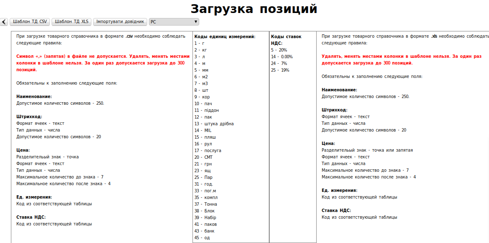

####################################################
Заповнення Товарного Довідника
####################################################

.. contents:: Содержание:

---------

Вступ
===================================

Дана інструкція описує порядок заповнення **«Товарного Довідника» (ТД)**, а також обов'язкових для заповнення полів.

Заповнити Товарний Довідник на Web-платформі можна декількома способами:

**Вручну на платформі, Через шаблон .CSV, Через шаблон .XLS**.
Нижче будуть наведені приклади усіх способів.

Заповнення Товарного Довідника вручну
===============================================

Для переходу до заповнення Товарного довідника, необхідно перейти в розділ **«Меню» -> «Довідники» -> «Товарний Довідник»**

Для того щоб додати товарної позиції, натисніть на кнопку **«+»**.

Після натискання на яку у вас відкриється форма **«Відхилення від норми даних товарної позиції»**.

**Обов'язкові для заповнення поля**:

#. **Найменування*** - вкажіть найменування товарної позиції.
#. **Штрих-код*** - вкажіть штрихкод позиції.
#. **Ціна*** - вкажіть ціну без ПДВ.
#. **Од.вим.*** - зі списку виберіть одиницю.
#. **ПДВ*** - Вкажіть ставку ПДВ.
#. **ТМ** - вкажіть, до яких торговельних мереж буде відноситись даний товар. За замовчуванням стоїть значення "Всі".

Позиція з позначкою **ТМ** може бути додана тільки в разі, якщо ця товарна позиція вже існує в загальному довіднику.

Після заповнення **обов'язкових полів**, натисніть на **«Зберегти»** для внесення змін за товарною позицією.

Позиція буде збережена і відображатиметься в загальному довіднику.

Позиції з позначкою **ТМ** будуть відображатися в довіднику з найменуванням мережі в квадратних дужках після найменування.

.. image:: pics_zapolnenie_tovarnogo_spravochnika/zapolnenie_tovarnogo_spravochnika_05.png
   :align: center

Завантаження Товарного Довідника через шаблон
==========================================================

Для того щоб перейти в Меню завантаження шаблону Товарного Довідника, натисніть на кнопку **«Імпортувати довідник»**.

Після чого відкриється форма **«Завантаження позицій»**.

Для завантаження позицій на платформу, потрібно завантажити структурований шаблон натисканням на кнопку - ** «Шаблон ТД» **, заповнити його згідно з інструкцією яка знаходиться в нижній частині екрану.

.. important:: **Зверніть увагу!** Коди «Одиниць вимірювань» і Коди «Ставок ПДВ» потрібно заповнити згідно таблиці, яка розташована в центральній частині екрану

Заповнення ТД за допомогою шаблону .csv
--------------------------------------------

.. important:: Якщо Ваша програма не підтримує формат .csv (або файл відображається некоректно), ви можете встановити безкоштовний пакет офісних програм LibreOffice перейшовши за посиланням: http://free-software.com.ua/office/libreoffice/

Для того щоб завантажити шаблон, натисніть на кнопку ** «Шаблон ТД.CSV» **. Після чого почнеться скачування файлу.

Відкрийте порожній файл Excel, після чого натисканням на кнопку **«Файл»** -> **«Відкрити»** відкрийте завантажений шаблон.

Для того щоб відкрити таблицю Шаблона ТД.CSV, вкажіть в Таблиці **«Імпорт даних з тексту»** коректні дані.

.. image:: pics_zapolnenie_tovarnogo_spravochnika/zapolnenie_tovarnogo_spravochnika_10.png
   :align: center

Для коректного відкриття документа вкажіть в полі **Кодування - «Кирилиця (Windows-1251)»**, в полі **Параметри роздільник** - **«Кома / Крапка з комою»** і в полі **Інші параметри** - **«Розпізнавати будь-які числа»**, і натисніть клавішу **ОК**.

Відкрийте завантажений файл Excel і заповніть **обов'язкові колонки**, виділені кольором, згідно з інструкцією на сайті:

.. image:: pics_zapolnenie_tovarnogo_spravochnika/zapolnenie_tovarnogo_spravochnika_11.png
   :align: center

Після заповнення таблиці, збережіть файл на робочий стіл.

Завантаження шаблону Товарного Довідника
--------------------------------------------

Для завантаження шаблону необхідно повернутися в Товарний Довідник і натиснути на кнопку **«Завантажити Шаблон»** (при необхідності, відзначте роздрібну мережу, для якої ви хочете завантажити довідник).

Потім виберіть створений документ, який ви зберегли раніше.
Після завантаження позиції будуть збережені і відобразяться в загальному довіднику.

Позиції з позначкою **ТМ** будуть відображатися в довіднику з найменуванням мережі в квадратних дужках після найменування.

Заповнення ТД за допомогою шаблону .xls
------------------------------------------------

Для того щоб завантажити шаблон, натисніть на кнопку **«Шаблон ТД XLS»**, після чого почнеться скачування файлу.

Відкрийте завантажений файл Excel і заповніть **обов'язкові колонки**, виділені кольором, згідно з інструкцією на сайті:

.. image:: pics_zapolnenie_tovarnogo_spravochnika/zapolnenie_tovarnogo_spravochnika_15.png
   :align: center

Після заповнення шаблону, збережіть файл на робочий стіл.

Для завантаження шаблону необхідно повернутися в Товарний Довідник і натиснути на кнопку **«Завантажити Шаблон»** (при необхідності, відзначте роздрібну мережу, для якої ви хочете завантажити довідник).

Потім виберіть створений документ, який ви зберегли.
Після завантаження позиції будуть збережені і відобразяться в загальному довіднику.

Позиції з позначкою **ТМ** будуть відображатися в довіднику з найменуванням мережі в квадратних дужках після найменування.

Після завантаження позиції будуть збережені і відобразяться в загальному довіднику.

.. include:: kontakti.rst
