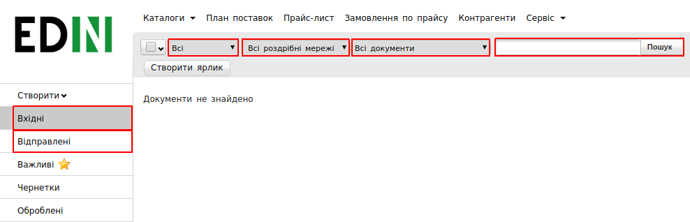
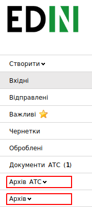
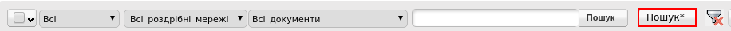

####################################################
Інструкція з пошуку документів на веб-платформі
####################################################

У кожного користувача веб-платформи неодноразово може виникати складність з успішним пошуком необхідних документів. Причиною можуть бути різноманітні фактори, серед яких:

1. перший фільтр (всі, прочитані, не прочитані) не відповідає тому статусу, в якому зараз документ;
2. неправильно введений номер документа при пошуку;
3. не вірно вибраний GLN-номер компанії на який мав надійти документ.

Якщо розуміти, яким чином виконується пошук на платформі та послідовність виконуваних дій, то він здається простим та зрозумілим. В даній інструкції описані основні можливості фільтра, якими варто скористатися для вдалого пошуку необхідного документа.

**Використовуємо фільтр**
==========================

.. attention:: Починайте пошук документа переконавшись, що вибрано вірний GLN-номер Вашої компанії.

Для пошуку документів на платформі необхідно використовувати доступний функціонал наявного фільтра. Існують як основні критерії пошуку, так і розширені. До основних відносяться:

* **Напрямок документа:** Вхідний, Відправлений
* **Статус документа:** Прочитаний, Непрочитаний, Всі
* **Торгова мережа:** (Приклад: Новус, Велика Кишеня)
* **Тип документа:** (Приклад: Замовлення, Комерційний документ)
* **Номер документа**

Пошук можна виконувати по кожному критерію окремо, але більш доцільним і ефективним буде пошук, який поєднує декілька критеріїв.
Даних фільтрів для пошуку документів в більшості випадків вистачає і при корректному встановленні фільтра пошук документа закінчується успішно.

**Пам’єтаємо про архівні документи**
====================================================

Документи, термін яких більше трьох місяців, потрапляють в архів.
На платформі Ви можете побачити наступні вкладки:

* Архів АТС (період з 01.06.2018)
* Архів (період до 01.06.2018)

Якщо завчасно відомо, що документ, який необхідно знайти, є архівним, тоді необхідно відкрити відповідну вкладку, в залежності від періоду документа та виконати пошук, скориставшись основними фільтрами.

* **Тип документа** (Приклад: Замовлення)
* **Торгова мережа** (Приклад: Новус, Велика Кишеня)
* **Період** (місяць)
* **Номер документа**

В разі, якщо віднайти документ за допомогою основних критеріїв не вдалося, радимо скористатися можливостями розширеного пошуку, доступним при натиснені на кнопку, як на зображенні нижче.

.. include:: kontakti.rst