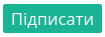

Підписання на платформі EDI Network 2.0
###################################################################################################

.. сюди закину трохи картинок

.. |del_key| image:: /_constant/signing/del_key.png

.. role:: red

.. role:: underline

.. contents:: Зміст:
   :depth: 3

---------

Для налаштування підпису окремої процедури проводити не потрібно. Усі налаштування та додавання файлового ключа здійснюються при :underline:`першому` підписанні. Якщо в документі перед підписанням були зроблені зміни, то його потрібно **"Зберегти"**.

Процес підписання є типовим на платформі EDI Network 2.0 та, як правило, ініціюється натисканням на кнопку **"Підписати"** (після створення нового документа чи у відповідь на вхідний документ):

.. include:: /_constant/atb_check/atb_check.rst
   :start-after: .. початок блоку для ATB_check
   :end-before: .. кінець блоку для ATB_check

.. tabs::

   .. tab:: Файловий ключ

      .. include:: /_constant/signing/signing.rst
         :start-after: .. початок блоку для Signing
         :end-before: .. кінець блоку для Signing

   .. tab:: Token

      .. include:: /_constant/token_signing/token_signing.rst
         :start-after: .. початок блоку для TokenSign
         :end-before: .. кінець блоку для TokenSign

   .. tab:: Гряда

      .. include:: /_constant/gryada_signing/gryada_signing.rst
         :start-after: .. початок блоку для GryadaSign
         :end-before: .. кінець блоку для GryadaSign

   .. tab:: Дія.Підпис

      .. include:: /_constant/diya_signing/diya_signing.rst
         :start-after: .. початок блоку для DiyaPidps
         :end-before: .. кінець блоку для DiyaPidps

   .. tab:: Cloud

      .. include:: /_constant/cloud_signing/cloud_signing.rst
         :start-after: .. початок блоку для CloudSign
         :end-before: .. кінець блоку для CloudSign

Після підписання документу інформація щодо підписанта відображається в блоці "Дані про підписантів". Створені та підписані ініціатором документи можливо **"Відправити"**.

------------------------------------------------

.. include:: /_constant/kontakti.rst
