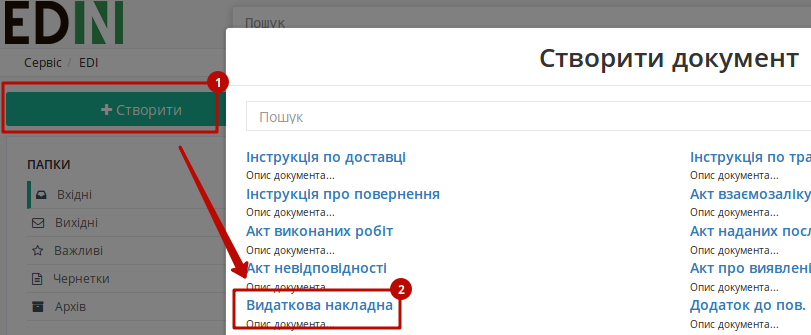
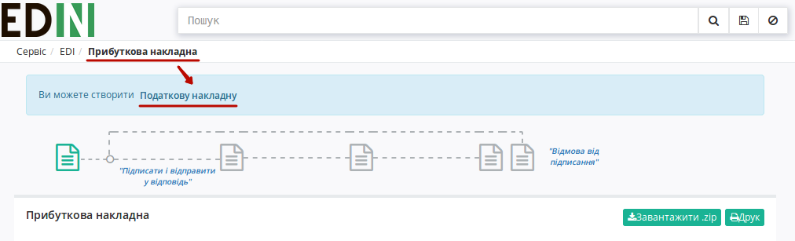
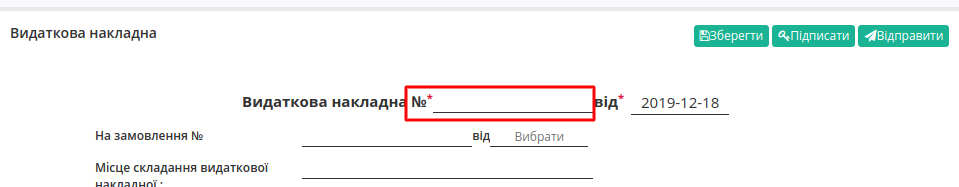
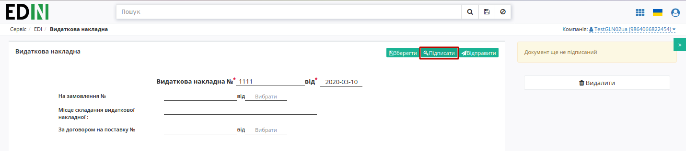
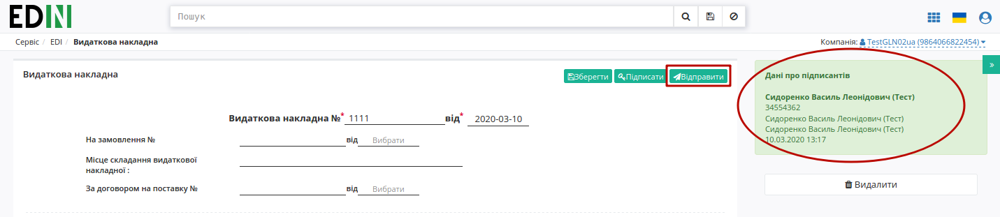
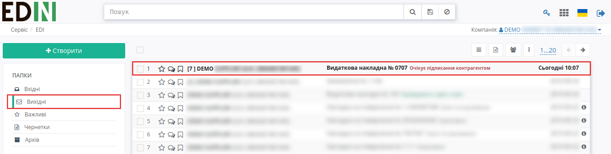
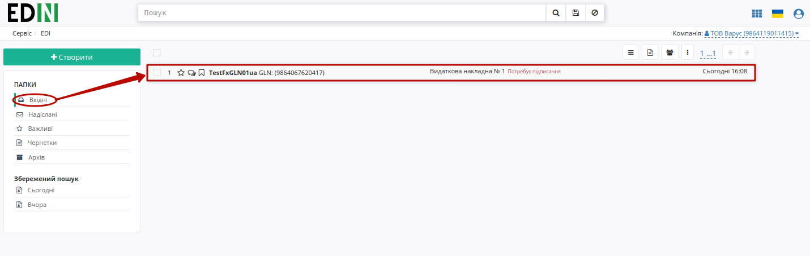
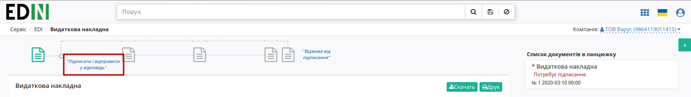

.. Deprecated

Інструкція по роботі з комерційними документами (налаштування підписання)
###################################################################################################

.. сюда закину немного картинок для текста

.. |drop_pass| image:: pics_instruktsiyi_po_dodavannyu_klyuchiv/drop_pass.png


.. role:: red

.. role:: underline

.. contents:: Зміст:
   :depth: 3

---------

Для налаштування підпису окремої процедури проводити не потрібно. Усі налаштування та додавання файлового ключа здійснюються при :underline:`першому` підписанні.

**1 Створення, підписання та відправка комерційного документа**
=====================================================================================

Розглянемо приклад створення комерційного документу на web-платформі (його можливо створити "з нуля" або на підставі іншого документу):

* Для створення комерційного документу "з нуля" потрібно натиснути кнопку "Створити" та вибрати зі списку комерційний документ, наприклад "Видаткову накладну"



* Для створення комерційного документу на підставі іншого документу потрібно перейти в документ-підставу, при перегляді якого в верхній частині єкрану буде представлений запропонований перелік документів, які можливо створити на основі розглядаємого документу 



Розглянемо приклад на основі "Видаткової накладної"

1) Для відправки комерційного документа необхідно створити комерційний документ: відкрийте необхідний документ та в доступному списку документів для створення натисніть “Видаткова накладна”:


2) Заповнити всі обовʼязкові поля комерційного документа, які позначені червоною зірочкою :red:`*`, наприклад "Номер документа" є обов'язковим полем:


    
3) Обовʼязково **"Зберегти"** необхідний документ
    
4) Натиснути кнопку **"Підписати"**



.. _sign:

.. include:: /_constant/atb_check/atb_check.rst
   :start-after: .. початок блоку для ATB_check
   :end-before: .. кінець блоку для ATB_check

.. tabs::

   .. tab:: Файловий ключ

      .. include:: /_constant/signing/signing.rst
         :start-after: .. початок блоку для Signing
         :end-before: .. кінець блоку для Signing

   .. tab:: Token

      .. include:: /_constant/token_signing/token_signing.rst
         :start-after: .. початок блоку для TokenSign
         :end-before: .. кінець блоку для TokenSign

   .. tab:: Гряда

      .. include:: /_constant/gryada_signing/gryada_signing.rst
         :start-after: .. початок блоку для GryadaSign
         :end-before: .. кінець блоку для GryadaSign

   .. tab:: Cloud

      .. include:: /_constant/cloud_signing/cloud_signing.rst
         :start-after: .. початок блоку для CloudSign
         :end-before: .. кінець блоку для CloudSign

Після підписання документу інформація щодо підписанта відображається в блоці "Дані про підписантів". Для відправки документу необхідно натинути на кнопку "Відправити".



.. image:: pics_instruktsiyi_po_dodavannyu_klyuchiv/dodavannyu_klyuchiv_06n.png
   :align: center

Комерційний документ додається в папку **"Вихідні"**:



**2 Робота з вхідним комерційним документом**
=========================================================

2.1 Підписання комерційних документів (COMDOC)
-----------------------------------------------------

Одержувачу необхідно:

1) Відкрити папку "Вхідні"

2) Вибрати необхідний документ



Вхідний документ потребує підписання (при перегляді документу тікети на схемі — "не активні")



3) Натиснути кнопку **"Підписати і відправити у відповідь"**

4) `Додати ключ для підписання <https://wiki.edin.ua/uk/latest/general_2_0/instruktsiyi_po_dodavannyu_klyuchiv.html#sign>`__ (за необхідністю)

5) **"Підписати"** комерційний документ

.. important:: Після натискання кнопки **"Підписати та відправити у відповідь"** комерційний документ відразу відправляється одержувачу без можливості редагування документа

Після відправки наступний тікет в схемі документообігу стане "активним", користувачу стає доступна функція створення `Запиту на анулювання <https://wiki.edin.ua/uk/latest/general_2_0/instruktsiyi_po_dodavannyu_klyuchiv.html#repeal>`__.  

.. image:: pics_instruktsiyi_po_dodavannyu_klyuchiv/dodavannyu_klyuchiv_13n.png
   :align: center

.. _revoke:

2.2 Відкликання підпису комерційних документів (COMDOC)
------------------------------------------------------------------------------------

.. include:: /_constant/comdoc_revoke/comdoc_revoke.rst
   :start-after: .. початок блоку для Comdoc_Revoke
   :end-before: .. кінець блоку для Comdoc_Revoke

.. _reject:

2.3 Відмова від підписання комерційних документів (COMDOC)
------------------------------------------------------------------------------------

.. include:: /_constant/comdoc_reject/comdoc_reject.rst
   :start-after: .. початок блоку для Comdoc_Reject
   :end-before: .. кінець блоку для Comdoc_Reject

.. _repeal:

2.4 Анулювання підписаних комерційних документів (COMDOC)
-----------------------------------------------------------------------------

.. include:: /_constant/comdoc_repeal/comdoc_repeal.rst
   :start-after: .. початок блоку для Comdoc_Repeal
   :end-before: .. кінець блоку для Comdoc_Repeal

.. _repeal-accept:

2.4.1 Підтвердження запиту на анулювання комерційного документа (COMDOC)
``````````````````````````````````````````````````````````````````````````````
.. include:: /_constant/comdoc_repeal_accept/comdoc_repeal_accept.rst
   :start-after: .. початок блоку для Comdoc_RepealAccept
   :end-before: .. кінець блоку для Comdoc_RepealAccept

.. _repeal-reject:

2.4.2 Відмова від анулювання комерційних документів (COMDOC)
``````````````````````````````````````````````````````````````````````````````

.. include:: /_constant/comdoc_repeal_reject/comdoc_repeal_reject.rst
   :start-after: .. початок блоку для Comdoc_RepealReject
   :end-before: .. кінець блоку для Comdoc_RepealReject

------------------------------------------------

.. include:: /_constant/kontakti.rst
