Інструкція користувача "Інтеграційного модуля EDI-NETWORK" | 1С BAS:Бухгалтерія 7.7
####################################################################################

.. role:: red

.. role:: grey

.. role:: beige

.. role:: green

.. role:: peachpuff

.. role:: underline

.. contents:: Зміст:
   :depth: 6

---------

Скорочення:

ОС - облікова система

EDI (electronic data interchange - електронний обмін данними) - тут використовується в значенні "електронний документообіг"

---------

**Вступ**
======================

Компанією EDIN розроблено модуль інтеграції з платформою EDIN2.0, що дозволяє працювати з обліковими системами 1С | BAS: Підприємство 7.7 (надалі ОС) на базі операційної системи Windows. Модуль за замовчуванням дозволяє слідкувати за електронним документообігом (переглядати ланцюжки документів, деякі типи документів (детальніше в інструкції)), створювати/редагувати документи в ОС 1С | BAS та відправляти документи контрагентам в електронному вигляді.

.. note::
    В даній інструкції описані загальні можливості базової версії модуля інтеграції під 1С | BAS:Бухгалтерія 7.7 на прикладі конфігурації "Бухгалтерский учет для Украины", до якої були внесені наступні зміни:

    1) Додано довідники:

        * EDIN_Сети
        * EDIN_ТМЦСетей
        * EDIN_Контакты
    2) Додано службові реквізити в документи "Счет" та "РасходнаяНакладная"

.. hint::
    В залежності від того, які документи використовує клієнт, того, як з ними працює його ОС, попередньо може бути проведене спеціалізоване налаштування клієнського модуля (робота з документами, їх реквізитами) програмістом 1С | BAS.

**Запуск і налаштування модуля**
================================================

Вибір та запуск модуля інтеграції здійснюється в ОС 1С | BAS через "Файл"->"Открыть" (файл модуля передається користувачеві співробітниками EDIN):

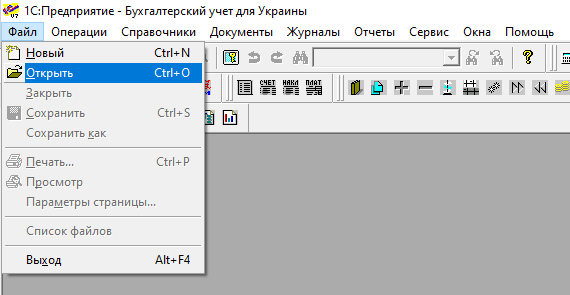

Також облікова система 1С | BAS дозволяє налаштувати запуск модуля вбудованим функціоналом (через "Сервис"->"Дополнительные возможности"):

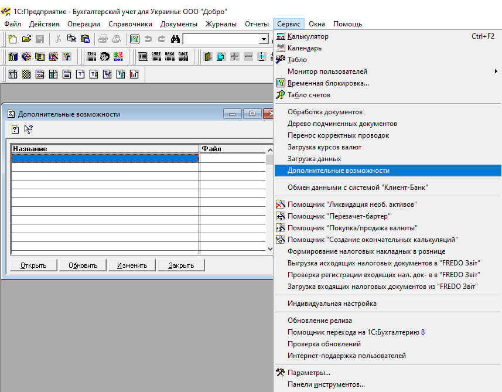

**Підключення**
-------------------------------

За замовчанням при запуску модуля відкривається вікно "Настройки", в якому користувачеві потрібно ввести адресу платформи (https://edo-v2.edin.ua), свій логін, пароль та API KEY (за наявності такого у користувача):

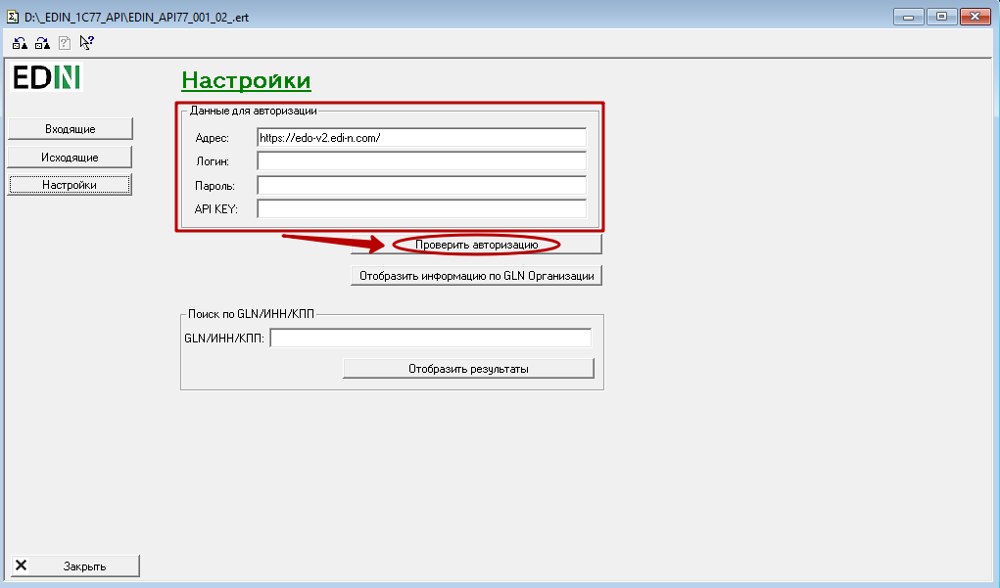

Після того, як всі потрібні дані будуть введені можливо здійснити перевірку (кнопка **"Проверить авторизацию"**) введених даних (модуль повідомить про корректність введених даних).

Для того аби не вводити дані для підключення при кожному запуску модуля, можливо зберегти налаштування (кнопка **"Сохранить настройку"**):

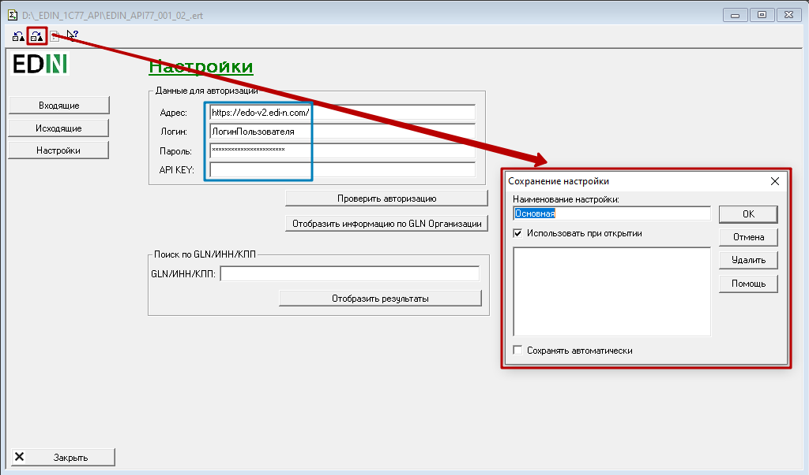

**Допоміжний функціонал**
-------------------------------

Додатково в "Налаштуваннях" можливо отримати інформацію по всіх прив'язаних до аккаунту GLN-ах організації (кнопка **"Отобразить информацию по GLN Организации"** (1)). А для отримання інформації про організації контрагентів також реалізована панель пошуку (2) по Назві/ІПН/КПП/GLN (по будь-якому параметру):

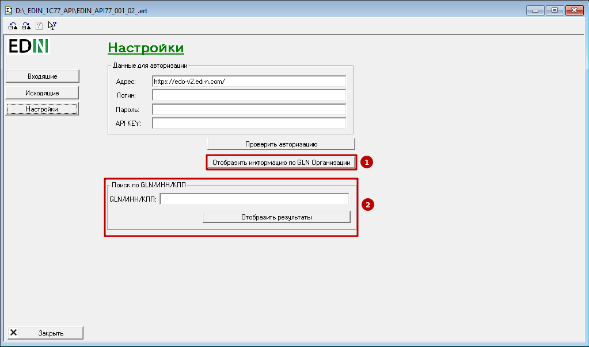

**Робота з документами**
================================================

Для зручної роботи з документами передбачені два вікна: **"Входящие"** и **"Исходящие"**, в яких і відображаються вхідні і вихідні документи відповідно.

**Робота з вхідними документами**
-----------------------------------------

Всі основні дії з документами проводяться у вкладці **"Входящие"**. Для початку роботи з документами потрібно обрати період (1) та натиснути **"Отобразить входящие документы"** (2):

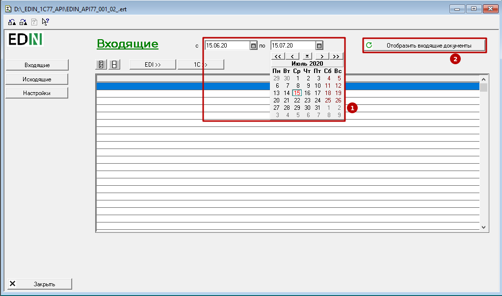

Після чого в журналі документів відобразяться всі вхідні документи (та їх ланцюжки) всіх контрагентів за обраний період:

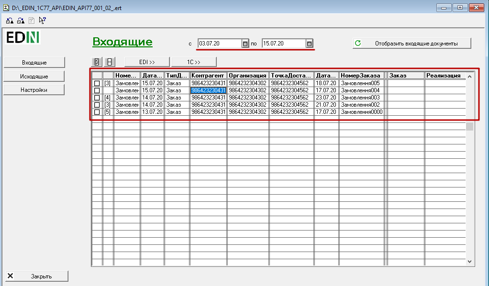

В журналі документів відображаються дані по: **Кількості документів в ланцюжку документів, Номеру документа, Даті документа, Типу документа, Контрагенту, Організації, Точці доставки, Даті доставки, Номеру замовлення, Замовленню(1С | BAS), Реалізації(1С | BAS)**. 

При подвійному кліку мишкою на "кількість документів в ланцюжку документів" (документи, що логічно об’єднані між собою) відображається вікно перегляду даного ланцюжка документів. При подвійному кліку мишкою на дані документа (Номер, Дата, Тип...) відображається вікно перегляду документа, що складається з шапки та табличної частини:

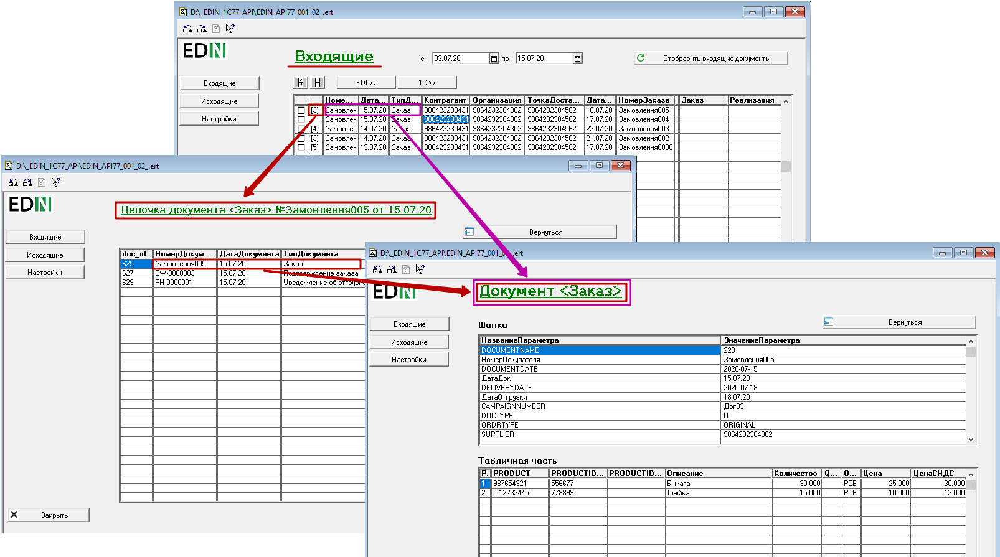

За замовчуванням в модулі для перегляду доступно 3 типи документів: `Замовлення <https://wiki.edin.ua/uk/latest/EDIN_Specs/XML/ORDER_x.html>`__, `Підтвердження замовлення <https://wiki.edin.ua/uk/latest/EDIN_Specs/XML/ORDRSP_x.html>`__, `Повідомлення про відвантаження <https://wiki.edin.ua/uk/latest/EDIN_Specs/XML/DESADV_x.html>`__.

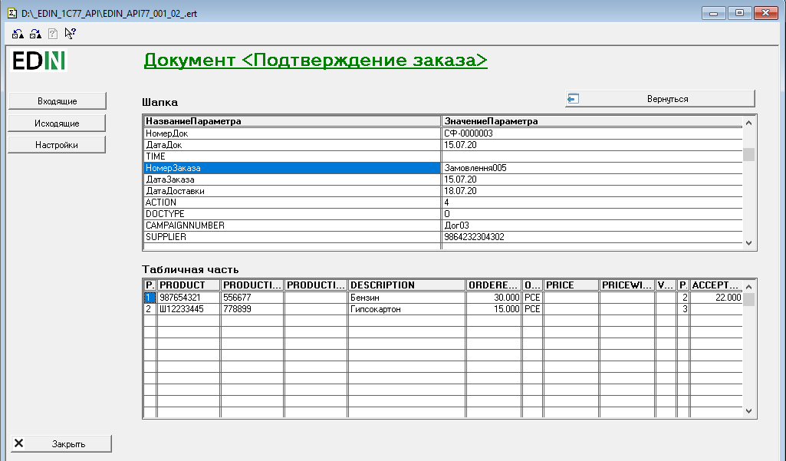

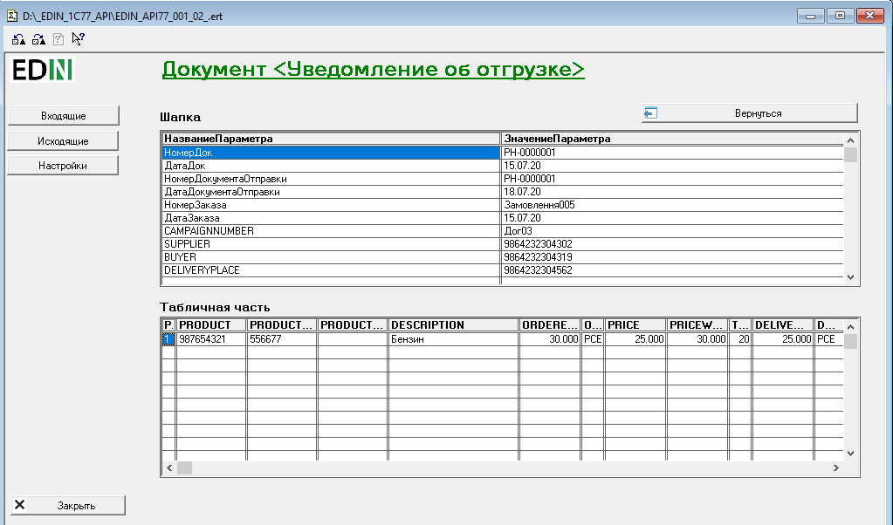

Якщо в полях **"Контрагент"**, **"Организация"** и **"ТочкаДоставки"** відображається GLN, то при подвійному кліку мишкою по номеру відкриються налаштування довідника для вибору та зпівставлення даних. Заміна GLN номера на значення з довідника для вказаних вище колонок аналогічне, розглянемо для прикладу заміну для **"Контрагента"**:

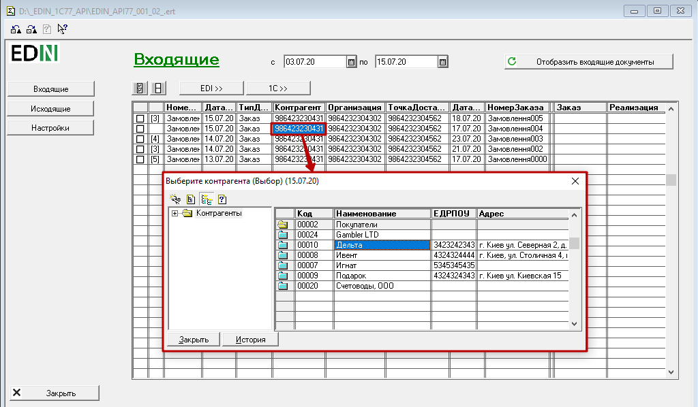

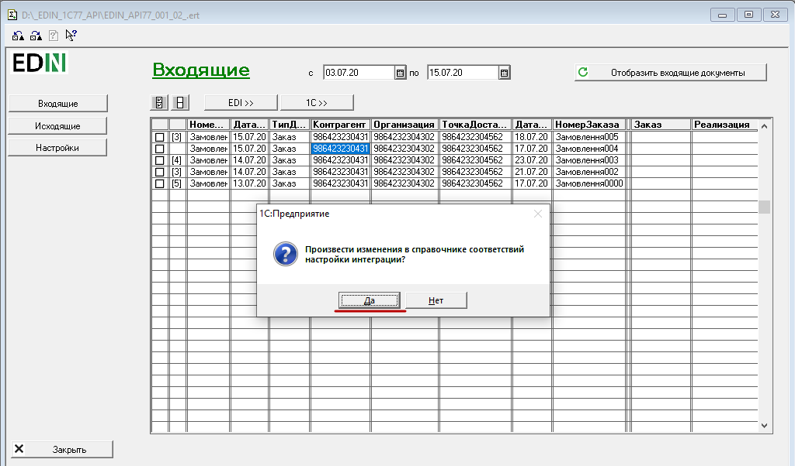

Після проведення зпівставлень з відповідними довідниками обрані GLN номера в подальшому автоматично замінюються даними з довідника:

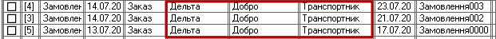

**Формування та відправка документів**
~~~~~~~~~~~~~~~~~~~~~~~~~~~~~~~~~~~~~~~~~~~~~~~~~~~~~~

Після того, як в журналі відобразились потрібні для роботи документи спочатку потрібно зформувати відповідні документи в ОС 1С | BAS:

1. Обрати подвійним кліком вхідні документи (для зручності можливо скористатись кнопками **"Обрати всі документи"** / **"Відмінити вибір всіх документів"**)
2. Натиснути на кнопку **"1С | BAS>>"** та обрати **"Создать заказы"** / **"Создать реализации"** для створення "Замовлень в 1С | BAS" чи "Реалізацій в 1С | BAS" по всім обраним документам відповідно.

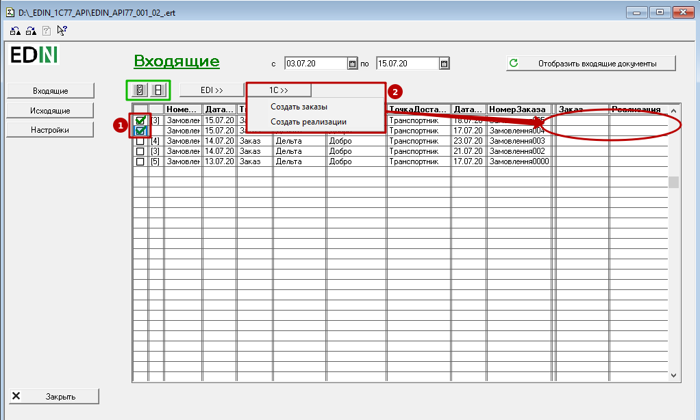

.. note::
   Під час операції створення документу 1С | BAS може виникнути ситуація коли номенклатура окремих позицій у вхідному документі не зпівставлена з номенклатурою в довідниках 1С | BAS. Модуль автоматично повідомляє про необхідність зпівставлення номенклатури і відкриває вікно **"Несопоставленная номенклатура"**, в якому через подвійний клік мишею по номенклатурі потрібно обрати відповідне значення в довіднику 1С | BAS і **"Сопоставить номенклатуру сети"**:

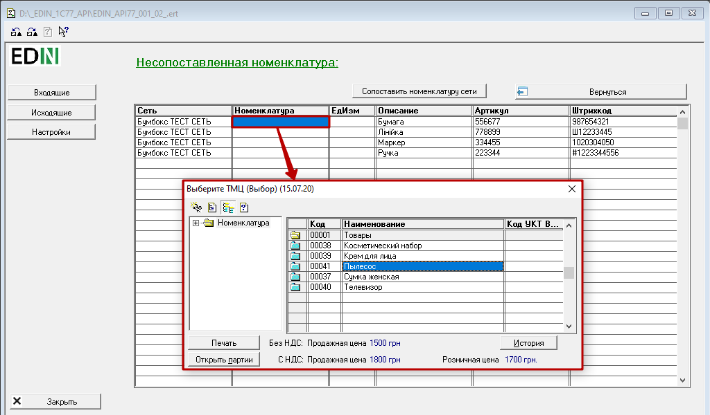

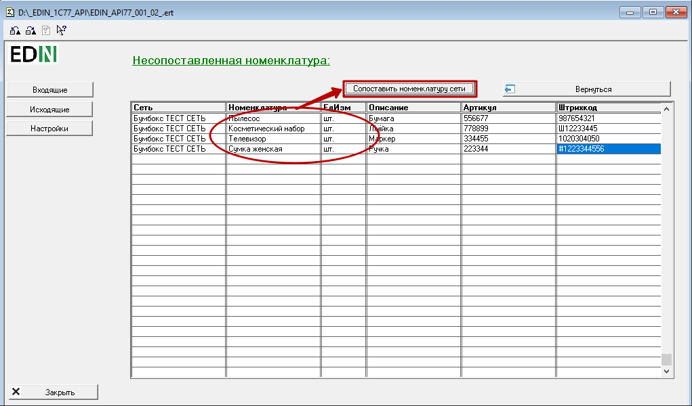

3. Після того, як документи 1С | BAS сформовані можливо подвійним кліком миші по значенню рядка **"Заказ"** (1С | BAS) чи **"Реализация"** (1С | BAS) відкрити документ, внести в ньому за потреби зміни та зберегти.
4. Обрати подвійним кліком документи, що будуть в подальшому відправлені.
5. Натиснути на кнопку **"EDI>>"** та обрати **"Отправить ORDRSP"** / **"Отправить DESADV"** для відправки "Підтвердження замовлення" чи "Повідомлення про відвантаження" по всім обраним документам відповідно.

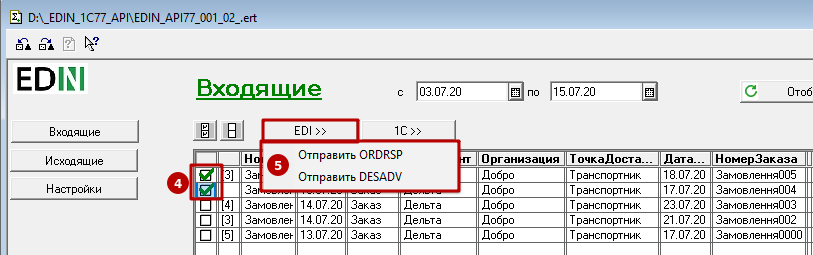

6. Для відображення змін документообігу потрібно оновити журнал кнопкою **"Отобразить входящие документы"**.

.. attention::
   За замовчуванням: якщо при відправці "Підтвердження замовлення" (**"Отправить ORDRSP"**) попередньо не було створено і відредаговано "Замовлення"(1С | BAS), то "Підтвердження замовлення" виконується в повному обсязі (тобто підтверджуються всі позиції вхідного "Замовлення"): 

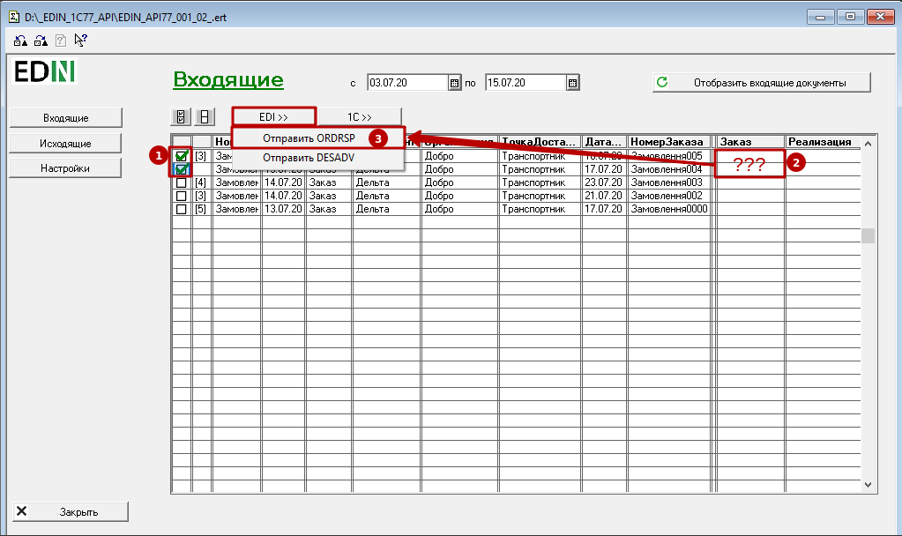

**Вихідні документи**
-----------------------------------------

У вікні "Исходящие" відображаються вихідні (відправлені) документи. Для перегляду документів потрібно обрати період (1) та натиснути **"Отобразить входящие документы"** (2):

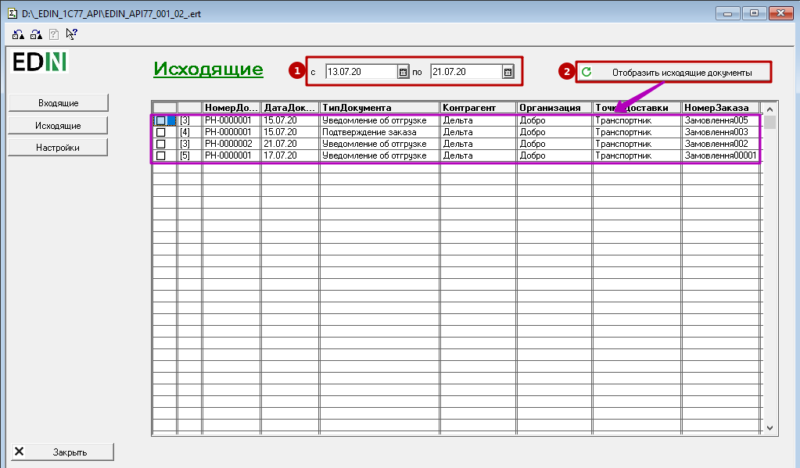

.. include:: kontakti.rst
