###############################################################################################################
Короткий посібник з інтеграції сервісу EDIN "ETTN" з обліковими системи 1C на звичайних формах 
###############################################################################################################

.. role:: underline

.. role:: red

.. contents:: Зміст:
   :depth: 4

---------

Скорочення:

Е-ТТН – товарно-транспортна накладна в електронній формі

ОС - облікова система

ЕЦП - електронно-цифровий підпис/печатка

GLN - (Global Location Number) глобальний номер місцезнаходження

НКІ - носій конфіденційної інформації

---------

****************************************************
**1 Перший запуск і налаштування модуля**
****************************************************

Розроблений компанією EDIN інтеграційний модуль сервісу EDIN "ETTN" (в подальшому просто модуль) дозволяє працювати з обліковими системами 1С | BAS: Підприємство 8.Х :underline:`на звичайних формах`, платформа 8.3.11 та вище (надалі 1С | BAS) на базі операційної системи Windows, та орієнтований на вантажовідправника та вантажоотримувача.

Для роботи з модулем у користувача повинна бути підключена послуга для роботи з API. Для роботи з модулем користувачеві надаються логін, пароль і api_key:

- email - логін користувача;
- password - пароль користувача на платформі EDIN 2.0
- api_key - пароль доступу до API

Для запуску модуля необхідно в обліковій системі 1С | BAS відкрити файл запуску модуля (передається користувачеві співробітниками EDIN):

.. image:: pics_integration_guide/integration_guide_01.jpg
   :align: center

.. important:: У користувача повинні бути повні права на каталог, в якому знаходиться файл модуля

При підключенні модуля облікова система 1С | BAS може вимагати від користувача дозвіл на виконання операцій з боку модуля (захист від небезпечних дій).

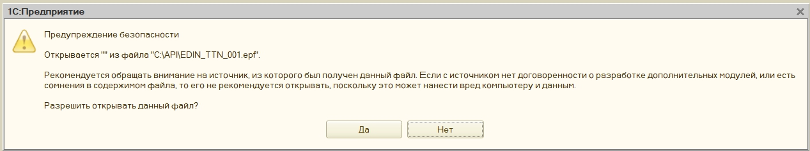

При першому запуску (відсутній **config.txt**) автоматично відкривається розділ "Налаштування" для введення всіх необхідних даних (надалі при запуску відкривається розділ "Вхідні"). У каталозі, в якому розташований файл модуля, автоматично створюються файл основних налаштувань **Config.txt**.

********************************
**2 Налаштування**
********************************

При першому запуску інтеграційного модуля сервісу EDIN "ETTN" автоматично відкривається розділ "Налаштування":

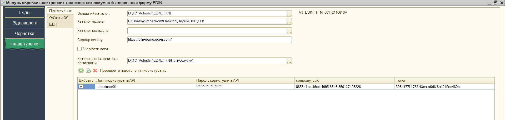

Розділ містить 3 вкладки:

- **Підключення**
- **Об'єкти ОС**
- **ЕЦП**

**2.1 Підключення**
================================================

**Основний каталог** – місце розташування файлу модуля.

**Каталог архівів** – місце збереження архівів та файлів.

**Каталог вкладень** – місце збереження вкладень документів.

**Сервер обміну** – адреса платформи електронного документообігу (на цю адресу надсилаються запити модуля).

**Зберігати логи** – при встановленій відмітці зберігається логи.

**Каталог логів запитів з помилками** – місце збереження запитів з помилками.

У цій вкладці додаються (зелена кругла кнопка "+") користувачі, для кожного вказуються свої **Логін користувача API(email) / Пароль користувача API / API key / company_uuid (надається користувачеві співробітниками EDIN)**. У цій вкладці також здійснюється вибір користувачів, від імені яких будуть здійснюватися подальші дії, наприклад, запити на відображення Вхідних / Вихідних документів.  

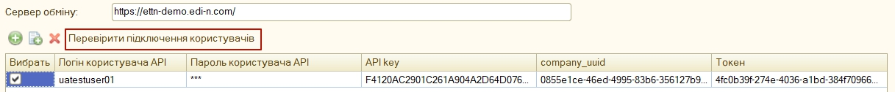

.. note::
    Налаштування користувачів зберігаються в файлі **UserSettings**, який розміщується в підкаталозі (найменування = <користувач 1С | BAS>) на одному рівні з файлом запуску модуля.

Після того, як дані користувачів були введені можливо здійснити перевірку (кнопка "Перевірити підключення користувачів") введених даних (по користувачам, у рядках яких встановлено відмітки в колонці "Вибрати"). В результаті перевірки отриманий **Токен** свідчить про коректно заповнені дані, пройдену авторизацію на платформі електронного документообігу. Також модуль відображає статусні повідомлення про успішність чи помилки, що можуть виникнути у користувача при роботі з модулем.

**2.2 Об'єкти ОС**
================================================

Для подальшої роботи з електронним документообігом необхідно провести синхронізацію модуля і ОС.

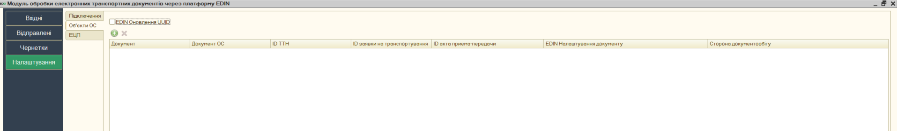

EDIN Оновлення UUID – відмітка для оновлення UUID при помилково створених документах.

Спочатку потрібно додати та обрати електронні документи сервісу EDIN "ETTN", якими буде здійснюватись в подальшому електронний документообіг (колонка "Документ"):

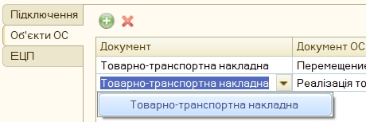

Далі потрібно для кожного електроного документу обрати документ облікової системи (на підставі цього документу можливо буде створювати електронний документообіг) - колонка "Документ ОС":

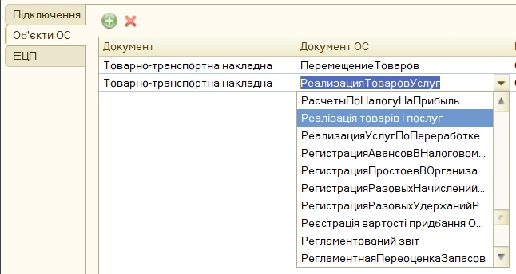

В колонках **ID ТТН** та **ID заявки на транспортування** вказуються налаштування місцерозташування **uuid платформи** цих двох основних документів сервісу (електронної "ТТН" та "Заявки на транспортування" відповідно). А в колонці "Сторона документообігу" обирається роль `учасника документообігу <https://wiki.edin.ua/uk/latest/ETTN_2_0/Work_with_ETTN.html#scenario>`__ , що дозволяє для кожної ролі вказувати різні налаштування для документів. 

В колонці "EDIN Налаштування документу" вказуються загальні налаштування документів (маппінг для формування електронного документу з даних документів ОС). Для того аби відкрити форму налаштувань потрібно натиснути на кнопку **"..."**:

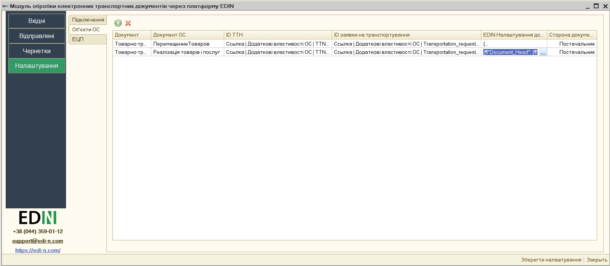

Відкрита форма налаштувань відповідності даних документа містить специфікацію тіла обраного електронного документа а також його табличної частини:

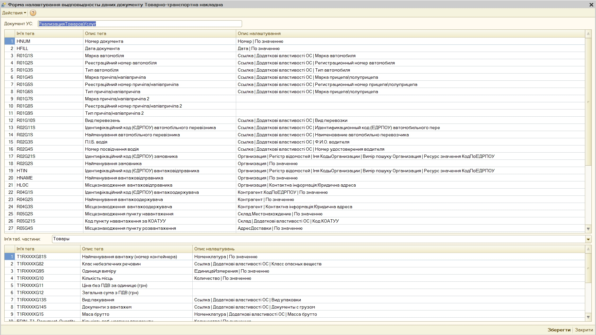

Для кожного із представлених тегів (полей) специфікації документу можливо обрати реквізити для заповнення: для цього потрібно обрати потрібний тег та в колонці "Опис налаштування" натиснути на кнопку **"..."**:

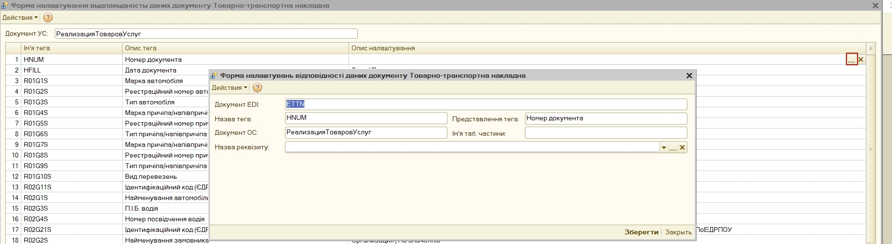

Після чого відкриється форма налаштувань відповідності даних електронного документу, в якій можливо обрати реквізит документа ОС для заповнення обраного тега електронного документу (кнопка **"..."**):

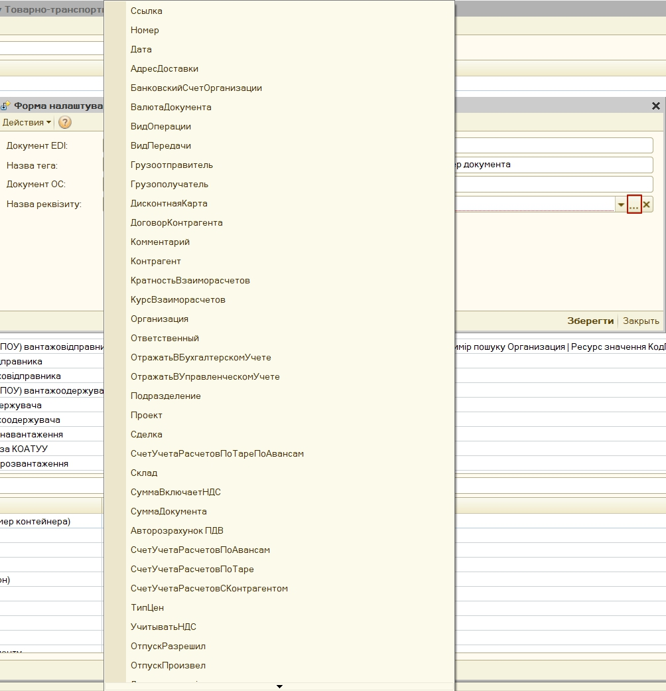

На формі в обраному реквізиті (умовно "1") можливо обрати підлеглий до нього інший реквізит (умовно "1.1"). Цю операцію вибору підлеглого реквізиту, що відноситься до вже обраного можливо продовжити ("1.1"->"1.1.1"->"1.1.1.6"->"1.1.1.6.4"->"1.1.1.6.4.2" ...) за допомогою кнопки:

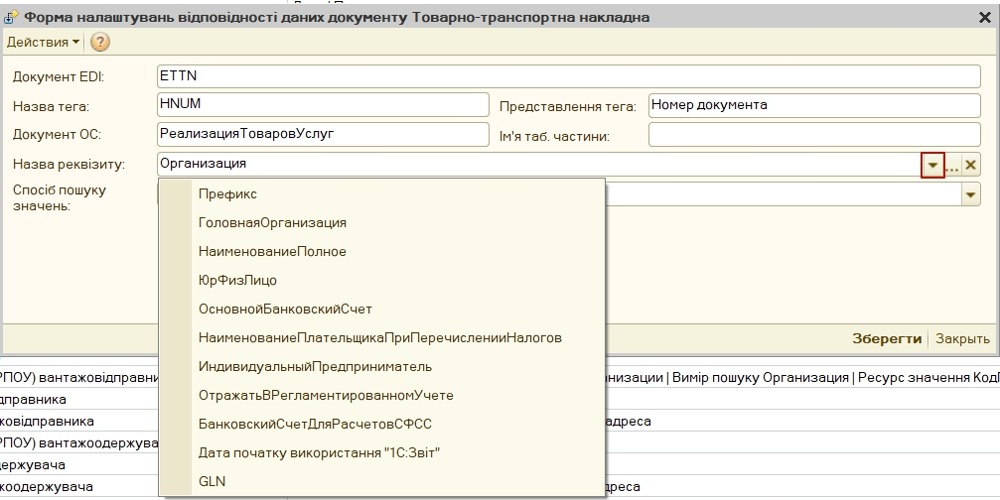

Після вибору реквізиту стане доступним для редагування "Спосіб пошуку значень":

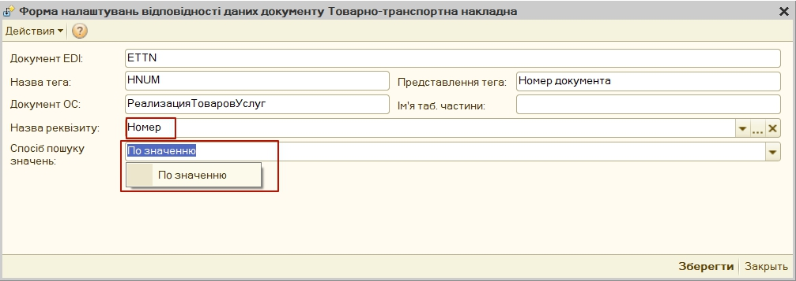

"Спосіб пошуку значень"="По значенню" свідчить, що для заповнення тегу електронного документу буде обрано значення реквізиту документу ОС. І для даного значення реквізиту, що наведений на зображенні вище не доступні "Додаткові властивості ОС". "Спосіб пошуку значень"="Додаткові властивості ОС", які використовуються, коли потрібно обрати значення, що не зберігаються безпосередньо в об'єкті 1С | BAS:

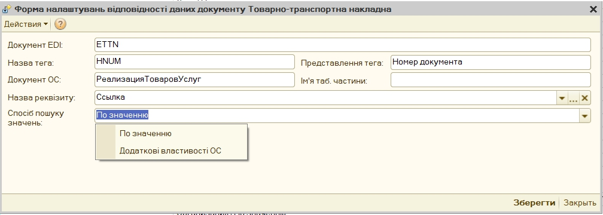

Після чого можливо обрати назву додаткової відомості:

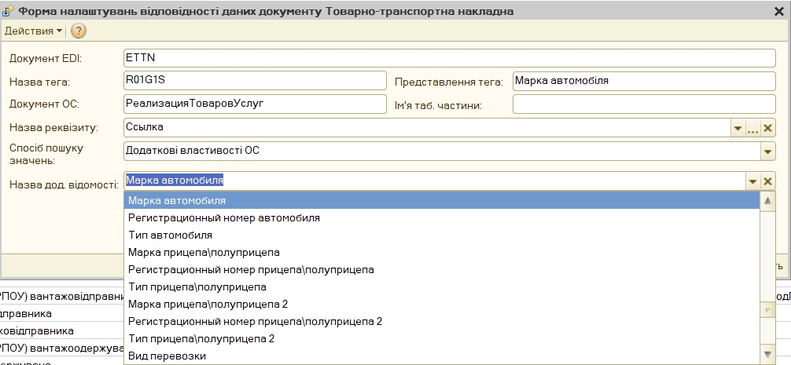

Для елементу довідника "Організація" доступно додатково обрати "Спосіб пошуку значень"="Регістр відомостей" / "Контактна інформація: Юридична адреса" / "Контактна інформація: Фактична адреса", які використовуються, коли потрібно обрати значення, що не зберігаються безпосередньо в об'єкті 1С | BAS, дані яких потрібно взяти, для прикладу, з підлеглого регістра відомостей:

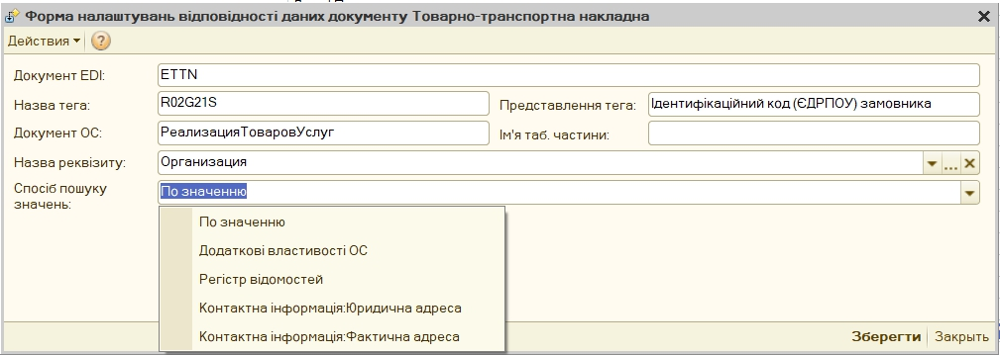

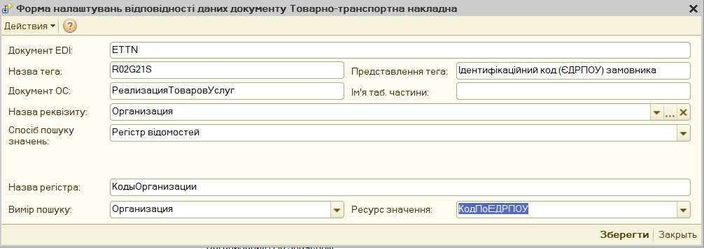

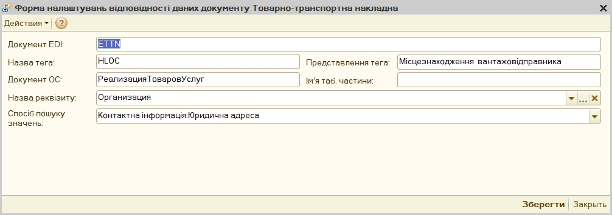

Також для елементу довідника "Контрагент" доступно обрати "Спосіб пошуку значень"="По значенню" / "Додаткові властивості ОС" / "Контактна інформація: Юридична адреса" / "Контактна інформація: Фактична адреса":

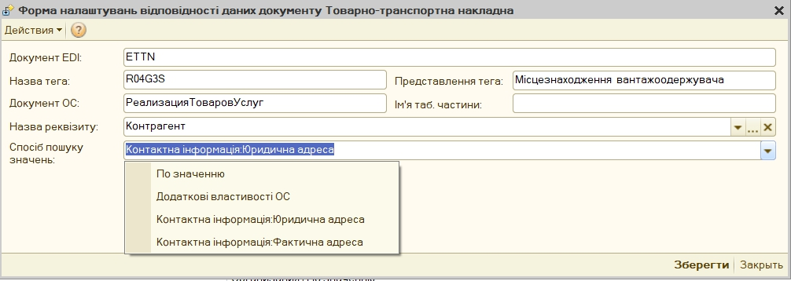

В формі налаштувань відповідності даних документа в специфікації тіла обраного електронного документа окрім типових тегів містяться й нетипові (додаткові), які відрізняються тим, що дозволяють налаштувати, наприклад, математичні операції та їх використання для автоматичного заповнення тегів електронного документу:

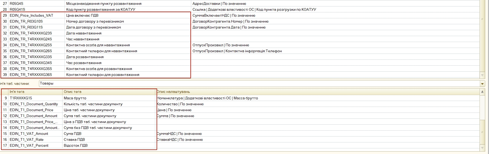

Таблиця 1 - Опис нетипових тегів для документу ТТН

.. csv-table:: 
  :file: for_csv/TTN_not_type_tags.csv
  :widths:  1, 7, 12, 41
  :header-rows: 1
  :stub-columns: 0

**2.3 ЕЦП**
=====================

Розділ налаштувань електронно-цифрового підпису і печатки (ЕЦП), в якому зазначаються сертифікати ДФС (знаходяться у вільному доступі) і EDIN (надається співробітником компанії або за :download:`посиланням</_static/files/Certs/ats_stamp_crypt_EU-3FAA9288358EC00304000000C9C427007CB9D400.cer>`).

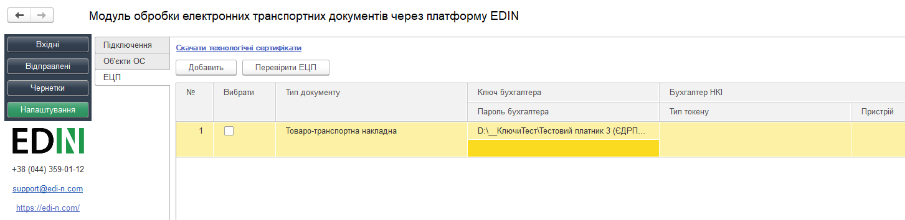

У таблицю через кнопку **"+"** можливо додати або шляхи до ключів підписанта, якими будуть підписуватись юридично значимі документи або вказати токен (НКІ). Якщо вказано шлях до файлу (ключа) і токену, то пріоритет надається файлу. Налаштування для токену ("Тип пристрою" та "Пристрій" (серійний номер часто вказується на фізичному носії)) можливо вибрати зі списку або скористатись автоматичним підбором налаштувань.

При вивантаженні юридично значимих документів паролі можна вносити або до таблиці, або обробка відобразить вікно для їх внесення перед початком підписання. Кнопка **"Перевірити ЕЦП"** дозволяє перевірити коректність введених даних ключів і паролів перед початком підписання. 

Модуль дозволяє зберігати будь-яку кількість наборів ключів, але на момент підписання по одній організації і типу документу необхідно вибрати (встановити прапорець в колонці "Вибрати") тільки одну пару ключів.

При виявленні помилки при перевірці модуль попросить повторно ввести пароль:

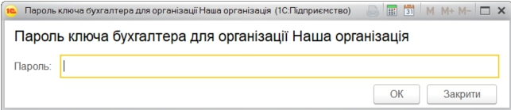

При кожній перевірці ключа у вікні повідомлень відображається опис результату виконаної перевірки.

********************
**Додатково**
********************

`Опис конфігураційного файлу Config.txt модуля для інтеграції з сервісом EDIN "ETTN" <https://wiki.edin.ua/uk/latest/поки_відсутній.html>`__ .

-------------------------------------

.. include:: /_constant/kontakti.rst
