Обмін е-документами з поштово-логістичним оператором Meest-Express
####################################################################################################

.. contents:: Зміст:
   :depth: 6

---------

Вступ
=======================

Дана інструкція описує порядок роботи з документами, які відправляє компанія Meest-Express:

- Рахунок
- Акт виконаних робіт
- Специфікація

Документи Вам будуть надходити у вигляді Комерційного документа з відповідним типом.

*Акт виконаних робіт* вимагає узгодження: прийняття / підписання або відхилення.
*Рахунок* і *Специфікація* є інформаційним документом без будь-яких вимог.

Вхід на платформу
=======================

Для входу на платформу необхідно перейти за посиланням https://obmin.edi-n.com/. На сторінці, введіть логін і пароль для доступу в систему.

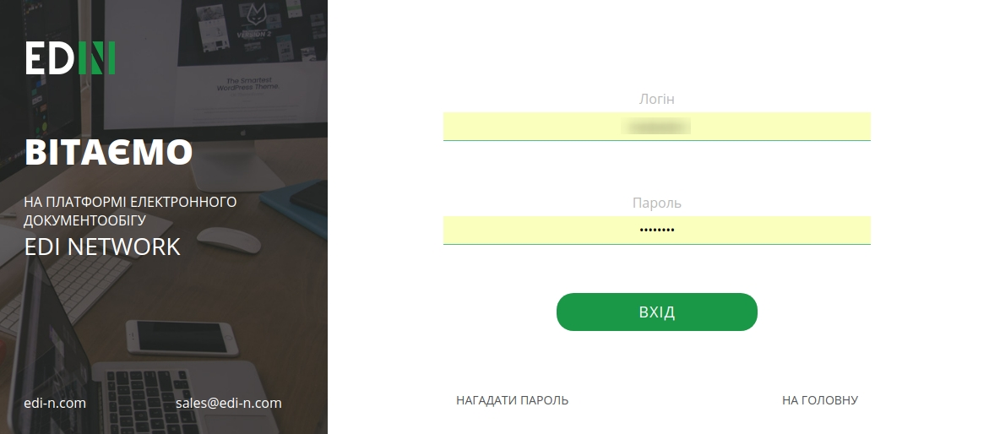

Налаштування ЕЦП
=======================

Перед початком роботи необхідно налаштувати підпис, яким Ви будете підписувати документи. Щоб перейти до Налаштування ЕЦП, зайдіть в Налаштування, натиснувши на "**шестерню**" у верхньому правому куті. Відкриється Провідник, де необхідно буде вказати каталог з секретними ключами і вибрати ключі.

.. image:: pics_Obmin_e_dokumentami_s_Meest_Express/Obmen_e-dokumentami_s_Meest-Express_02.png
   :align: center

Якщо ключі отримані в **АЦСК ІДД (ДФС)**, тоді необхідно вибирати: ключі **key-6.dat**.

Якщо ви використовуєте для підписання ключі **АЦСК «Україна»**, тоді вид ключів такий:

- Ключ директора: ЕДРПОУ_ИНН подписанта_D1111111.ZS2
- Ключ бухгалтера: ЕДРПОУ_ИНН подписанта _B1111111.ZS2
- Ключ печатки: ЕДРПОУ_S1111111.ZS2 (ЕГРПОУ _U1111111.ZS2)
- Ключ шифрування: ЕДРПОУ_С1111111.ZS2 (ЕГРПОУ _U1111111.ZS2)

Після того, як ключ обраний, з'являється вікно, в якому необхідно ввести пароль і натиснути кнопку: **Зчитати**.

Коли ключі зчитані, у вікні ЕЦП можна буде побачити інформацію про ЕЦП:

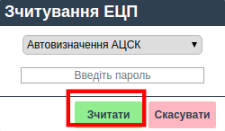

.. image:: pics_Obmin_e_dokumentami_s_Meest_Express/Obmen_e-dokumentami_s_Meest-Express_04.png
   :align: center

Підписання документів
===================================

Для того, щоб підписати документ ЕЦП, необхідно натиснути кнопку **Підписати**.

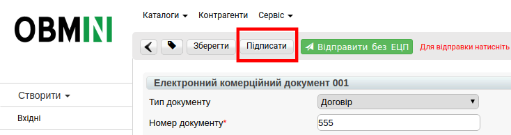

Відкриється вікно для підписання, в якому необхідно натиснути кнопку **Підписати**.

.. image:: pics_Obmin_e_dokumentami_s_Meest_Express/Obmen_e-dokumentami_s_Meest-Express_06.png
   :align: center

Далі відкриється вікно, в якому необхідно відзначити чекером типи ключів, якими буде підписаний документ. Потім встановлюємо послідовність підпису, наприклад:

- директор - 1
- печатка - 2

.. image:: pics_Obmin_e_dokumentami_s_Meest_Express/Obmen_e-dokumentami_s_Meest-Express_07.png
   :align: center

І натискаємо кнопку **Підписати**. Після процесу підписання необхідно натиснути кнопку **Відправити**.

.. image:: pics_Obmin_e_dokumentami_s_Meest_Express/Obmen_e-dokumentami_s_Meest-Express_08.png
   :align: center

Робота з документами
===================================

При отриманні документа, він відображається на платформі в папці **Вхідні**.

**Зверніть увагу**! Тип документа відображається в короткому описі документа.

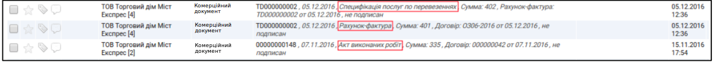

Для вибору необхідного документа є можливість скористатися фільтрами, які відображаються над документами:

- Перший фільтр відображає **всі**, прочитані і непрочитані документи;
- Другий фільтр дозволяє вибрати конкретний **тип** документа.

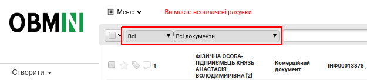

**Всі документи, які відправляє компанія Meest-Express передаються в форматі Комерційного документа (comdoc).**

Після вибору цього документа в другому фільтрі, з'являється два додаткових фільтра, що дозволяють сортувати:

- за типом документа
- за статусом.

Також можна скористатися рядком пошуку, вказавши правильний номер документа.

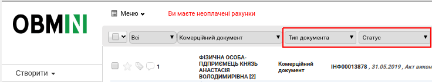

При необхідності є можливість використовувати розширений пошук. Для цього потрібно натиснути на відповідну кнопку - **Пошук***.

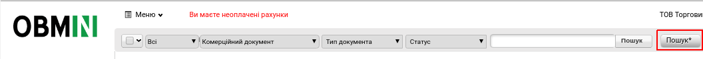

У вікні необхідно ввести параметри пошуку і натиснути кнопку **Знайти**.

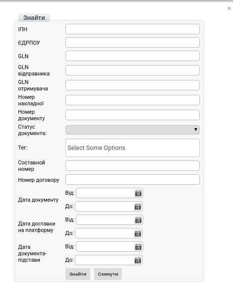

Рахунок-фактура
------------------

Документ передає інформацію про вартість послуг, що надаються компанією Meest-Express. Інформація про підписання документа відображається в блоці «**Підписи**». У відкритому документі вгорі є кілька кнопок, які дозволять Вам:      

- роздрукувати документ;
- скачати документ у форматі .xls;
- скачати документ у форматі .xml;
- відобразити більш детальну інформацію по документу;
- завантажити документ з ЕЦП;

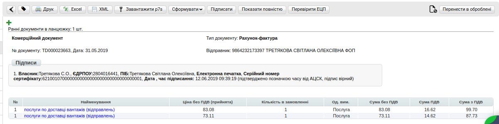

Специфікація послуг з перевезень
------------------------------------

Документ розшифровує рахунки, виставлені в електронному документі «Рахунок-фактура».

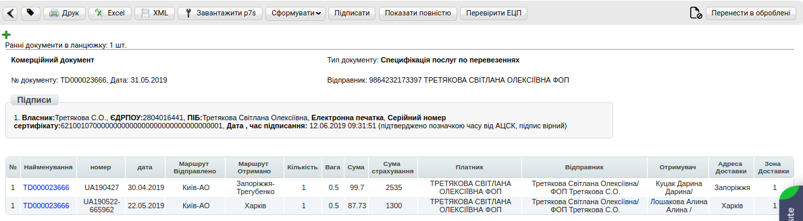

Акт виконаних робіт
---------------------------

Даний документ обов'язково **вимагає перевірки** і підтвердження або відхилення.

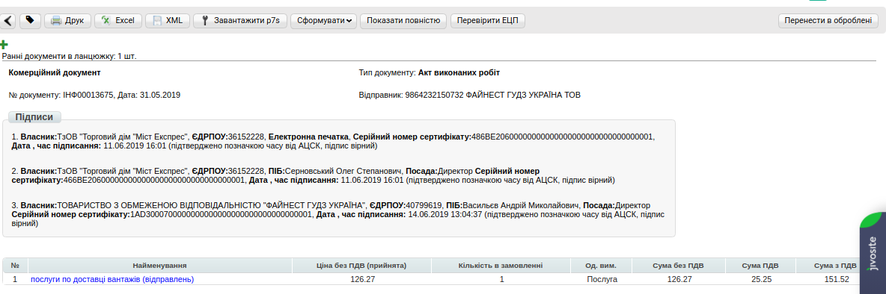

Для підтвердження Акта необхідно натиснути на кнопку **Підписати**, і в блоці «ЕЦП» ввести паролі для підписання документа.

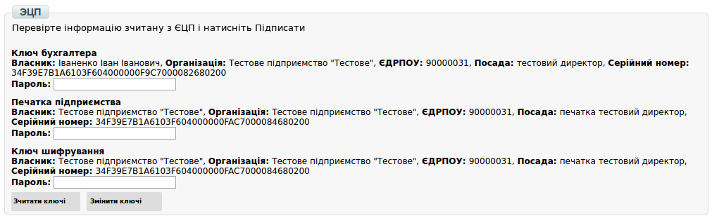

У разі якщо ЕЦП не налаштований, поверніться до кроку 2 даної інструкції.

Додаткові сервіси
===================================

Портал сертифікатів
---------------------------

Портал сертифікатів EDIN-Certificate - це онлайн сервіс зі зберігання, обробки, пошуку та спільному використанні сертифікатів в єдиному середовищі для всіх учасників.

Для роботи зі звітністю потрібно вибрати Сервіс -> Сертифікати:

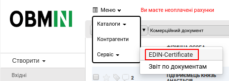

Основні можливості сервісу - Портал Сертифікатів:

- Швидкий пошук сертифіката (2 сек.);
- Зручний обмін між учасниками;
- Захист від втрати сертифіката (хмарне зберігання);
- Пряме посилання для швидкого перегляду / скачування;
- Завантаження і друк сертифіката в середовищі сервісу;
- Пошук сертифіката за різними ознаками (№, артикул, штрих-код і т.д.)

Додавання і зміни email в налаштуваннях користувача
-------------------------------------------------------

Для редагування (зміни, видалення або додавання) адреси e-mail необхідно:

1. У правому верхньому куті на платформі перейти у «**Налаштування**».
2. В розділі «**Зміна поштової скриньки**» скорегувати існуючу адресу пошти.   

.. hint::
   Також через «,» можливо додати кілька e-mail. Пример: test@mail.ua,test2@mail.ua,test3@mail.ua

3. Після внесення всіх необхідних змін зберегти їх натисканням кнопки «**Зберегти зміни**».

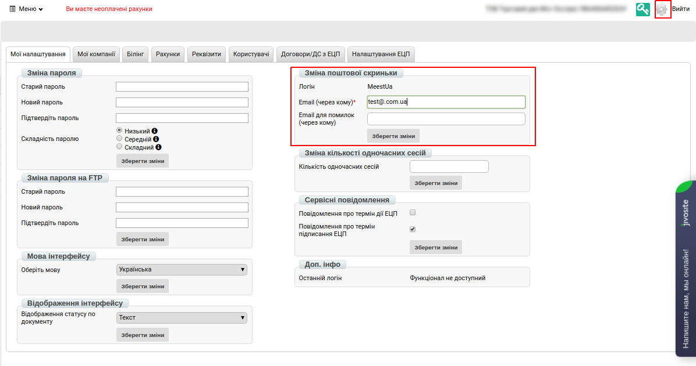

.. include:: kontakti.rst
