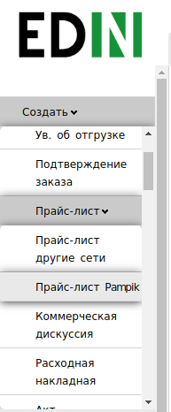
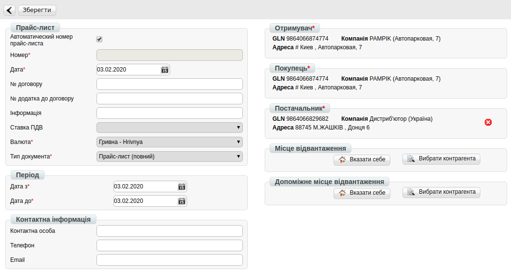
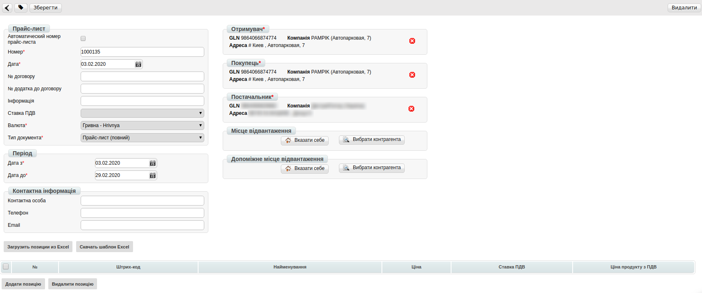
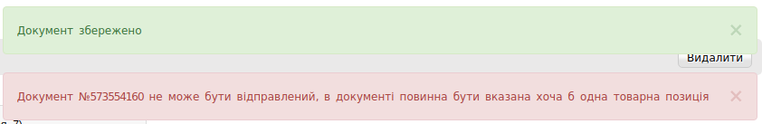
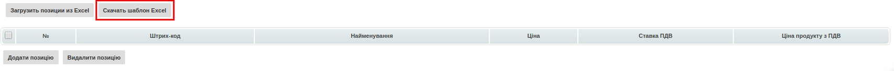
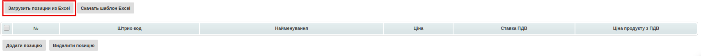
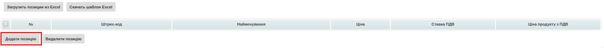
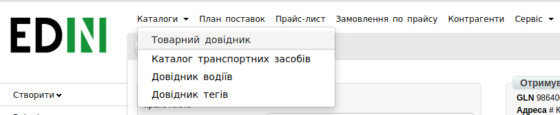

Інструкція по роботі з документом "Прайс-лист" для PAMPIK (Лелека Трейд) на web-платформі 
####################################################################################################################

.. role:: red

.. contents:: Зміст:
   :depth: 6

---------

**1 Формуваня документа "Прайс-лист"**
==============================================

Для входу на web платформу EDIN необхідно перейти за посиланням: https://edo.edin.ua

Для формування документу в основному меню натискаємо на кнопку “Створити” та обираємо документ “Прайс-лист”.

Відкриється форма документу для мережі «PAMPIK»:

Поля «Отримувач», «Покупець» автоматично заповнені (GLN номер головного офісу 9864066874774, мережа «PAMPIK») та недоступні для редагування.

Обов’язкові поля для заповнення:

* Номер прайс-листа — можна внести власний номер (при встановленій помітці, номер присвоюється автоматично)
* Дата прайс-листа — поточна дата
* Валюта — Гривня за замовчуванням
* Тип документа — Прайс-лист (повний), Доповнення прайс-листа
* "Дата з" - дата початку дії цін
* "Дата до" - дата закінчення дії цін

Всі інші поля не є обов'язковими для заповнення.

Після внесення всіх даних натискаємо на кнопку «Зберегти».

В правому верхньому куті буде відображене повідомлення:

**2 Додавання товарних позицій**
==================================

2.1 Додавання товарних позицій за допомогою Шаблону
--------------------------------------------------------------------

Для додавання товарних позицій є можливість скористатись шаблоном. Для цього в нижній частині сторінки необхідно натиснути «Скачать шаблон Excel»:

На Ваш комп'ютер буде завантажено файл з назвою **pricat_products_sample.xls**. Відкривши його, необхідно внести інформацію по товару. Обов'язкові для заповнення поля (відмічені жовтим кольором):

* Штрихкод
* Найменування
* Ціна
* Ставка ПДВ
* Ціна з ПДВ

.. important:: Ні в якому разі не змінювати формат шаблону, не видаляти або додавати нові стовпці. Також не допускаєтся зміна формату комірок. 

.. hint:: В полі «Ставка ПДВ» необхідно вказати значення «0» або «7», або «20».

Після збереження заповненої інформації завантажуємо файл на веб-портал, скориставшись кнопкою «Загрузить позиции из Excel»:

2.2 Додавання позицій з товарного довідника
--------------------------------------------------------------------

Також у користувачів є можливість додавати позиції до документу з заповненого раніше товарного довідника. Для цього необхідно натиснути на кнопку «Додати позицію»:

Відкриється вікно заповнення інформації, в якому необхідно внести найменування продукції. У випадку наявності даної продукції в товарному довіднику інформація буде заповнена автоматично. Для додавання товарної позиції до прайс-листу необхідно заповнити обов’язкові поля, що позначені червоною зірочкою :red:`*`. Після цього необхідно натиснути на кнопку «Зберегти».

Якщо в товарному довіднику продукція відсутня, користувачу необхідно її додати. Для цього необхідно в верхньому меню обрати «Каталоги», з випадаючого списку обрати «Товарний довідник» та додати продукцію до товарного довідника.

Інструкція щодо додавання продукції до товарного довідника — https://wiki.edin.ua/uk/latest/general/Zapolnenie_Tovarnogo_spravochnika.html.

**3 Збереження та відправка документу**
================================================

При вдалому завантаженні товарні позиції будуть відображені в прайс-листі. Після чого необхідно натиснути «Зберегти» та «Відправити». Після відправки документ буде відображений в папці «Вихідні» на веб-порталі.

.. include:: kontakti.rst
