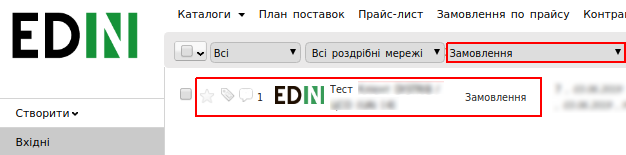
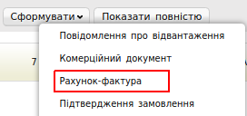
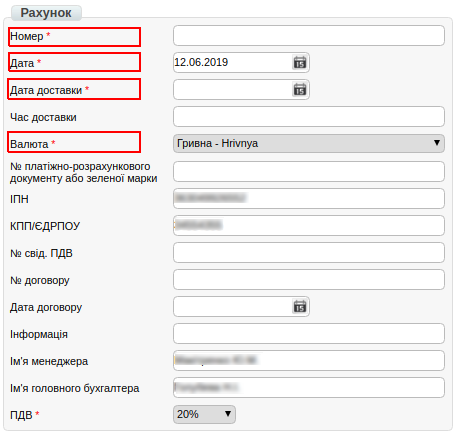
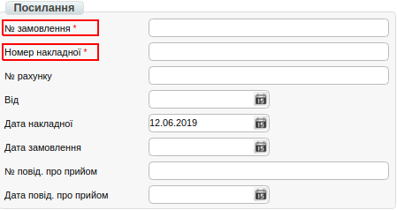
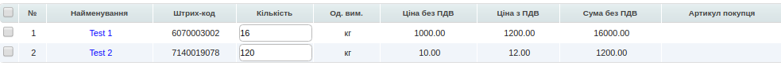
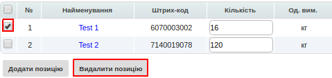
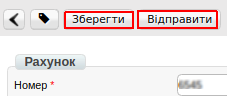

#################################################################################################
Формування та відправка документа «Рахунок фактура» (INVOICE) на web-платформі
#################################################################################################

.. contents:: Зміст:
   :depth: 6

---------

Вступ
====================================

Дана інструкція описує порядок формування та відправки документа «**Рахунок фактура**» (INVOICE).

Формування документа «Рахунок фактура»
==============================================

Створення документа відбувається на підставі «**Замовлення**».

Перейдіть в розділ «**Вхідні**», для зручності пошуку виберіть в фільтрі необхідну мережу і тип документа «Замовлення».

У відкритому документі, натисніть кнопку «**Сформувати**» і виберіть зі списку документ «**Рахунок фактура**».

У вікні з'явиться **Форма** для заповнення необхідних реквізитів документа. Всі поля, позначені червоною зірочкою ***** обов'язкові для заповнення.

Заповнення документа «Рахунок фактура»
=============================================

.. important:: **Увага!** Номер накладної повинен повністю співпадати з номером оригіналу паперової накладної.

#. **Номер*** - номер рахунку по даному замовленню. Автоматично вказано номер замовлення.
#. **Дата** - дата рахунку. Автоматично вказана поточна дата.
#. **Валюта** - за замовчуванням «гривня»
#. **№ замовлення** - автоматично переноситься з Замовлення.
#. **№ накладної** - номер видаткової накладної

.. important:: **Увага!** У разі створення декількох видаткових накладних, необхідно на кожне замовлення сформувати рахунок фактуру. При цьому, поле «**Номер накладної**» в документах повинно відрізнятися.

Нижче на сторінці створеного документа знаходиться перелік товарних позицій, які були замовлені, і їх кількість:

Система автоматично підставляє значення в колонку «**Кількість**» з раніше надісланого документа «**Замовлення**».

Редагування товарних позицій
====================================

У разі, якщо вам необхідно змінити кількість товару, що поставляється, в колонці «**Кількість**», внесіть необхідне значення.

.. important:: **Увага!** Кількість товарных позиций, що поставляється не може перевищувати кількість зазначену в замовленні!

Якщо якась із позицій відсутня і поставлятися не буде, її необхідно відзначити галочкою і видалити.

Після внесення всіх даних в документі, натисніть кнопку «**Зберегти**», потім «**Надіслати**».

Відправлений документ автоматично потрапляє в папку «**Відправлені**» і буде знаходиться в ланцюжку документів разом із **Замовленням** і **Підтвердженням замовлення**.

.. include:: kontakti.rst
