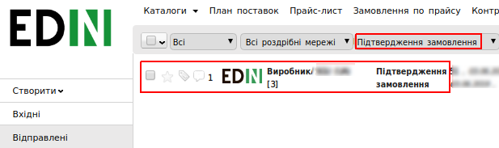
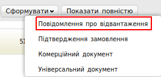
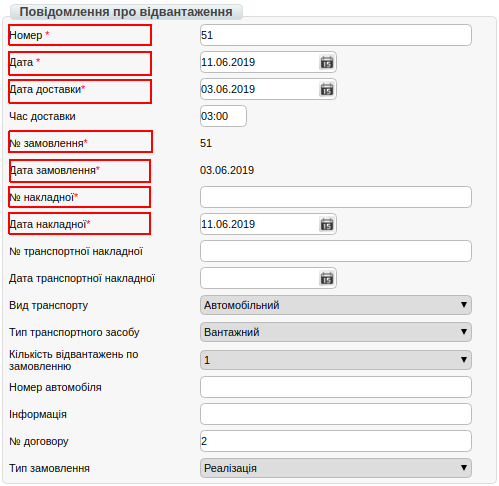
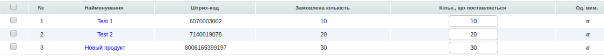
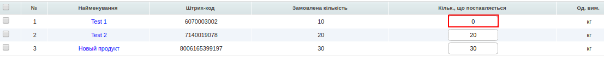
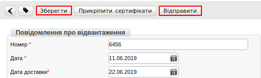

########################################################################################################
Формування документа «Повідомлення про відвантаження» (DESADV) на платформі
########################################################################################################

.. role:: red

.. contents:: Зміст:
   :depth: 6

---------

Вступ
====================================

Дана інструкція описує порядок формування та відправки документа «**Повідомлення про відвантаження**» (DESADV).

Формування Повідомлення про відвантаження (DESADV)
===========================================================

Формування документа можливе як на підставі «**Замовлення**», так і на основі «**Підтвердження замовлення**».

Розглянемо формування «**Повідомлення про відвантаження**» на підставі  «**Підтвердження замовлення**».

Перейдіть в розділ «**Відправлені**», для зручності пошуку виберіть в фільтрі необхідну мережу і тип документа «**Підтвердження замовлення**».

У відкритому документі, натисніть кнопку «**Створити**» і виберіть зі списку документ «**Повідомлення про відвантаження**».

У вікні з'явиться **Форма** для заповнення необхідних реквізитів документа. Всі поля, позначені червоною зірочкою :red:`*` є обов'язковими для заповнення.

#. **Номер*** - номер "Повідомлення про відвантаження" по даному замовленню (номер Замовлення встановлюється автоматично)
#. **Дата** - дата повідомлення про відвантаження, автоматично встановлюється поточна дата
#. **Дата доставки** - переноситься з Замовлення (якщо з мережею погоджено перенесення - змініть її)
#. **№ Замовлення** - автоматично переноситься з Замовлення
#. **Дата Замовлення** - автоматично переноситься з Замовлення
#. **№ накладної** - номер видаткової накладної
#. **Дата накладної** - дата видаткової накладної

.. important:: **Увага!** Номер накладної повинен повністю збігатися з номером оригіналу паперової накладної**.

.. important:: **Увага!** У разі створення декількох видаткових накладних на Замовлення, необхідно на кожну накладну сформувати "Повідомлення про відвантаження". При цьому, поле «Накладної» в документах повинно відрізнятися.

Ниже на странице созданного документа находится перечень товарных позиций, которые были заказаны, и их количество:

Система автоматично підставляє значення в колонку «**Кількість, що поставляється**» з раніше відправленого документа «**Підтвердження замовлення**».

Редагування товарних позицій
=====================================================

За потреби є можливість змінити кількість товару, що поставляється, в колонці «**Кількість, що поставляється**».

.. important:: **Увага!** Кількість товарных позиций, що поставляється не може перевищувати кількість зазначену в замовленні!

Якщо якась із позицій відсутня і поставлятися не буде, в колонці «**Кількість, що поставляється**», вкажіть 0.

Після внесення всіх даних в документі, натисніть кнопку «**Зберегти**», потім «**Відправити**».

Відправлений документ автоматично потрапляє в папку «**Відправлені**» і буде знаходиться в ланцюжку документів разом із **Замовленням** і **Підтвердженням замовлення**.

.. include:: kontakti.rst
