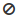
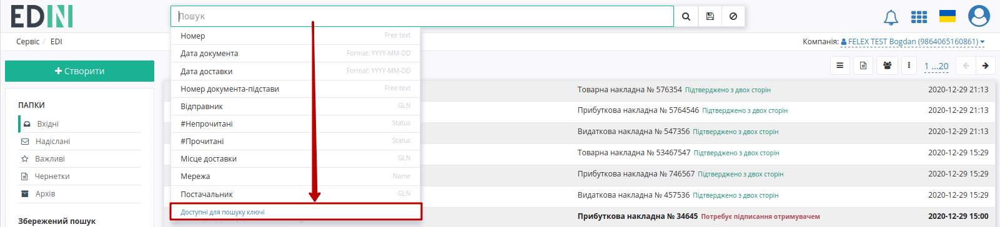
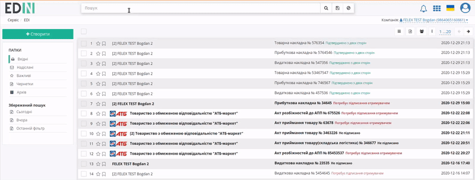
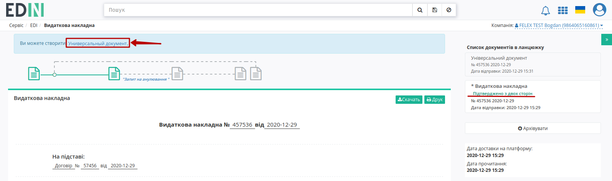
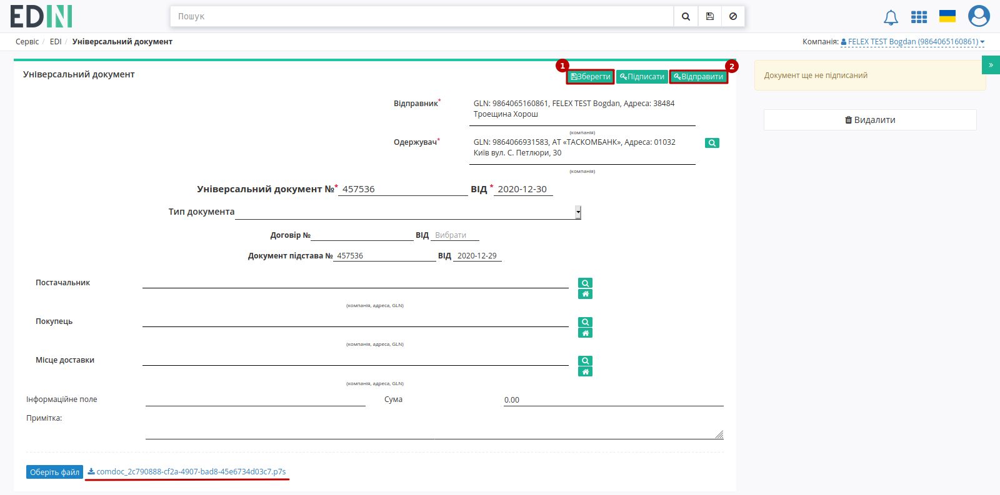
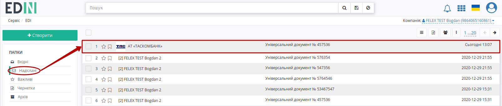

Інструкція для роботи з факторингом
####################################################################################################################

.. role:: red

.. role:: green

.. |лупа| image:: pics_Factoring_instruction_EDIN_2_0/Factoring_instruction_EDIN_2_0_09.png

.. |save| image:: pics_Factoring_instruction_EDIN_2_0/Factoring_instruction_EDIN_2_0_10.png

.. contents:: Зміст:
   :depth: 3

---------

Для входу на web платформу EDIN 2.0 необхідно перейти за посиланням: https://edo-v2.edin.ua/.

Для роботи по факторингу на платформі необхідно створити "Універсальний документ" (`CONDRA <https://wiki.edin.ua/uk/latest/EDIN_Specs/XML/CONDRA_x.html>`__) на основі одного з документ-підстав:

* "Видаткової накладної" (`COMDOC_006 <https://wiki.edin.ua/uk/latest/EDIN_Specs/XML/COMDOC_006_x.html>`__);
* "Прибуткової накладної" (`COMDOC_007 <https://wiki.edin.ua/uk/latest/EDIN_Specs/XML/COMDOC_007_x.html>`__);
* "Товарної накладної" (`DOCUMENTINVOICE <https://wiki.edin.ua/uk/latest/EDIN_Specs/XML/DOCUMENTINVOICE_x.html>`__).

.. important::
    Документ-підстава повинен знаходитись в статусі :green:`"Підтверджено з двох сторін"`!

    .. image:: pics_Factoring_instruction_EDIN_2_0/Factoring_instruction_EDIN_2_0_01.png
       :align: center

**1 Формування та відправка "Універсального документа" для сторони-Фактора**
===========================================================================================

Для зручності можливо скористатись "Пошуком" (можливо переглянути всі "Доступні ключі пошуку"):

Наприклад, для того, щоб вибрати всі підписані з обох сторін "Видаткові накладні" потрібно ввести через кому два параметра: **#Видаткова накладна, #Підтверджено з двох сторін,** і натиснути |лупа|. За потреби пошук можливо зберегти (|save|):

Для формування "Універсального документа" потрібно відкрити підписаний з двох сторін документ (наприклад, "Видаткову накладну") та натиснути кнопку **"Універсальний документ"**:

Далі в вікні "Пошуку контрагента" знайти та **"Вибрати"** сторону, що виступає в ролі Фактора: 

.. image:: pics_Factoring_instruction_EDIN_2_0/Factoring_instruction_EDIN_2_0_03.png
   :align: center

Після чого відкриється автоматично створена чернетка "Універсального документа", що містить у вкладеннях підписаний документ-підставу в форматі p7s. Документ, за потреби, можливо відредагувати, **"Зберегти"** (1) та **"Відправити"** (2) не підписуючи:

Документ відправляється і відображається в **"Надісланих"**:

.. hint::
    Також можливо масово створювати та відправляти "Універсальні документи" Фактору (детальніше в `розділі інструкції масових операцій з документами <https://wiki.edin.ua/uk/latest/general_2_0/massovi_operacii_EDIN_2.0.html#condra-create-send>`__)

**2 Відповідь сторони-Фактора**
===========================================================================================

Сторона, що виступає Фактором (банк) розглядає документи і якщо накладна на фінансування з будь-яких причин не приймається, то Фактор лише в цьому випадку відправляє Постачальнику у відповідь до "Універсального документа" статус **не прийнято/відхилено** разом з причиною (в коментарях).

Відсутність будь-яких статусів говорить про розглядання чи прийняття накладної на фінансування. Найближчим часом по всіх прийнятих накладних Фактор відправляє "Універсальний документ" (`CONDRA <https://wiki.edin.ua/uk/latest/EDIN_Specs/XML/CONDRA_x.html>`__) з вкладеним "Реєстром документів" (:download:`приклад<pics_Factoring_instruction_EDIN_2_0/Factoring_instruction_EDIN_2_0_06.png>`), що містить список прийнятих до фінансування накладних.

-----------------------------------

.. include:: kontakti.rst