Формування Коригувальної ПН на підставі Накладної на повернення
############################################################################

.. сюда закину немного картинок для текста

.. |drop_pass| image:: pics_instruktsiyi_po_dodavannyu_klyuchiv/drop_pass.png

.. |del_key| image:: pics_instruktsiyi_po_dodavannyu_klyuchiv/del_key.png

.. role:: red

.. contents:: Зміст:
   :depth: 2

---------

Початкові налаштування
====================================

Для початку роботи з електронною податковою, переконайтеся що введені коректні данні про вашу компанію. Для налаштування або зміни данних вашого аккаунту зверніться до нашої Служби Технічної підтримки. 

Підготуйте діючий електронний цифровий підпис особи (осіб), за допомогою якого буде здійснюватися підписання електронної податкової накладної (DECLAR). Якщо ключі не на зовнішніх носіях (диск, флеш-накопичувач), а на вашому ПК - потрібно знати шлях до ключів в файловій системі.

Зайдіть на портал: https://edo-v2.edin.ua і введіть логін і пароль.

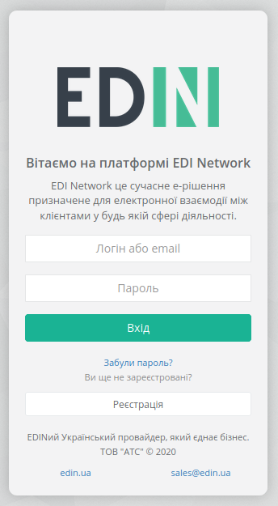

Перед початком роботи з Коригувальною податковою накладною необхідно одноразово заповнити всі реквізити, які будуть відображатися в податковій з боку постачальника, й виберіть GLN, з якого відбуватиметься відправка накладних.

**Необхідно вказати**:

- Код ЄДРПОУ
- Код ІПН
- Правильну назву компанії
- № свідоцтва платника ПДВ
- Вулицю і будинок (юр. адреса)
- Індекс (юр. адреса)
- Місто (юр. Адреса)
- Країну (вибирайте зі списку Україну)
- Область (вибирайте зі списку)
- ДПІ (вибирайте зі списку податкову, в яку подаєте звітність)
- Підписант (П.І.Б. та ІПН підписувача)
- Телефон
- Форма власності (юр. чи фіз. особа)

Формування документа "Коригування до Податкової накладної (DECLAR_J12)"
====================================================================================

Даний документ формується на підставі **Комерційного документа (СOMDOC) “Накладна на повернення”**.

*Перед відправкою коригування необхідно підписати і відправити Комерційний документ "Накладна на повернення".*

Для зручності пошуку виберіть в першому фільтрі **торгівельну мережу**, в другому - тип документа **Накладна на повернення**.

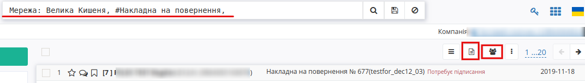

Для того, щоб сформувати документ “**Коригування до Податкової накладної**”, необхідно зайти в **Комерційний документ** “**Накладна на повернення**”.

Далі у відкритому документі на формі-підказці натисніть —> **Розрахунок коригування до податкової накладної**.

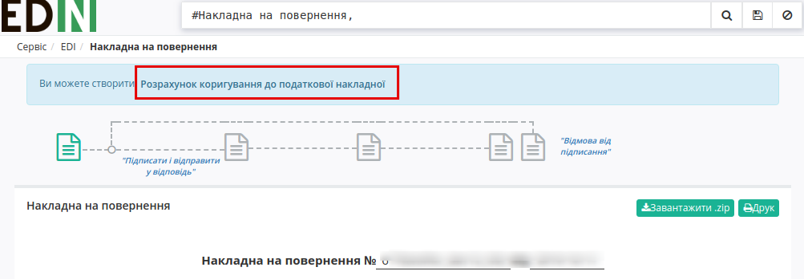

Заповнення документа "Коригування до Податкової накладної (DECLAR_J12)"
========================================================================

Всі необхідні поля для заповнення позначені червоними зірочками :red:`*`.

У новому вікні в випадаючому списку оберіть ставку ПДВ для Розрахунку коригування до податкової накладної. Виберіть необхідний параметр:

- 20%
- 19%
- 0%
- 7%

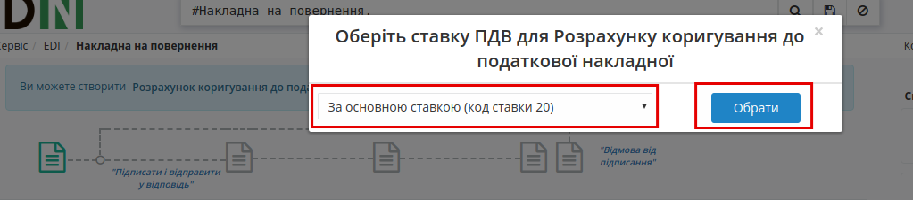

**Розділ А** розраховується автоматично.

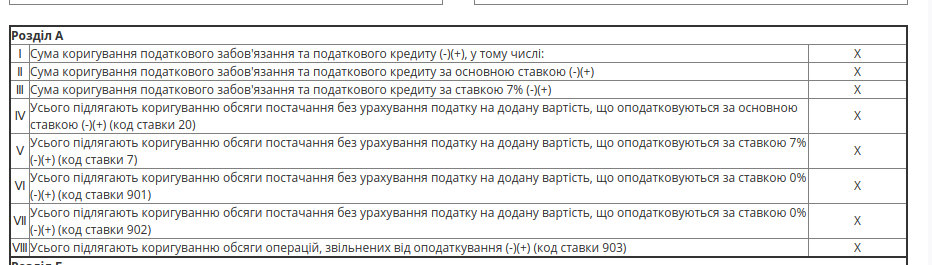

Нижче ви можете побачити перелік товарних позицій, які переносяться з документа “**Накладна на повернення**”. 

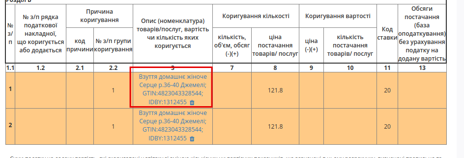

Якщо позицій пісвічуються жовтим кольром,необхідно заповнити обов'язкову інформацію. Для цього натисніть на **назву позіції** та у новому вікні заповніть усі поля помічені червоними зірочками. 

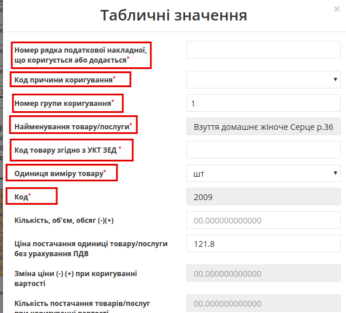

Для видалення позиції, натисніть на піктограму *кошик* біля назви позиції:

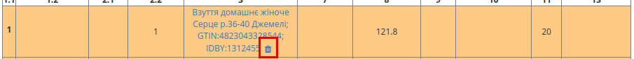

Всі інші поля ви заповнюєте самостійно згідно з чинним податковим законодавством України.

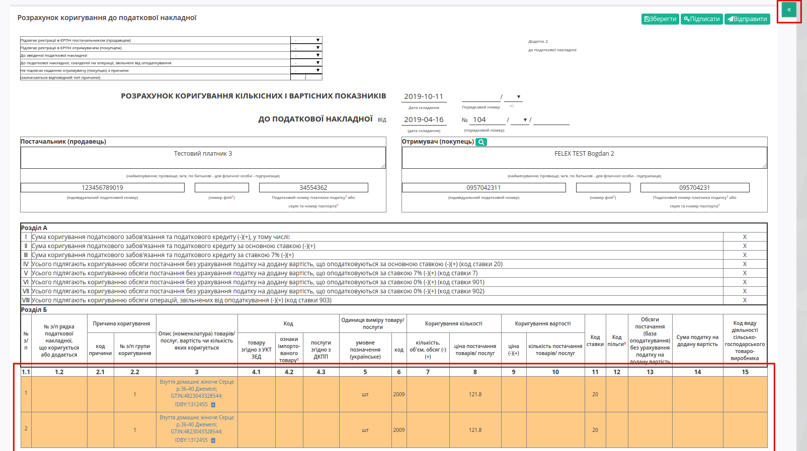

Після внесення всіх даних необхідно натиснути кнопку «**Зберегти**». Якщо частина необхідних реквізитів не заповнена, з'являться підказки, які поля потрібно заповнити.

Після збереження податкової накладної для нанесення підписів необхідно натиснути кнопку «**Підписати**».

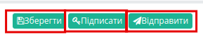

.. _`Додати ключ для підписання`:

Далі у модальному вікні потрібно обрати файл чи токен (1), ввести пароль (2) та натиснути **"Считати"** (3) ключ для підписання:

.. image:: pics_formuvannia_Koryhuvalnoi_PN_na_Nakladnoi_na_povernennia/file1.png
   :align: center

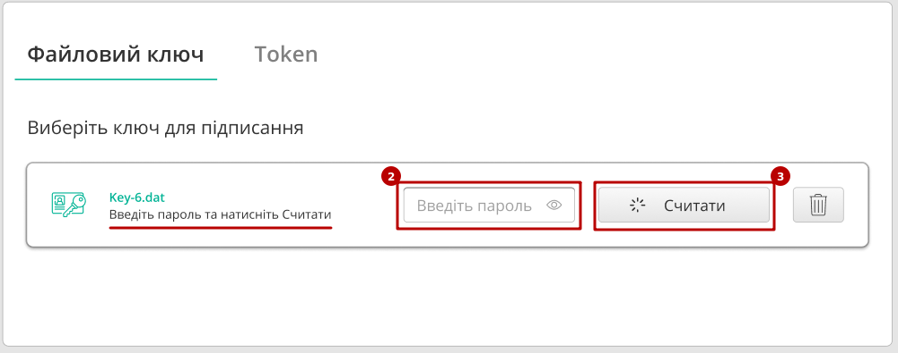

При успішному додаванні ключа автоматично відобразиться особа, від імені якої буде здійснено підписання. У користувача може бути додано кілька ключів - для вибору потрібного для здійснення операції підписання потрібно проставити відмітку (4) лівою кнопкою миші і натиснути "Підписати" (5):

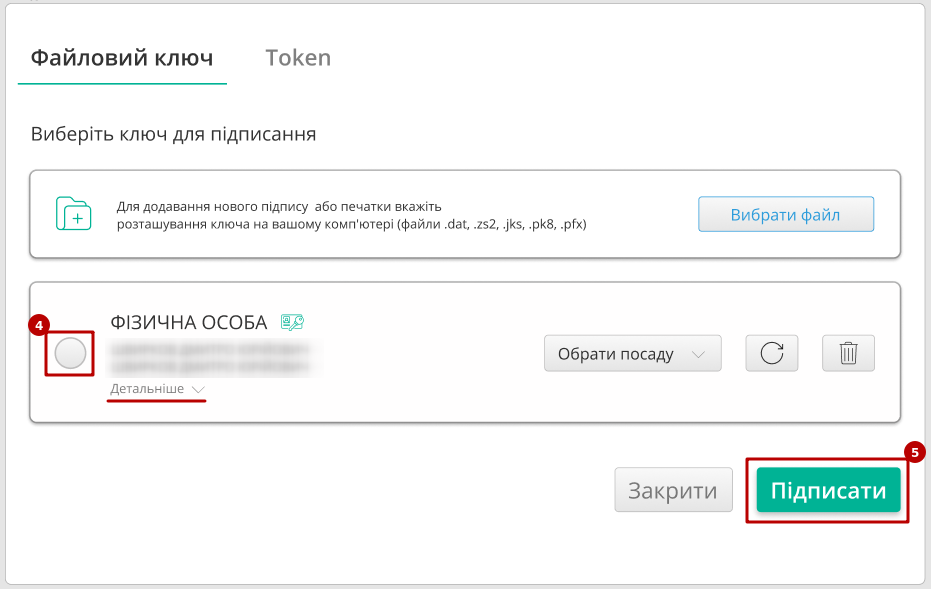

У користувача повинно бути додано три ключа (Директор, Бухгалтер, Штамп), кожним з яких повинен бути підписаний документ. Можливо здійснювати вибір ключів під час підписання.

.. important:: Підписання "Податкових накладних" (DECLAR), та "Коригувань до податкових накладних" (DECLARj12) здійснюється трьома ключами (Директор, Бухгалтер, Штамп): для одного документу неможливо використати один і той же ключ більше одного разу, а також неможливо встановити більше одного ключа для однієї ролі!

.. important::
   Якщо підписання цим ключем вже було здійснено або знайдена невідповідність даних ЄДРПОУ/ІПН (перевірка), то підписання блокується, а користувачу виводиться відповідне повідомлення:

.. image:: pics_formuvannia_Koryhuvalnoi_PN_na_Nakladnoi_na_povernennia/wrong_key.png
   :align: center

Додатково в вікні підписання можливо натиснути **"Детальніше"** для того, щоб переглянути інформацію про підписанта, обрати за необхідності посаду, скинути пароль активного ключа (|drop_pass|) чи видалити помилкові (|del_key|).

При подальшій роботі з раніше доданим ключем/-ами потрібно вводити лише пароль для обраного ключа:

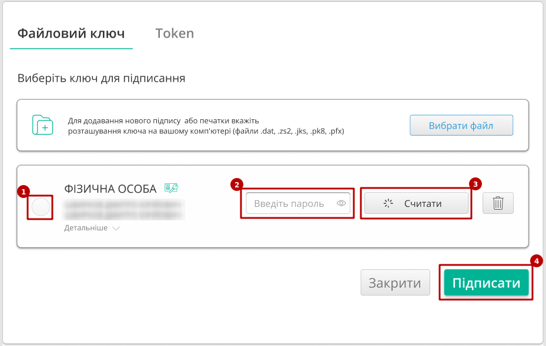

Після підписання документу інформація щодо підписанта відображається в блоці "Дані про підписантів". Для відправки документу необхідно натинути на кнопку "Відправити".

.. image:: pics_formuvannia_Koryhuvalnoi_PN_na_Nakladnoi_na_povernennia/Koryhuvalnoi_PN_iz_Nakladnoi_na_povernennia_17.png
   :align: center

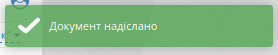

Після натискання кнопки «**Надіслати**» накладна відправляється на реєстрацію до Єдиного реєстру податкових накладних та відображається на в каталозі **"Надіслані"**.

Отримання статусу про реєстрацію
=======================================================================

Залежно від того, чи була зареєстрована накладна чи ні, вам обов'язково надійде відповідний статус:

1. **Зареєстровано в ЄРПН**

Свідчить про те, що Коригувальна податкова накладна була успішно зареєстрована в ЄРПН вашим контрагентом.

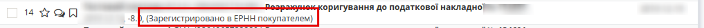

2. **Помилка при реєстрації в ЄРПН**

Свідчить про те, що Коригувальна податкова накладна була відхилена вашим контрагентом.

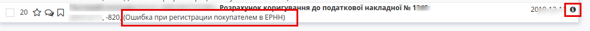

Також помилку реєстрації (квитанцію) можна переглянути, зайшовши в документ.

3. **Відправлений на перевірку в торговельну мережу**

Документ перевіряється на стороні торгової мережі перед відправкою на реєстрацію.

.. include:: kontakti.rst
