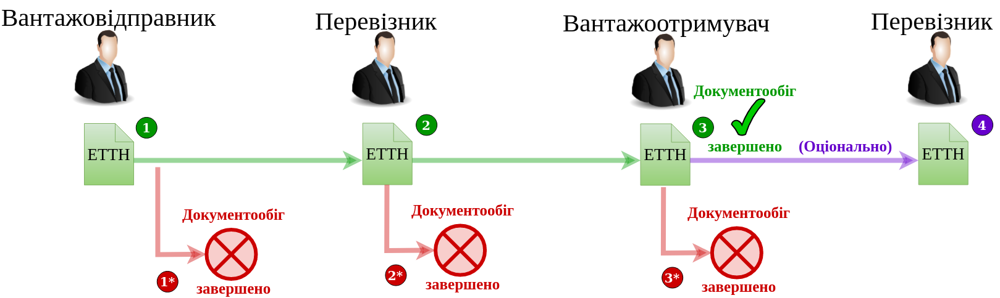

Пряма схема документообігу ЕТТН
#############################################################

.. role:: red

.. role:: underline

.. role:: green

.. role:: purple

----------------------------------------------------

----------------------------------------------------

1.1 `Авторизація Вантажовідправника <https://wiki.edin.ua/uk/latest/API_ETTN/Methods/Authorization.html>`__

1.2 `Створення/редагування чернетки е-ТТН <https://wiki.edin.ua/uk/latest/API_ETTN/Methods/CreateConsignorETTN.html>`__

1.3 `Створення XML документа для подальшого підписання Вантажовідправником <https://wiki.edin.ua/uk/latest/API_ETTN/Methods/CreateEttnV2XML.html>`__

1.4 `Підписання е-ТТН Вантажовідправником <https://wiki.edin.ua/uk/latest/API_ETTN/Methods/SaveEttnV2Sign.html>`__

1.5 `Відправка е-ТТН Вантажовідправником <https://wiki.edin.ua/uk/latest/API_ETTN/Methods/DocSend.html>`__

1.6 `Відхилення е-ТТН Вантажовідправником <https://wiki.edin.ua/uk/latest/API_ETTN/Methods/DocReject.html>`__

-----------------------------------------------

2.1 `Авторизація Перевізника <https://wiki.edin.ua/uk/latest/API_ETTN/Methods/Authorization.html>`__

2.2 :purple:`Опціонально:` `Підтвердження е-ТТН Водієм <https://wiki.edin.ua/uk/latest/API_ETTN/Methods/DocConfirm.html>`__

2.3 `Створення XML документа для подальшого підписання Перевізником <https://wiki.edin.ua/uk/latest/API_ETTN/Methods/CreateEttnV2XML.html>`__

2.4 `Підписання е-ТТН Перевізником <https://wiki.edin.ua/uk/latest/API_ETTN/Methods/SaveEttnV2Sign.html>`__

2.2* `Відхилення е-ТТН Перевізником <https://wiki.edin.ua/uk/latest/API_ETTN/Methods/DocReject.html>`__

-----------------------------------------------

3.1 `Авторизація Вантажоотримувача <https://wiki.edin.ua/uk/latest/API_ETTN/Methods/Authorization.html>`__

3.2 :purple:`Опціонально:` `Підтвердження е-ТТН Приймальником <https://wiki.edin.ua/uk/latest/API_ETTN/Methods/DocConfirm.html>`__

3.3 `Створення XML документа для подальшого підписання Вантажоотримувачем <https://wiki.edin.ua/uk/latest/API_ETTN/Methods/CreateEttnV2XML.html>`__

3.4 `Підписання е-ТТН Вантажоотримувачем <https://wiki.edin.ua/uk/latest/API_ETTN/Methods/SaveEttnV2Sign.html>`__

3.2* `Відхилення е-ТТН Вантажоотримувачем <https://wiki.edin.ua/uk/latest/API_ETTN/Methods/DocReject.html>`__

-----------------------------------------------

4.1 `Авторизація Перевізника <https://wiki.edin.ua/uk/latest/API_ETTN/Methods/Authorization.html>`__

4.2 `Підписання е-ТТН Перевізником <https://wiki.edin.ua/uk/latest/API_ETTN/Methods/SaveEttnV2Sign.html>`__

