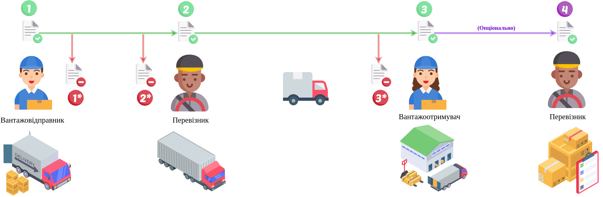

Пряма схема документообігу ЕТТН
#############################################################

.. role:: red

.. role:: underline

.. role:: green

.. role:: purple

----------------------------------------------------

----------------------------------------------------

1.1 `Авторизація Вантажовідправника <https://wiki.edin.ua/uk/latest/API_ETTN/Methods/Authorization.html>`__

1.2 `Створення/редагування чернетки е-ТТН <https://wiki.edin.ua/uk/latest/API_ETTN/Methods/CreateConsignorETTN.html>`__

1.3 `Створення XML документа для подальшого підписання Вантажовідправником <https://wiki.edin.ua/uk/latest/API_ETTN/Methods/CreateEttnV2XML.html>`__

1.4 `Підписання е-ТТН Вантажовідправником <https://wiki.edin.ua/uk/latest/API_ETTN/Methods/SaveEttnV2Sign.html>`__

1.5 `Відправка е-ТТН Вантажовідправником <https://wiki.edin.ua/uk/latest/API_ETTN/Methods/DocSend.html>`__

.. image:: pics/ETTN_API_work_10.png
   :height: 31px
   :width: 31px

1.6 `Відмовити в підписанні документа сервісу «ЕТТН» <https://wiki.edin.ua/uk/latest/API_ETTN/Methods/DocReject.html>`__

-----------------------------------------------

2.1 `Авторизація Перевізника <https://wiki.edin.ua/uk/latest/API_ETTN/Methods/Authorization.html>`__

2.2 **Опціонально:** `Підтвердження е-ТТН Водієм <https://wiki.edin.ua/uk/latest/API_ETTN/Methods/DocConfirm.html>`__

2.3 `Створення XML документа для подальшого підписання Перевізником <https://wiki.edin.ua/uk/latest/API_ETTN/Methods/CreateEttnV2XML.html>`__

2.4 `Підписання е-ТТН Перевізником <https://wiki.edin.ua/uk/latest/API_ETTN/Methods/SaveEttnV2Sign.html>`__

.. image:: pics/ETTN_API_work_12.png
   :height: 31px
   :width: 31px

2.2* `Відмовити в підписанні документа сервісу «ЕТТН» <https://wiki.edin.ua/uk/latest/API_ETTN/Methods/DocReject.html>`__

-----------------------------------------------

.. image:: pics/ETTN_API_work_13.png
   :height: 31px
   :width: 31px

3.1 `Авторизація Вантажоотримувача <https://wiki.edin.ua/uk/latest/API_ETTN/Methods/Authorization.html>`__

3.2 **Опціонально:** `Підтвердження е-ТТН Приймальником <https://wiki.edin.ua/uk/latest/API_ETTN/Methods/DocConfirm.html>`__

3.3 `Створення XML документа для подальшого підписання Вантажоотримувачем <https://wiki.edin.ua/uk/latest/API_ETTN/Methods/CreateEttnV2XML.html>`__

3.4 `Підписання е-ТТН Вантажоотримувачем <https://wiki.edin.ua/uk/latest/API_ETTN/Methods/SaveEttnV2Sign.html>`__

.. image:: pics/ETTN_API_work_14.png
   :height: 31px
   :width: 31px

3.2* `Відмовити в підписанні документа сервісу «ЕТТН» <https://wiki.edin.ua/uk/latest/API_ETTN/Methods/DocReject.html>`__

-----------------------------------------------

4.1 `Авторизація Перевізника <https://wiki.edin.ua/uk/latest/API_ETTN/Methods/Authorization.html>`__

4.2 `Підписання е-ТТН Перевізником <https://wiki.edin.ua/uk/latest/API_ETTN/Methods/SaveEttnV2Sign.html>`__

-----------------------------------------------

**Додаткові методи API**
=============================

Робота з довідниками
-------------------------------

* `Отримання даних компанії, співробітників, адрес з довідників сервісу «ЕТТН» <https://wiki.edin.ua/uk/latest/API_ETTN/Methods/ExtraData.html>`__
* `Отримання даних про компанію за назвою / ІНН / ЄДРПОУ <https://wiki.edin.ua/uk/latest/API_ETTN/Methods/CompanySearch.html>`__
* `Отримання даних співробіника компанії за прізвищем / ІПН / номером посвідчення водія <https://wiki.edin.ua/uk/latest/API_ETTN/Methods/EmployeesSearch.html>`__
* `Отримання адреси з довідника компанії за назвою / містом / вулицею / кодом КОАТУУ / кодом КАТОТТГ <https://wiki.edin.ua/uk/latest/API_ETTN/Methods/AddressesSearch.html>`__
* `Отримання данних КАТОТТГ за кодом / назвою населеного пункту <https://wiki.edin.ua/uk/latest/API_ETTN/Methods/SearchKatottg.html>`__
* `Отримання даних про компанію по ідентифікатору компанії <https://wiki.edin.ua/uk/latest/API_ETTN/Methods/GetCompany.html>`__

Додаткові можливості
---------------------------

* `Створення вкладення до документа <https://wiki.edin.ua/uk/latest/API_ETTN/Methods/CreateDocAttachment.html>`__
* `Отримання вкладення документа сервісу «ЕТТН» <https://wiki.edin.ua/uk/latest/API_ETTN/Methods/GetDocAttachment.html>`__
* `Видалення вкладення документа сервісу «ЕТТН» <https://wiki.edin.ua/uk/latest/API_ETTN/Methods/DelDocAttachment.html>`__
* `Відмітити документ, як «прочитаний» <https://wiki.edin.ua/uk/latest/API_ETTN/Methods/MarkDocumentAsRead.html>`__
* `Створити копію документа сервісу «ЕТТН» <https://wiki.edin.ua/uk/latest/API_ETTN/Methods/DocClone.html>`__
* `Видалення документів сервісу «ЕТТН» з «Чернеток» <https://wiki.edin.ua/uk/latest/API_ETTN/Methods/DelDocs.html>`__
* `Отримання документа сервісу «ЕТТН» <https://wiki.edin.ua/uk/latest/API_ETTN/Methods/GetDoc.html>`__
* `Отримання ланцюжка документів сервісу «ЕТТН» по id ланцюжка чи id документа <https://wiki.edin.ua/uk/latest/API_ETTN/Methods/GetChain.html>`__
* `Отримання тіла документа сервісу «ЕТТН» в json форматі <https://wiki.edin.ua/uk/latest/API_ETTN/Methods/GetDocBody.html>`__
* `Отримання даних підписантів документа сервісу «ЕТТН» <https://wiki.edin.ua/uk/latest/API_ETTN/Methods/GetSignersInfo.html>`__
* `Отримання пов’язаних документів сервісу «ETTN» <https://wiki.edin.ua/uk/latest/API_ETTN/Methods/GetLinks.html>`__
* `Отримання даних документа сервісу «ЕТТН» для підписання <https://wiki.edin.ua/uk/latest/API_ETTN/Methods/GetTicket.html>`__
* `Отримання списку ланцюжків документів сервісу «ЕТТН» <https://wiki.edin.ua/uk/latest/API_ETTN/Methods/GetChainsList.html>`__
* `Отримання документа в вигляді архіву (json + XML + підписані дані) <https://wiki.edin.ua/uk/latest/API_ETTN/Methods/GetDocArchive.html>`__
* `Отримання списку документів сервісу «ЕТТН» <https://wiki.edin.ua/uk/latest/API_ETTN/Methods/GetDocList.html>`__
* `Заархівувати всі документи у вказаному ланцюжку <https://wiki.edin.ua/uk/latest/API_ETTN/Methods/ArcChains.html>`__
* `Додати коментар до документа сервісу «ЕТТН» <https://wiki.edin.ua/uk/latest/API_ETTN/Methods/AddComment.html>`__
* `Отримання коментарів до документу сервісу «ЕТТН» <https://wiki.edin.ua/uk/latest/API_ETTN/Methods/GetComments.html>`__