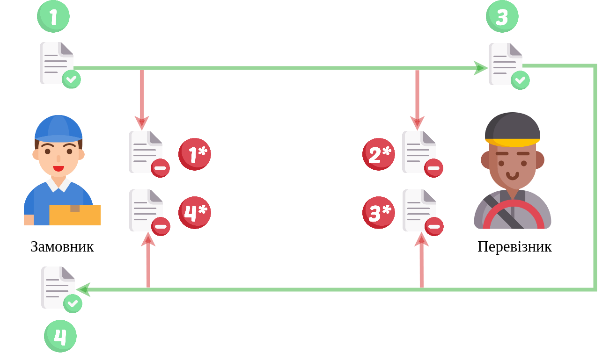

Cхема документообігу "Заявка на транспортування"->"Підтвердження транспортування"
#############################################################################################

.. role:: red

.. role:: underline

.. role:: green

.. role:: purple

----------------------------------------------------

----------------------------------------------------

.. image:: pics/ETTN_API_work_09.png
   :height: 31px
   :width: 31px

1.1 `Авторизація Замовника <https://wiki.edin.ua/uk/latest/API_ETTN/Methods/Authorization.html>`__

1.2 `Створення/редагування чернетки «Заявка на транспортування» <https://wiki.edin.ua/uk/latest/API_ETTN/Methods/CreateBooking.html>`__

1.3 `Створення XML документа для подальшого підписання Замовником <https://wiki.edin.ua/uk/latest/API_ETTN/Methods/CreateEttnV2XML.html>`__

1.4 `Підписання е-ТТН Замовником <https://wiki.edin.ua/uk/latest/API_ETTN/Methods/SaveEttnV2Sign.html>`__

1.5 `Відправка е-ТТН Замовником <https://wiki.edin.ua/uk/latest/API_ETTN/Methods/DocSend.html>`__

.. image:: pics/ETTN_API_work_10.png
   :height: 31px
   :width: 31px

1.6 `Відхилення е-ТТН Замовником <https://wiki.edin.ua/uk/latest/API_ETTN/Methods/DocReject.html>`__

-----------------------------------------------

.. image:: pics/ETTN_API_work_11.png
   :height: 31px
   :width: 31px

2.1 `Авторизація Перевізника <https://wiki.edin.ua/uk/latest/API_ETTN/Methods/Authorization.html>`__

2.2 **Опціонально:** `Підтвердження е-ТТН Водієм <https://wiki.edin.ua/uk/latest/API_ETTN/Methods/DocConfirm.html>`__

2.3 `Створення XML документа для подальшого підписання Перевізником <https://wiki.edin.ua/uk/latest/API_ETTN/Methods/CreateEttnV2XML.html>`__

2.4 `Підписання е-ТТН Перевізником <https://wiki.edin.ua/uk/latest/API_ETTN/Methods/SaveEttnV2Sign.html>`__

.. image:: pics/ETTN_API_work_12.png
   :height: 31px
   :width: 31px

2.2* `Відхилення е-ТТН Перевізником <https://wiki.edin.ua/uk/latest/API_ETTN/Methods/DocReject.html>`__

-----------------------------------------------

.. image:: pics/ETTN_API_work_13.png
   :height: 31px
   :width: 31px

3.1 `Авторизація Вантажоотримувача <https://wiki.edin.ua/uk/latest/API_ETTN/Methods/Authorization.html>`__

3.2 **Опціонально:** `Підтвердження е-ТТН Приймальником <https://wiki.edin.ua/uk/latest/API_ETTN/Methods/DocConfirm.html>`__

3.3 `Створення XML документа для подальшого підписання Вантажоотримувачем <https://wiki.edin.ua/uk/latest/API_ETTN/Methods/CreateEttnV2XML.html>`__

3.4 `Підписання е-ТТН Вантажоотримувачем <https://wiki.edin.ua/uk/latest/API_ETTN/Methods/SaveEttnV2Sign.html>`__

.. image:: pics/ETTN_API_work_14.png
   :height: 31px
   :width: 31px

3.2* `Відхилення е-ТТН Вантажоотримувачем <https://wiki.edin.ua/uk/latest/API_ETTN/Methods/DocReject.html>`__

-----------------------------------------------

.. image:: pics/ETTN_API_work_15.png
   :height: 31px
   :width: 31px

4.1 `Авторизація Перевізника <https://wiki.edin.ua/uk/latest/API_ETTN/Methods/Authorization.html>`__

4.2 `Підписання е-ТТН Перевізником <https://wiki.edin.ua/uk/latest/API_ETTN/Methods/SaveEttnV2Sign.html>`__

-----------------------------------------------

**Додаткові методи API**
=============================

