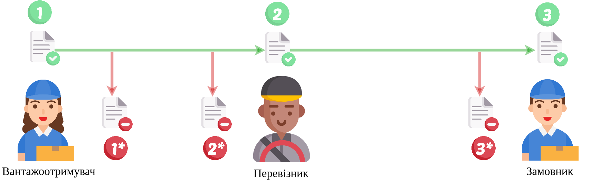
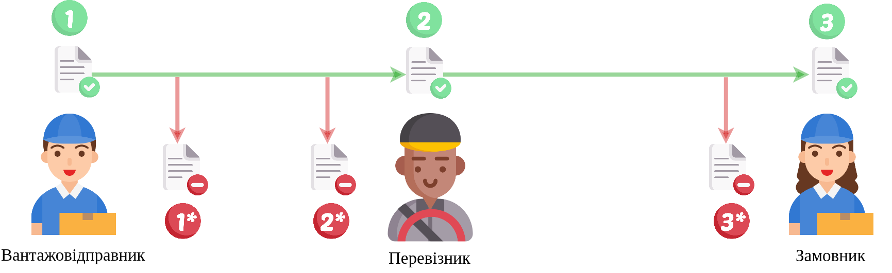
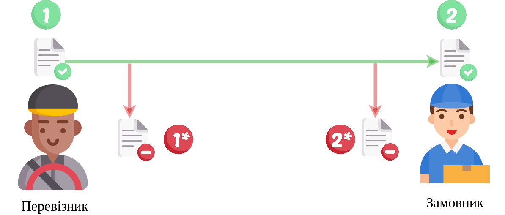
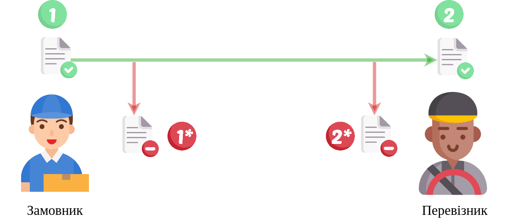

Cхеми документообігу "Акт про заміну пункту призначення вантажу" (ConsigneeChangeAct)
#####################################################################################################################

.. role:: red

.. role:: underline

.. role:: green

.. role:: purple

----------------------------------------------------

.. attention::
   В залежності від того, хто є ініціатором Акта, буде відрізнятися кількість учасників Акта та послідовність його підписання:
   
   1. Якщо ініціатором Акта є **Вантажоодержувач**, то в документа буде три сторони-підписувачі: :green:`"Вантажоодержувач" -> "Перевізник" -> "Замовник"`.
   2. Якщо ініціатором Акта є **Вантажовідправник**, то в документа буде три сторони-підписувачі: :green:`"Вантажовідправник" -> "Перевізник" -> "Замовник"`.
   3. Якщо ініціатором Акта є **Перевізник**, то в документа буде дві сторони-підписувачі: :green:`"Перевізник" -> "Замовник"`.
   4. Якщо ініціатором Акта є **Замовник**, то в документа буде дві сторони-підписувачі: :green:`"Замовник" -> "Перевізник"`.

----------------------------------------------------

1)

.. csv-table:: 
  :file: ConsigneeChangeActv3_API_work_001.csv
  :widths:  40, 40
  :stub-columns: 0

-----------------------------------------------

2)

.. csv-table:: 
  :file: ConsigneeChangeActv3_API_work_002.csv
  :widths:  40, 40
  :stub-columns: 0

-----------------------------------------------

3)

.. csv-table:: 
  :file: ConsigneeChangeActv3_API_work_003.csv
  :widths:  40, 40
  :stub-columns: 0

-----------------------------------------------

4)

.. csv-table:: 
  :file: ConsigneeChangeActv3_API_work_004.csv
  :widths:  40, 40
  :stub-columns: 0

-----------------------------------------------

**Додаткові методи API**
=============================

* `Отримання інформації про підписантів <https://wiki.edin.ua/uk/latest/integration_2_0/APIv2/Methods/GetSignersInfo.html>`__
* `Отримати значення з віртуального довідника <https://wiki.edin.ua/uk/latest/integration_2_0/APIv2/Methods/GetVirtualDictionary.html>`__
* `Додати значення в довідник <https://wiki.edin.ua/uk/latest/integration_2_0/APIv2/Methods/PostVirtualDictionaryValues.html>`__
* `Отримання інформації про організацію по Назві/ІПН/КПП/GLN <https://wiki.edin.ua/uk/latest/integration_2_0/APIv2/Methods/OasIdentifiers.html>`__
* `Отримання документа сервісу «ЕТТН» <https://wiki.edin.ua/uk/latest/API_ETTN/Methods/GetDoc.html>`__
* `Отримання списку подій з ЦБД <https://wiki.edin.ua/uk/latest/API_ETTNv3_1/Methods/MintransEvents.html>`__

