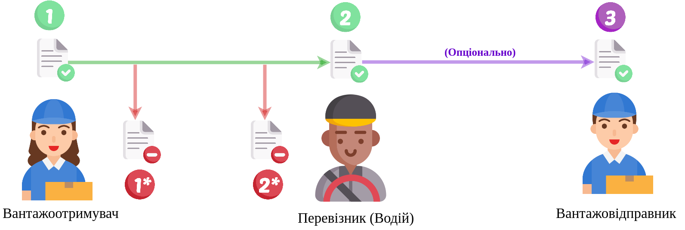

Cхема документообігу "Акта розбіжностей про вантаж" (DisagreementAct)
#####################################################################################################################

.. role:: red

.. role:: underline

.. role:: green

.. role:: purple

----------------------------------------------------

----------------------------------------------------

.. csv-table:: 
  :file: DisagreementActv3_API_work.csv
  :widths:  40, 40
  :stub-columns: 0

-----------------------------------------------

.. toggle-header::
    :header: **Додаткові методи API**

    * `Отримання інформації про підписантів <https://wiki.edin.ua/uk/latest/integration_2_0/APIv2/Methods/GetSignersInfo.html>`__
    * `Отримати значення з віртуального довідника <https://wiki.edin.ua/uk/latest/integration_2_0/APIv2/Methods/GetVirtualDictionary.html>`__
    * `Додати значення в довідник <https://wiki.edin.ua/uk/latest/integration_2_0/APIv2/Methods/PostVirtualDictionaryValues.html>`__
    * `Отримання інформації про організацію по Назві/ІПН/КПП/GLN <https://wiki.edin.ua/uk/latest/integration_2_0/APIv2/Methods/OasIdentifiers.html>`__
    * `Отримання документа сервісу «ЕТТН» <https://wiki.edin.ua/uk/latest/API_ETTN/Methods/GetDoc.html>`__
    * `Отримання списку подій з ЦБД <https://wiki.edin.ua/uk/latest/API_ETTNv3_1/Methods/MintransEvents.html>`__

