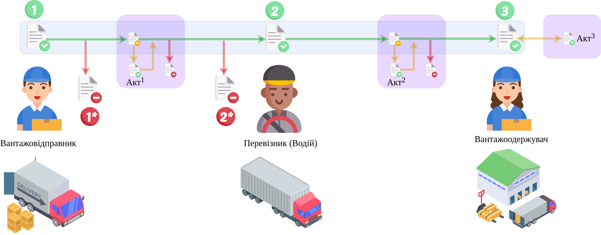

Пряма схема документообігу е-ТТН v3
#############################################################

.. role:: red

.. role:: underline

.. role:: green

.. role:: purple

----------------------------------------------------

.. [1] «Акт про відмову вантажити» (LoadRejectAct) / «Акт примусового завершення е-ТТН» (StopAct)

.. [2] «Акт розбіжностей про вантаж» (DisagreementAct) / «Акт примусового завершення е-ТТН» (StopAct) / «Акт перепломбування» (ResealingAct) / «Акт розвантаження на проміжному складі» (StorageDeliveryAct) / «Акт завантаження на проміжному складі» (StoragePickUpAct) / «Акт перевантаження» (ReloadAct) / «Акт про заміну пункту призначення вантажу» (ConsigneeChangeAct) / «Акт коригування» (AdjustmentAct)

.. [3] «Акт коригування» (AdjustmentAct)

----------------------------------------------------

.. important::
   Повний опис всіх додаткових транзакцій та змін, що вносяться в ТТН при формуванні Актів за `посиланням <https://wiki.edin.ua/uk/latest/API_ETTNv3_1/Additional_transactions.html>`__.

----------------------------------------------------

.. csv-table:: 
  :file: ETTNv3_API_work.csv
  :widths:  40, 40
  :stub-columns: 0

:download:`Postman environment (DEMO)<files/v.1-ettn+actu.postman_collection.json>`
:download:`Postman environment (PROD)<files/v.1-prod.postman_environment.json>`

-----------------------------------------------

.. toggle-header::
    :header: **Додаткові методи API**

    * `Отримання інформації про підписантів <https://wiki.edin.ua/uk/latest/integration_2_0/APIv2/Methods/GetSignersInfo.html>`__
    * `Отримати значення з віртуального довідника <https://wiki.edin.ua/uk/latest/integration_2_0/APIv2/Methods/GetVirtualDictionary.html>`__
    * `Додати значення в довідник <https://wiki.edin.ua/uk/latest/integration_2_0/APIv2/Methods/PostVirtualDictionaryValues.html>`__
    * `Отримання інформації про організацію по Назві/ІПН/КПП/GLN <https://wiki.edin.ua/uk/latest/integration_2_0/APIv2/Methods/OasIdentifiers.html>`__
    * `Отримання мета-даних документа <https://wiki.edin.ua/uk/latest/integration_2_0/APIv2/Methods/GetDocument.html>`__
    * `Отримання списку подій з ЦБД <https://wiki.edin.ua/uk/latest/API_ETTNv3_1/Methods/MintransEvents.html>`__

