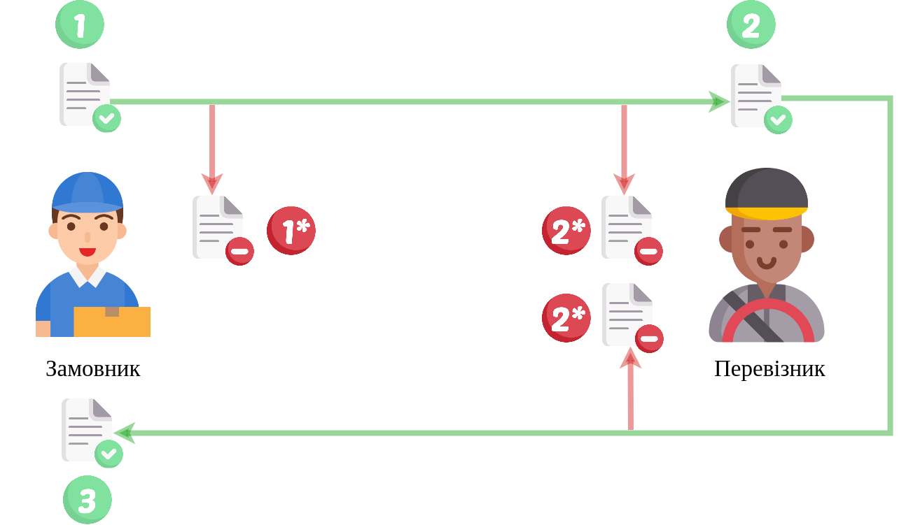

Алгоритм "Заявка на транспортування"->"Підтвердження транспортування" (TRANSPORTATIONORDER)
#####################################################################################################################

.. role:: red

.. role:: underline

.. role:: green

.. role:: purple

----------------------------------------------------

----------------------------------------------------

.. csv-table:: 
  :file: Proposalv3_API_work.csv
  :widths:  40, 40
  :stub-columns: 0

:download:`Завантажити колекцію методів для Postman (TRANSPORTATIONORDER)<files/Заявка на транспортування + Підтвердження ЗНТ.postman_collection.json>`

:download:`Postman environment (DEMO)<files/ettn-demo.postman_environment.json>`

:download:`Postman environment (PROD)<files/prod.postman_environment.json>`

-----------------------------------------------

.. toggle-header::
    :header: **Додаткові методи API**

    * `Редагування чернетки документа <https://wiki.edin.ua/uk/latest/integration_2_0/APIv2/Methods/EditDocument.html>`__
    * `Отримання інформації про підписантів <https://wiki.edin.ua/uk/latest/integration_2_0/APIv2/Methods/GetSignersInfo.html>`__
    * `Отримати значення з віртуального довідника <https://wiki.edin.ua/uk/latest/integration_2_0/APIv2/Methods/GetVirtualDictionary.html>`__
    * `Додати значення в довідник <https://wiki.edin.ua/uk/latest/integration_2_0/APIv2/Methods/PostVirtualDictionaryValues.html>`__
    * `Отримання інформації про організацію по Назві/ІПН/КПП/GLN <https://wiki.edin.ua/uk/latest/integration_2_0/APIv2/Methods/OasIdentifiers.html>`__
 

