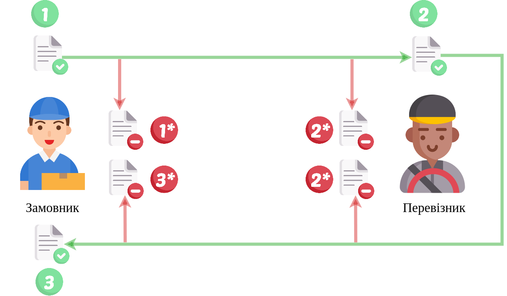

Cхема документообігу "Заявка на транспортування"->"Підтвердження транспортування" (TRANSPORTATIONORDER)
#####################################################################################################################

.. role:: red

.. role:: underline

.. role:: green

.. role:: purple

----------------------------------------------------

----------------------------------------------------

.. image:: pics/ETTNv3_API_work_09.png
   :height: 31px
   :width: 31px

1.1 `Авторизація Замовника <https://wiki.edin.ua/uk/latest/integration_2_0/APIv2/Methods/Authorization.html>`__

1.2 `Створення чернетки «Заявки на транспортування» <https://wiki.edin.ua/uk/latest/integration_2_0/APIv2/Methods/CreateDocument.html>`__

1.3 `Підписання «Заявки на транспортування» Замовником <https://wiki.edin.ua/uk/latest/integration_2_0/APIv2/Methods/CreateTicketV2.html>`__

1.4 `Відправка «Заявки на транспортування» Замовником <https://wiki.edin.ua/uk/latest/integration_2_0/APIv2/Methods/SendDocument.html>`__

.. image:: pics/ETTNv3_API_work_10.png
   :height: 31px
   :width: 31px

1.5* В розробці: Відкликання «Заявки на транспортування» Замовником

.. `Відхилення «Заявки на транспортування» Замовником <https://wiki.edin.ua/uk/latest/API_ETTN/Methods/DocReject.html>`__

-----------------------------------------------

.. image:: pics/ETTNv3_API_work_12.png
   :height: 31px
   :width: 31px

2.1* `Авторизація Перевізника <https://wiki.edin.ua/uk/latest/integration_2_0/APIv2/Methods/Authorization.html>`__

2.2* В розробці: Відхилення «Заявки на транспортування» Перевізником

.. `Відхилення «Заявки на транспортування» Перевізником <https://wiki.edin.ua/uk/latest/API_ETTN/Methods/DocReject.html>`__

-----------------------------------------------

.. image:: pics/ETTNv3_API_work_13.png
   :height: 31px
   :width: 31px

2.1 `Авторизація Перевізника <https://wiki.edin.ua/uk/latest/integration_2_0/APIv2/Methods/Authorization.html>`__

2.2 `Отримання контенту «Заявки на транспортування» <https://wiki.edin.ua/uk/latest/integration_2_0/APIv2/Methods/DocBody.html>`__

2.3 `Підписання «Заявки на транспортування» Перевізником <https://wiki.edin.ua/uk/latest/integration_2_0/APIv2/Methods/CreateTicketV2.html>`__

2.4 `Створення чернетки «Підтвердження транспортування» <https://wiki.edin.ua/uk/latest/integration_2_0/APIv2/Methods/CreateDocument.html>`__

2.5 `Підписання «Підтвердження транспортування» Перевізником <https://wiki.edin.ua/uk/latest/integration_2_0/APIv2/Methods/CreateTicketV2.html>`__

2.6 `Відправка «Підтвердження транспортування» Перевізником <https://wiki.edin.ua/uk/latest/integration_2_0/APIv2/Methods/SendDocument.html>`__

2.7* В розробці: Відкликання «Підтвердження транспортування» Перевізником

.. `Відхилення «Підтвердження транспортування» Перевізником <https://wiki.edin.ua/uk/latest/API_ETTN/Methods/DocReject.html>`__

-----------------------------------------------

3.1 `Авторизація Замовника <https://wiki.edin.ua/uk/latest/integration_2_0/APIv2/Methods/Authorization.html>`__

3.2 `Отримання контенту «Підтвердження транспортування» <https://wiki.edin.ua/uk/latest/integration_2_0/APIv2/Methods/DocBody.html>`__

3.3 `Підписання «Підтвердження транспортування» Замовником <https://wiki.edin.ua/uk/latest/integration_2_0/APIv2/Methods/CreateTicketV2.html>`__

3.2* В розробці: Відхилення «Підтвердження транспортування» Замовником

.. `Відхилення «Підтвердження транспортування» Замовником <https://wiki.edin.ua/uk/latest/API_ETTN/Methods/DocReject.html>`__

-----------------------------------------------

**Додаткові методи API**
=============================

* `Редагування чернетки документа (для CONDRA та TRANSPORTATIONORDER) <https://wiki.edin.ua/uk/latest/integration_2_0/APIv2/Methods/EditDocument.html>`__
* `Отримання інформації про підписантів <https://wiki.edin.ua/uk/latest/integration_2_0/APIv2/Methods/GetSignersInfo.html>`__
* `Отримати значення з віртуального довідника <https://wiki.edin.ua/uk/latest/integration_2_0/APIv2/Methods/GetVirtualDictionary.html>`__
* `Додати значення в довідник <https://wiki.edin.ua/uk/latest/integration_2_0/APIv2/Methods/PostVirtualDictionaryValues.html>`__
* `Отримання інформації про організацію по Назві/ІПН/КПП/GLN <https://wiki.edin.ua/uk/latest/integration_2_0/APIv2/Methods/OasIdentifiers.html>`__
 

+-------------------------------------------------------------------------------------------------------------------------------------------------------+----------------------------------------------------------------------------+
| :green:`1.1` `Авторизація Замовника <https://wiki.edin.ua/uk/latest/integration_2_0/APIv2/Methods/Authorization.html>`__                              |                                                                            |
|                                                                                                                                                       |                                                                            |
| :green:`1.2` `Створення чернетки «Заявки на транспортування» <https://wiki.edin.ua/uk/latest/integration_2_0/APIv2/Methods/CreateDocument.html>`__    |                                                                            |
|                                                                                                                                                       |                                                                            |
| :green:`1.3` `Підписання «Заявки на транспортування» Замовником <https://wiki.edin.ua/uk/latest/integration_2_0/APIv2/Methods/CreateTicketV2.html>`__ |                                                                            |
|                                                                                                                                                       |                                                                            |
| :green:`1.4` `Відправка «Заявки на транспортування» Замовником <https://wiki.edin.ua/uk/latest/integration_2_0/APIv2/Methods/SendDocument.html>`__    |                                                                            |
|                                                                                                                                                       | :red:`1.5*` В розробці: Відкликання «Заявки на транспортування» Замовником |
+-------------------------------------------------------------------------------------------------------------------------------------------------------+----------------------------------------------------------------------------+

+-------------------------------------------------------------------------------------------------------------------------------------------------------------+----------------------------------------------------------------------------------+
| :green:`2.1` `Авторизація Перевізника <https://wiki.edin.ua/uk/latest/integration_2_0/APIv2/Methods/Authorization.html>`__                                  |                                                                                  |
|                                                                                                                                                             |                                                                                  |
| :green:`2.2` `Отримання контенту «Заявки на транспортування» <https://wiki.edin.ua/uk/latest/integration_2_0/APIv2/Methods/DocBody.html>`__                 | :red:`2.2*` В розробці: Відхилення «Заявки на транспортування» Перевізником      |
|                                                                                                                                                             |                                                                                  |
| :green:`2.3` `Підписання «Заявки на транспортування» Перевізником <https://wiki.edin.ua/uk/latest/integration_2_0/APIv2/Methods/CreateTicketV2.html>`__     |                                                                                  |
|                                                                                                                                                             |                                                                                  |
| :green:`2.4``Створення чернетки «Підтвердження транспортування» <https://wiki.edin.ua/uk/latest/integration_2_0/APIv2/Methods/CreateDocument.html>`__       |                                                                                  |
|                                                                                                                                                             |                                                                                  |
| :green:`2.5` `Підписання «Підтвердження транспортування» Перевізником <https://wiki.edin.ua/uk/latest/integration_2_0/APIv2/Methods/CreateTicketV2.html>`__ |                                                                                  |
|                                                                                                                                                             |                                                                                  |
| :green:`2.6` `Відправка «Підтвердження транспортування» Перевізником <https://wiki.edin.ua/uk/latest/integration_2_0/APIv2/Methods/SendDocument.html>`__    |                                                                                  |
|                                                                                                                                                             | :red:`2.7*` В розробці: Відкликання «Підтвердження транспортування» Перевізником |
+-------------------------------------------------------------------------------------------------------------------------------------------------------------+----------------------------------------------------------------------------------+

+-----------------------------------------------------------------------------------------------------------------------------------------------------------+-------------------------------------------------------------------------------+
| :green:`3.1` `Авторизація Замовника <https://wiki.edin.ua/uk/latest/integration_2_0/APIv2/Methods/Authorization.html>`__                                  |                                                                               |
|                                                                                                                                                           |                                                                               |
| :green:`3.2` `Отримання контенту «Підтвердження транспортування» <https://wiki.edin.ua/uk/latest/integration_2_0/APIv2/Methods/DocBody.html>`__           | :red:`3.2*` В розробці: Відхилення «Підтвердження транспортування» Замовником |
|                                                                                                                                                           |                                                                               |
| :green:`3.3` `Підписання «Підтвердження транспортування» Замовником <https://wiki.edin.ua/uk/latest/integration_2_0/APIv2/Methods/CreateTicketV2.html>`__ |                                                                               |
+-----------------------------------------------------------------------------------------------------------------------------------------------------------+-------------------------------------------------------------------------------+
