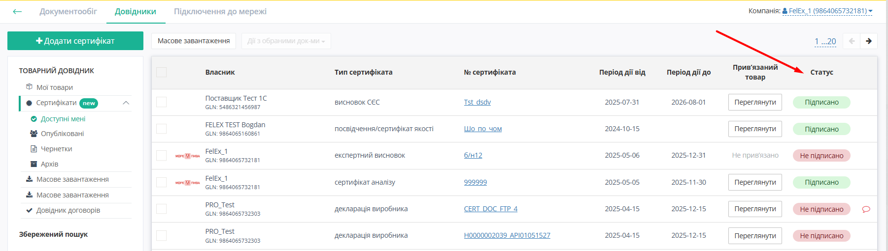
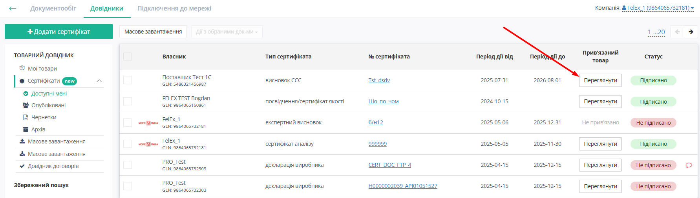

###########################################################################
Робота Мережі з сервісом Е-Сертифікати
###########################################################################

.. тут іконки для текста

.. |лупа2| image:: /_constant/icons/magnifying_glass2.png

.. |парамс| image:: /_constant/icons/search_params.png

.. |дискета| image:: /_constant/icons/diskette_search.png

.. |коло| image:: /_constant/icons/search_clear.png

.. |друк| image:: /_constant/icons/print_blue.png

.. |завантаж| image:: /_constant/icons/download.png

---------

.. contents:: Зміст:
   :depth: 3

---------

Вступ
=======================================

Інструкція описує порядок роботи з сертифікатами якості та додатковими документами до них на Порталі Сертифікатів для Мереж.

1. Початок роботи на Порталі Сертифікатів Е-Сертифікати
============================================================================

.. include:: /Certificate/EDIN_2_0/APIv2/Instrukcija_postachalnika_EDIN_Certificate.rst
   :start-after: .. початок блоку для Start
   :end-before: .. кінець блоку для Start

2. Пошук сертифікатів
============================================================================

.. include:: /Certificate/EDIN_2_0/APIv2/Instrukcija_postachalnika_EDIN_Certificate.rst
   :start-after: .. початок блоку для Search
   :end-before: .. кінець блоку для Search

Приклад пошуку по Пов'язаній накладній. Обреріть ключ пошуку
«Пов'язана накладна», вкажіть бажане значення та натисніть на «Лупу» |лупа2|. Результатом пошуку будуть сертифікати, що пов'язані з зазначеною накладною

.. image:: pics_Instrukcija_po_rabote_s_servisom_EDIN_Certificate/Instrukcija_po_rabote_s_servisom_EDIN_Certificate_28.png
   :align: center

Приклад пошуку по даті Пов'язаної накладної. Обреріть ключ пошуку
«Дата пов'язаної накладної», вкажіть бажане значення та натисніть на «Лупу» |лупа2|. Результатом пошуку будуть сертифікати, що пов'язані з зазначеною датою пов'язаної накладної

.. image:: pics_Instrukcija_po_rabote_s_servisom_EDIN_Certificate/Instrukcija_po_rabote_s_servisom_EDIN_Certificate_29.png
   :align: center

.. include:: /Certificate/EDIN_2_0/APIv2/Instrukcija_postachalnika_EDIN_Certificate.rst
   :start-after: .. початок блоку для Save_Search
   :end-before: .. кінець блоку для Save_Search

3. Робота з журналом Сертифікатів
============================================================================

В журналі сертифікатів в колонці «Статус» відображається Статус підписання сертифікату:
 

Якщо Сертифікат має Прив'язані товари, в колонці «Прив'язані товари» є кнопка «**Переглянути**» для швидкого перегляду Прив'язаних товарів:

Після натискання на сертифікат відкривається картка Сертифікату, де можна ознайомитись з Атрибутами сертифіката, переглянути, завантажити, роздрукувати вкладення, звірити Пов'язані товари та переглянути інформацію про власника:
 
.. image:: pics_Instrukcija_po_rabote_s_servisom_EDIN_Certificate/Instrukcija_po_rabote_s_servisom_EDIN_Certificate_31.png
   :align: center

.. include:: /Certificate/EDIN_2_0/APIv2/Instrukcija_postachalnika_EDIN_Certificate.rst
   :start-after: .. початок блоку для Print
   :end-before: .. кінець блоку для Print

Для завантаження Сертифіката натисніть кнопку «**Завантажити файл**» |завантаж| поруч з кнопкою «**Роздрукувати файл**» на вкладці «**Вкладення**»:
 

Після завершення процесу завантаження обраний Сертифікат можна знайти в папці із завантаженнями на Вашому комп'ютері. Якщо Сертифікат має кілька вкладень, по натисканню кнопки «Завантажити файл» |завантаж| доступна опція «Завантажити всі файли».

4. Скарги на опублікований Сертифікат
====================================================================

При наявності помилок в опублікованому сертифікаті Мережа може створити скаргу з детальним описом причини. Для цього треба відкрити Картку сертифіката на вкладці «**Мої скарги**» та натиснути кнопку «**Додати скаргу**»:

При цьому відкриється вікно «**Додати скаргу**», де треба обрати тип помилки та надати детальний опис помилки:

   
Тип помилки треба обрати з випадаючого списка:

- Помилка у даних картки
- Погана якість скану
- Невідповідність товару
- Неактуальний сертифікат

Після заповнення необхідних данних та натискання кнопки «**Опублікувати**» нова скарга відобразиться в переліку скарг в Картці сертифіката, про що буде повідомлено Власника сертифіката у відповідному листі. Сертифікати, на які є відкрита скарга, позначаються для Мережі в теці «**Доступні мені**» іконкою |скарга|:

При натисненні на іконку |скарга| відкривається Картка сертифіката на вкладці «**Мої скарги**», де можна побачити перелік Ваших скарг на обраний Сертифікат:

Скарга на Сертифікат може знаходитись в одному з наступних статусів:

- **Відкрито** - скарга  ще не опрацьована Власником сертифікату. Потребує виконання дій з боку Власника сертифіката.
- **Відхилено** - Власник сертифіката відхилив скаргу із зазначенням причини відхилення.
- **Виконано** - Власник сертифіката виконав дії, зазначені Мережею в скарзі, для виправлення помилки сертифіката. В разі незгоди Мережа може повторно відкрити цю скаргу.
- **Відкликано** - Мережа відкликала свою скаргу.

Коли Власник сертифіката змінює статус скарги, Мережа отримує повідомлення про це у відповідному листі.

Відкриту скаргу Мережа може за необхідності відредагувати або відкликати. Для цього треба натиснути іконку |крапки| праворуч скарги в Картці сертифіката:

У випадаючому списку треба обрати дію зі скаргою:

- **Редагувати скаргу** - для внесення змін у відкриту скаргу.
- **Відкликати** - для переведення скарги  в статус «**Відкликано**» в разі, коли скарга вже непотрібна.

По скарзі, відхиленій Власником сертифіката, можна подивитись причину відхилення. Для цього натисніть іконку |комент| праворуч скарги в Картці сертифіката:

Виконану скаргу Мережа може відкрити знов в разі незгоди. Для цього треба натиснути іконку |крапки| праворуч скарги в Картці сертифіката та підтвердити повторне відкриття. При цьому скарга знов отримає статус **Відкрито** і Власник сертифіката буде повідомлений про це у відповідному листі.

Після опрацювання всіх скарг по сертифікату (відхилення або виконання Власником або відкликання Мережею) іконка |скарга| зникне в переліку сертифікатів в теці «**Доступні мені**».

----------------------------
   
.. include:: /_constant/kontakti.rst
