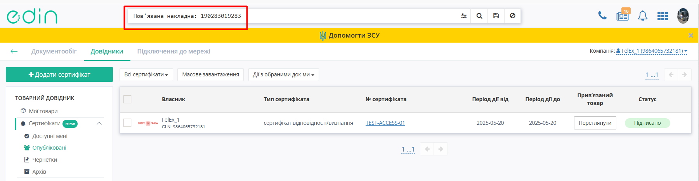
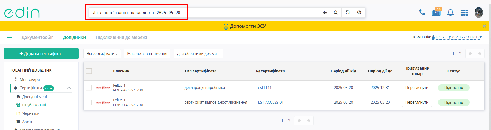

###########################################################################
Робота Мережі з сервісом Е-Сертифікати
###########################################################################

.. тут іконки для текста

.. |лупа2| image:: /_constant/icons/magnifying_glass2.png

.. |парамс| image:: /_constant/icons/search_params.png

.. |дискета| image:: /_constant/icons/diskette_search.png

.. |коло| image:: /_constant/icons/search_clear.png

.. |друк| image:: /_constant/icons/print_blue.png

.. |завантаж| image:: /_constant/icons/download.png

---------

.. contents:: Зміст:
   :depth: 3

---------

Вступ
=======================================

Інструкція описує порядок роботи з сертифікатами якості та додатковими документами до них на Порталі Сертифікатів для Мереж.

1. Початок роботи на Порталі Сертифікатів Е-Сертифікати
============================================================================

.. include:: /Certificate/EDIN_2_0/APIv2/Instrukcija_postachalnika_EDIN_Certificate.rst
   :start-after: .. початок блоку для Start
   :end-before: .. кінець блоку для Start

2. Пошук сертифікатів
============================================================================

.. include:: /Certificate/EDIN_2_0/APIv2/Instrukcija_postachalnika_EDIN_Certificate.rst
   :start-after: .. початок блоку для Search
   :end-before: .. кінець блоку для Search

Приклад пошуку по Пов'язаній накладній. Обреріть ключ пошуку
"Пов'язана накладна", вкажіть бажане значення та натисніть на "Лупу" |лупа2|. Результатом пошуку будуть сертифікати, що пов'язані з зазначеною накладною

Приклад пошуку по даті Пов'язаної накладної. Обреріть ключ пошуку
"Дата пов'язаної накладної", вкажіть бажане значення та натисніть на "Лупу" |лупа2|. Результатом пошуку будуть сертифікати, що пов'язані з зазначеною датою пов'язаної накладної

3. Робота з журналом Сертифікатів
============================================================================

В журналі сертифікатів в колонці "Статус"відображається Статус підписання сертифікату:
 
.. image:: pics_Instrukcija_po_rabote_s_servisom_EDIN_Certificate/Instrukcija_po_rabote_s_servisom_EDIN_Certificate_30.png
   :align: center

Якщо Сертифікат має Прив'язані товари, в колонці "Прив'язані товари" є кнопка "Переглянути" для швидкого перегляду Прив'язаних товарів:

.. image:: pics_Instrukcija_po_rabote_s_servisom_EDIN_Certificate/Instrukcija_po_rabote_s_servisom_EDIN_Certificate_33.png
   :align: center

Після натискання на сертифікат відкривається картка Сертифікату, де можна ознайомитись з Атрибутами сертифіката, переглянути, завантажити, роздрукувати вкладення, звірити Пов'язані товари та переглянути інформацію про власника:
 

.. include:: /Certificate/EDIN_2_0/APIv2/Instrukcija_postachalnika_EDIN_Certificate.rst
   :start-after: .. початок блоку для Print
   :end-before: .. кінець блоку для Print

Для завантаження Сертифіката натисніть кнопку "Завантажити файл" |завантаж| поруч з кнопкою "Роздрукувати файл" на вкладці "**Вкладення**":
 
.. image:: pics_Instrukcija_po_rabote_s_servisom_EDIN_Certificate/Instrukcija_po_rabote_s_servisom_EDIN_Certificate_32.png
   :align: center

Після завершення процесу завантаження обраний Сертифікат можна знайти в папці із завантаженнями на Вашому комп'ютері. Якщо Сертифікат має кілька вкладень, по натисканню кнопки "Завантажити файл" |завантаж| доступна опція "Завантажити всі файли".

----------------------------
   
.. include:: /_constant/kontakti.rst
