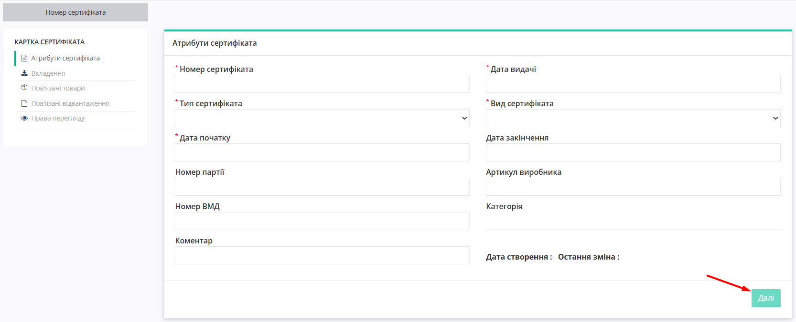
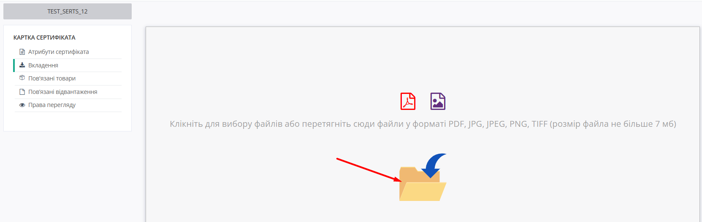
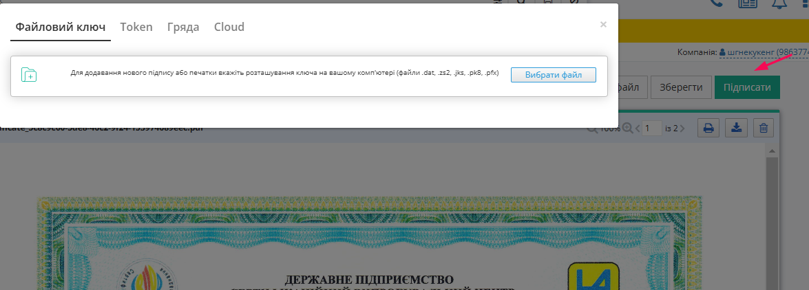
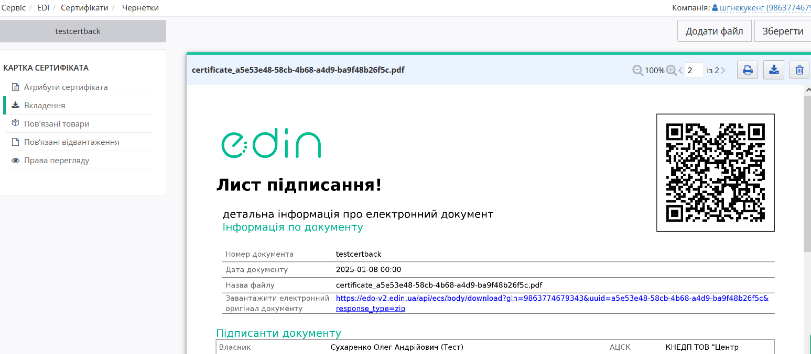

###########################################################################
Робота Постачальника з сервісом Е-Сертифікати
###########################################################################

.. тут іконки для текста

.. |лупа2| image:: /_constant/icons/magnifying_glass2.png

.. |парамс| image:: /_constant/icons/search_params.png

.. |дискета| image:: /_constant/icons/diskette_search.png

.. |коло| image:: /_constant/icons/search_clear.png

.. |друк| image:: /_constant/icons/print_blue.png

---------

.. contents:: Зміст:
   :depth: 3

---------

Вступ
=======================================

Інструкція описує порядок завантаження і поширення сертифікатів якості та додаткових документів до них на Порталі Сертифікатів.

1. Початок роботи на Порталі Сертифікатів Е-Сертифікати
============================================================================

.. початок блоку для Start

На вкладці «**Продукти та рішення**» перейдіть в розділ **Е-Сертифікати** 

В сервісі доступні наступні теки:

- **Публічний доступ** - сертифікати, які були опубліковані контрагентами як загальнодоступні всім користувачам сервісу
- **Доступні мені** - сертифікати, до яких Вам надано доступ
- **Опубліковані** - опубліковані Вами сертифікати
- **Чернетки** - створені, але не опубліковані Вами сертифікати
- **Архів** - Ваші архівні сертифікати, а також Ваші сертифікати із завершеним терміном дії

.. кінець блоку для Start

2. Додавання документа на Портал Сертифікатів
=========================================================================

Щоб додати сертифікат, натисніть на зелену кнопку «**Додати сертифікат**»:

2.1. Заповнення атрибутів Сертифікату
------------------------------------------------------------------------

У формі, що з'явилася необхідно заповнити обов'язкові поля відмічені **червоною зірочкою (*)**

- **Номер сертифіката** - номер, вказаний на сертифікаті
- **Дата видачі** - дата видачі документа
- **Тип сертифіката** - обреріть із доступного переліку тип документа
- **Вид сертифіката** - оберіть по періоду дії документа або за номером партії
- **Дата початку** - дата початку дії сертифікату

Далі, в залежності від обраного виду сертифіката, заповнюється поле **Дата закінчення** або **Номер партії**, на який виписаний документ. 

За наявності інформації заповніть необов'язкові поля **Артикул виробника**, **Номер ВМД**, **Коментар**.

2.2. Завантаження файлів Сертифікату
------------------------------------------------------------------------

Після натискання кнопки «Далі» відкривається форма для додавання сертифікату у вкладення. Клікніть для вибору файлу або перетягніть файл у форматі PDF, JPG, JPEG, PNG, TIFF (розмір файла небільше 7 мб). 

Після завантаження файлу доданий сертифікат візуалізується. Для додавання до вкладень декількох сертифікатів натисніть кнопку «**Додати файл**» та оберіть файл для завантаження зі свого комп'ютера. Для перегляду завантажених файлів скористайтесь кнопками навігації по сторінках завантажень.

2.3. Підписання файлів Сертифікату
------------------------------------------------------------------------

Після завантаження файлів сертифікатів Ви можете підписати ці документи КЕП. Підписання можливе також пізніше, коли створена картка сертифіката знаходиться в Чернетках. Для підписання сертифікату натисніть кнопку «**Підписати**».

Відкриється стандартне вікно вибору способу підписання документів. Оберіть потрібний спосіб підписання та натисніть кнопку «**Підписати**» у вікні.

Після підписання на сертифікатах у вкладенні з'явиться водяний знак (Watermark) та до вкладень картки сертифікату буде додано Лист підписання.
.. image:: pics_Instrukcija_po_rabote_s_servisom_EDIN_Certificate/Instrukcija_po_rabote_s_servisom_EDIN_Certificate_09.png
   :align: center

Перейти до Листа підписання можна за допомогою кнопок навігації по сторінках вкладень:

2.4. Прив'язка товару до Сертифікату
------------------------------------------------------------------------
Далі необхідно прив’язати сертифікат до товару, на який він виписаний. Для цього натисніть кнопку «Далі» у вкладеннях або перейдіть до вкладки «**Пов'язані товари**» в боковому меню. Заповніть необхідні параметри товару. Якщо товарних позицій декілька, потрібно натиснути на кнопку «Додати» й заповнити обов'язкові параметри для іншого товару, виділені **червоною зірочкою** (*). Після заповнення натисніть на кнопку «Далі».

2.5. Права перегляду для Сертифікату
------------------------------------------------------------------------

Після цього відкриється вкладка «Права перегляду», де зазначаються права перегляду сертифіката для інших користувачів. Оберіть потрібне з наступного:

- *Не вибрано* - статус, при якому не можна опублікувати сертифікат, необхідно вибрати права перегляду
- *Публічний доступ* - доступний для перегляду всім користувачам
- *Обмежений доступ* - доступ тільки обраним користувачам або мережам

В разі вибору опції «Обмежений доступ» необхідно додати користувачів або мережі, яким буде доступний сертифікат, інакше сертифікат буде доступний для перегляду тільки Вам. Для цього натисніть кнопку «**Додати**».

На екрані з'явиться вікно, в якому за допомогою пошуку по GLN-номеру або назві мережі можна знайти компанії, для яких сертифікат буде доступний для перегляду.

Після того, як знайшли компанію за назвою або GLN, натисніть кнопку «**Вибрати мережу**». Натиснувши кнопку «**Додати**», можна додати ще компанії.

Після заповнення всіх атрибутів Сертифікату натисніть кнопку «**Опублікувати**» (якщо вся потрібна інформація по Сертифікату вже внесена та сертифікат підписаний) або «**Зберегти**» (для збереження Сертифікату в Чернетках та подальшого редагування).

.. attention::
   Після публікування Сертифікат недоступний для редагування!

3. Масове додавання документів
=============================================================================

Щоб масово додати документ, потрібно попередньо підготувати необхідні файли, а саме заповнити шаблон і відсканувати необхідні документи в форматі *PDF, JPG, JPEG, PNG, TIFF*.

Для завантаження шаблону натисніть кнопку «**Додаткові дії**» і виберіть опцію «**Масове завантаження**»

У вікні, що з'явилось, натисніть кнопку «**Зберегти шаблон Exel**»

Після цієї дії на Ваш комп'ютер буде завантажено файл шаблону у форматі Exel. Знайдіть цей файл в теці завантажень та відкрийте. 
Заповніть інформацію по сертифікатах в завантажений шаблон, попередньо видаливши дані, зазначені для прикладу (окрім заголовків стовбців):

Зверніть увагу на два аркуші в шаблоні! Дані для аркуша «**Сертифікати**»:

- **Тип сертифіката** - в залежності від типу зазначеного в документі, необхідно вказати відповідний номер типу:

#. Сертифікат відповідності / визнання
#. Посвідчення / сертифікат якості
#. Декларація імпортера
#. Висновок СЕС
#. Декларація виробника
#. Карантинний сертифікат
#. Акт фітосанітарного контролю
#. Фітосанітарний сертифікат
#. Висновок фітосанітарної експертизи
#. Протокол лабораторних досліджень
#. Експертний висновок
#. Сертифікат типу
#. Сертифікат аналізу
#. Дозвіл на випуск / реалізацію
#. Висновок Держлікслужби
#. Сертифікат на СУЯ (ISO9001)
#. Паспорт якості
#.	Звіт про виконання науково-дослідної роботи
#.	Протокол випробувань
#.	Декларація про відповідність ТР (технічного регламенту)

- **Номер сертифіката** - номер вказаний на сертифікаті;
- **Дата видачі** - дата видачі документа в форматі "ДД.ММ.ГГ.ГГ";
- **Вид сертифіката** - для документа, виданого на період дії, вкажіть "1", для виданого на певну партію вкажіть "2";

Далі, в залежності від виду сертифікату, заповнюються поля:

- **Дата початку дії** і **Дата закінчення дії** або **Номер партії**, на який виписаний документ;

Зверніть увагу, для Виду сертифіката виданого на період - обов'язково вказувати дату закінчення, а для виданого на певну партію - Номер партії.

* **Артикул виробника** - артикул вказаний виробником;
* **Номер ВМД, накладної** - номер накладної до якої відноситься сертифікат;
* **Коментар** - при необхідності можна додати додаткові відомості;
* **Назва файлу** - в цьому полі необхідно вказати ім'я файлу для подальшого прикріплення до картки сертифіката. Зверніть увагу, що для одного документа допускається вказувати тільки одну назву файлу з розширенням. Наприклад "image (1) .jpg".

Після цього заповніть також аркуш «**Прив'язка до товарів**» шаблону, попередньо видаливши дані, зазначені для прикладу (окрім заголовків стовбців). Всі комірки таблиці тут обов'язкові до заповнення.

Далі необхідно додати заповнений шаблон і всі підготовлені та відскановані файли в zip-архів.

Для масового створення документів знов натисніть кнопку «**Додаткові дії**» і виберіть опцію «**Масове завантаження**». 

У вікні оберіть спочатку права доступу для сертифікатів, що завантажуєте (Публічний доступ обрано за замовчуванням). Встановіть:

- "Чернетки" - для збереження в Чернетках, якщо сертифікати ще будуть редагуватись до публікації;
- "Публічний доступ" - якщо сертифікати будуть загальнодоступними;
- "Обмежений доступ" - якщо сертифікати будуть доступні певним контрагентам;

За умови вибору опції «**Обмежений доступ**» треба задати контрагентів, для яких будуть доступні сертифікати, що завантажуються. Для цього натисніть кнопку «Додати». З'явиться поле, де можна за допомогою пошуку за назвою або GLN знайти потрібну мережу. 

За необхідності можна додати доступ ще іншим контрагентам, натиснувши знов кнопку «**Додати**» та повторивши попередні дії з пошуком.

Далі натисніть «**Завантажити zip-архів**» і в формі вибору файлів виберіть потрібний zip-архів.

Після обробки zip-архіву у випадку успішного завантаження Ви отримаєте вікно підтвердження. 

При натисканні кнопки «**До сертифікатів**» відкриється відповідна вкладка з сертифікатами (наприклад, якщо Ви обирали при завантаженні zip-архіву Публічний доступ до сертифікатів, то відкриється вкладка з Публічними сертифікатами). Завантажені сертифікати відображуються на початку переліку, зі статусом «**Не підписано**»

У разі наявності помилок заповнення шаблону Ви отримаєте попередження про помилки. Завантаження сертифікатів неможливе при наявності помилки. Виправте вказані у повідомлення помилки та спробуйте завантажити zip-архів ще раз.

.. note:: Якщо при масовому імпорті сертифікатів Ви встановили "Обмежений доступ" але не вказали контрагента або точку доставки - за замовчуванням такі сертифікати будуть з обмеженими правами перегляду (доступні тільки вам). Для зміни прав необхідно буде перейти в картку сертифікату натиснувши на Номер і змінити Права перегляду.

4. Підписання файлів сертифікатів
===========================================================================

Після завантаження файлів сертифікатів у Вас є можливість підписати ці документи КЕП.  Підписати можливо ті сертифікати, що мають статус «Не підписано». Для підпису клікніть по обраному сертифікату в переліку. Відкриється картка сертифікату, перейдіть на вкладку  «Вкладення» бокового меню і натисніть кнопку «**Підписати**». Відкриється стандартне вікно вибору способу підписання документів. Оберіть потрібний спосіб підписання та натисніть кнопку «**Підписати**» у вікні.

Після підписання на сертифікатах у вкладенні з'явиться водяний знак (Watermark) та до вкладень картки сертифікату буде додано Лист підписання. 

.. image:: pics_Instrukcija_po_rabote_s_servisom_EDIN_Certificate/Instrukcija_po_rabote_s_servisom_EDIN_Certificate_09.png
   :align: center

Перейти до Листа підписання можна за допомогою кнопок навігації по сторінках вкладень:

5. Пошук сертифікатів та робота з журналом сертифікатів
==========================================================================

.. початок блоку для Search

Для пошуку сертифіката за певними параметрами натисніть на іконку |парамс| поруч з полем «**Пошук**». Відкриється вікно задання параметрів пошуку:

Введіть значення потрібних параметрів пошуку та натисніть кнопку «**Пошук**» або іконку |лупа2| поруч з полем пошуку. В переліку сертифікатів залишаться лише ті, що відповідають введеним параметрам пошуку.

Для скидання результатів пошуку натисніть іконку |коло| поруч з полем пошуку. Детальніше про роботу з пошуком можна дізнатись за `посиланням <https://wiki.edin.ua/uk/latest/general_2_0/rabota_s_platformoj_EDIN_2.0.html#doc-search>`__

.. кінець блоку для Search

Для перегляду або редагування сертифікату натисніть на обраний сертифікат в переліку. При цьому відкриється картка сертифікату на вкладці «Атрибути сертифіката»

Редагувати всі атрибути можна для ще не опублікованих Вами сертифікатів, які знаходяться в Чернетках. Редагувати пов'язані товари можна для опублікованих Вами сертифікатів. Редагувати пов'язані відвантаження можна для підписаних та опублікованих Вами сертифікатів. Після публікації сертифікату є можливість його підписання. Також власник сертифіката може коригувати права доступу до сертифіката після його публікації.

6. Друк сертифіката
====================================================================

Щоб роздрукувати сертифікат, клікніть на обраному сертифікаті в переліку сертифікатів. Відкриється картка обраного сертифікату. Перейдіть на вкладку "**Вкладення**" бокового меню та натисніть іконку друку. Обраний сертифікат завантажиться на Ваш комп'ютер та відкриється меню, де можна налаштувати параметри друку та роздрукувати сертифікат

----------------------------
   
.. include:: /_constant/kontakti.rst
