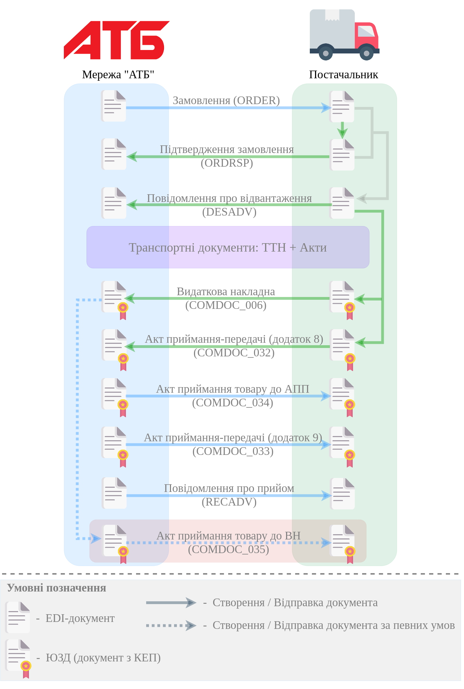

Робота з АТБ через API
#############################################################

.. role:: red

.. role:: underline

.. role:: green

.. role:: purple

----------------------------------------------------

.. csv-table:: 
  :file: API_schema_table1.csv
  :widths:  7, 42, 7, 21
  :header-rows: 1
  :stub-columns: 0

:download:`Завантажити колекцію методів для Postman (EDI)<API_schema/ATB.postman_collection.json>`

.. deprecated

   **Додаткові методи API**
   =============================

   Додатково мережа АТБ зі своєї сторони може `відкликати підписання документа COMDOC <https://wiki.edin.ua/uk/latest/integration_2_0/APIv2/Methods/PostDocumentRevoke.html>`__, `відхилити документ COMDOC <https://wiki.edin.ua/uk/latest/integration_2_0/APIv2/Methods/DocReject.html>`__ від Постачальника чи почати процес анулювання:

   * зі сторони АТБ виконується `запит на анулювання COMDOC <https://wiki.edin.ua/uk/latest/integration_2_0/APIv2/Methods/RepealRequest.html>`__
   * у відповідь зі сторони Постачальника виконується `прийняття запиту на анулювання COMDOC <https://wiki.edin.ua/uk/latest/integration_2_0/APIv2/Methods/RepealAccept.html>`__ або `відмова від анулювання COMDOC) <https://wiki.edin.ua/uk/latest/integration_2_0/APIv2/Methods/RepealReject.html>`__

   * `Отримання всіх квитанцій вказаного документа <https://wiki.edin.ua/uk/latest/integration_2_0/APIv2/Methods/GetTickets.html>`__                                                             |

   -------------------------------

   Список додаткового API по роботі з квитанціями COMDOC `за посиланням <https://wiki.edin.ua/uk/latest/integration_2_0/APIv2/APIv2_list.html#id4>`__.
