########################################################################################################################
Документообіг з мережею "АТБ" на платформі EDI Network 2.0: "Міжнародні перевезення"
########################################################################################################################

.. сюда закину немного картинок для текста

.. |будинок| image:: pics_ATB_International_transportation_instruction/ATB_International_transportation_instruction_004.png

.. role:: red

.. contents:: Зміст:
   :depth: 2

---------

Вступ
====================================

Дана інструкція описує порядок документообігу з мережею "АТБ" на платформі EDI Network 2.0 за схемою передбаченою для міжнародних перевезень. В документообігу приймають участь наступні документи:

- `Замовлення <https://wiki.edin.ua/uk/latest/ClientProcesses/ATB/ATB_XML-structure.html#order>`__
- `Підтвердження замовлення <https://wiki.edin.ua/uk/latest/ClientProcesses/ATB/ATB_XML-structure.html#ordrsp>`__
- `Повідомлення про відвантаження <https://wiki.edin.ua/uk/latest/ClientProcesses/ATB/ATB_XML-structure.html#desadv>`__
- `Універсальний документ <https://wiki.edin.ua/uk/latest/XML/XML-structure.html#condra>`__

**Загальна схема документообігу:**

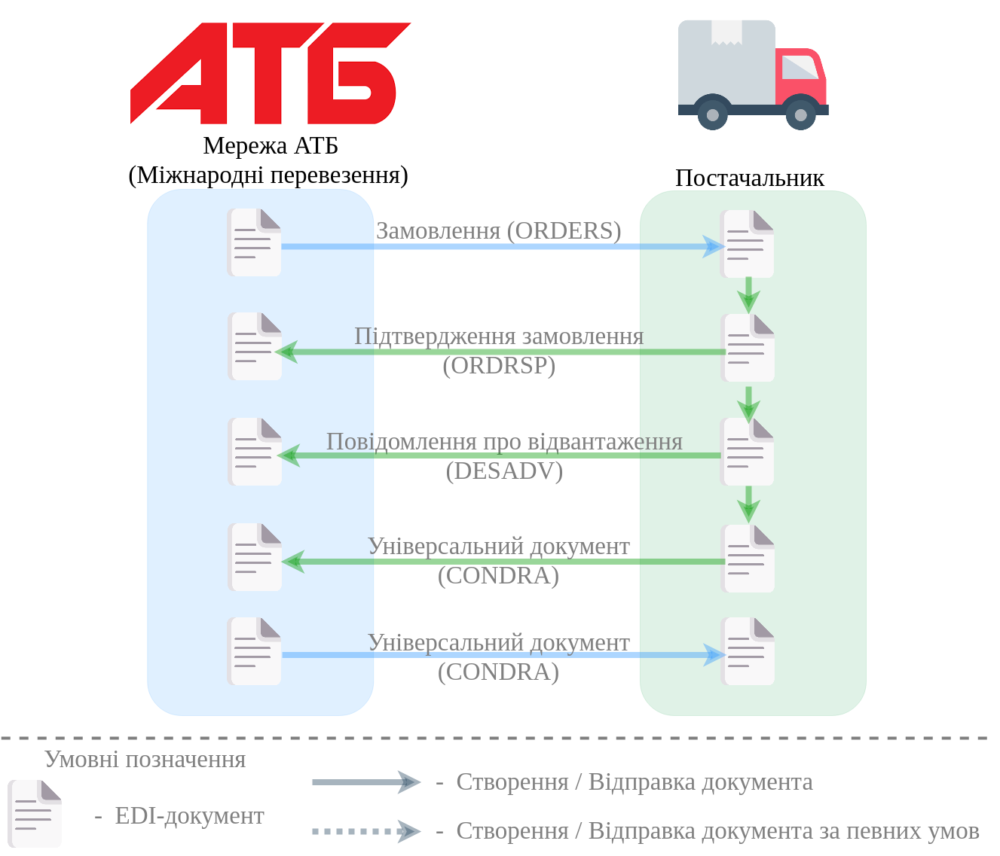

1 Формування "Замовлення" (ORDER). Сторона мережі "АТБ"
==================================================================

Для формування "Замовлення" (ORDER) користувачу мережі "АТБ" в меню сервісу потрібно натиснути кнопку **"Створити"** та обрати документ "Замовлення" (для зручності можливо скористатись пошуком за назвою документа):

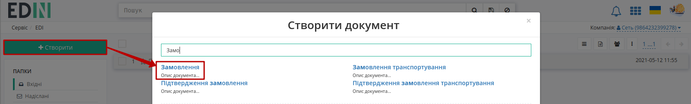

У відкритій формі документа всі обов'язкові до заповнення поля позначені червоною зірочкою :red:`*`.

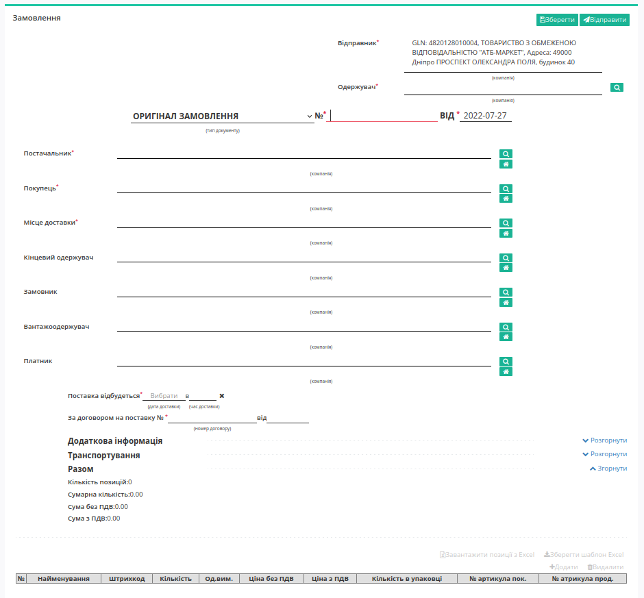

#. **Відправник** - дані відправника документу (мережі) - заповнюються автоматично; не підлягають редагуванню;
#. **Одержувач** - дані одержувача (постачальника), для зручного пошуку контрагента натисніть на кнопку з іконкою лупи |лупа| ;
#. **Тип документа** - поле для вибору типу: *Оригінал замовлення*, *Заміна*, *Видалення*, *Фіктивність замовлення*, *Передзамовлення*, *Замовлення на послугу/маркетинг*;
#. **№** - номер замовлення;
#. **від** - дата підтвердження, за замовчуванням вказана поточна дата;
#. **Постачальник** - заповнюється за допомогою кнопки "Пошук контрагента" (|лупа|), або за допомогою кнопки "Вказати себе" (|будинок|);
#. **Покупець** - заповнюється за допомогою кнопки "Пошук контрагента" (|лупа|), або за допомогою кнопки "Вказати себе" (|будинок|);
#. **Місце доставки** - заповнюється за допомогою кнопки "Пошук контрагента" (|лупа|), або за допомогою кнопки "Вказати себе" (|будинок|);
#. **Поставка відбудеться** - дата та час доставки;
#. **За договором на поставку №** - номер договору на поставку.

.. hint::
   За допомогою кнопки **"Пошук контрагента"** (|лупа|) або ж за допомогою кнопки **"Вказати себе"** (|будинок|) можливо вказати чи змінити дані Покупця або Постачальника. Для пошуку введіть назву компанії, GLN або ІПН:

   .. image:: pics_ATB_International_transportation_instruction/ATB_International_transportation_instruction_005.png
      :align: center

.. вирішили прибрати, але для інших інструкцій ок - Блоки **Додаткова інформація** та **Транспортування** необов'язкові для заповнення і "згорнуті" за замовчуванням. Блок **Разом** розраховується автоматично після заповнення позицій.

   .. image:: pics_ATB_International_transportation_instruction/ATB_International_transportation_instruction_006.png
      :align: center

В табличній частині відображається основна інформація по замовлених **товарних позиціях**. Позиції можна заповнити вручну (кнопка **"+Додати"**) або **"Завантажити позиції з Excel"** файлу.

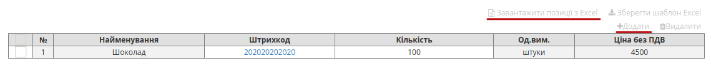

При ручному введенні через форму через кнопку **"+Додати"** товарні позиції заповнюються з товарного довідника (обов'язкові до заповнення поля позначені червоною зірочкою :red:`*`):

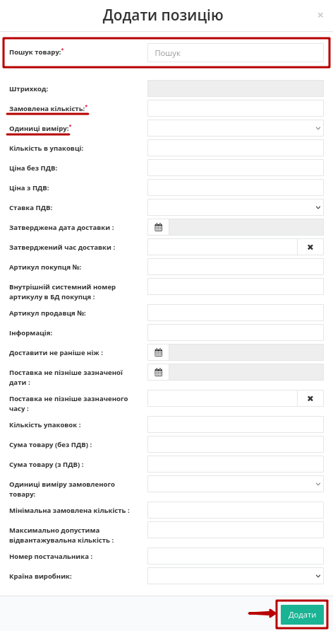

Завантажити позиції списком можливо за допомогою .XLS файлу Excel. Для коректного заповнення таблиці можливо скористатись шаблоном (кнопка **"Зберегти шаблон Excel"** для скачування шаблону у форматі .xls). Відкрийте та заповніть файл Excel. Колонки виділенні зеленим кольором - **обов'язкові для заповнення**! Деякі стовпці мають підказки до заповнення - наведіть курсор у верхній куток назви стовпця для відображення підказки: 

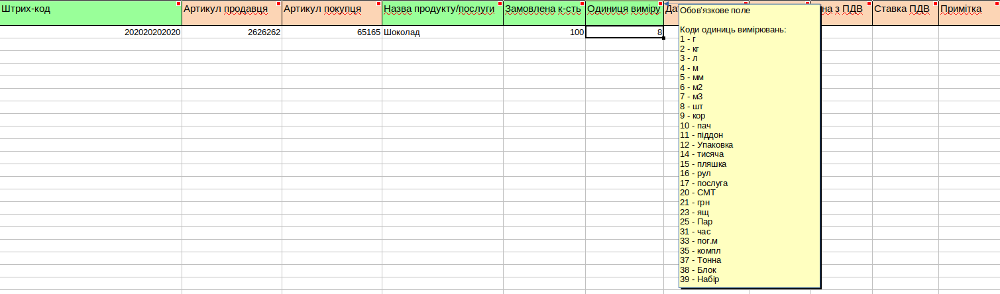

Для завантаження заповненого файлу на платформу натисніть на кнопку **"Завантажити позиції з Excel"** та виберіть у новому вікні збережений файл.

При необхідності змінити чи доповнити дані по позиціям, змініть данні у файлі .XLS та завантажке на платформу повторно. Позиції оновляться відповідно до файлу.

.. important:: У разі неправильного заповнення .XLS файлу Excel, при завантаженні з'явиться повідомлення про помилку з указанням рядка, який необхідно відкоригувати. При додаванні позиції, яка вже була додана, також зявиться попередження з указанням штрихкоду позиції.

Після внесення всіх даних потрібно **"Зберегти"** (1) документ, після чого його можливо **"Відправити"** (2):

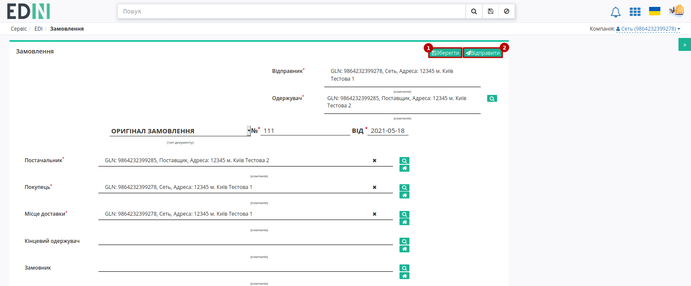

Після збереження документ потрапляє в папку **"Чернетки"**:

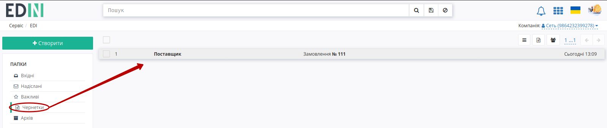

Відправлений документ автоматично потрапляє в папку **"Надіслані"**:

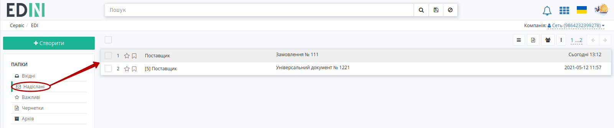

2 Формування "Підтвердження замовлення" (ORDRSP) у відповідь на вхідне "Замовлення" (ORDER). Сторона Постачальника
=========================================================================================================================

Для формування "Підтвердження замовлення" (ORDRSP) потрібно у папці **"Вхідні"** обрати "Замовлення" (ORDER), за яким потрібно зробити підтвердження. Документ відображається у **"Вхідних"** (для зручності можливо скористатись `пошуком <https://wiki.edin.ua/uk/latest/general_2_0/rabota_s_platformoj_EDIN_2.0.html#doc-search>`__):

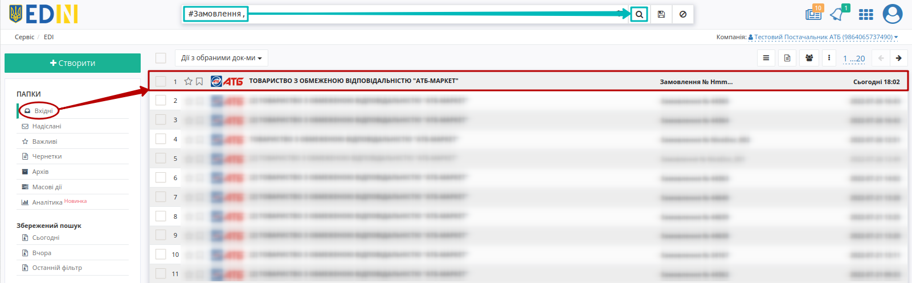

Потрібно відкрити вхідне "Замовлення" (ORDER) лівою кнопкою миші та створити "Підтвердження замовлення" (ORDRSP) в блоці `ланцюжка документів <https://wiki.edin.ua/uk/latest/_constant/chain/chain.html>`__ для мережі "АТБ" за допомогою кнопки **"Створити документ"** (документ створиться автоматично):

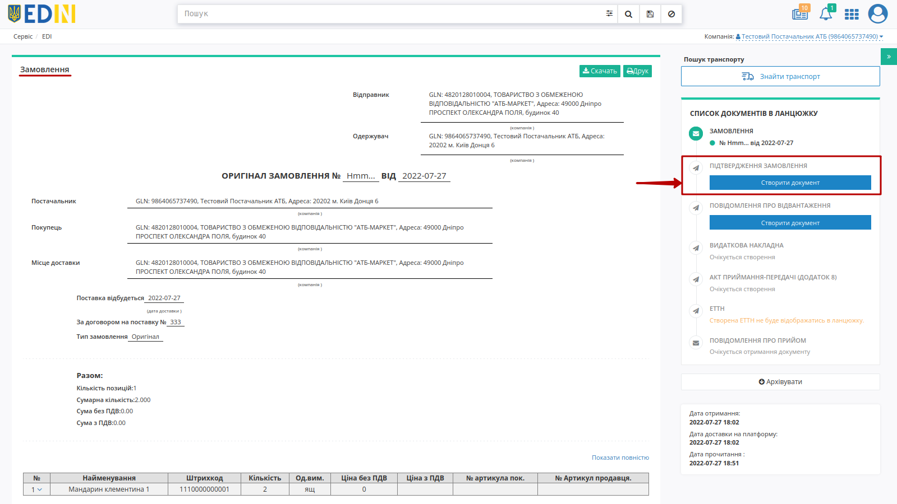

У відкритій формі "Підтвердження замовлення" (ORDRSP) деякі поля заповнюються автоматично з пов'язаного "Замовлення" (обов'язкові до заповнення поля позначені червоною зірочкою :red:`*`):

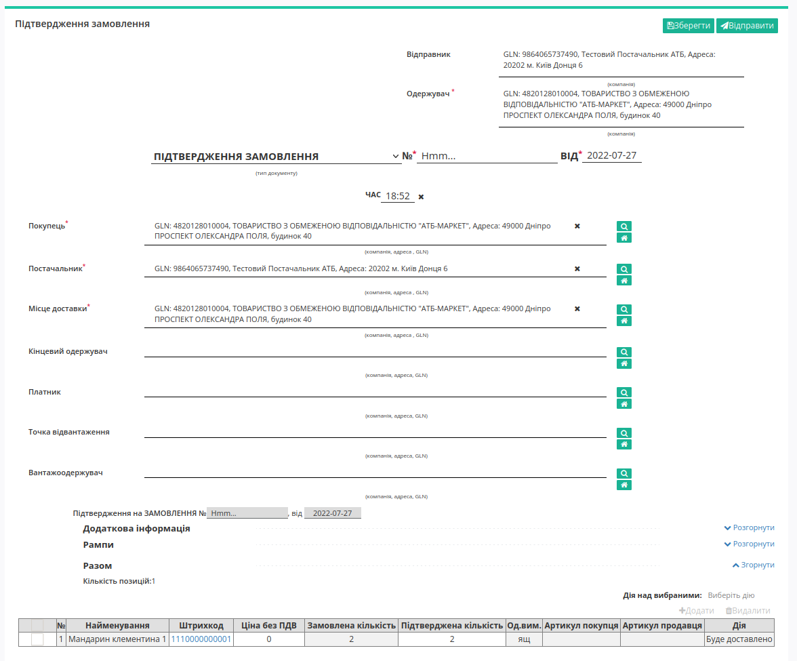

#. **Одержувач** - дані одержувача (мережі), не підлягають редагуванню
#. **Підтвердження замовлення** - поле для вибору типу: *Підтвердження замовлення*, *Заміна підтвердження замовлення*, *Видалення підтвердження замовлення*;
#. **№** - номер підтвердження замовлення;
#. **від** - дата підтвердження замовлення, за замовчуванням вказана поточна дата;
#. **Покупець** - заповнюється автоматично або за допомогою кнопки "Пошук контрагента" (|лупа|), або за допомогою кнопки "Вказати себе" (|будинок|);
#. **Постачальник** - заповнюється автоматично або за допомогою кнопки "Пошук контрагента" (|лупа|), або за допомогою кнопки "Вказати себе" (|будинок|);
#. **Місце доставки** - заповнюється автоматично або за допомогою кнопки "Пошук контрагента" (|лупа|), або за допомогою кнопки "Вказати себе" (|будинок|).

.. hint::
   За допомогою кнопки **"Пошук контрагента"** (|лупа|) або ж за допомогою кнопки **"Вказати себе"** (|будинок|) можливо вказати чи змінити дані Покупця або Постачальника. Для пошуку введіть назву компанії, GLN або ІПН:

   .. image:: pics_ATB_International_transportation_instruction/ATB_International_transportation_instruction_005.png
      :align: center

.. вирішили прибрати, але для інших інструкцій ок - Блоки **Додаткова інформація** та **Рампи** необов'язкові для заповнення і "згорнуті" за замовчуванням. Блок **Разом** розраховується автоматично після заповнення позицій.

   .. image:: pics_ATB_International_transportation_instruction/ATB_International_transportation_instruction_018.png
      :align: center

В табличній частині відображається основна інформація по замовлених **товарних позиціях**. **Товарні позиції** переносяться з Замовлення: їх можна додати, змінити, підтвердити/відхилити чи видалити.

:red:`Всі зміни за позиціями тільки після узгодження з мережею!`

Після того, як товарні позиції будуть обрані (відмічені чекером) над ними доступні наступні **"Дії над вибраними"** : **Буде доставлено** або **Відмовлено**. У колонці **Дії** - відображається статус дії в обраній позиції. Можливі наступні статуси: **Буде доставлено, Зміни кількості**, або **Відмовлено**.

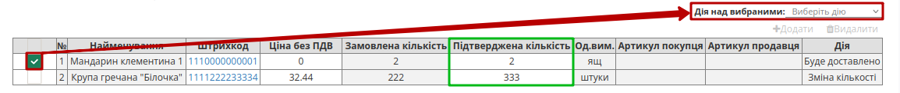
  
Постачальник може редагувати позиції, наприклад, у випадку коли необхідно змінити кількість підтвердженого товару. Для цього внесіть кількість товару, що підтверджується в колонці **Підтверджена кількість**. Якщо по якійсь з позицій не буде поставки її необхідно відзначити галочкою і **"Видалити"**.

.. вирішили прибрати, але для інших інструкцій ок - Можливо також додати іншу позицію з Товарного довідника, заповнивши форму **Додати позицію** через кнопку **"+Додати"** (обов'язкові до заповнення поля позначені червоною зірочкою :red:`*`).

   .. image:: pics_ATB_International_transportation_instruction/ATB_International_transportation_instruction_020.png
      :align: center

.. attention::
   Підтверджена кількість товарних позицій не може перевищувати зазначену в "Замовленні"!

Після внесення всіх даних в документ, натисніть кнопку **"Зберегти"** (1), потім **"Відправити"** (2).

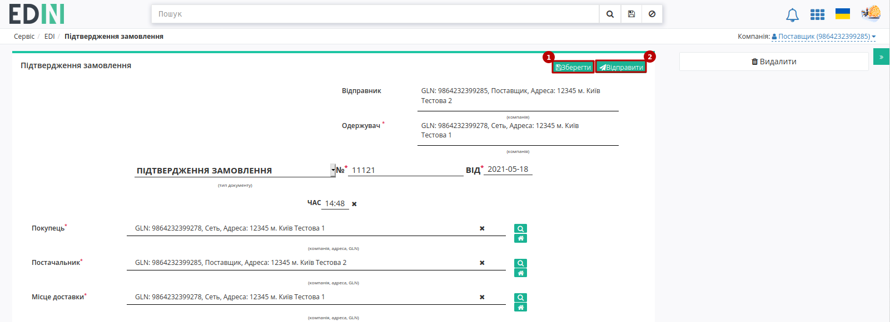

Відправлений документ автоматично потрапляє в папку **"Надіслані"** і буде знаходиться в ланцюжку документів разом із "Замовленням".

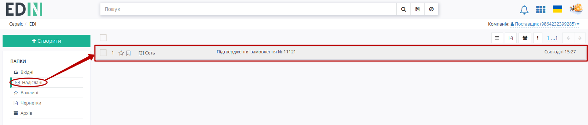

3 Формування "Повідомлення про відвантаження" (DESADV). Сторона Постачальника
=========================================================================================================================

Для формування "Повідомлення про відвантаження" (DESADV) потрібно у папці **"Надіслані"** обрати "Підтвердження замовлення" (ORDRSP), за яким потрібно зробити відвантаження (для зручності можливо скористатись `пошуком <https://wiki.edin.ua/uk/latest/general_2_0/rabota_s_platformoj_EDIN_2.0.html#doc-search>`__):

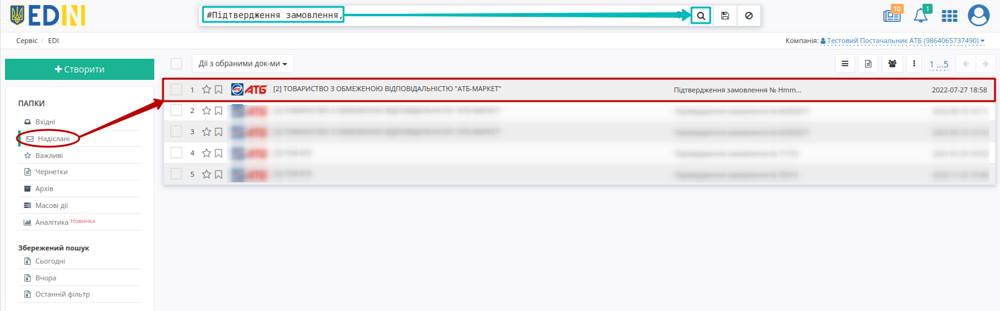

Потрібно відкрити надіслане "Підтвердження замовлення" (ORDRSP) лівою кнопкою миші та створити "Повідомлення про відвантаження" (DESADV) в блоці `ланцюжка документів <https://wiki.edin.ua/uk/latest/_constant/chain/chain.html>`__ для мережі "АТБ" за допомогою кнопки **"Створити документ"** (документ створиться автоматично):

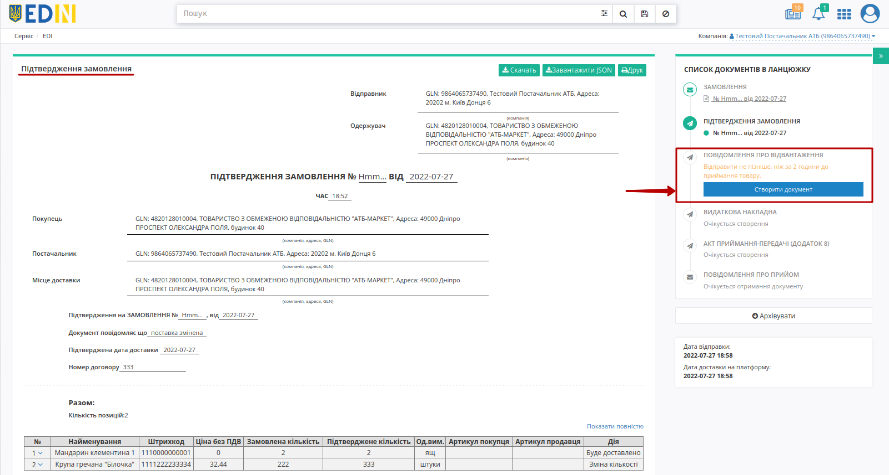

У відкритій формі "Повідомлення про відвантаження" (DESADV) деякі поля заповнюються автоматично з пов'язаного документа-підстави (обов'язкові до заповнення поля позначені червоною зірочкою :red:`*`):

.. note::
   Документ "Повідомлення про відвантаження" (DESADV) підтримує версійність (на рівні одного `ланцюжка документів <https://wiki.edin.ua/uk/latest/_constant/chain/chain.html>`__). Якщо мережа відхиляє сформовану ТТН, необхідно переробити весь ланцюжок документів, починаючи з "Повідомлення про відвантаження" (DESADV). При заміні документа (номер документа зберігається) потрібно збільшувати значення **"Версії"** документа на одиницю (n+1).

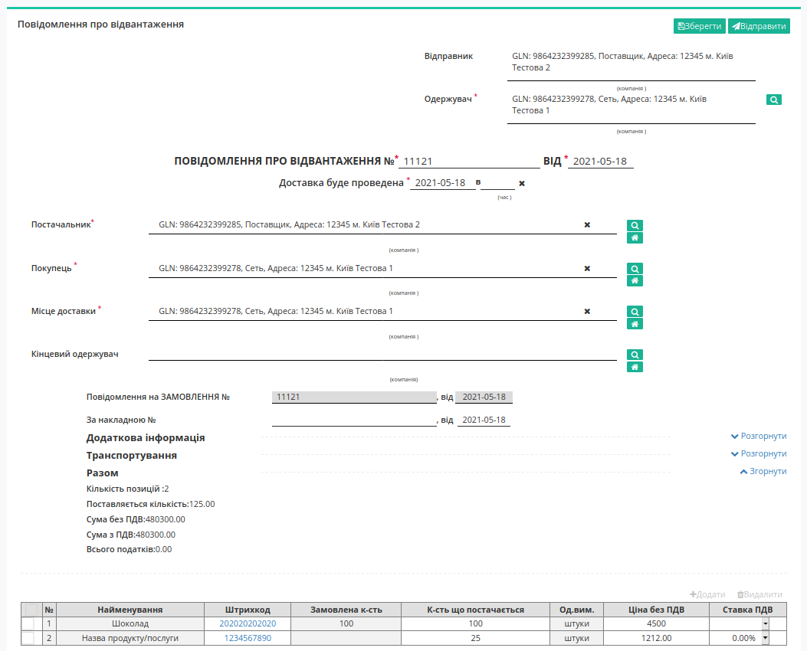

#. **Одержувач** - дані одержувача (мережі), компанія;
#. **Повідомлення про відвантаження №** - номер "Повідомлення про відвантаження";
#. **від** - дата "Повідомлення про відвантаження", за замовчуванням вказана поточна дата;
#. **Доставка буде проведена** - дата і час доставки;
#. **Версія** - версія документа. Числове значення вказується автоматично і не може бути меншим за версію попередніх "Повідомлень про відвантаження" (DESADV) в ланцюжку документів;
#. **Постачальник** - заповнюється автоматично або за допомогою кнопки "Пошук контрагента" (|лупа|), або за допомогою кнопки "Вказати себе" (|будинок|);
#. **Покупець** - заповнюється автоматично або за допомогою кнопки "Пошук контрагента" (|лупа|), або за допомогою кнопки "Вказати себе" (|будинок|);
#. **Місце доставки** - заповнюється автоматично або за допомогою кнопки "Пошук контрагента" (|лупа|), або за допомогою кнопки "Вказати себе" (|будинок|);
#. **Повідомлення на замовлення №** / **від** - номер/дата "Замовлення" в ланцюжку документів;
#. **За накладною №** / **від** - номер/дата накладної. :red:`Номер "первинного" документа на паперовому носії повинен співпадати з номером накладної!`

.. hint::
   За допомогою кнопки **"Пошук контрагента"** (|лупа|) або ж за допомогою кнопки **"Вказати себе"** (|будинок|) можливо вказати чи змінити дані Покупця або Постачальника. Для пошуку введіть назву компанії, GLN або ІПН:

   .. image:: pics_ATB_International_transportation_instruction/ATB_International_transportation_instruction_005.png
      :align: center

.. вирішили прибрати, але для інших інструкцій ок - Блоки **Додаткова інформація** та **Транспортування** необов'язкові для заповнення і "згорнуті" за замовчуванням. Блок **Разом** розраховується автоматично після заповнення позицій.

   .. image:: pics_ATB_International_transportation_instruction/ATB_International_transportation_instruction_026.png
      :align: center

.. important::
   **Увага!** Номер вказаної накладної повинен повністю збігатися з номером оригіналу паперової накладної.

Також повинні збігатись перелік товарних позицій (які були замовлені), їх кількість, що постачається. Система автоматично заповнює значення за позиціями з раніше відправленого документа "Підтвердження замовлення", на основі якого був створений документ "Повідомлення про відвантаження" (DESADV). Можливо вносити зміни в кількість і ціну позицій.

:red:`Всі зміни за позиціями тільки після узгодження з мережею!`

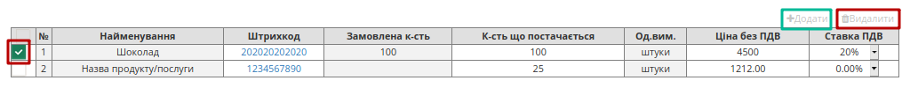

.. important::
   **Увага!** У разі створення **кількох** видаткових накладних на замовлення, необхідно на кожну накладну формувати **Повідомлення про відвантаження**. При цьому, поле **"За накладною №"** в документах повинно відрізнятися.

.. attention::
   Кількість товарних позицій, що постачається не може перевищувати кількість зазначену в "Замовленні"!

Якщо по якійсь з позицій не буде поставки її необхідно відзначити галочкою і **"Видалити"**.

.. вирішили прибрати, але для інших інструкцій ок - Можливо також додати іншу позицію з Товарного довідника, заповнивши форму **Додати позицію** через кнопку **"+Додати"** (обов'язкові до заповнення поля позначені червоною зірочкою :red:`*`).

Після внесення всіх даних в документ, натисніть кнопку **"Зберегти"** (1), потім **"Відправити"** (2).

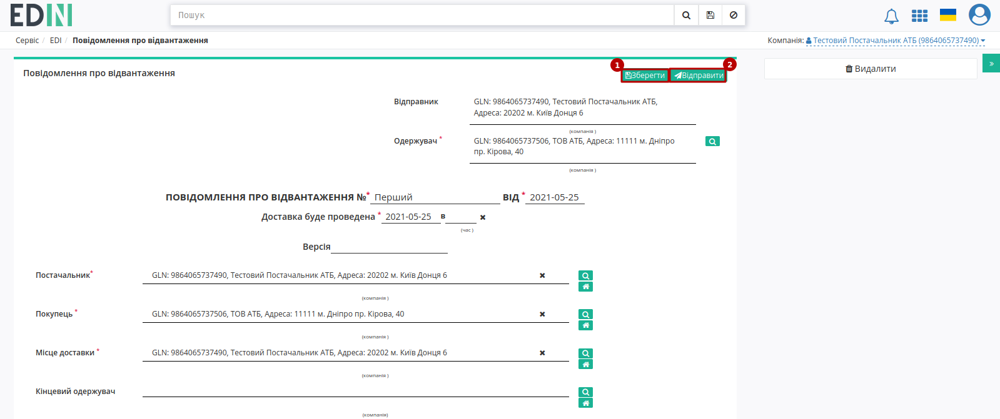
   
Відправлений документ автоматично потрапляє в папку **"Надіслані"** і буде знаходитись в ланцюжку документів разом із "Замовленням" і "Підтвердженням замовлення".

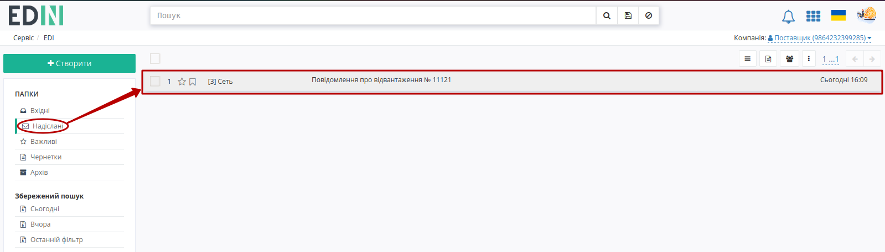

--------------------------------------

.. include:: /retail_2.0/formirovanie_otpravka_dokumenta_Uvedomlenie_ob_otgruzke_DESADV_na_EDI_Network_2.0.rst
   :start-after: .. початок блоку для DESADV_TTN
   :end-before: .. кінець блоку для DESADV_TTN

.. _condra-form:

4 Формування "Універсального документа" (CONDRA). Сторона Постачальника
=========================================================================================================================

Для формування "Універсального документа" (CONDRA) потрібно у папці **"Надіслані"** обрати "Повідомлення про відвантаження" (DESADV) (для зручності можливо скористатись `пошуком <https://wiki.edin.ua/uk/latest/general_2_0/rabota_s_platformoj_EDIN_2.0.html#doc-search>`__):

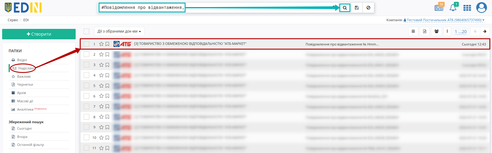

Потрібно відкрити надіслане "Повідомлення про відвантаження" (DESADV) лівою кнопкою миші та створити "Універсальний документ" (CONDRA) в блоці `ланцюжка документів <https://wiki.edin.ua/uk/latest/_constant/chain/chain.html>`__ для мережі "АТБ" за допомогою кнопки **"Створити документ"** (документ створиться автоматично):

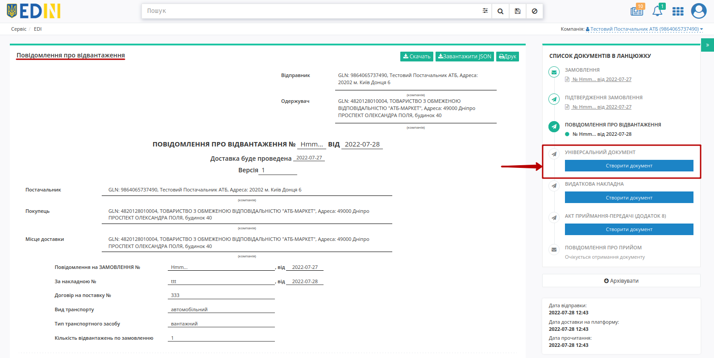

У відкритій формі "Універсального документа" (CONDRA) деякі поля заповнюються автоматично з пов'язаного документа-підстави (обов'язкові до заповнення поля позначені червоною зірочкою :red:`*`):

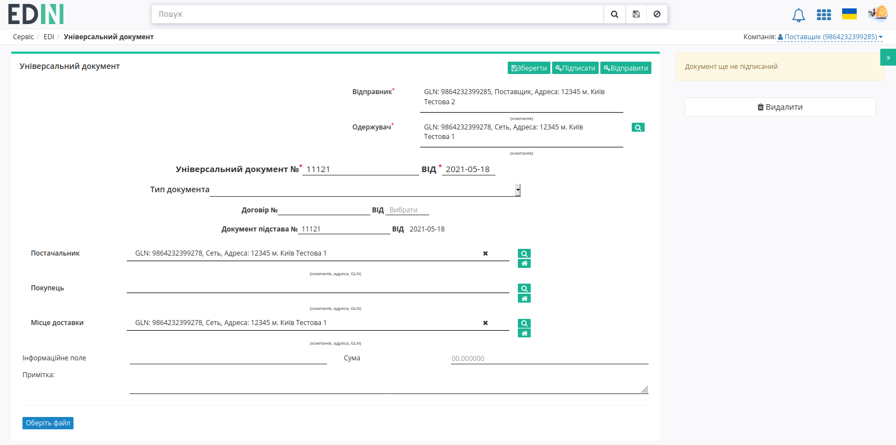

#. **Одержувач** - дані одержувача (мережі), компанія;
#. **Універсальний документ №** - номер "Універсального документа";
#. **від** - дата "Універсального документа", за замовчуванням вказана поточна дата;

.. hint::
   За допомогою кнопки **"Пошук контрагента"** (|лупа|) або ж за допомогою кнопки **"Вказати себе"** (|будинок|) можливо вказати чи змінити дані Покупця або Постачальника. Для пошуку введіть назву компанії, GLN або ІПН:

   .. image:: pics_ATB_International_transportation_instruction/ATB_International_transportation_instruction_005.png
      :align: center

Для зручності комунікації, вкажіть Тип документа, вибравши його зі списку.

Через кнопку **"Оберіть файл"** можливо обрати та додати файл (наприклад, сертифікат) з вашого з локального носія:

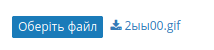

.. note::
   **Увага!** Додати можливо будь-який **1** файл розміром **до 5 МБ**! 

Після вибору й завантаження файлу, біля кнопки відобразиться назва файлу у вигляді посилання, по якому можливо скачати файл для перегляду.

Після внесення всіх даних в документ, натисніть кнопку **"Зберегти"** (1), потім **"Відправити"** (2) без підписання.

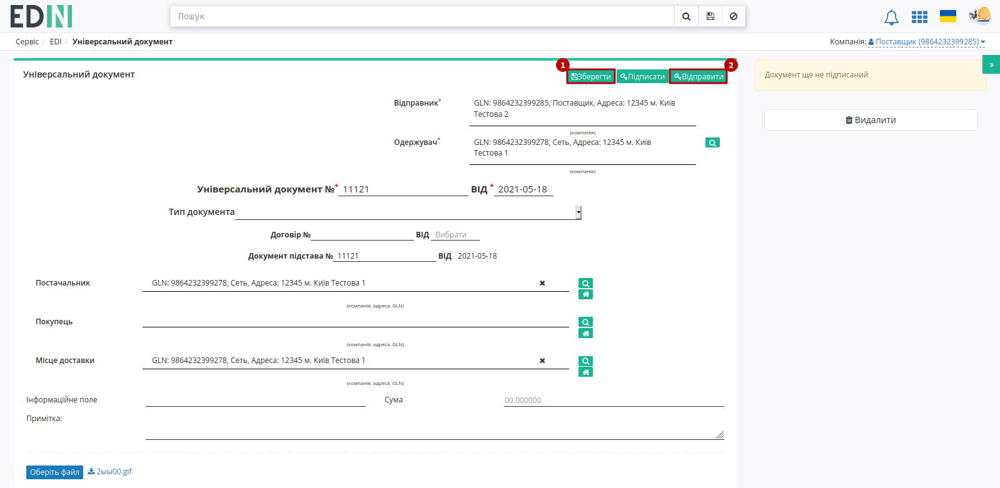
   
Відправлений документ автоматично потрапляє в папку **"Надіслані"** і буде знаходитись в ланцюжку разом із пов'язаними документами.

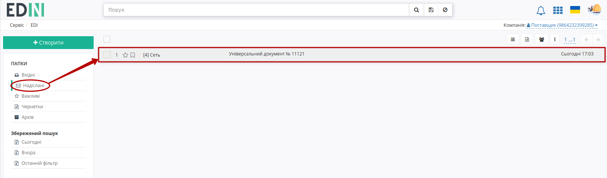

5 Формування "Універсального документа" (CONDRA). Сторона: мережа "АТБ"
=========================================================================================================================

За потреби мережа "АТБ" може зформувати у відповідь "Універсальний документ" (CONDRA) разом з запропонованими правками і коментарями. 

.. hint::
   Процес формування документа не відрізняється і описаний в `розділі вище <https://wiki.edin.ua/uk/latest/ClientProcesses/ATB/ATB_Instructions/ATB_International_transportation_instruction.html#condra-form>`__ .

-------------------------------------

.. include:: /_constant/kontakti.rst
