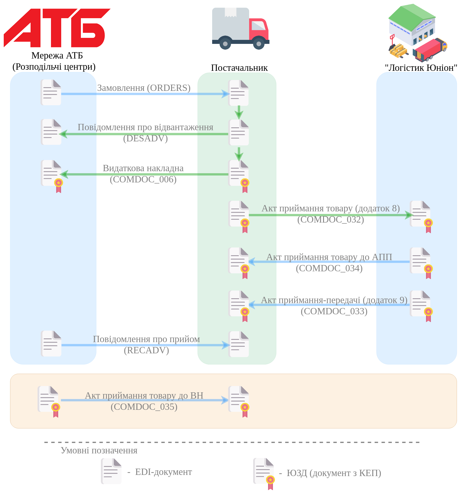
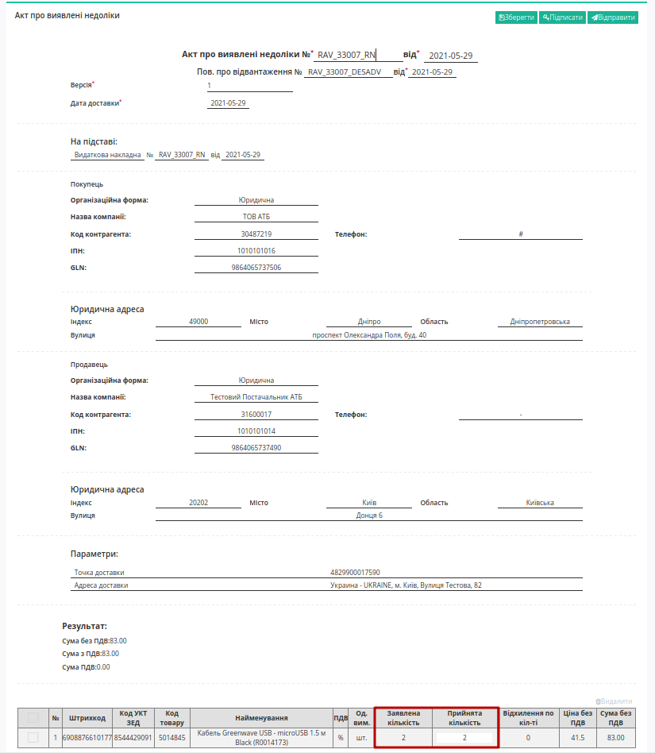
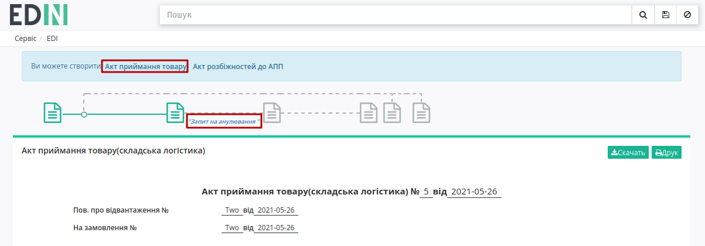
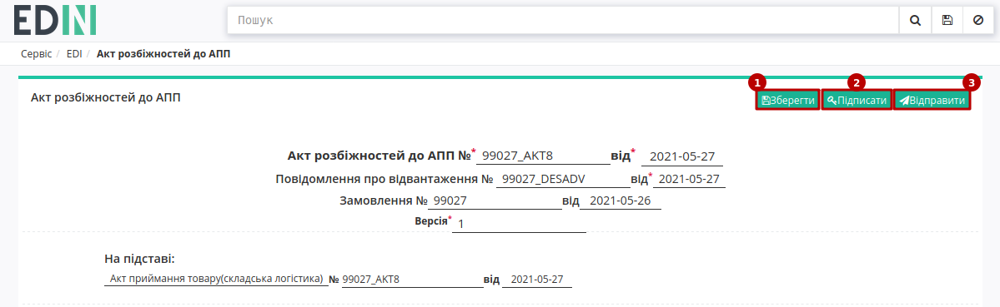

########################################################################################################################
Документообіг з мережею "АТБ" на платформі EDI Network 2.0. Інструкція для "АТБ" та "Логістик Юніон"
########################################################################################################################

.. сюда закину немного картинок для текста

.. |будинок| image:: pics_ATB_external_EDI_instruction/ATB_external_EDI_instruction_004.png

.. |плюс| image:: pics_ATB_external_EDI_instruction/ATB_external_EDI_instruction_029.png

.. |мусорка| image:: pics_ATB_external_EDI_instruction/ATB_external_EDI_instruction_030.png

.. |info| image:: pics_ATB_external_EDI_instruction/ATB_external_EDI_instruction_064.png

.. role:: red

.. contents:: Зміст:
   :depth: 5

---------

Вступ
====================================

Дана інструкція описує порядок документообігу з мережею "АТБ" на платформі EDI Network 2.0. В документообігу приймають участь наступні документи:

- `Замовлення (ORDER) <https://wiki.edin.ua/uk/latest/ClientProcesses/ATB/ATB_XML-structure.html#order>`__
- `Повідомлення про відвантаження (DESADV) <https://wiki.edin.ua/uk/latest/ClientProcesses/ATB/ATB_XML-structure.html#desadv>`__
- `Повідомлення про прийом (RECADV) <https://wiki.edin.ua/uk/latest/XML/XML-structure.html#recadv>`__
- `Видаткова накладна (COMDOC_006) <https://wiki.edin.ua/uk/latest/ClientProcesses/ATB/ATB_XML-structure.html#comdoc-006>`__
- `Акт приймання товару до ВН (COMDOC_035) <https://wiki.edin.ua/uk/latest/ClientProcesses/ATB/ATB_XML-structure.html#comdoc-035>`__
- `Акт приймання-передачі (додаток 8) (COMDOC_032) <https://wiki.edin.ua/uk/latest/ClientProcesses/ATB/ATB_XML-structure.html#comdoc-032>`__
- `Акт приймання-передачі (додаток 9) (COMDOC_033) <https://wiki.edin.ua/uk/latest/ClientProcesses/ATB/ATB_XML-structure.html#comdoc-033>`__
- `Акт приймання товару до АПП (COMDOC_034) <https://wiki.edin.ua/uk/latest/ClientProcesses/ATB/ATB_XML-structure.html#comdoc-034>`__

**Загальна схема документообігу:**

1 Отримання "Видаткової накладної" (COMDOC_006). Сторона мережі "АТБ"
=========================================================================================================================

Документ "Видаткова накладна" (COMDOC_006) на стороні мережі знаходиться у папці **"Вхідні"**. Для пошуку достатньо ввести коректний номер документа в полі «Пошук». Документи також можливо шукати за **Відправником**, **Датою документа** і **Одержувачем**.

.. important::
   Мережа "АТБ" переглядає "Видаткову накладну" (COMDOC_006), що потребує підписання і:

   1. якщо всі дані в документі коректні, то підписує цей документ;
   2. якщо кількісно-цінові значення в позиціях в документі розходяться з фактичними, то формує у відповідь "Акт приймання товару до ВН" - COMDOC_035; при підписанні документа з обох сторін вхідна "Видаткова накладна" переглядається і виконуються дії згідно п.1; 
   3. якщо невірно вказані дані в полях документа, то формує "Відмову від підписання" - COMDOC_021 квитанція №13 (`детальніше <https://wiki.edin.ua/uk/latest/ClientProcesses/ATB/ATB_Instructions/ATB_external_EDI_instruction_net.html#reject>`__).

.. _to006:

1.1 Підписання вхідної "Видаткової накладної" (COMDOC_006). Сторона мережі "АТБ"
----------------------------------------------------------------------------------------------------------------------------

Для підписання потрібно натиснути на кнопку **"Підписати і відправити у відповідь"**:

.. hint::
   Процес підписання на платформі описаний в окремому розділі за `посиланням <https://wiki.edin.ua/uk/latest/ClientProcesses/ATB/ATB_Instructions/ATB_external_EDI_instruction_net.html#sign>`__ .

За потреби можливо створити **"Запит на анулювання"** вже підписаного документа (COMDOC_019 квитанція №11 (`детальніше <https://wiki.edin.ua/uk/latest/ClientProcesses/ATB/ATB_Instructions/ATB_external_EDI_instruction_net.html#repeal>`__)):

1.2 Формування у відповідь "Акта приймання товару до ВН" (COMDOC_035). Сторона мережі "АТБ"
----------------------------------------------------------------------------------------------------------------------------

Для формування "Акта приймання товару до ВН" (COMDOC_035) виберіть відповідний документ на формі-підказці - документ створиться автоматично.

.. image:: pics_ATB_external_EDI_instruction/ATB_external_EDI_instruction_100.png
   :align: center

У відкритій формі "Акта приймання товару до ВН" (COMDOC_035) всі поля заповнюються автоматично з пов'язаного документа-підстави. Блок табличної частини з переліком позицій також заповнюються автоматично з документа-основи. Документ засвідчує невідповідність кількості товарних позицій:

Після внесення змін в документ, натисніть кнопку **"Зберегти"** (1), **"Підписати"** (2) та **"Відправити"** (3):

.. hint::
   Процес підписання на платформі описаний в окремому розділі за `посиланням <https://wiki.edin.ua/uk/latest/ClientProcesses/ATB/ATB_Instructions/ATB_external_EDI_instruction_net.html#sign>`__ .

Відправлений документ автоматично потрапляє в папку **"Надіслані"** зі статусом "Потребує підписання отримувачем":

Доступне **Відкликання підпису** - COMDOC_021 квитанція №14 (`детальніше <https://wiki.edin.ua/uk/latest/ClientProcesses/ATB/ATB_Instructions/ATB_external_EDI_instruction_net.html#revoke>`__).

2 Отримання "Акта приймання-передачі (додаток 8)" (COMDOC_032). Сторона "Логістик Юніон"
=========================================================================================================================

У від відповідь на вхідний (папка **"Вхідні"**) "Акт приймання-передачі (додаток 8)" (COMDOC_032) формується "Акт приймання-передачі (додаток 9)" (COMDOC_033) чи "Акт приймання товару до АПП" (COMDOC_034). Для пошуку потрібного документа достатньо ввести коректний номер документа в полі «Пошук». Документи також можливо шукати за **Відправником**, **Датою документа** і **Одержувачем**.

.. important::
   Компанія "Логістик Юніон" переглядає "Акт приймання-передачі (додаток 8)" (COMDOC_032) і:

   1. якщо всі дані в документі коректні, то підписує цей документ і формує у відповідь "Акт приймання-передачі (додаток 9)" (COMDOC_033);
   2. якщо кількісно-цінові значення в позиціях в документі розходяться з фактичними, то формує у відповідь "Акт приймання товару до АПП" (COMDOC_034); при підписанні документа з обох сторін вхідний акт переглядається і виконуються дії згідно п.1; 
   3. якщо невірно вказані дані в полях документа, то формує "Відмову від підписання" - COMDOC_021 квитанція №13 (`детальніше <https://wiki.edin.ua/uk/latest/ClientProcesses/ATB/ATB_Instructions/ATB_external_EDI_instruction_net.html#reject>`__).

.. image:: pics_ATB_external_EDI_instruction/ATB_external_EDI_instruction_053.png
   :align: center

.. _to033:

2.1 Підписання та формування "Акта приймання-передачі (додаток 9)" (COMDOC_033) у відповідь. Сторона "Логістик Юніон"
----------------------------------------------------------------------------------------------------------------------------

Перед тим, як сформувати "Акт приймання-передачі (додаток 9)" (COMDOC_033) компанія "Логістик Юніон" підписує вхідний акт. Для підписання потрібно натиснути на кнопку **"Підписати і відправити у відповідь"**:

.. hint::
   Процес підписання на платформі описаний в окремому розділі за `посиланням <https://wiki.edin.ua/uk/latest/ClientProcesses/ATB/ATB_Instructions/ATB_external_EDI_instruction_net.html#sign>`__ .

Після того, як документ підписано можливо сформувати **"Акт приймання-передачі (додаток 9)"** чи **"Запит на анулювання"** вже підписаного документа (COMDOC_019 квитанція №11 (`детальніше <https://wiki.edin.ua/uk/latest/ClientProcesses/ATB/ATB_Instructions/ATB_external_EDI_instruction_net.html#repeal>`__)):

2.1.1 Формування "Акта приймання-передачі (додаток 9)" (COMDOC_033). Сторона "Логістик Юніон"
~~~~~~~~~~~~~~~~~~~~~~~~~~~~~~~~~~~~~~~~~~~~~~~~~~~~~~~~~~~~~~~~~~~~~~~~~~~~~~~~~~~~

Для формування "Акта приймання-передачі (додаток 9)" (COMDOC_033) виберіть відповідний документ на формі-підказці - документ створиться автоматично.

.. image:: pics_ATB_external_EDI_instruction/ATB_external_EDI_instruction_056.png
   :align: center

.. image:: pics_ATB_external_EDI_instruction/ATB_external_EDI_instruction_057.png
   :align: center

У відкритій формі "Акта приймання-передачі (додаток 9)" (COMDOC_033) всі поля заповнюються автоматично з пов'язаного документа-підстави. Блок табличної частини з переліком позицій також заповнюються автоматично з документа-основи. Можливо вносити зміни в дані позиції (кількість, базову ціну позицій) чи "Видалити" обрані позиції:

:red:`Всі зміни за позиціями тільки після узгодження з мережею!`

.. image:: pics_ATB_external_EDI_instruction/ATB_external_EDI_instruction_058.png
   :align: center

.. attention::
   Кількість товарних позицій, що постачається не може перевищувати кількість зазначену в "Замовленні"!

Після внесення змін в документ, натисніть кнопку **"Зберегти"** (1), **"Підписати"** (2) та **"Відправити"** (3):

.. hint::
   Процес підписання на платформі описаний в окремому розділі за `посиланням <https://wiki.edin.ua/uk/latest/ClientProcesses/ATB/ATB_Instructions/ATB_external_EDI_instruction_net.html#sign>`__ .

Відправлений документ автоматично потрапляє в папку **"Надіслані"** зі статусом "Потребує підписання отримувачем":

Доступне **Відкликання підпису** - COMDOC_021 квитанція №14 (`детальніше <https://wiki.edin.ua/uk/latest/ClientProcesses/ATB/ATB_Instructions/ATB_external_EDI_instruction_net.html#revoke>`__).

2.2 Формування у відповідь "Акта приймання товару до АПП" (COMDOC_034). Сторона "Логістик Юніон"
----------------------------------------------------------------------------------------------------------------------------

Для формування "Акта приймання товару до АПП" (COMDOC_034) виберіть відповідний документ на формі-підказці - документ створиться автоматично.

.. image:: pics_ATB_external_EDI_instruction/ATB_external_EDI_instruction_081.png
   :align: center

У відкритій формі "Акта приймання товару до АПП" (COMDOC_034) всі поля заповнюються автоматично з пов'язаного документа-підстави. Блок табличної частини з переліком позицій також заповнюються автоматично з документа-основи. Документ засвідчує невідповідність кількості товарних позицій:

.. attention::
   Кількість товарних позицій, що постачається не може перевищувати кількість зазначену в "Замовленні"!

Після внесення змін в документ, натисніть кнопку **"Зберегти"** (1), **"Підписати"** (2) та **"Відправити"** (3):

.. hint::
   Процес підписання на платформі описаний в окремому розділі за `посиланням <https://wiki.edin.ua/uk/latest/ClientProcesses/ATB/ATB_Instructions/ATB_external_EDI_instruction_net.html#sign>`__ .

Відправлений документ автоматично потрапляє в папку **"Надіслані"** зі статусом "Потребує підписання отримувачем":

.. image:: pics_ATB_external_EDI_instruction/ATB_external_EDI_instruction_084.png
   :align: center

Доступне **Відкликання підпису** - COMDOC_021 квитанція №14 (`детальніше <https://wiki.edin.ua/uk/latest/ClientProcesses/ATB/ATB_Instructions/ATB_external_EDI_instruction_net.html#revoke>`__).

.. _sign:

Підписання на платформі EDIN 2.0
=========================================================================================================================

.. tabs::

   .. tab:: Файловий ключ

      .. include:: /_constant/signing/signing.rst
         :start-after: .. початок блоку для Signing
         :end-before: .. кінець блоку для Signing

   .. tab:: Cloud

      .. include:: /_constant/cloud_signing/cloud_signing.rst
         :start-after: .. початок блоку для CloudSign
         :end-before: .. кінець блоку для CloudSign

.. _revoke:

Відкликання підпису комерційних документів (COMDOC)
=========================================================================================================================

.. include:: /_constant/comdoc_revoke/comdoc_revoke.rst
   :start-after: .. початок блоку для Comdoc_Revoke
   :end-before: .. кінець блоку для Comdoc_Revoke

.. _repeal:

Анулювання підписаних комерційних документів (COMDOC)
=========================================================================================================================

.. include:: /_constant/comdoc_repeal/comdoc_repeal.rst
   :start-after: .. початок блоку для Comdoc_Repeal
   :end-before: .. кінець блоку для Comdoc_Repeal

.. _reject:

Відмова від підписання комерційних документів (COMDOC)
=========================================================================================================================

.. include:: /_constant/comdoc_reject/comdoc_reject.rst
   :start-after: .. початок блоку для Comdoc_Reject
   :end-before: .. кінець блоку для Comdoc_Reject

------------------------------------------------

.. include:: /_constant/kontakti.rst
