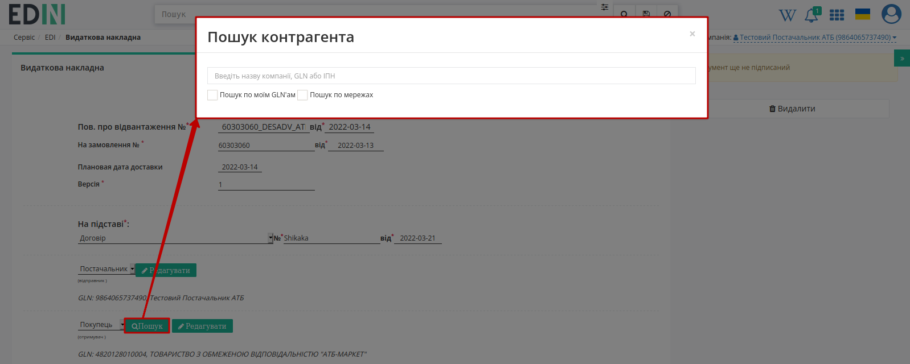

########################################################################################################################
Документообіг з мережею "АТБ" на платформі EDI Network 2.0. Інструкція для Постачальника
########################################################################################################################

.. сюда закину немного картинок для текста

.. |лупа| image:: pics_ATB_external_EDI_instruction/ATB_external_EDI_instruction_003.png

.. |будинок| image:: pics_ATB_external_EDI_instruction/ATB_external_EDI_instruction_004.png

.. |плюс| image:: pics_ATB_external_EDI_instruction/ATB_external_EDI_instruction_029.png

.. |мусорка| image:: pics_ATB_external_EDI_instruction/ATB_external_EDI_instruction_030.png

.. |info| image:: pics_ATB_external_EDI_instruction/ATB_external_EDI_instruction_064.png

.. role:: red

.. contents:: Зміст:
   :depth: 5

---------

Вступ
====================================

Дана інструкція описує порядок документообігу з мережею "АТБ" на платформі EDI Network 2.0. В документообігу приймають участь наступні документи:

- `Замовлення (ORDER) <https://wiki.edin.ua/uk/latest/ClientProcesses/ATB/ATB_XML-structure.html#order>`__
- `Повідомлення про відвантаження (DESADV) <https://wiki.edin.ua/uk/latest/ClientProcesses/ATB/ATB_XML-structure.html#desadv>`__
- `Видаткова накладна (COMDOC_006) <https://wiki.edin.ua/uk/latest/ClientProcesses/ATB/ATB_XML-structure.html#comdoc-006>`__
- `Акт про виявлені недоліки (COMDOC_005) <https://wiki.edin.ua/uk/latest/ClientProcesses/ATB/ATB_XML-structure.html#comdoc-005>`__
- `Акт приймання товару (складська логістика) (COMDOC_032) <https://wiki.edin.ua/uk/latest/ClientProcesses/ATB/ATB_XML-structure.html#comdoc-032>`__
- `Акт приймання товару (COMDOC_033) <https://wiki.edin.ua/uk/latest/ClientProcesses/ATB/ATB_XML-structure.html#comdoc-033>`__
- `Акт розбіжностей до АПП (COMDOC_034) <https://wiki.edin.ua/uk/latest/ClientProcesses/ATB/ATB_XML-structure.html#comdoc-034>`__

Постачальник може працювати з ТОВ "АТБ-Маркет" напряму або через логістичного оператора ТОВ "Логістик Юніон".

**Загальна схема документообігу:**

.. uml::
   :scale: 100 %
   :align: center

   @startuml

   АТБ -> Постачальник: Замовлення (ORDER)
   АТБ <- Постачальник: Повідомлення про відвантаження (DESADV)
   АТБ <- Постачальник: Видаткова накладна (COMDOC_006) - 1 підпис

   == Початок блоку роботи з ТОВ "Логістик Юніон" ==

   Постачальник -> ЛЮ: Акт приймання товару (складська логістика) (COMDOC_032) - 1 підпис
   Постачальник <- ЛЮ: Акт розбіжностей до АПП (COMDOC_034) - 1 підпис
   Постачальник <- ЛЮ: Акт приймання товару (COMDOC_033) - 1 підпис
   Постачальник -> ЛЮ: Акт розбіжностей до АПП (COMDOC_034) - 2 підписи
   Постачальник -> ЛЮ: Акт приймання товару (COMDOC_033) - 2 підписи
   Постачальник <- ЛЮ: Акт приймання товару (складська логістика) (COMDOC_032) - 2 підписи

   == Завершення блоку роботи з ТОВ "Логістик Юніон" ==

   АТБ -> Постачальник: Акт про виявлені недоліки (COMDOC_005) - 1 підпис
   АТБ <- Постачальник: Акт про виявлені недоліки (COMDOC_005) - 2 підписи
   АТБ -> Постачальник: Видаткова накладна (COMDOC_006) - 2 підписи

   @enduml

1 Постачання товару в ТОВ "АТБ-Маркет"
=========================================================================================================================

1.1 Формування "Повідомлення про відвантаження" (DESADV). Сторона Постачальника
-----------------------------------------------------------------------------------------------------------------------------

Для формування "Повідомлення про відвантаження" (DESADV) потрібно у папці **"Надіслані"** обрати "Замовлення" (ORDER), за яким потрібно зробити відвантаження. Для пошуку достатньо ввести коректний номер документа в полі «Пошук». Документи також можливо шукати за **Відправником**, **Датою документа** і **Одержувачем**.

.. image:: pics_ATB_external_EDI_instruction/ATB_external_EDI_instruction_014.png
   :align: center

.. image:: pics_ATB_external_EDI_instruction/ATB_external_EDI_instruction_015.png
   :align: center

Для формування "Повідомлення про відвантаження" (DESADV) виберіть відповідний документ на формі-підказці - документ створиться автоматично.

.. image:: pics_ATB_external_EDI_instruction/ATB_external_EDI_instruction_016.png
   :align: center

.. hint::
    Документ "Повідомлення про відвантаження" (DESADV) підтримує версіонність (на рівні одного ланцюжка документів). **"Версія"** документа використовується при заміні документа (номер документа зберігається): потрібно збільшувати значення на одиницю (n+1).

У відкритій формі "Повідомлення про відвантаження" (DESADV) деякі поля заповнюються автоматично з пов'язаного документа-підстави (обов'язкові до заповнення поля позначені червоною зірочкою :red:`*`):

.. image:: pics_ATB_external_EDI_instruction/ATB_external_EDI_instruction_017.png
   :align: center

#. **Одержувач** - дані одержувача (мережі), компанія;
#. **Повідомлення про відвантаження №** - номер "Повідомлення про відвантаження";
#. **від** - дата "Повідомлення про відвантаження", за замовчуванням вказана поточна дата;
#. **Доставка буде проведена** - дата і час доставки;
#. **Постачальник** - заповнюється автоматично або за допомогою кнопки "Пошук контрагента" (|лупа|), або за допомогою кнопки "Вказати себе" (|будинок|);
#. **Покупець** - заповнюється автоматично або за допомогою кнопки "Пошук контрагента" (|лупа|), або за допомогою кнопки "Вказати себе" (|будинок|);
#. **Місце доставки** - заповнюється автоматично або за допомогою кнопки "Пошук контрагента" (|лупа|), або за допомогою кнопки "Вказати себе" (|будинок|);
#. **За накладною №** - номер накладної;
#. **від** - дата накладної.

.. hint::
   За допомогою кнопки **"Пошук контрагента"** (|лупа|) або ж за допомогою кнопки **"Вказати себе"** (|будинок|) можливо вказати чи змінити дані Покупця або Постачальника. Для пошуку введіть назву компанії, GLN або ІПН:

   .. image:: pics_ATB_external_EDI_instruction/ATB_external_EDI_instruction_005.png
      :align: center

.. вирішили прибрати, але для інших інструкцій ок - Блоки **Додаткова інформація** та **Транспортування** необов'язкові для заповнення і "згорнуті" за замовчуванням. Блок **Разом** розраховується автоматично після заповнення позицій.

   .. image:: pics_ATB_external_EDI_instruction/ATB_external_EDI_instruction_026.png
      :align: center

.. important::
   **Увага!** Номер вказаної накладної повинен повністю збігатися з номером оригіналу паперової накладної.

Також повинні збігатись перелік товарних позицій (які були замовлені), їх кількість, що постачається. Система автоматично заповнює значення за позиціями з раніше відправленого документа "Замовлення", на основі якого був створений документ "Повідомлення про відвантаження" (DESADV). Можливо вносити зміни в кількість і ціну позицій.

:red:`Всі зміни за позиціями тільки після узгодження з мережею!`

.. image:: pics_ATB_external_EDI_instruction/ATB_external_EDI_instruction_018.png
   :align: center

.. attention::
   Кількість товарних позицій, що постачається не може перевищувати кількість зазначену в "Замовленні"!

Якщо по якійсь з позицій не буде поставки її необхідно відзначити галочкою і **"Видалити"**.

.. вирішили прибрати, але для інших інструкцій ок - Можливо також додати іншу позицію з Товарного довідника, заповнивши форму **Додати позицію** через кнопку **"+Додати"** (обов'язкові до заповнення поля позначені червоною зірочкою :red:`*`).

Після внесення всіх даних в документ, натисніть кнопку **"Зберегти"** (1), потім **"Відправити"** (2).

.. image:: pics_ATB_external_EDI_instruction/ATB_external_EDI_instruction_019.png
   :align: center
   
Відправлений документ автоматично потрапляє в папку **"Надіслані"** і буде знаходитись в ланцюжку документів разом із "Замовленням" і "Підтвердженням замовлення".

.. image:: pics_ATB_external_EDI_instruction/ATB_external_EDI_instruction_020.png
   :align: center

---------------------------------

.. include:: /retail_2.0/formirovanie_otpravka_dokumenta_Uvedomlenie_ob_otgruzke_DESADV_na_EDI_Network_2.0.rst
   :start-after: .. початок блоку для DESADV_TTN
   :end-before: .. кінець блоку для DESADV_TTN

1.2 Формування "Видаткової накладної" (COMDOC_006). Сторона Постачальника
-----------------------------------------------------------------------------------------------------------------------------

Перед початком роботи з **"Видатковою накладною"** необхідно заповнити всі реквізити, які будуть відображатися в документі з боку постачальника.

.. important::
   **Увага!** Зверніть увагу, що реквізити заповнюються українською мовою і повинні відповідати інформації в реєстраційних документах компанії.

Для формування "Видаткової накладної" (COMDOC_006) потрібно у папці **"Надіслані"** обрати "Повідомлення про відвантаження" (DESADV). Для пошуку достатньо ввести коректний номер документа в полі «Пошук». Документи також можливо шукати за **Відправником**, **Датою документа** і **Одержувачем**.

.. image:: pics_ATB_external_EDI_instruction/ATB_external_EDI_instruction_021.png
   :align: center

.. image:: pics_ATB_external_EDI_instruction/ATB_external_EDI_instruction_022.png
   :align: center

Для формування "Видаткової накладної" (COMDOC_006) виберіть відповідний документ на формі-підказці - документ створиться автоматично.

.. image:: pics_ATB_external_EDI_instruction/ATB_external_EDI_instruction_023.png
   :align: center

У відкритій формі "Видаткової накладної" (COMDOC_006) деякі поля заповнюються автоматично з пов'язаного документа-підстави (обов'язкові до заповнення поля позначені червоною зірочкою :red:`*`):

.. image:: pics_ATB_external_EDI_instruction/ATB_external_EDI_instruction_024.png
   :align: center

#. **Видаткова накладна №** - номер "Видаткової накладної";
#. **від** - дата "Видаткової накладної", за замовчуванням вказана поточна дата;
#. **"Повідомлення про відвантаження №"** - номер "Повідомлення про відвантаження";
#. **від** - дата "Повідомлення про відвантаження";
#. **На замовлення №** - номер "Замовлення";
#. **від** - дата "Замовлення";
#. **Версія** - версія "Видаткової накладної";
#. **На підставі** - поле для вибору типу документа-підстави;
#. **№** - номер документа-підстави;
#. **від** - дата документа-підстави.

.. hint::
   Блоки даних контрагентів (Відправника і Замовника) заповнюються автоматично. За допомогою кнопки **"Редагувати"** ці дані можливо замінити вручну (обов'язкові до заповнення поля позначені червоною зірочкою :red:`*`):

   .. image:: pics_ATB_external_EDI_instruction/ATB_external_EDI_instruction_025.png
      :align: center

   Блоки згортаються за допомогою кнопки **"Сховати"**:

   .. image:: pics_ATB_external_EDI_instruction/ATB_external_EDI_instruction_026.png
      :align: center

Змінити дані Замовника можливо також за допомогою **"Пошуку"**, вказавши назву компанії, GLN або ІПН:

Також можливо **Додати нового контрагента**, наприклад, Платника або Перевізника. При додаванні контрагента потрібно обрати роль контрагента із випадаючого списку (1) і натиснути на зелену кнопку **"+"** (2). Новий блок дозволяє здійснити пошук контрагента (3) за назвою компанії, GLN, ІПН:

.. image:: pics_ATB_external_EDI_instruction/ATB_external_EDI_instruction_028.png
   :align: center

В блок **Параметрів** можливо "Додати" (|плюс|) чи "Видалити" (|мусорка|) власні значення. З документа-підстави автоматично заповнюються обов'язкові **Параметри** доставки - "Точка доставки" та "Адреса доставки":

.. image:: pics_ATB_external_EDI_instruction/ATB_external_EDI_instruction_031.png
   :align: center

Блок **Результат** вираховується з табличної частини і містить загальну інформацію за товарними позиціями:

.. image:: pics_ATB_external_EDI_instruction/ATB_external_EDI_instruction_032.png
   :align: center

Алгоритм розрахунку суми накладної:
1. Закупівельна ціна без ПДВ з двома знаками після коми множиться на кількість;
2. Отримана сума без ПДВ округляється до двох знаків після коми (Допустиме округлення: 0,5коп на одиницю товару);
3. Підсумкова сума без ПДВ розраховується шляхом підсумовування сум без ПДВ всіх рядків документа;
4. Підсумкова сума без ПДВ множиться на ставку ПДВ товару в документі- отримуємо суму ПДВ по документу (Допустиме округлення: 1коп);
5. Підсумкова сума з ПДВ документа розраховується як сума підсумкової суми без ПДВ і суми ПДВ.

Блок табличної частини з переліком позицій заповнюються автоматично з документа-основи DESADV (поля **№**, **Найменування**, **Штрихкод**, **Базова ціна**, **ПДВ за од. продукції**, **Ціна**, **Кількість**, **Артикул покупця**, **Сумма без ПДВ**, **Сумма з ПДВ**) та з товарного довідника (поля **Од. Вим.**, **Артикул продавця**, **Код УКТЗЕД**). 

Можливо вносити зміни в кількість, ціну позицій та відсоток ставки ПДВ.

:red:`Всі зміни за позиціями тільки після узгодження з мережею!`

.. image:: pics_ATB_external_EDI_instruction/ATB_external_EDI_instruction_033.png
   :align: center

.. attention::
   Кількість товарних позицій, що постачається не може перевищувати кількість зазначену в "Замовленні"!

Після внесення всіх даних в документ, натисніть кнопку **"Зберегти"** (1) та **"Підписати"** (2):

.. image:: pics_ATB_external_EDI_instruction/ATB_external_EDI_instruction_034.png
   :align: center

Після збереження документ потрапляє в папку **"Чернетки"**:

.. image:: pics_ATB_external_EDI_instruction/ATB_external_EDI_instruction_035.png
   :align: center

.. hint::
   Процес підписання на платформі описаний в окремому розділі за `посиланням <https://wiki.edin.ua/uk/latest/ClientProcesses/ATB/ATB_Instructions/ATB_external_EDI_instruction_post.html#sign>`__ .

.. error::
   На платформі EDIN 2.0 здійснюються перевірки документів на валідність КЕП, на приналежність власника сертифіката КЕП зазначеному підприємству, перевірки на коректність заповнення документа і відповідність один одному в рамках одного пакета документів. Постачальнику відправляється квитанція про результати перевірки і в разі помилки статус файл з повідомленням:

   * помилок не виявлено
   * перевищення кількості
   * товар відсутній в повідомленні про відвантаження
   * помилка ціни
   * помилка дати поставки
   * помилка ставки ПДВ
   * помилка суми без ПДВ
   * помилка суми ПДВ
   * помилка суми з ПДВ
   * невідповідний  договір
   * помилка назви постачальника
   * помилка назви перевізника
   * помилка назви покупця
   * невід. ЄДРПОУ постачальника
   * невід. ЄДРПОУ перевізника
   * невід. ЄДРПОУ покупця
   * помилка юридичної адреси покупця
   * в повідомленні про відвантаження вказана схема постачання через відповідальне зберігання
   * помилка дати документа
   * товари не збігаються з повідомленням про відвантаження
   * помилка адреси місця поставки
   * помилка дати договору
   * документ не відповідає договору постачання
   * постачальник не є платником ПДВ
   * в документі є товари з різними ставками ПДВ

Підписаний документ можливо **"Відправити"**:

.. image:: pics_ATB_external_EDI_instruction/ATB_external_EDI_instruction_036.png
   :align: center

Відправлений документ автоматично потрапляє в папку **"Надіслані"** зі статусом "Потребує підписання отримувачем":

.. image:: pics_ATB_external_EDI_instruction/ATB_external_EDI_instruction_037.png
   :align: center

Доступне **Відкликання підпису** - COMDOC_021 квитанція №14 (`детальніше <https://wiki.edin.ua/uk/latest/ClientProcesses/ATB/ATB_Instructions/ATB_external_EDI_instruction_post.html#revoke>`__).

.. warning::
   Після оприбуткування товару в обліковій системі складу, якщо кількість поставленого товару відповідає кількості DESADV і дата переходу права власності в COMDOC_006 відповідає фактичній даті приймання товару, приймальник складу мережі ТОВ "АТБ-Маркет" накладає КЕП на Видаткову накладну (COMDOC_006).

   У разі якщо кількісно-цінові значення в позиціях в документі розходяться з фактичними, то мережа "АТБ" формує у відповідь "Акт про виявлені недоліки" - COMDOC_005 (детальніше у наступному підрозділі).

1.3 Отримання і підписання "Акта про виявлені недоліки" (COMDOC_005). Сторона Постачальника
-----------------------------------------------------------------------------------------------------------------------------

Після того, як мережа "АТБ" сформувала "Акт про виявлені недоліки" (COMDOC_005), його потрібно затвердити підписанням. Для цього у папці **"Вхідні"** потрібно знайти і відкрити акт, що потребує підписання (документ в статусі "Поребує підписання отримувачем":

.. image:: pics_ATB_external_EDI_instruction/ATB_external_EDI_instruction_108.png
   :align: center

В відкритій формі документа можливо ознайомитись з відхиленнями в табличній частині:

.. attention::
   Для того аби мережа "АТБ" підписала "Видаткову накладну" (COMDOC_006) потрібно узгодити (підписати) "Акт про виявлені недоліки" (COMDOC_005)!

"Акт про виявлені недоліки" (COMDOC_005) можливо **"Підписати і відправити у відповідь"**:

.. image:: pics_ATB_external_EDI_instruction/ATB_external_EDI_instruction_111.png
   :align: center

.. hint::
   Процес підписання на платформі описаний в окремому розділі за `посиланням <https://wiki.edin.ua/uk/latest/ClientProcesses/ATB/ATB_Instructions/ATB_external_EDI_instruction_post.html#sign>`__ .

Після того, як обидві сторони підписали "Акт про виявлені недоліки" (COMDOC_005) мережа "АТБ" може підписати "Видаткову накладну" (COMDOC_006).

2 Постачання товару в ТОВ "АТБ-Маркет" з поставкою через логістичного оператора ТОВ "Логістик Юніон"
=========================================================================================================================

.. note::
   Ця частина інструкції призначена лише для Постачальників, що працюють через ТОВ "Логістик Юніон"!

2.1 Формування "Акта приймання товару (складська логістика)" (COMDOC_032). Сторона Постачальника
-----------------------------------------------------------------------------------------------------------------------------

Для формування "Акта приймання товару (складська логістика)" (COMDOC_032) потрібно у папці **"Надіслані"** обрати "Повідомлення про відвантаження" (DESADV). Для пошуку достатньо ввести коректний номер документа в полі «Пошук». Документи також можливо шукати за **Відправником**, **Датою документа** і **Одержувачем**.

.. image:: pics_ATB_external_EDI_instruction/ATB_external_EDI_instruction_041.png
   :align: center

Для формування "Акта приймання товару (складська логістика)" (COMDOC_032) виберіть відповідний документ на формі-підказці - документ створиться автоматично.

.. image:: pics_ATB_external_EDI_instruction/ATB_external_EDI_instruction_039.png
   :align: center

У відкритій формі "Акта приймання товару (складська логістика)" (COMDOC_032) деякі поля заповнюються автоматично з пов'язаного документа-підстави (обов'язкові до заповнення поля позначені червоною зірочкою :red:`*`):

.. image:: pics_ATB_external_EDI_instruction/ATB_external_EDI_instruction_040.png
   :align: center

#. **Акт приймання товару(складська логістика) №** - номер "Акта приймання товару (складська логістика)";
#. **від** - дата "Акта приймання товару (складська логістика)", за замовчуванням вказана поточна дата;
#. **"Повідомлення про відвантаження №"** - номер "Повідомлення про відвантаження";
#. **від** - дата "Повідомлення про відвантаження";
#. **На замовлення №** - номер "Замовлення";
#. **від** - дата "Замовлення";
#. **Версія** - версія "Акта приймання товару (складська логістика)";
#. **На підставі** - поле для вибору типу документа-підстави;
#. **№** - номер документа-підстави;
#. **від** - дата документа-підстави.

Блоки даних контрагентів (Замовника і Виконавця) частково заповнюються автоматично. Блок Замовника (відправника) містить додаткові обов'язкові до заповнення поля (позначені червоною зірочкою :red:`*`):

.. image:: pics_ATB_external_EDI_instruction/ATB_external_EDI_instruction_043.png
   :align: center

Після того, як всі обов'язкові дані будуть заповнені блоки можливо згорнути за допомогою кнопки **"Сховати"**:

.. attention::
   В якості Виконавця за допомогою **"Пошуку"** чи вручну (ввести дані через кнопку **"Редагувати"**) потрібно зазначити компанію "Логістик Юніон":

   .. image:: pics_ATB_external_EDI_instruction/ATB_external_EDI_instruction_044.png
      :align: center

Також можливо **Додати нового контрагента**, наприклад, Платника або Перевізника. При додаванні контрагента потрібно обрати роль контрагента із випадаючого списку (1) і натиснути на зелену кнопку **"+"** (2). Новий блок дозволяє здійснити пошук контрагента (3) за назвою компанії, GLN, ІПН:

.. image:: pics_ATB_external_EDI_instruction/ATB_external_EDI_instruction_045.png
   :align: center

В блок **Параметрів** можливо "Додати" (|плюс|) чи "Видалити" (|мусорка|) власні значення. З документа-підстави автоматично заповнюються обов'язкові **Параметри** доставки - "Точка доставки" та "Адреса доставки":

.. image:: pics_ATB_external_EDI_instruction/ATB_external_EDI_instruction_031.png
   :align: center

Блок **Результат** вираховується з табличної частини і містить загальну інформацію за товарними позиціями. Блок табличної частини з переліком позицій заповнюються автоматично з документа-основи DESADV. Можливо вносити зміни в дані позиції (кількість, базову ціну позицій та відсоток ставки ПДВ).

:red:`Всі зміни за позиціями тільки після узгодження з мережею!`

.. image:: pics_ATB_external_EDI_instruction/ATB_external_EDI_instruction_046.png
   :align: center

.. attention::
   Кількість товарних позицій, що постачається не може перевищувати кількість зазначену в "Замовленні"!

Після внесення всіх даних в документ, натисніть кнопку **"Зберегти"** (1) та **"Підписати"** (2):

.. image:: pics_ATB_external_EDI_instruction/ATB_external_EDI_instruction_047.png
   :align: center

Після збереження документ потрапляє в папку **"Чернетки"**.

.. hint::
   Процес підписання на платформі описаний в окремому розділі за `посиланням <https://wiki.edin.ua/uk/latest/ClientProcesses/ATB/ATB_Instructions/ATB_external_EDI_instruction_post.html#sign>`__ .

Підписаний документ можливо **"Відправити"**:

.. image:: pics_ATB_external_EDI_instruction/ATB_external_EDI_instruction_048.png
   :align: center

Відправлений документ автоматично потрапляє в папку **"Надіслані"** зі статусом "Потребує підписання отримувачем":

.. image:: pics_ATB_external_EDI_instruction/ATB_external_EDI_instruction_049.png
   :align: center

Доступне **Відкликання підпису** - COMDOC_021 квитанція №14 (`детальніше <https://wiki.edin.ua/uk/latest/ClientProcesses/ATB/ATB_Instructions/ATB_external_EDI_instruction_post.html#revoke>`__).

2.2 Отримання і підписання "Акта розбіжностей до АПП" (COMDOC_034). Сторона Постачальника
-----------------------------------------------------------------------------------------------------------------------------

Після того, як компанія "Логістик Юніон" сформувала "Акт розбіжностей до АПП" (COMDOC_034), його потрібно затвердити підписанням. Для цього у папці **"Вхідні"** потрібно знайти і відкрити акт, що потребує підписання (документ в статусі "Поребує підписання отримувачем":

.. image:: pics_ATB_external_EDI_instruction/ATB_external_EDI_instruction_087.png
   :align: center

В відкритій формі документа можливо ознайомитись з відхиленнями в табличній частині:

.. image:: pics_ATB_external_EDI_instruction/ATB_external_EDI_instruction_088.png
   :align: center

.. attention::
   Для того аби компанія "Логістик Юніон" підписала "Акт приймання товару (складська логістика)" (COMDOC_032) потрібно узгодити (підписати) "Акт розбіжностей до АПП" (COMDOC_034)!

"Акта розбіжностей до АПП" (COMDOC_034) можливо **"Підписати і відправити у відповідь"**:

.. image:: pics_ATB_external_EDI_instruction/ATB_external_EDI_instruction_090.png
   :align: center

.. hint::
   Процес підписання на платформі описаний в окремому розділі за `посиланням <https://wiki.edin.ua/uk/latest/ClientProcesses/ATB/ATB_Instructions/ATB_external_EDI_instruction_post.html#sign>`__ .

Після того, як обидві сторони підписали "Акт розбіжностей до АПП" (COMDOC_034) компанія "Логістик Юніон" може підписати "Акт приймання товару (складська логістика)" (COMDOC_032), як це описано в `інструкції для мережі <https://wiki.edin.ua/uk/latest/ClientProcesses/ATB/ATB_Instructions/ATB_external_EDI_instruction_net.html#to033>`__.

2.3 Отримання "Акта приймання товару" (COMDOC_033). Сторона Постачальника
-----------------------------------------------------------------------------------------------------------------------------

"Акт приймання товару" (COMDOC_033) від компанії "Логістик Юніон" знаходиться в папці **"Вхідні"**. Для пошуку достатньо ввести коректний номер документа в полі «Пошук». Документи також можливо шукати за **Відправником**, **Датою документа** і **Одержувачем**.

.. image:: pics_ATB_external_EDI_instruction/ATB_external_EDI_instruction_070.png
   :align: center

.. image:: pics_ATB_external_EDI_instruction/ATB_external_EDI_instruction_068.png
   :align: center

Відкритий "Акт приймання товару" (COMDOC_033) можливо **"Підписати і відправити у відповідь"**:

.. image:: pics_ATB_external_EDI_instruction/ATB_external_EDI_instruction_072.png
   :align: center

.. hint::
   Процес підписання на платформі описаний в окремому розділі за `посиланням <https://wiki.edin.ua/uk/latest/ClientProcesses/ATB/ATB_Instructions/ATB_external_EDI_instruction_post.html#sign>`__ .

Документообіг завершено.

.. _sign:

Підписання на платформі EDIN 2.0
=========================================================================================================================

.. include:: /_constant/signing/signing.rst
   :start-after: .. початок блоку для Signing
   :end-before: .. кінець блоку для Signing

.. _revoke:

Відкликання підпису комерційних документів (COMDOC)
=========================================================================================================================

.. include:: /_constant/comdoc_revoke/comdoc_revoke.rst
   :start-after: .. початок блоку для Comdoc_Revoke
   :end-before: .. кінець блоку для Comdoc_Revoke

.. _repeal:

Анулювання підписаних комерційних документів (COMDOC)
=========================================================================================================================

.. include:: /_constant/comdoc_repeal/comdoc_repeal.rst
   :start-after: .. початок блоку для Comdoc_Repeal
   :end-before: .. кінець блоку для Comdoc_Repeal

.. _reject:

Відмова від підписання комерційних документів (COMDOC)
=========================================================================================================================

.. include:: /_constant/comdoc_reject/comdoc_reject.rst
   :start-after: .. початок блоку для Comdoc_Reject
   :end-before: .. кінець блоку для Comdoc_Reject

------------------------------------------------

.. include:: /_constant/kontakti.rst
