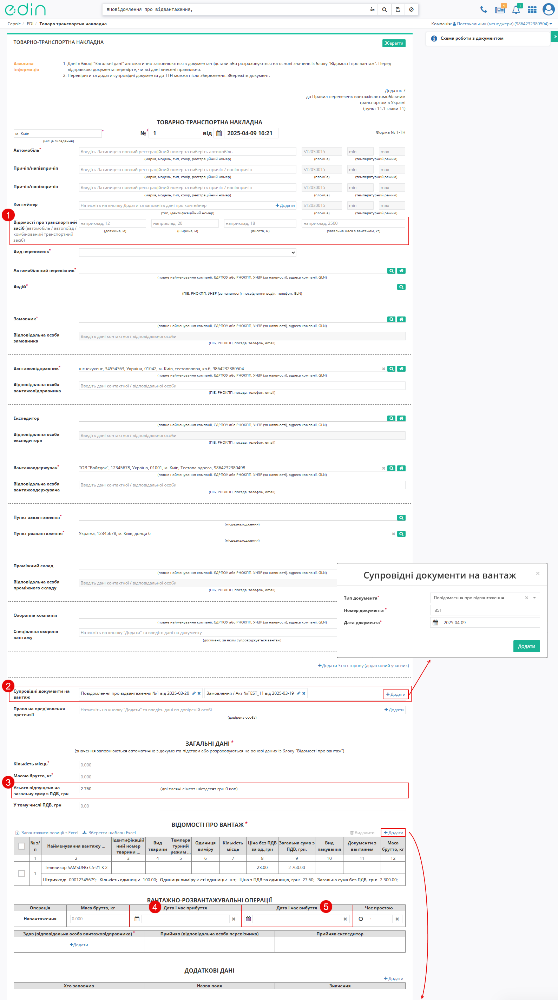
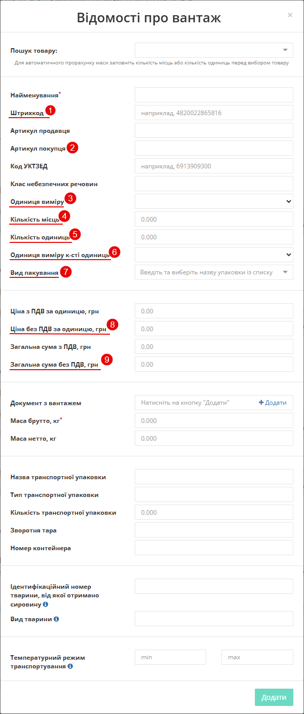
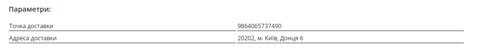
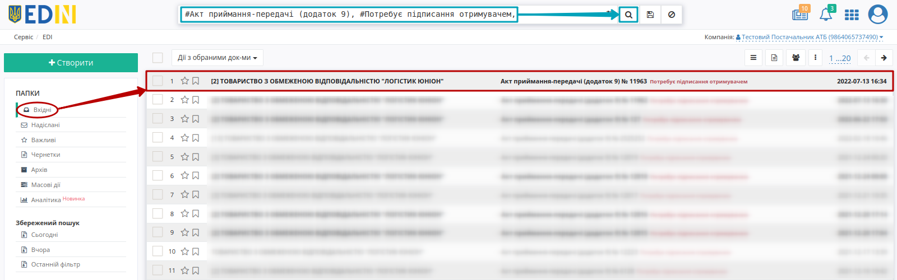

#############################################################################################################################
Документообіг з мережею "АТБ". Інструкція для Постачальника
#############################################################################################################################

.. сюда закину немного картинок для текста

.. |лупа| image:: pics_ATB_external_EDI_instruction/ATB_external_EDI_instruction_003.png

.. |будинок| image:: pics_ATB_external_EDI_instruction/ATB_external_EDI_instruction_004.png

.. role:: red

.. role:: green

.. role:: underline

.. contents:: Зміст:
   :depth: 5

---------

Вступ
====================================

Дана інструкція описує порядок документообігу з мережею "АТБ" на платформі EDI Network 2.0. В документообігу приймають участь наступні документи:

- `Замовлення (ORDER) <https://wiki.edin.ua/uk/latest/ClientProcesses/ATB/ATB_XML-structure.html#order>`__
- `Повідомлення про відвантаження (DESADV) <https://wiki.edin.ua/uk/latest/ClientProcesses/ATB/ATB_XML-structure.html#desadv>`__
- `е-ТТН <https://wiki.edin.ua/uk/latest/Docs_ETTNv3/ETTN/ETTNpage_v3.html>`__
- `Повідомлення про прийом (RECADV) <https://wiki.edin.ua/uk/latest/EDIN_Specs/XML/RECADV_x.html>`__
- `Видаткова накладна (COMDOC_006) <https://wiki.edin.ua/uk/latest/ClientProcesses/ATB/ATB_XML-structure.html#comdoc-006>`__
- `Акт приймання товару до ВН (COMDOC_035) <https://wiki.edin.ua/uk/latest/ClientProcesses/ATB/ATB_XML-structure.html#comdoc-035>`__
- `Акт приймання-передачі (додаток 8) (COMDOC_032) <https://wiki.edin.ua/uk/latest/ClientProcesses/ATB/ATB_XML-structure.html#comdoc-032>`__
- `Акт приймання-передачі (додаток 9) (COMDOC_033) <https://wiki.edin.ua/uk/latest/ClientProcesses/ATB/ATB_XML-structure.html#comdoc-033>`__
- `Акт приймання товару до АПП (COMDOC_034) <https://wiki.edin.ua/uk/latest/ClientProcesses/ATB/ATB_XML-structure.html#comdoc-034>`__

Додатково (Акти до "е-ТТН"):

* `Акт перевантаження <https://wiki.edin.ua/uk/latest/Docs_ETTNv3/RELOAD_ACT/RELOAD_ACTpage_v3.html>`__
* `Акт розбіжностей про вантаж <https://wiki.edin.ua/uk/latest/Docs_ETTNv3/DISAGREEMENT_ACT/DISAGREEMENT_ACTpage_v3.html>`__
* `Акт про заміну пункту призначення вантажу <https://wiki.edin.ua/uk/latest/Docs_ETTNv3/CONSIGNEE_CHANGE_ACT/CONSIGNEE_CHANGE_ACTpage_v3.html>`__ 
* `Акт коригування <https://wiki.edin.ua/uk/latest/Docs_ETTNv3/ADJUSTMENT_ACT/ADJUSTMENT_ACTpage_v3.html>`__

Постачальник може працювати з ТОВ "АТБ-Маркет" напряму або через логістичного оператора ТОВ "Логістик Юніон".

**Загальна схема документообігу:**

.. image:: pics_ATB_external_EDI_instruction/ATB_external_EDI_instruction_147.png
   :height: 700px
   :align: center

1. Вхід на платформу
====================================

.. include:: /general_2_0/rabota_s_platformoj_EDIN_2.0.rst
   :start-after: .. початок блоку для Enter
   :end-before: .. кінець блоку для Enter

Після успішної авторизації відкриється основне меню, де у вкладці **"Продукти та рішення"** EDIN потрібно обрати сервіс **"EDI Network"**:

.. image:: /_constant/pics_landing/landing_edi.png
   :align: center

2. Постачання товару в ТОВ "АТБ-Маркет"
=========================================================================================================================

2.1. Формування "Повідомлення про відвантаження" (DESADV). Сторона Постачальника
-----------------------------------------------------------------------------------------------------------------------------

.. початок блоку для ATB_storehouse_DESADV

Мережа "АТБ" є ініціатором документообігу: мережа надсилає документ "Замовлення" (ORDER), за яким потрібно зробити відвантаження. Документ відображається у **"Вхідних"** (для зручності можливо скористатись `пошуком <https://wiki.edin.ua/uk/latest/general_2_0/rabota_s_platformoj_EDIN_2.0.html#doc-search>`__):

Потрібно відкрити вхідне "Замовлення" (ORDER) лівою кнопкою миші та створити "Повідомлення про відвантаження" (DESADV) в блоці `ланцюжка документів <https://wiki.edin.ua/uk/latest/_constant/chain/chain.html>`__ для мережі "АТБ" за допомогою кнопки **"Створити документ"** (документ створиться автоматично):

У відкритій формі "Повідомлення про відвантаження" (DESADV) деякі поля заповнюються автоматично з пов'язаного документа-підстави (обов'язкові до заповнення поля позначені червоною зірочкою :red:`*`):

.. note::
   Документ "Повідомлення про відвантаження" (DESADV) підтримує версійність (на рівні одного `ланцюжка документів <https://wiki.edin.ua/uk/latest/_constant/chain/chain.html>`__). :red:`Якщо мережа відхиляє сформовану ТТН, необхідно переробити весь ланцюжок документів, починаючи з "Повідомлення про відвантаження" (DESADV).` При заміні документа (номер документа зберігається) потрібно збільшувати значення **"Версії"** документа на одиницю (n+1).

#. **Одержувач** - дані одержувача (мережі), компанія;
#. **Повідомлення про відвантаження №** - номер "Повідомлення про відвантаження";
#. **від** - дата "Повідомлення про відвантаження", за замовчуванням вказана поточна дата;
#. **Доставка буде проведена** - дата і час доставки;
#. **Версія** - версія документа. Числове значення вказується автоматично і не може бути меншим за версію попередніх "Повідомлень про відвантаження" (DESADV) в ланцюжку документів;
#. **Постачальник** - заповнюється автоматично або за допомогою кнопки "Пошук контрагента" (|лупа|), або за допомогою кнопки "Вказати себе" (|будинок|);
#. **Покупець** - заповнюється автоматично або за допомогою кнопки "Пошук контрагента" (|лупа|), або за допомогою кнопки "Вказати себе" (|будинок|);
#. **Місце доставки** - заповнюється автоматично або за допомогою кнопки "Пошук контрагента" (|лупа|), або за допомогою кнопки "Вказати себе" (|будинок|);
#. **За накладною №** / **від** - номер/дата накладної. :red:`Номер "первинного" документа на паперовому носії повинен співпадати з номером накладної!`

.. hint::
   За допомогою кнопки **"Пошук контрагента"** (|лупа|) або ж за допомогою кнопки **"Вказати себе"** (|будинок|) можливо вказати чи змінити дані Покупця або Постачальника. Для пошуку введіть назву компанії, GLN або ІПН:

   .. image:: pics_ATB_external_EDI_instruction/ATB_external_EDI_instruction_005.png
      :align: center

.. вирішили прибрати, але для інших інструкцій ок - Блоки **Додаткова інформація** та **Транспортування** необов'язкові для заповнення і "згорнуті" за замовчуванням. Блок **Разом** розраховується автоматично після заповнення позицій.

   .. image:: pics_ATB_external_EDI_instruction/ATB_external_EDI_instruction_026.png
      :align: center

.. important::
   **Увага!** Номер вказаної накладної повинен повністю збігатися з номером оригіналу паперової накладної.

Також повинні збігатись перелік товарних позицій (які були замовлені), їх кількість, що постачається. Система автоматично заповнює значення за позиціями з раніше відправленого документа "Замовлення", на основі якого був створений документ "Повідомлення про відвантаження" (DESADV). Можливо вносити зміни в кількість і ціну позицій.

:red:`Всі зміни за позиціями тільки після узгодження з мережею!`

.. image:: pics_ATB_external_EDI_instruction/ATB_external_EDI_instruction_018.png
   :align: center

.. attention::
   Кількість товарних позицій, що постачається не може перевищувати кількість зазначену в "Замовленні"!

Якщо по якійсь з позицій не буде поставки її необхідно відзначити галочкою і **"Видалити"**.

.. вирішили прибрати, але для інших інструкцій ок - Можливо також додати іншу позицію з Товарного довідника, заповнивши форму **Додати позицію** через кнопку **"+Додати"** (обов'язкові до заповнення поля позначені червоною зірочкою :red:`*`).

Після внесення всіх даних в документ, натисніть кнопку **"Зберегти"** (1), потім **"Відправити"** (2).

   
Відправлений документ автоматично потрапляє в папку **"Надіслані"** і буде знаходитись в ланцюжку документів разом із "Замовленням" і "Підтвердженням замовлення".

.. кінець блоку для ATB_storehouse_DESADV

2.2. Створення «е-ТТН» на підставі «Підтвердження заявки на транспортування» (TRANSPORTATIONORDER з SUBDOCTYPE = 2)
---------------------------------------------------------------------------------------------------------------------

.. include:: /ETTN_3_0/Create_ETTN_from
   :start-after: .. початок блоку для ETTN_from_Proposal_Confirmation
   :end-before: .. кінець блоку для ETTN_from_Proposal_Confirmation

2.3. Формування "е-ТТН" на підставі "Повідомлення про відвантаження" (DESADV). Сторона Постачальника
-----------------------------------------------------------------------------------------------------------------------------

При роботі з транспортними документами передбачені 4 основні ролі учасників документообігу: **"Замовник"**, **"Вантажовідправник"**, **"Перевізник"**, **"Вантажоодержувач"**. Ініціатором документообігу "е-ТТН" виступає **"Вантажовідправник" (Постачальник)**.

.. attention::
   1. Акти завантаження/розвантаження на проміжному складі не використовуються.
   
      Мережа "АТБ" наразі не використовує типи актів:
         * Акт розвантаження на проміжному складі
         * Акт завантаження на проміжному складі
         * Акт перевантаження

   2. Обов’язкове заповнення GLN.
   
      У всіх документах має бути вказано GLN (Глобальний Локальний Номер):
         * Для кожної компанії (відправник, одержувач тощо)
         * Для кожної локації навантаження та розвантаження

   3. Паспорт замість РНОКПП (ІПН) не приймається.
   
      На даний момент технічно не реалізовані сценарії роботи з учасниками документоббігу що не мають РНОКПП (ІПН). Документи в котрих буде зазначатись ПАСПОРТ як ідентифікатор компанії чи відповідальної особи будуть потрапляти в помилки. 

   4. Створення ТТН – лише на підставі одного повідомлення.
   
      Формувати ТТН дозволяється виключно на основі одного повідомлення про відвантаження.

   5. Повна інформація про компанію.
   
      У документах має бути:
         * Повна назва компанії (згідно з ЄДР)
         * Форма власності (ТОВ, ПП, ФОП тощо) - повна назва
   
   6. Вся інформація має відповідати GLN від мережі АТБ.
   
      Інформація про локації (магазини, РЦ, склади тощо) повинна точно відповідати даним GLNа, які належать та викорисовуютсья мережею.

   7. Обовʼязкове заповнення ролі “Замовник” і адрес компаній.
   
      У документі має бути:
         * Вказана роль “Замовник”
         * Вказані фізичні адреси всіх компаній-учасників

   8. Підписує документи тільки Водій (не Перевізник).
   
      Усі документи повинні обовязково бути підписані Водієм, який здійснює перевезення (зазначений в тілі документа).

   9. Тільки дозволені супровідні документи.
   
      У складі блоку супровідні документи на вантаж допускаються лише ті документи, що наведені в офіційній інструкції.

   10. Обов’язкове заповнення УНЗР (за наявності).
   
      Якщо у фізичної особи є унікальний номер запису в реєстрі (УНЗР) — його обов’язково потрібно вказати у відповідних полях документа.

Для створення **"е-ТТН"** на підставі **"Повідомлення про відвантаження"** (DESADV) в сервісі **"EDI Network"** Вантажовідправнику потрібно відкрити папку **"Надіслані"** та відфільтрувати "Повідомлення про відвантаження" в журналі документів . 
Після чого оберіть відповідне **"Повідомлення про відвантаження"** в журналі документів. 

У відкритому документі натисніть **"Створити документ"** в блоці `ланцюжка документів <https://wiki.edin.ua/uk/latest/_constant/chain/chain.html>`__ "Товарно-транспортна накладна"(ETTN).

Після цього відкриється форма редагування документа **"е-ТТН"**, яка буде частково заповнена на підставі даних з документа **"Повідомлення про відвантаження"**.

Дані, що переносяться з документа-підстави, доступні для перегляду та редагування.

::

      Додаткові поля, які обов'язкові для заповненя при роботі з мережою "АТБ":
         1. "Відомості про таранспортний засіб (автомобіль/автопоїзд/комбінованиий транспортний засіб)":
            - (довжина, м) - загальна довжина автопоїзда від переднього бампера автомобіля до заднього бампера причепа або напівпричепа останнього в складі автопоїзда;
            - (ширина, м) - найбільше значення ширини автопоїзда;
            - (висота, м) - найбільше значення висоти автопоїзда;
            - (загальна маса з вантажем, кг) - загальна маса вантажу та транспортних засобів.
  
         2. "Супровідні документи на вантаж" - додаються в модальному вікні після натискання на кнопку "+ Додати":      
            -  "220" - "Замовлення" (обов'язково);
            -  "351" - "Повідомлення про відвантаження" (обов'язково);
            -  "335" - "Заявка на транспортування" (за наявності);
            -  "441" - "Маршрутний лист" (за наявності);
            -  "770" - "Підтвердження заявки на транспортування" (за наявності);
            -  "916" - "Коригуючі Акти до ТТН" (додаються автоматично при наявності).

         ЗАГАЛЬНІ ДАНІ
         3. "Усього відпущенно на загальну суму з ПДВ, грн";
   
         ВІДОМОСТІ ПРО ВАНТАЖ
         В модальному вікні "Відомості про вантаж", що відкривається після натискання на кнопку "+ Додати":
            1. "Штрихкод";
            2. "Артикул покупця";
            3. "Артикул продавця";
            4. "Код УКТЗЕД";
            5. "Одиниця виміру";
            6. "Кількість місць";
            7. "Кількість одиниць";
            8. "Одиниця виміру к-сті одиниць";
            9. "Вид пакування";
            10. "Ціна без ПДВ за одиницю, грн";
            11. "Загальна сума без ПДВ, грн";
            12. "Назва транспортної упаковки".

         ВАНТАЖНО-РОЗВАНТАЖУВАЛЬНІ ОПЕРАЦІЇ
         4. "Дата і час прибуття";
         5. "Дата і час вибуття".

Після редагування або доповнення форми "е-ТТН" документ можна **"Зберегти"**, **"Підписати"** та **"Надіслати"**. 
Процес підписання на платформі описан в `інструкції <https://wiki.edin.ua/uk/latest/ClientProcesses/ATB/ATB_Instructions/ATB_external_EDI_instruction_post.html#edin-2-0>`__.

.. початок блоку для work_with_acts

Документообіг **"е-ТТН"** передбачає поетапне внесення змін і підписання документа кожним учасником процесу.

Під час документообігу **"е-ТТН"** з мережею "АТБ" також можуть створюватися Акти до "е-ТТН", які потребують Вашої участі. 
Перелік інструкцій із роботи з Актами описано в окремій `інструкції <https://wiki.edin.ua/uk/latest/ETTN_3_0/ETTN_3_0_list.html#comdoc-037>`__.

.. кінець блоку для work_with_acts

.. note::
   У разі, якщо мережа "АТБ" не підписала документ, необхідно:
         
   * переглянути зміст помилки та виконати рекомендовані дії (див. Інструкцію для постачальника від мережі);
   * за потреби — повторно створити весь ланцюжок документів, починаючи з **«Повідомлення про відвантаження» (DESADV)**.
   
   Під час заміни документа (із збереженням його номера) слід збільшити значення поля **«Версія»** на одиницю — (n + 1).

   .. image:: pics_ATB_external_EDI_instruction/ATB_external_EDI_instruction_152.png
      :align: center

   .. image:: pics_ATB_external_EDI_instruction/ATB_external_EDI_instruction_153.png
      :align: center

2.4. Формування "Видаткової накладної" (COMDOC_006). Сторона Постачальника
-----------------------------------------------------------------------------------------------------------------------------

Перед початком роботи з **"Видатковою накладною"** необхідно заповнити всі реквізити, які будуть відображатися в документі з боку Постачальника (детальніше про `налаштування GLN <https://wiki.edin.ua/uk/latest/Personal_Cabinet/PCInstruction.html#gln-main>`__ та `налаштування компанії <https://wiki.edin.ua/uk/latest/Personal_Cabinet/PCInstruction.html#company>`__ за посиланнями).

.. important::
   Зверніть увагу, що реквізити заповнюються українською мовою і повинні відповідати інформації в реєстраційних документах компанії.

Для формування "Видаткової накладної" (COMDOC_006) потрібно у папці **"Надіслані"** обрати "Повідомлення про відвантаження" (DESADV). Для зручності можливо скористатись `пошуком <https://wiki.edin.ua/uk/latest/general_2_0/rabota_s_platformoj_EDIN_2.0.html#doc-search>`__:

.. image:: pics_ATB_external_EDI_instruction/ATB_external_EDI_instruction_022n.png
   :align: center

Для формування "Видаткової накладної" (COMDOC_006) в блоці `ланцюжка документів <https://wiki.edin.ua/uk/latest/_constant/chain/chain.html>`__ для мережі "АТБ" натисніть **"Створити документ"** (документ створиться автоматично):

.. note::
   Якщо в даній "гілці поставки" даний тип документа ("Видаткова накладна" (COMDOC_006)) вже є в **Чернетках**, то новий документ не створиться - до редагування відкриється документ-чернетка!  

У відкритій формі "Видаткової накладної" (COMDOC_006) деякі поля заповнюються автоматично з пов'язаного документа-підстави (обов'язкові до заповнення поля позначені червоною зірочкою :red:`*`):

.. image:: pics_ATB_external_EDI_instruction/ATB_external_EDI_instruction_024n.png
   :align: center

.. note::
   Документ "Видаткова накладна" (COMDOC_006) підтримує версійність (на рівні одного `ланцюжка документів <https://wiki.edin.ua/uk/latest/_constant/chain/chain.html>`__). :red:`Якщо мережа відхиляє сформовану ТТН, необхідно переробити весь ланцюжок документів, починаючи з "Повідомлення про відвантаження" (DESADV).` При заміні документа (номер документа зберігається) потрібно збільшувати значення **"Версії"** документа на одиницю (n+1).

#. **Видаткова накладна №** - номер "Видаткової накладної";
#. **від** - дата "Видаткової накладної", за замовчуванням вказана поточна дата;
#. **"Повідомлення про відвантаження №"** - номер "Повідомлення про відвантаження";
#. **від** - дата "Повідомлення про відвантаження";
#. **На замовлення №** - номер "Замовлення";
#. **від** - дата "Замовлення";
#. **Версія** - версія "Видаткової накладної".

.. include:: /retail_2.0/formirovanie_otpravka_dokumenta_Vydatkova_Nakladna_na_EDI_Network_2.0.rst
   :start-after: .. початок блоку для ForAllCOMDOC_006/032/037
   :end-before: .. кінець блоку для ForAllCOMDOC_006/032/037

.. hint::
   Блоки даних контрагентів (Відправника і Замовника) заповнюються автоматично. За допомогою кнопки **"Редагувати"** ці дані можливо замінити вручну (обов'язкові до заповнення поля позначені червоною зірочкою :red:`*`):

   .. image:: pics_ATB_external_EDI_instruction/ATB_external_EDI_instruction_025n.png
      :align: center

   Блоки згортаються за допомогою кнопки **"Сховати"**:

   .. image:: pics_ATB_external_EDI_instruction/ATB_external_EDI_instruction_026n.png
      :align: center

Змінити дані Замовника можливо також за допомогою **"Пошуку"**, вказавши назву компанії, GLN або ІПН:

.. image:: pics_ATB_external_EDI_instruction/ATB_external_EDI_instruction_027.png
   :align: center

Також можливо **Додати нового контрагента**, наприклад, Платника або Перевізника. При додаванні контрагента потрібно обрати роль контрагента із випадаючого списку (1) і натиснути на зелену кнопку **"+"** (2). Новий блок дозволяє здійснити пошук контрагента (3) за назвою компанії, GLN, ІПН:

Блок **Місце доставки** заповнюється автоматично з документа підстави:

.. important::
   Зверніть увагу: значення полів "Вулиця", "Місто", "Область" повинні відповідати (бути ідентичними) `налаштуванням вказаного GLN <https://wiki.edin.ua/uk/latest/Personal_Cabinet/PCInstruction.html#gln-main>`__ 

   .. image:: pics_ATB_external_EDI_instruction/ATB_external_EDI_instruction_120.png
      :align: center

В блоці **Параметрів** обов'язкові **Параметри** доставки - "Точка доставки" та "Адреса доставки" автоматично заповнюється значеннями відповідно до заповненого блоку **Місце доставки**:

Блок **Результат** вираховується з табличної частини і містить загальну інформацію за товарними позиціями:

Алгоритм розрахунку суми накладної:

1. Закупівельна ціна без ПДВ з двома знаками після коми множиться на кількість;
2. Отримана сума без ПДВ округляється до двох знаків після коми (Допустиме округлення: 0,5коп на одиницю товару);
3. Підсумкова сума без ПДВ розраховується шляхом підсумовування сум без ПДВ всіх рядків документа;
4. Підсумкова сума без ПДВ множиться на ставку ПДВ товару в документі- отримуємо суму ПДВ по документу (Допустиме округлення: 1коп);
5. Підсумкова сума з ПДВ документа розраховується як сума підсумкової суми без ПДВ і суми ПДВ.

Блок табличної частини з переліком позицій заповнюються автоматично з документа-основи DESADV (поля **№**, **Найменування**, **Штрихкод**, **Базова ціна**, **ПДВ за од. продукції**, **Ціна**, **Кількість**, **Артикул покупця**, **Сумма без ПДВ**, **Сумма з ПДВ**) та з товарного довідника (поля **Од. Вим.**, **Артикул продавця**, **Код УКТЗЕД**). 

Можливо вносити зміни в кількість, ціну позицій та відсоток ставки ПДВ.

:red:`Всі зміни за позиціями тільки після узгодження з мережею!`

.. image:: pics_ATB_external_EDI_instruction/ATB_external_EDI_instruction_033.png
   :align: center

.. attention::
   Кількість товарних позицій, що постачається не може перевищувати кількість зазначену в "Замовленні"!

Після внесення всіх даних в документ, натисніть кнопку **"Зберегти"** (1) та **"Підписати"** (2):

.. image:: pics_ATB_external_EDI_instruction/ATB_external_EDI_instruction_034.png
   :align: center

Після збереження документ потрапляє в папку **"Чернетки"**:

.. hint::
   Процес підписання на платформі описаний в окремому розділі за `посиланням <https://wiki.edin.ua/uk/latest/ClientProcesses/ATB/ATB_Instructions/ATB_external_EDI_instruction_post.html#sign>`__.

.. error::
   На платформі EDIN 2.0 здійснюються перевірки документів на валідність КЕП, на приналежність власника сертифіката КЕП зазначеному підприємству, перевірки на коректність заповнення документа і відповідність один одному в рамках одного пакета документів. Постачальнику відправляється квитанція про результати перевірки і в разі помилки статус файл з повідомленням:

   * помилок не виявлено
   * перевищення кількості
   * товар відсутній в повідомленні про відвантаження
   * помилка ціни
   * помилка дати поставки
   * помилка ставки ПДВ
   * помилка суми без ПДВ
   * помилка суми ПДВ
   * помилка суми з ПДВ
   * невідповідний  договір
   * помилка назви постачальника
   * помилка назви перевізника
   * помилка назви покупця
   * невід. ЄДРПОУ постачальника
   * невід. ЄДРПОУ перевізника
   * невід. ЄДРПОУ покупця
   * помилка юридичної адреси покупця
   * в повідомленні про відвантаження вказана схема постачання через відповідальне зберігання
   * помилка дати документа
   * товари не збігаються з повідомленням про відвантаження
   * помилка адреси місця поставки
   * помилка дати договору
   * документ не відповідає договору постачання
   * постачальник не є платником ПДВ
   * в документі є товари з різними ставками ПДВ

Підписаний документ можливо **"Відправити"**:

Відправлений документ автоматично потрапляє в папку **"Надіслані"** зі статусом "Потребує підписання отримувачем":

Доступне **Відкликання підпису** - COMDOC_021 квитанція №14 (`детальніше <https://wiki.edin.ua/uk/latest/ClientProcesses/ATB/ATB_Instructions/ATB_external_EDI_instruction_post.html#revoke>`__).

.. warning::
   Після оприбуткування товару в обліковій системі складу, якщо кількість поставленого товару відповідає кількості DESADV і дата переходу права власності в COMDOC_006 відповідає фактичній даті приймання товару, приймальник складу мережі ТОВ "АТБ-Маркет" накладає КЕП на Видаткову накладну (COMDOC_006).

   У разі якщо кількісно-цінові значення в позиціях в документі розходяться з фактичними, то мережа "АТБ" формує у відповідь "Акт приймання товару до ВН" - COMDOC_035 (детальніше у наступному підрозділі).

2.5. Отримання "Повідомлення про прийом" (RECADV). Сторона Постачальника
-----------------------------------------------------------------------------------------------------------------------------

Мережа "АТБ" може відправити "Повідомлення про прийом" (RECADV). Документ можливо знайти в `ланцюжку документів <https://wiki.edin.ua/uk/latest/_constant/chain/chain.html>`__ чи скориставшись `пошуком <https://wiki.edin.ua/uk/latest/general_2_0/rabota_s_platformoj_EDIN_2.0.html#doc-search>`__ у папці **"Вхідні"**:

"Повідомлення про прийом" (RECADV) використовується для оповіщення постачальників про прийом товарів. 

.. attention::
   Даний документ при роботі з мережею "АТБ" також відіграє відіграє ключову роль в контролі зобов'язань своєчасної поставки згідно заключеного договору з Постачальниками (передбачені штрафні санкції): 

2.6. Отримання і підписання "Акта приймання товару до ВН" (COMDOC_035). Сторона Постачальника
-----------------------------------------------------------------------------------------------------------------------------

Після того, як мережа "АТБ" сформувала "Акт приймання товару до ВН" (COMDOC_035), його потрібно затвердити підписанням. Для цього у папці **"Вхідні"** потрібно знайти і відкрити акт, що потребує підписання (документ в статусі "Поребує підписання отримувачем"):

В відкритій формі документа можливо ознайомитись з відхиленнями в табличній частині:

.. image:: pics_ATB_external_EDI_instruction/ATB_external_EDI_instruction_109.png
   :align: center

.. attention::
   Для того аби мережа "АТБ" підписала "Видаткову накладну" (COMDOC_006) потрібно узгодити (підписати) "Акт приймання товару до ВН" (COMDOC_035)!

"Акт приймання товару до ВН" (COMDOC_035) можливо **"Підписати і відправити у відповідь"**:

.. image:: pics_ATB_external_EDI_instruction/ATB_external_EDI_instruction_111.png
   :align: center

.. hint::
   Процес підписання на платформі описаний в окремому розділі за `посиланням <https://wiki.edin.ua/uk/latest/ClientProcesses/ATB/ATB_Instructions/ATB_external_EDI_instruction_post.html#sign>`__.

Після того, як обидві сторони підписали "Акт приймання товару до ВН" (COMDOC_035) мережа "АТБ" може підписати "Видаткову накладну" (COMDOC_006).

3. Постачання товару в ТОВ "АТБ-Маркет" з поставкою через логістичного оператора ТОВ "Логістик Юніон"
=========================================================================================================================

.. note::
   Ця частина інструкції призначена лише для Постачальників, що працюють через ТОВ "Логістик Юніон"!

.. початок блоку для LU_only

3.1. Формування "Акта приймання-передачі (додаток 8)" (COMDOC_032). Сторона Постачальника
-----------------------------------------------------------------------------------------------------------------------------

Перед початком роботи з **"Актом приймання-передачі (додаток 8)"** необхідно заповнити всі реквізити, які будуть відображатися в документі з боку Постачальника (детальніше про `налаштування GLN <https://wiki.edin.ua/uk/latest/Personal_Cabinet/PCInstruction.html#gln-main>`__ та `налаштування компанії <https://wiki.edin.ua/uk/latest/Personal_Cabinet/PCInstruction.html#company>`__ за посиланнями).

Для формування "Акта приймання-передачі (додаток 8)" (COMDOC_032) потрібно у папці **"Надіслані"** обрати "Повідомлення про відвантаження" (DESADV). Для зручності можливо скористатись `пошуком <https://wiki.edin.ua/uk/latest/general_2_0/rabota_s_platformoj_EDIN_2.0.html#doc-search>`__:

.. image:: pics_ATB_external_EDI_instruction/ATB_external_EDI_instruction_022n.png
   :align: center

Для формування "Акта приймання-передачі (додаток 8)" (COMDOC_032) в блоці `ланцюжка документів <https://wiki.edin.ua/uk/latest/_constant/chain/chain.html>`__ для мережі "АТБ" натисніть **"Створити документ"** (документ створиться автоматично):

.. note::
   Якщо в даній "гілці поставки" даний тип документа ("Акт приймання-передачі (додаток 8)" (COMDOC_032)) вже є в **Чернетках**, то новий документ не створиться - до редагування відкриється документ-чернетка!  

У відкритій формі "Акта приймання-передачі (додаток 8)" (COMDOC_032) деякі поля заповнюються автоматично з пов'язаного документа-підстави (обов'язкові до заповнення поля позначені червоною зірочкою :red:`*`):

.. image:: pics_ATB_external_EDI_instruction/ATB_external_EDI_instruction_143.png
   :align: center

.. note::
   Документ "Акт приймання-передачі (додаток 8)" (COMDOC_032) підтримує версійність (на рівні одного `ланцюжка документів <https://wiki.edin.ua/uk/latest/_constant/chain/chain.html>`__). :red:`Якщо мережа відхиляє сформовану ТТН, необхідно переробити весь ланцюжок документів, починаючи з "Повідомлення про відвантаження" (DESADV).` При заміні документа (номер документа зберігається) потрібно збільшувати значення **"Версії"** документа на одиницю (n+1).

#. **Акт приймання-передачі (додаток 8) №** - номер "Акта приймання-передачі (додаток 8)";
#. **від** - дата "Акта приймання-передачі (додаток 8)", за замовчуванням вказана поточна дата;
#. **"Повідомлення про відвантаження №"** - номер "Повідомлення про відвантаження";
#. **від** - дата "Повідомлення про відвантаження";
#. **На замовлення №** - номер "Замовлення";
#. **від** - дата "Замовлення";
#. **Версія** - версія "Акта приймання-передачі (додаток 8)".

.. include:: /retail_2.0/formirovanie_otpravka_dokumenta_Vydatkova_Nakladna_na_EDI_Network_2.0.rst
   :start-after: .. початок блоку для ForAllCOMDOC_006/032/037
   :end-before: .. кінець блоку для ForAllCOMDOC_006/032/037

Блоки даних контрагентів (**Замовника** і **Виконавця**) частково заповнюються автоматично. Блок **Замовника** (відправника) містить додаткові обов'язкові до заповнення поля (позначені червоною зірочкою :red:`*`):

.. початок блоку для Prizvusche

.. hint::
   Якщо Ви вже раніше відправляли подібні документи, то в полі "Прізвище" у Вас буде можливість обрати відповідального співробітника (його дані підтягнуться автоматично) або ж **"Додати"** нове прізвище (після відправки документа дані відповідального співробітника зберігаються автоматично):

   .. image:: /ClientProcesses/ATB/ATB_Instructions/pics_ATB_external_EDI_instruction/ATB_external_EDI_instruction_142.gif
      :align: center

.. кінець блоку для Prizvusche

Після того, як всі обов'язкові дані будуть заповнені блоки можливо згорнути за допомогою кнопки **"Сховати"**. Блок **Виконавця** автоматично заповнюється даними компанії "Логістик Юніон".

Також можливо **Додати нового контрагента**, наприклад, Платника або Перевізника. При додаванні контрагента потрібно обрати роль контрагента із випадаючого списку (1) і натиснути на зелену кнопку **"+"** (2). Новий блок дозволяє здійснити пошук контрагента (3) за назвою компанії, GLN, ІПН:

Блок **Місце доставки** є обов'язковим до заповнення: 

.. important::
   Зверніть увагу: значення полів "Вулиця", "Місто", "Область" повинні відповідати (бути ідентичними) `налаштуванням вказаного GLN <https://wiki.edin.ua/uk/latest/Personal_Cabinet/PCInstruction.html#gln-main>`__ 

   .. image:: pics_ATB_external_EDI_instruction/ATB_external_EDI_instruction_120.png
      :align: center

В блоці **Параметрів** обов'язкові **Параметри** доставки - "Точка доставки" та "Адреса доставки" автоматично заповнюється значеннями відповідно до заповненого блоку **Місце доставки**:

Блок **Результат** вираховується з табличної частини і містить загальну інформацію за товарними позиціями. Блок табличної частини з переліком позицій заповнюються автоматично з документа-основи DESADV. Можливо вносити зміни в дані позиції (кількість, базову ціну позицій та відсоток ставки ПДВ).

:red:`Всі зміни за позиціями тільки після узгодження з мережею!`

.. attention::
   Кількість товарних позицій, що постачається не може перевищувати кількість зазначену в "Замовленні"!

Після внесення всіх даних в документ, натисніть кнопку **"Зберегти"** (1) та **"Підписати"** (2):

.. image:: pics_ATB_external_EDI_instruction/ATB_external_EDI_instruction_047.png
   :align: center

Після збереження документ потрапляє в папку **"Чернетки"**.

.. hint::
   Процес підписання на платформі описаний в окремому розділі за `посиланням <https://wiki.edin.ua/uk/latest/ClientProcesses/ATB/ATB_Instructions/ATB_external_EDI_instruction_post.html#sign>`__ .

Підписаний документ можливо **"Відправити"**:

.. image:: pics_ATB_external_EDI_instruction/ATB_external_EDI_instruction_048.png
   :align: center

Відправлений документ автоматично потрапляє в папку **"Надіслані"** зі статусом "Потребує підписання отримувачем":

Доступне **Відкликання підпису** - COMDOC_021 квитанція №14 (`детальніше <https://wiki.edin.ua/uk/latest/ClientProcesses/ATB/ATB_Instructions/ATB_external_EDI_instruction_post.html#revoke>`__).

3.2. Отримання і підписання "Акта приймання товару до АПП" (COMDOC_034). Сторона Постачальника
-----------------------------------------------------------------------------------------------------------------------------

Після того, як компанія "Логістик Юніон" сформувала "Акт приймання товару до АПП" (COMDOC_034), його потрібно затвердити підписанням. Для цього у папці **"Вхідні"** потрібно знайти і відкрити акт, що потребує підписання (документ в статусі "Потребує підписання отримувачем"):

В відкритій формі документа можливо ознайомитись з відхиленнями в табличній частині:

.. attention::
   Для того аби компанія "Логістик Юніон" підписала "Акт приймання-передачі (додаток 8)" (COMDOC_032) потрібно узгодити (підписати) "Акт приймання товару до АПП" (COMDOC_034)!

"Акта приймання товару до АПП" (COMDOC_034) можливо **"Підписати і відправити у відповідь"**:

.. hint::
   Процес підписання на платформі описаний в окремому розділі за `посиланням <https://wiki.edin.ua/uk/latest/ClientProcesses/ATB/ATB_Instructions/ATB_external_EDI_instruction_post.html#sign>`__ .

Після того, як обидві сторони підписали "Акт приймання товару до АПП" (COMDOC_034) компанія "Логістик Юніон" може підписати "Акт приймання-передачі (додаток 8)" (COMDOC_032), як це описано в `інструкції для мережі <https://wiki.edin.ua/uk/latest/ClientProcesses/ATB/ATB_Instructions/ATB_external_EDI_instruction_net.html#to033>`__.

3.3. Отримання "Акта приймання-передачі (додаток 9)" (COMDOC_033). Сторона Постачальника
-----------------------------------------------------------------------------------------------------------------------------

Після того, як компанія "Логістик Юніон" сформувала "Акт приймання-передачі (додаток 9)" (COMDOC_033), його потрібно затвердити підписанням. Для цього у папці **"Вхідні"** потрібно знайти і відкрити акт, що потребує підписання (документ в статусі "Потребує підписання отримувачем"):

Відкритий "Акт приймання-передачі (додаток 9)" (COMDOC_033) можливо **"Підписати і відправити у відповідь"**:

.. hint::
   Процес підписання на платформі описаний в окремому розділі за `посиланням <https://wiki.edin.ua/uk/latest/ClientProcesses/ATB/ATB_Instructions/ATB_external_EDI_instruction_post.html#sign>`__ .

Документообіг завершено.

------------------------------------------------------

.. _sign:

Підписання на платформі EDIN 2.0
=========================================================================================================================

.. warning::
   У відправника під час підписання діє перевірка на **відповідність ІПН / ЄДРПОУ підпису  підпису та даних відповідальної особи**:
   
   .. image:: /_constant/atb_check/atb_check_002.png
      :align: center

.. include:: /_constant/atb_check/atb_check.rst
   :start-after: .. початок блоку для ATB_check
   :end-before: .. кінець блоку для ATB_check

.. tabs::

   .. tab:: Файловий ключ

      .. include:: /_constant/signing/signing.rst
         :start-after: .. початок блоку для Signing
         :end-before: .. кінець блоку для Signing

   .. tab:: Token

      .. include:: /_constant/token_signing/token_signing.rst
         :start-after: .. початок блоку для TokenSign
         :end-before: .. кінець блоку для TokenSign

   .. tab:: Гряда

      .. include:: /_constant/gryada_signing/gryada_signing.rst
         :start-after: .. початок блоку для GryadaSign
         :end-before: .. кінець блоку для GryadaSign

   .. tab:: Cloud

      .. include:: /_constant/cloud_signing/cloud_signing.rst
         :start-after: .. початок блоку для CloudSign
         :end-before: .. кінець блоку для CloudSign

------------------------------------------------------

.. _revoke:

Відкликання підпису комерційних документів (COMDOC)
=========================================================================================================================

.. include:: /_constant/comdoc_revoke/comdoc_revoke.rst
   :start-after: .. початок блоку для Comdoc_Revoke
   :end-before: .. кінець блоку для Comdoc_Revoke

------------------------------------------------------

.. _repeal:

Анулювання підписаних комерційних документів (COMDOC)
=========================================================================================================================

.. include:: /_constant/comdoc_repeal/comdoc_repeal.rst
   :start-after: .. початок блоку для Comdoc_Repeal
   :end-before: .. кінець блоку для Comdoc_Repeal

.. _repeal-accept:

Підтвердження запиту на анулювання комерційного документа (COMDOC)
------------------------------------------------------------------------------------------------------------
.. include:: /_constant/comdoc_repeal_accept/comdoc_repeal_accept.rst
   :start-after: .. початок блоку для Comdoc_RepealAccept
   :end-before: .. кінець блоку для Comdoc_RepealAccept

.. _repeal-reject:

Відмова від анулювання комерційних документів (COMDOC)
------------------------------------------------------------------------------------------------------------

.. include:: /_constant/comdoc_repeal_reject/comdoc_repeal_reject.rst
   :start-after: .. початок блоку для Comdoc_RepealReject
   :end-before: .. кінець блоку для Comdoc_RepealReject

------------------------------------------------------

.. _reject:

Відмова від підписання комерційних документів (COMDOC)
=========================================================================================================================

.. include:: /_constant/comdoc_reject/comdoc_reject.rst
   :start-after: .. початок блоку для Comdoc_Reject
   :end-before: .. кінець блоку для Comdoc_Reject

.. кінець блоку для LU_only

------------------------------------------------

.. include:: /_constant/kontakti.rst
