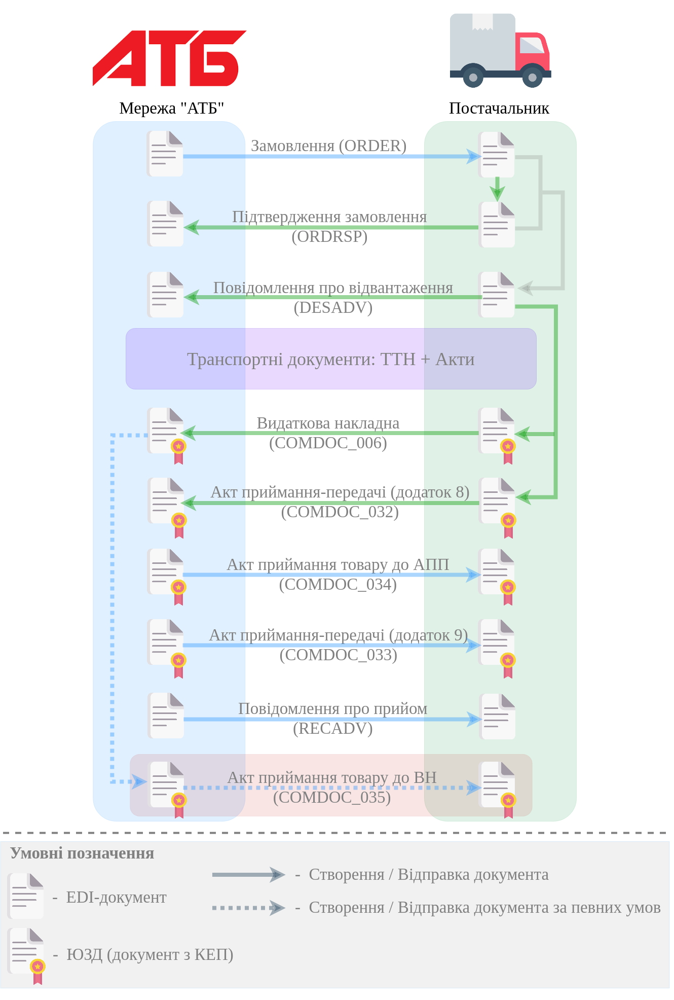

XML Специфікації для роботи з "АТБ"
####################################

.. contents:: Зміст:

---------

.. hint::
  API по `роботі з квитанціями COMDOC <https://wiki.edin.ua/uk/latest/integration_2_0/APIv2/APIv2_list.html#id4>`__ документів!

---------

**XML специфікації електронних документів**

У специфікаціях представлено опис полів XML-документів, які застосовуються в електронному обміні даними при роботі з мережею "АТБ" на платформі EDIN за схемою:

---------------------------------------------------------

.. початок блоку для International_transportation_specs1

Замовлення (ORDER)
==========================

.. csv-table:: Замовлення (ORDER) на поставку відправляє покупець постачальнику, вказуючи штрих-код продукту, його опис, замовлену кількість, ціну та іншу необхідну інформацію.
  :file: ATB_XML/files/ORDER.csv
  :widths:  20, 7, 29, 37
  :header-rows: 1

:download:`XML-Приклад ORDER</ClientProcesses/ATB/ATB_XML/examples/ORDERS_example.xml>`

:download:`JSON-Приклад ORDER</ClientProcesses/ATB/ATB_XML/examples/ORDERS.json>`

---------

Підтвердження замовлення (ORDRSP)
========================================

.. csv-table:: Підтвердження замовлення (ORDRSP) відправляється у відповідь на прийнятий документ Замовлення (ORDER). Основною особливістю Підтвердження замовлення є уточнення про постачання по кожній товарній позиції: чи буде товар доставлений; чи змінилася кількість/ціна чи буде відмова від поставки товарної позиції
  :file: ATB_XML/files/ORDRSP.csv
  :widths:  40, 7, 12, 41
  :header-rows: 1

:download:`XML-Приклад ORDRSP</ClientProcesses/ATB/ATB_XML/examples/ORDRSP_example.xml>`

:download:`JSON-Приклад ORDRSP</ClientProcesses/ATB/ATB_XML/examples/ORDRSP.json>`

---------

Повідомлення про відвантаження (DESADV)
===============================================

.. csv-table:: **Повідомлення про відвантаження (DESADV)** відправляє постачальник у відповідь на **Замовлення (ORDER)**. При цьому постачальник може змінити кількість замовлених товарних позицій, що поставляються, дату і час поставки, додаткові відомості. Даний документ є аналогом товарно-транспортної накладної (ТТН)
  :file: ATB_XML/files/DESADV.csv
  :widths:  20, 7, 29, 37
  :header-rows: 1

:download:`XML-Приклад DESADV</ClientProcesses/ATB/ATB_XML/examples/DESADV_example.xml>`

:download:`JSON-Приклад DESADV</ClientProcesses/ATB/ATB_XML/examples/DESADV.json>`

.. кінець блоку для International_transportation_specs1

---------

Транспортні документи: ТТН + Акти
================================================================================

.. raw:: html

    <embed>
    <iframe src="https://docs.google.com/spreadsheets/d/e/2PACX-1vSrSft75XLCHJK-EsFJsq_rSCmhiwaX1pkEvqxXROD6rVTh2fbdd2pmr1TmYeNjRA/pubhtml?gid=330971859&single=true" width="1145" height="13430" frameborder="0" marginheight="0" marginwidth="0">Loading...</iframe>
    </embed>

:download:`ТТН, XML-Приклад<ATB_XML/examples/ttn.xml>`

:download:`Обов'язкові поля ТТН, XML-Приклад<ATB_XML/examples/required_fields.xml>`

:download:`ТТН, JSON-Приклад<ATB_XML/examples/ttn.json>`

:download:`Обов'язкові поля ТТН, JSON-Приклад<ATB_XML/examples/required_fields.json>`

-------------------------

Акт приймання товару до ВН (COMDOC_035)
================================================================================

.. csv-table:: Акт приймання товару до Видаткової Накладної (COMDOC_035)
  :file: ATB_XML/files/COMDOC_035.csv
  :widths:  20, 11, 29, 37
  :header-rows: 1

:download:`XML-Приклад COMDOC_035<ATB_XML/examples/COMDOC_035.xml>`

---------

Видаткова накладна (COMDOC_006)
================================================================================

.. csv-table:: Видаткова накладна (COMDOC_006)
  :file: ATB_XML/files/COMDOC_006.csv
  :widths:  20, 11, 29, 37
  :header-rows: 1

:download:`XML-Приклад COMDOC_006<ATB_XML/examples/COMDOC_006.xml>`

:download:`JSON-Приклад COMDOC_006<ATB_XML/examples/COMDOC_006_.json>`

---------

Анулювання (COMDOC_019)
================================================================================

.. csv-table:: Анулювання (COMDOC_019)
  :file: ATB_XML/files/COMDOC_019.csv
  :widths:  20, 11, 29, 37
  :header-rows: 1

:download:`XML-Приклад COMDOC_019<ATB_XML/examples/comdoc_019_anuluvannya.xml>`

:download:`JSON-Приклад COMDOC_019<ATB_XML/examples/COMDOC_019.json>`

---------

Повідомлення про відмову від підписання документу (квитанція №13) / Повідомлення про відклик підпису (квитанція №14) (COMDOC_021)
================================================================================================================================================================

.. csv-table:: Повідомлення про відмову від підписання документу (квитанція №13) / Повідомлення про відклик підпису (квитанція №14) (COMDOC_021)
  :file: ATB_XML/files/COMDOC_021.csv
  :widths:  20, 11, 29, 37
  :header-rows: 1

:download:`XML-Приклад COMDOC_021 - відмова від підписання<ATB_XML/examples/comdoc_021_otkaz+.xml>`

:download:`XML-Приклад COMDOC_021 - відклик підпису<ATB_XML/examples/comdoc_021_otziv+.xml>`

---------

Акт приймання-передачі (додаток 8) (COMDOC_032)
================================================================================

.. csv-table:: Акт приймання-передачі (додаток 8) (COMDOC_032)
  :file: ATB_XML/files/COMDOC_032.csv
  :widths:  20, 11, 29, 37
  :header-rows: 1

:download:`XML-Приклад COMDOC_032<ATB_XML/examples/COMDOC_032.xml>`

---------

Акт приймання-передачі (додаток 9) (COMDOC_033)
================================================================================

.. csv-table:: Акт приймання-передачі (додаток 9) (COMDOC_033)
  :file: ATB_XML/files/COMDOC_033.csv
  :widths:  20, 11, 29, 37
  :header-rows: 1

:download:`XML-Приклад COMDOC_033<ATB_XML/examples/COMDOC_033.xml>`

---------

Акт приймання товару до АПП (COMDOC_034)
================================================================================

.. csv-table:: Акт приймання товару до АПП (COMDOC_034)
  :file: ATB_XML/files/COMDOC_034.csv
  :widths:  20, 11, 29, 37
  :header-rows: 1

:download:`XML-Приклад COMDOC_034<ATB_XML/examples/COMDOC_034.xml>`

-------------------------

.. [#] Під визначенням колонки **Тип поля** мається на увазі скорочене позначення:

   * M (mandatory) — обов'язкові до заповнення поля;
   * O (optional) — необов'язкові (опціональні) до заповнення поля.

.. [#] Одиниці виміру: "г", "кг", "л", "м", "мм", "м2", "м3", "шт", "кор", "пач", "піддон", "пак", "штука дрібна", "uauzd_MIL", "пляш", "рул", "послуга", "uauzd_CMT", "грн", "ящ", "Пар", "год.", "пог.м", "компл", "Тонна", "Блок", "Набір", "паков", "банк", "од"

