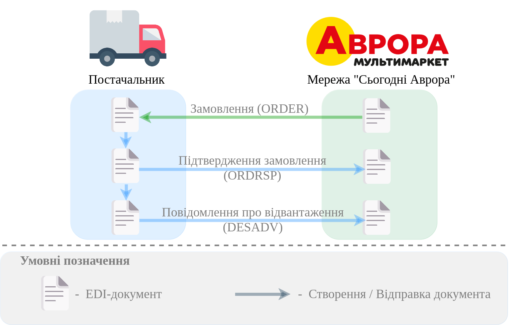
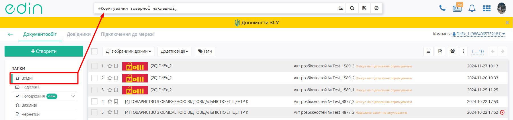

#############################################################################################################################
Документообіг з мережею "Сьогодні Аврора" на платформі EDI Network 2.0. Інструкція для Постачальника
#############################################################################################################################

.. сюда закину немного картинок для текста

.. |лупа| image:: /_constant/icons/magnifying_glass.png

.. |будинок| image:: /_constant/icons/house.png

.. role:: red

.. role:: green

.. role:: orange

.. role:: underline

.. contents:: Зміст:
   :depth: 5

---------

Вступ
====================================

Дана інструкція описує порядок документообігу з мережею "Сьогодні Аврора" на платформі EDI Network 2.0. В документообігу приймають участь наступні документи:

- `Замовлення (ORDER) <https://wiki.edin.ua/uk/latest/EDIN_Specs/XML/ORDER_x.html>`__
- `Підтвердження замовлення (ORDRSP) <https://wiki.edin.ua/uk/latest/EDIN_Specs/XML/ORDRSP_x.html>`__
- `Повідомлення про відвантаження (DESADV) <https://wiki.edin.ua/uk/latest/EDIN_Specs/XML/DESADV_x.html>`__
- `Видаткова накладна (DOCUMENTINVOICE_DRN) <https://wiki.edin.ua/uk/latest/ClientProcesses/Epicentr/Epicentr_XML/DOCUMENTINVOICE_DRN_x.html>`__
- `Акт розбіжностей (DOCCORINVOICE) <https://wiki.edin.ua/uk/latest/EDIN_Specs/XML/DOCCORINVOICE_x.html>`__
- `Накладна на повернення (DOCUMENTINVOICE_NP) <https://wiki.edin.ua/uk/latest/ClientProcesses/Epicentr/Epicentr_XML/DOCUMENTINVOICE_NP_x.html>`__

**Загальна схема документообігу:**

.. _auth:

1 Авторизація
================================================

.. include:: /general_2_0/User_registration.rst
   :start-after: .. початок блоку для Auth
   :end-before: .. кінець блоку для Auth

.. _register:

2 Реєстрація
================================================

.. raw:: html

   

       <iframe src="https://www.youtube.com/embed/VXlC2CKPJwE" frameborder="0" allowfullscreen style="position: absolute; top: 0; left: 0; width: 100%; height: 100%;"></iframe>
   

.. include:: /general_2_0/User_registration.rst
   :start-after: .. початок блоку для Register
   :end-before: .. кінець блоку для Register

.. _pass-recovery:

3 Відновлення/зміна пароля
======================================

.. include:: /general_2_0/User_registration.rst
   :start-after: .. початок блоку для Pass_recovery
   :end-before: .. кінець блоку для Pass_recovery

.. _general-look:

4 Загальний вигляд платформи
====================================

.. include:: /general_2_0/rabota_s_platformoj_EDIN_2.0.rst
   :start-after: .. початок блоку для General_look
   :end-before: .. кінець блоку для General_look

.. _catalogs:

5 Меню (папки) платформи
================================================

.. include:: /general_2_0/rabota_s_platformoj_EDIN_2.0.rst
   :start-after: .. початок блоку для Catalogs
   :end-before: .. кінець блоку для Catalogs

.. _work-with-docs:

6 Робота з документами на платформі
================================================

Після успішної авторизації на платформу відкриється основне меню, де у вкладці **"Продукти та рішення"** EDIN потрібно обрати сервіс **"EDI Network"**:

.. image:: /_constant/pics_landing/landing_edi.png
   :align: center

.. _ordrsp-create:

6.1 Створення та відправка «Підтвердження замовлення» (ORDRSP) на підставі вхідного «Замовлення» (ORDERS)
-------------------------------------------------------------------------------------------------------------

.. include:: /retail_2.0/ORDRSP_na_EDI_Network.rst
   :start-after: .. початок блоку для Ordrsp_from_docs
   :end-before: .. кінець блоку для Ordrsp_from_docs

.. _desadv-create:

6.2 Створення та відправка "Повідомлення про відвантаження" (DESADV) на підставі надісланого «Підтвердження замовлення» (ORDRSP)
----------------------------------------------------------------------------------------------------------------------------------

.. include:: /retail_2.0/formirovanie_otpravka_dokumenta_Uvedomlenie_ob_otgruzke_DESADV_na_EDI_Network_2.0.rst
   :start-after: .. початок блоку для Desadv_from_Ordrsp
   :end-before: .. кінець блоку для Desadv_from_Ordrsp

6.3 Створення, підписання та відправка "Видаткової накладної" (DOCUMENTINVOICE) на підставі  «Повідомлення про відвантаження» (DESADV)
----------------------------------------------------------------------------------------------------------------------------------------

.. include:: /ClientProcesses/Epicentr/Epicentr_Instructions/Epicentr_EDI_instruction_supplier.rst
   :start-after: .. початок блоку для Documentinvoice-create
   :end-before: .. кінець блоку для Documentinvoice-create

.. tabs::

   .. tab:: Файловий ключ

      .. include:: /_constant/signing/signing.rst
         :start-after: .. початок блоку для Signing
         :end-before: .. кінець блоку для Signing

   .. tab:: Token

      .. include:: /_constant/token_signing/token_signing.rst
         :start-after: .. початок блоку для TokenSign
         :end-before: .. кінець блоку для TokenSign

   .. tab:: Гряда

      .. include:: /_constant/gryada_signing/gryada_signing.rst
         :start-after: .. початок блоку для GryadaSign
         :end-before: .. кінець блоку для GryadaSign

   .. tab:: Cloud

      .. include:: /_constant/cloud_signing/cloud_signing.rst
         :start-after: .. початок блоку для CloudSign
         :end-before: .. кінець блоку для CloudSign

-------------------------------

.. include:: /ClientProcesses/Epicentr/Epicentr_Instructions/Epicentr_EDI_instruction_supplier.rst
   :start-after: .. початок блоку для Docinvoice_sign
   :end-before: .. кінець блоку для Docinvoice_sign

6.4 Обробка вхідного "Акту розбіжностей" (DOCCORINVOICE)
--------------------------------------------------------------------------------------------------

Знайдіть потрібний документ в меню сервісу **"EDI Network"** в теці **"Вхідні"** (для зручності в полі `пошуку <https://wiki.edin.ua/uk/latest/general_2_0/rabota_s_platformoj_EDIN_2.0.html#doc-search>`__ оберіть "Коригування товарної накладної" (DOCCORINVOICE)"):

Відкрийте документ, що очікує на підписання отримувачем, та натисніть кнопку **"Підписати"** (попередньо переглянути дані підпису Відправника можна після натискання кнопки "Переглянути підписи", що розташована нижче кнопки "Підписати"):

.. image:: pics_Avrora_EDI/Avrora_EDI_003.png
   :height: 700px
   :align: center

.. tabs::

   .. tab:: Файловий ключ

      .. include:: /_constant/signing/signing.rst
         :start-after: .. початок блоку для Signing
         :end-before: .. кінець блоку для Signing

   .. tab:: Token

      .. include:: /_constant/token_signing/token_signing.rst
         :start-after: .. початок блоку для TokenSign
         :end-before: .. кінець блоку для TokenSign

   .. tab:: Гряда

      .. include:: /_constant/gryada_signing/gryada_signing.rst
         :start-after: .. початок блоку для GryadaSign
         :end-before: .. кінець блоку для GryadaSign

   .. tab:: Cloud

      .. include:: /_constant/cloud_signing/cloud_signing.rst
         :start-after: .. початок блоку для CloudSign
         :end-before: .. кінець блоку для CloudSign

Після підписання документа його необхідно відправити, натиснувши кнопку **"Відправити"**

.. image:: /retail_2.0/pics_Create_DOCCORINVOICE_from/Create_DOCCORINVOICE_from_010.png
   :align: center

Після відправки документ лишається в теці **"Вхідні"** зі статусом "Підписано двома сторонами".

6.5 Обробка вхідної "Накладної на повернення" (DOCUMENTINVOICE_NP)
--------------------------------------------------------------------------------------------------

.. include:: /ClientProcesses/Epicentr/Epicentr_Instructions/Epicentr_EDI_instruction_supplier.rst
   :start-after: .. початок блоку для Docinvoice_np_processing
   :end-before: .. кінець блоку для Docinvoice_np_processing

-------------------------------------

.. include:: /_constant/kontakti.rst
