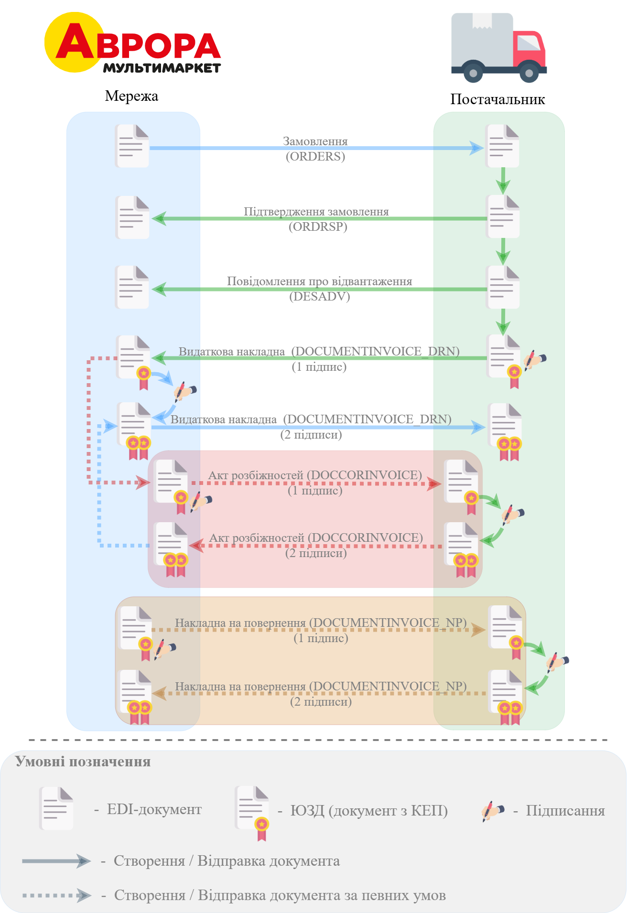

#############################################################################################################################
Документообіг з мережею "Сьогодні Аврора" на платформі EDI Network 2.0. Інструкція для Постачальника
#############################################################################################################################

.. сюда закину немного картинок для текста

.. |лупа| image:: /_constant/icons/magnifying_glass.png

.. |будинок| image:: /_constant/icons/house.png

.. role:: red

.. role:: green

.. role:: orange

.. role:: underline

.. contents:: Зміст:
   :depth: 5

---------

Вступ
====================================

Дана інструкція описує порядок документообігу з мережею "Сьогодні Аврора" на платформі EDI Network 2.0. В документообігу приймають участь наступні документи:

- `Замовлення (ORDER) <https://wiki.edin.ua/uk/latest/EDIN_Specs/XML/ORDER_x.html>`__
- `Підтвердження замовлення (ORDRSP) <https://wiki.edin.ua/uk/latest/EDIN_Specs/XML/ORDRSP_x.html>`__
- `Повідомлення про відвантаження (DESADV) <https://wiki.edin.ua/uk/latest/EDIN_Specs/XML/DESADV_x.html>`__
- `Видаткова накладна (DOCUMENTINVOICE_DRN) <https://wiki.edin.ua/uk/latest/ClientProcesses/Epicentr/Epicentr_XML/DOCUMENTINVOICE_DRN_x.html>`__
- `Акт розбіжностей (DOCCORINVOICE) <https://wiki.edin.ua/uk/latest/EDIN_Specs/XML/DOCCORINVOICE_x.html>`__
- `Накладна на повернення (DOCUMENTINVOICE_NP) <https://wiki.edin.ua/uk/latest/ClientProcesses/Epicentr/Epicentr_XML/DOCUMENTINVOICE_NP_x.html>`__

**Загальна схема документообігу:**

.. _auth:

1 Авторизація
================================================

.. include:: /general_2_0/User_registration.rst
   :start-after: .. початок блоку для Auth
   :end-before: .. кінець блоку для Auth

.. _register:

2 Реєстрація
================================================

.. raw:: html

   

       <iframe src="https://www.youtube.com/embed/VXlC2CKPJwE" frameborder="0" allowfullscreen style="position: absolute; top: 0; left: 0; width: 100%; height: 100%;"></iframe>
   

.. include:: /general_2_0/User_registration.rst
   :start-after: .. початок блоку для Register
   :end-before: .. кінець блоку для Register

.. _pass-recovery:

3 Відновлення/зміна пароля
======================================

.. include:: /general_2_0/User_registration.rst
   :start-after: .. початок блоку для Pass_recovery
   :end-before: .. кінець блоку для Pass_recovery

.. _general-look:

4 Загальний вигляд платформи
====================================

.. include:: /general_2_0/rabota_s_platformoj_EDIN_2.0.rst
   :start-after: .. початок блоку для General_look
   :end-before: .. кінець блоку для General_look

.. _catalogs:

5 Меню (папки) платформи
================================================

.. include:: /general_2_0/rabota_s_platformoj_EDIN_2.0.rst
   :start-after: .. початок блоку для Catalogs
   :end-before: .. кінець блоку для Catalogs

.. _work-with-docs:

6 Робота з документами на платформі
================================================

Після успішної авторизації на платформу відкриється основне меню, де у вкладці **"Продукти та рішення"** EDIN потрібно обрати сервіс **"EDI Network"**:

.. image:: /_constant/pics_landing/landing_edi.png
   :align: center

.. _ordrsp-create:

6.1 Створення та відправка «Підтвердження замовлення» (ORDRSP) на підставі вхідного «Замовлення» (ORDERS)
-------------------------------------------------------------------------------------------------------------

.. include:: /retail_2.0/ORDRSP_na_EDI_Network.rst
   :start-after: .. початок блоку для Ordrsp_from_docs
   :end-before: .. кінець блоку для Ordrsp_from_docs

.. _desadv-create:

6.2 Створення та відправка "Повідомлення про відвантаження" (DESADV) на підставі надісланого «Підтвердження замовлення» (ORDRSP)
----------------------------------------------------------------------------------------------------------------------------------

.. include:: /retail_2.0/formirovanie_otpravka_dokumenta_Uvedomlenie_ob_otgruzke_DESADV_na_EDI_Network_2.0.rst
   :start-after: .. початок блоку для Desadv_from_Ordrsp
   :end-before: .. кінець блоку для Desadv_from_Ordrsp

-------------------------------------

.. include:: /_constant/kontakti.rst
