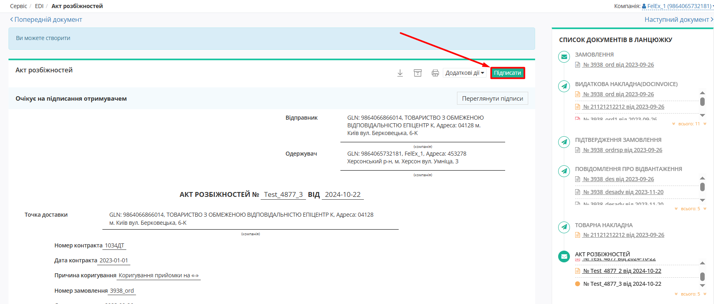

#############################################################################################################################
Документообіг з мережею "Сьогодні Аврора" на платформі EDI Network 2.0. Інструкція для Постачальника
#############################################################################################################################

.. сюда закину немного картинок для текста

.. |лупа| image:: /_constant/icons/magnifying_glass.png

.. |будинок| image:: /_constant/icons/house.png

.. role:: red

.. role:: green

.. role:: orange

.. role:: underline

.. contents:: Зміст:
   :depth: 5

---------

Вступ
====================================

Дана інструкція описує порядок документообігу з мережею "Сьогодні Аврора" на платформі EDI Network 2.0. В документообігу приймають участь наступні документи:

- `Замовлення (ORDER) <https://wiki.edin.ua/uk/latest/EDIN_Specs/XML/ORDER_x.html>`__
- `Підтвердження замовлення (ORDRSP) <https://wiki.edin.ua/uk/latest/EDIN_Specs/XML/ORDRSP_x.html>`__
- `Повідомлення про відвантаження (DESADV) <https://wiki.edin.ua/uk/latest/EDIN_Specs/XML/DESADV_x.html>`__
- `Видаткова накладна (DOCUMENTINVOICE_DRN) <https://wiki.edin.ua/uk/latest/ClientProcesses/Epicentr/Epicentr_XML/DOCUMENTINVOICE_DRN_x.html>`__
- `Акт розбіжностей (DOCCORINVOICE) <https://wiki.edin.ua/uk/latest/EDIN_Specs/XML/DOCCORINVOICE_x.html>`__
- `Накладна на повернення (DOCUMENTINVOICE_NP) <https://wiki.edin.ua/uk/latest/ClientProcesses/Epicentr/Epicentr_XML/DOCUMENTINVOICE_NP_x.html>`__

**Загальна схема документообігу:**

.. image:: pics_Avrora_EDI/Avrora_EDI_001.png
   :height: 700px
   :align: center

.. _auth:

1 Авторизація
================================================

.. include:: /general_2_0/User_registration.rst
   :start-after: .. початок блоку для Auth
   :end-before: .. кінець блоку для Auth

.. _register:

2 Реєстрація
================================================

.. raw:: html

   

       <iframe src="https://www.youtube.com/embed/VXlC2CKPJwE" frameborder="0" allowfullscreen style="position: absolute; top: 0; left: 0; width: 100%; height: 100%;"></iframe>
   

.. include:: /general_2_0/User_registration.rst
   :start-after: .. початок блоку для Register
   :end-before: .. кінець блоку для Register

.. _pass-recovery:

3 Відновлення/зміна пароля
======================================

.. include:: /general_2_0/User_registration.rst
   :start-after: .. початок блоку для Pass_recovery
   :end-before: .. кінець блоку для Pass_recovery

.. _general-look:

4 Загальний вигляд платформи
====================================

.. include:: /general_2_0/rabota_s_platformoj_EDIN_2.0.rst
   :start-after: .. початок блоку для General_look
   :end-before: .. кінець блоку для General_look

.. _catalogs:

5 Меню (папки) платформи
================================================

.. include:: /general_2_0/rabota_s_platformoj_EDIN_2.0.rst
   :start-after: .. початок блоку для Catalogs
   :end-before: .. кінець блоку для Catalogs

.. _work-with-docs:

6 Робота з документами на платформі
================================================

Після успішної авторизації на платформу відкриється основне меню, де у вкладці **"Продукти та рішення"** EDIN потрібно обрати сервіс **"EDI Network"**:

.. image:: /_constant/pics_landing/landing_edi.png
   :align: center

.. _ordrsp-create:

6.1 Створення та відправка «Підтвердження замовлення» (ORDRSP) на підставі вхідного «Замовлення» (ORDERS)
-------------------------------------------------------------------------------------------------------------

.. include:: /retail_2.0/ORDRSP_na_EDI_Network.rst
   :start-after: .. початок блоку для Ordrsp_from_docs
   :end-before: .. кінець блоку для Ordrsp_from_docs

.. _desadv-create:

6.2 Створення та відправка "Повідомлення про відвантаження" (DESADV) на підставі надісланого «Підтвердження замовлення» (ORDRSP)
----------------------------------------------------------------------------------------------------------------------------------

.. deprecated
   .. include:: /retail_2.0/formirovanie_otpravka_dokumenta_Uvedomlenie_ob_otgruzke_DESADV_na_EDI_Network_2.0.rst
      :start-after: .. початок блоку для Desadv_from_Ordrsp
      :end-before: .. кінець блоку для Desadv_from_Ordrsp

Щоб сформувати "Повідомлення про відвантаження" (DESADV) на підставі "Підтвердження замовлення" (ORDRSP) Вам потрібно в меню сервісу **"EDI Network"** увійти в папку "Надіслані" і обрати "Підтвердження замовлення" (ORDRSP) (для зручності можливо скористатись `пошуком <https://wiki.edin.ua/uk/latest/general_2_0/rabota_s_platformoj_EDIN_2.0.html#doc-search>`__):

.. image:: /retail_2.0/pics_DESADV_na_EDI_Network_2.0/DESADV_na_EDI_Network_009.png
   :align: center

Потрібно відкрити надіслане "Підтвердження замовлення" (ORDRSP) лівою кнопкою миші та створити "Повідомлення про відвантаження" (DESADV) в блоці `ланцюжка документів <https://wiki.edin.ua/uk/latest/_constant/chain/chain.html>`__ за допомогою кнопки **"Створити документ"**:

.. image:: /retail_2.0/pics_DESADV_na_EDI_Network_2.0/DESADV_na_EDI_Network_010.png
   :align: center

У відкритій формі "Повідомлення про відвантаження" (DESADV) значна частина полів заповнюються автоматично з пов'язаного "Підтвердження замовлення" (ORDRSP) (обов'язкові до заповнення поля позначені червоною зірочкою :red:`*`):

.. image:: /retail_2.0/pics_DESADV_na_EDI_Network_2.0/DESADV_na_EDI_Network_011.png
   :align: center

Дані **Відправника** - це Ваші дані, що заповнюються автоматично і не підлягають редагуванню. Заповнити дані **Одержувача** можливо за допомогою кнопки **"Пошук контрагента"** (|лупа|).

.. hint::
   За допомогою кнопки **"Пошук контрагента"** (|лупа|) або ж за допомогою кнопки **"Вказати себе"** (|будинок|) можливо вказати чи змінити дані Покупця або Постачальника. Для пошуку введіть назву компанії, GLN або ІПН:

   .. image:: /retail_2.0/pics_formirovanie_ORDERS_na_EDI_Network_2.0/ORDERS_na_EDI_Network_2.0_024.png
      :align: center

Поля **Номер**, **Дата** документа, Дата/час проведення доставки заповнюються автоматично, але доступні до редагування за потреби. Дані **Постачальник**, **Покупець**, **Місце доставки**, **Кінцевий одержувач** також заповнюються автоматично - їх можливо редагувати за допомогою кнопок "Пошук контрагента" (|лупа|) чи "Вказати себе" (|будинок|);

Автоматично вказується номер та дата "Замовлення" (ORDER), як початкового документа.

**За накладною №** - номер накладної.

.. important:: **Увага!** Номер накладної повинен повністю збігатися з номером оригіналу паперової накладної.

Блоки **Додаткова інформація** та **Транспортування** є необов'язковим до заповнення і "згорнуті" за замовчуванням. Блок **Разом** розраховується автоматично за табличними даними.

В блоці **Додаткова інформація** поля **Договір на поставку №** та **Дата** договору на поставку заповнюються автоматично даними із Замовлення (ORDERS) та не доступні для редагування. 

.. image:: /pics_Avrora_EDI/Avrora_EDI_004.png
   :align: center

**Товарні позиції** переносяться з "Замовлення". Можливо коригувати значення **Кількість, що постачається**, **Ціна без ПДВ**, **Ціна з ПДВ** (підраховується автоматично) та **Ставка ПДВ** прямо в таблиці чи **"Змінити"** "Дані позиції" в розширеній формі після натискання на штрих-код позиції:

.. image:: /retail_2.0/pics_DESADV_na_EDI_Network_2.0/DESADV_na_EDI_Network_004.png
   :align: center

:red:`Всі зміни за позиціями потребують узгодження з Вашим Контрагентом!`

.. important:: **Увага!** У разі створення **кількох** видаткових накладних на замовлення, необхідно на кожну накладну формувати **Повідомлення про відвантаження**. При цьому, поле «**За накладною №**» в документах повинно відрізнятися.

Якщо якась із позицій відсутня і поставлятися не буде, її необхідно відзначити галочкою і **"Видалити"**:

.. image:: /retail_2.0/pics_DESADV_na_EDI_Network_2.0/DESADV_na_EDI_Network_005.png
   :align: center

Можливо також **"+Додати"** іншу позицію з вашого `"Товарного довідника" <https://wiki.edin.ua/uk/latest/general_2_0/Directories.html>`__, заповнивши форму (обов'язкові до заповнення поля позначені червоною зірочкою :red:`*`):

.. image:: /retail_2.0/pics_DESADV_na_EDI_Network_2.0/DESADV_na_EDI_Network_006.png
   :align: center

Після цього можна за необхідності прикріпити Сертифікати на товари, наявні в даній накладній (для використання цієї опції Ваша компанія має бути підписана на користування сервісом Е-Сертифікати). Для додавання сертифікатів до створеної видаткової накладної натисніть кнопку «**Прикріпити сертифікати**» та в з'явившомуся вікні «Обрати сертифікат» скористайтесь пошуком, щоб знайти потрібні сертифікати:

.. image:: /retail_2.0/pics_DESADV_na_EDI_Network_2.0/DESADV_na_EDI_Network_012.png
   :align: center

Пошук здійснюється автоматично в опублікованих Вами сертифікатах, в сервісі Е-Сертифікати:

* По номеру сертифіката,

* По прив'язаним товарам (товари, зазначені в повідомленні про відвантаження та в Сертифікаті, мають співпадати),

* По номеру партії.

.. important:: **Увага!** При відправці повідомлення про відвантаження з прикріпленим сертифікатом автоматично заповнюються дані по обраним Сертифікатам: 
   
   * вкладка “Пов'язані відвантаження”
   * вкладка “Пов'язані товари”, по сертифіктах “Декларація виробника”, “Посвідчення/сертифікат якості”

Оберіть потрібні сертифікати в результатах пошуку та натисніть кнопку «**Зберегти**»:

.. image:: /retail_2.0/pics_DESADV_na_EDI_Network_2.0/DESADV_na_EDI_Network_013.png
   :align: center

Якщо в картці обраного сертифікату зазначено обмежений доступ, система перевірить наявність GLN отримувача повідомлення про відвантаження в правах перегляду цього сертифікату. В разі відсутності GLN отримувача повідомлення про відвантаження буде додано туди автоматично.

Після внесення всіх даних потрібно **"Зберегти"** (1) документ, після чого його можливо **"Відправити"** (2):

.. image:: /retail_2.0/pics_DESADV_na_EDI_Network_2.0/DESADV_na_EDI_Network_007.png
   :align: center

Після збереження документ можливо знайти в папці **"Чернетки"**. Відправлений документ автоматично потрапляє в папку **"Надіслані"** і буде знаходиться в ланцюжку документів разом із попередніми документами:

.. image:: /retail_2.0/pics_DESADV_na_EDI_Network_2.0/DESADV_na_EDI_Network_008.png
   :align: center

6.3 Створення, підписання та відправка "Видаткової накладної" (DOCUMENTINVOICE) на підставі  «Повідомлення про відвантаження» (DESADV)
----------------------------------------------------------------------------------------------------------------------------------------

.. deprecated
   .. include:: /ClientProcesses/Epicentr/Epicentr_Instructions/Epicentr_EDI_instruction_supplier.rst
      :start-after: .. початок блоку для Documentinvoice_create
      :end-before: .. кінець блоку для Documentinvoice_create

Для формування "Видаткової накладної" (DOCUMENTINVOICE) потрібно у папці **"Надіслані"** обрати "Повідомлення про відвантаження" (DESADV) (для зручності можливо скористатись `пошуком <https://wiki.edin.ua/uk/latest/general_2_0/rabota_s_platformoj_EDIN_2.0.html#doc-search>`__):

.. image:: /ClientProcesses/Epicentr/Epicentr_Instructions/pics_Epicentr_EDI_instruction/Epicentr_EDI_instruction_029.png
   :align: center

Потрібно відкрити надіслане "Повідомлення про відвантаження" (DESADV) лівою кнопкою миші та створити "Видаткову накладну" (DOCUMENTINVOICE) в блоці `ланцюжка документів <https://wiki.edin.ua/uk/latest/_constant/chain/chain.html>`__ для Мережі за допомогою кнопки **"Створити документ"**:

.. image:: /ClientProcesses/Epicentr/Epicentr_Instructions/pics_Epicentr_EDI_instruction/Epicentr_EDI_instruction_030.png
   :align: center

У відкритій формі "Видаткової накладної" (DOCUMENTINVOICE) багато даних автоматично переносяться з пов'язаного документа-підстави (обов'язкові до заповнення поля позначені червоною зірочкою :red:`*`):

.. image:: /ClientProcesses/Epicentr/Epicentr_Instructions/pics_Epicentr_EDI_instruction/Epicentr_EDI_instruction_041.png
   :align: center

Дані **Відправника** та **Одержувача** заповнюються автоматично з обраної компанії та документа-підстави відповідно і не підлягають редагуванню. **Номер** документа співпадає з номером документа-підстави, **Дата** документа заповнюються автоматично поточною датою, але доступна до редагування за потреби. Дані **Точки доставки** також заповнюються автоматично з документа-підстави.

**Номер** та **Дата** "Замовлення" також переносяться автоматично. **Номер контракту** та **Дата контракту** заповнюються автоматично даними з Повідомлення про відвантаження (DESADV) і не доступні для редагування. Поля **Номер контракту** та **Дата контракту** в Видатковій накладній не заповнюються автоматично та доступні для редагування у випадку, якщо в Повідомленні про відвантаження (DESADV) відповідні поля **Договір на поставку №** та **Дата договору на поставку** не заповнені. 

Блок **Додаткова інформація** необов'язковий до заповнення і згорнутий за замовчуванням. Блок **Разом** розраховується автоматично за табличнии позиціями.

Про необхідність заповнення та інші помилки в табличній частині документа Ви будете проінформовані (вказується номер позиції та невідповідність), а також рядок позиції виділяється помаранчевим кольором:

.. image:: /ClientProcesses/Epicentr/Epicentr_Instructions/pics_Epicentr_EDI_instruction/Epicentr_EDI_instruction_014.png
   :align: center

**"Змінити"** дані позиції можливо в розширеній формі "Дані товару" після натискання на штрихкод позиції:

.. image:: /ClientProcesses/Epicentr/Epicentr_Instructions/pics_Epicentr_EDI_instruction/Epicentr_EDI_instruction_015.png
   :align: center

Якщо по якійсь з позицій не буде поставки її необхідно відзначити галочкою і **"Видалити"**. Лише **після видалення** можливо **"+Додати"** товарні позиції, що були зазначені в **"Замовленні"**:

.. image:: /ClientProcesses/Epicentr/Epicentr_Instructions/pics_Epicentr_EDI_instruction/Epicentr_EDI_instruction_043.png
   :align: center

.. image:: /ClientProcesses/Epicentr/Epicentr_Instructions/pics_Epicentr_EDI_instruction/Epicentr_EDI_instruction_042.png
   :align: center

Після внесення всіх необхідних змін в документ потрібно натиснути кнопку **"Зберегти"** (1), після чого можливо **"Підписати"** (2):

.. image:: /ClientProcesses/Epicentr/Epicentr_Instructions/pics_Epicentr_EDI_instruction/Epicentr_EDI_instruction_017.png
   :align: center

.. tabs::

   .. tab:: Файловий ключ

      .. include:: /_constant/signing/signing.rst
         :start-after: .. початок блоку для Signing
         :end-before: .. кінець блоку для Signing

   .. tab:: Token

      .. include:: /_constant/token_signing/token_signing.rst
         :start-after: .. початок блоку для TokenSign
         :end-before: .. кінець блоку для TokenSign

   .. tab:: Гряда

      .. include:: /_constant/gryada_signing/gryada_signing.rst
         :start-after: .. початок блоку для GryadaSign
         :end-before: .. кінець блоку для GryadaSign

   .. tab:: Cloud

      .. include:: /_constant/cloud_signing/cloud_signing.rst
         :start-after: .. початок блоку для CloudSign
         :end-before: .. кінець блоку для CloudSign

-------------------------------

.. include:: /ClientProcesses/Epicentr/Epicentr_Instructions/Epicentr_EDI_instruction_supplier.rst
   :start-after: .. початок блоку для Docinvoice_sign
   :end-before: .. кінець блоку для Docinvoice_sign

6.4 Обробка вхідного "Акту розбіжностей" (DOCCORINVOICE)
--------------------------------------------------------------------------------------------------

Знайдіть потрібний документ в меню сервісу **"EDI Network"** в теці **"Вхідні"** (для зручності в полі `пошуку <https://wiki.edin.ua/uk/latest/general_2_0/rabota_s_platformoj_EDIN_2.0.html#doc-search>`__ оберіть "Коригування товарної накладної" (DOCCORINVOICE)"):

Відкрийте документ, що очікує на підписання отримувачем, та натисніть кнопку **"Підписати"** (попередньо переглянути дані підпису Відправника можна після натискання кнопки "Переглянути підписи", що розташована нижче кнопки "Підписати"):

.. tabs::

   .. tab:: Файловий ключ

      .. include:: /_constant/signing/signing.rst
         :start-after: .. початок блоку для Signing
         :end-before: .. кінець блоку для Signing

   .. tab:: Token

      .. include:: /_constant/token_signing/token_signing.rst
         :start-after: .. початок блоку для TokenSign
         :end-before: .. кінець блоку для TokenSign

   .. tab:: Гряда

      .. include:: /_constant/gryada_signing/gryada_signing.rst
         :start-after: .. початок блоку для GryadaSign
         :end-before: .. кінець блоку для GryadaSign

   .. tab:: Cloud

      .. include:: /_constant/cloud_signing/cloud_signing.rst
         :start-after: .. початок блоку для CloudSign
         :end-before: .. кінець блоку для CloudSign

Після підписання документа його необхідно відправити, натиснувши кнопку **"Відправити"**

.. image:: /retail_2.0/pics_Create_DOCCORINVOICE_from/Create_DOCCORINVOICE_from_010.png
   :align: center

Після відправки документ лишається в теці **"Вхідні"** зі статусом "Підписано двома сторонами".

6.5 Обробка вхідної "Накладної на повернення" (DOCUMENTINVOICE_NP)
--------------------------------------------------------------------------------------------------

.. include:: /ClientProcesses/Epicentr/Epicentr_Instructions/Epicentr_EDI_instruction_supplier.rst
   :start-after: .. початок блоку для Docinvoice_np_processing
   :end-before: .. кінець блоку для Docinvoice_np_processing

.. tabs::

   .. tab:: Файловий ключ

      .. include:: /_constant/signing/signing.rst
         :start-after: .. початок блоку для Signing
         :end-before: .. кінець блоку для Signing

   .. tab:: Token

      .. include:: /_constant/token_signing/token_signing.rst
         :start-after: .. початок блоку для TokenSign
         :end-before: .. кінець блоку для TokenSign

   .. tab:: Гряда

      .. include:: /_constant/gryada_signing/gryada_signing.rst
         :start-after: .. початок блоку для GryadaSign
         :end-before: .. кінець блоку для GryadaSign

   .. tab:: Cloud

      .. include:: /_constant/cloud_signing/cloud_signing.rst
         :start-after: .. початок блоку для CloudSign
         :end-before: .. кінець блоку для CloudSign

-------------------------------------

.. include:: /_constant/kontakti.rst
