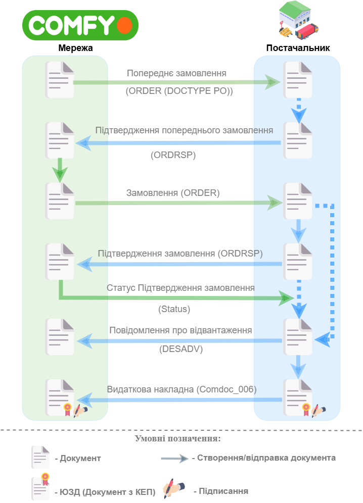
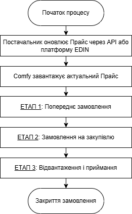
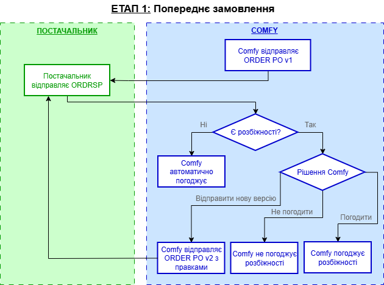
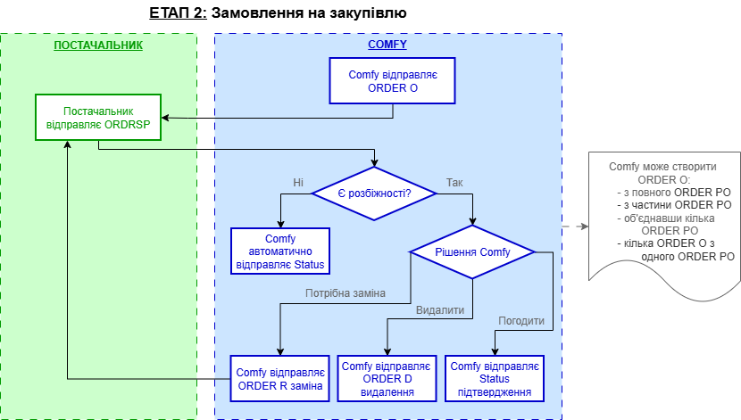
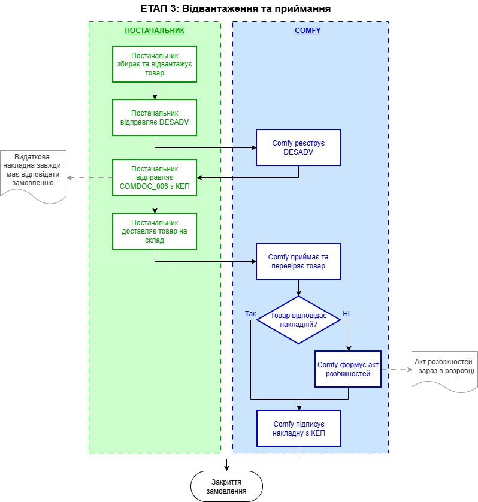

########################################################################################################################
Документообіг з мережею "Comfy" на платформі EDI Network 2.0
########################################################################################################################

.. сюда закину немного картинок для текста

.. |лупа| image:: /_constant/icons/magnifying_glass.png

.. |будинок| image:: /_constant/icons/house.png

.. |pencil_stencil| image:: /_constant/icons/pencil_stencil.png

.. |лупа2| image:: /_constant/icons/magnifying_glass2.png

.. |drag_dots| image:: /_constant/icons/drag_dots.png

.. |trash| image:: /_constant/icons/trash.png

.. |download| image:: /_constant/icons/download.png

.. |drop_pass| image:: signing/drop_pass.png

.. |del_key| image:: signing/del_key2.png

.. |bad_doc| image:: /general_2_0/pics_rabota_s_platformoj_EDIN_2.0/rabota_s_platformoj_066.png

.. role:: red

.. role:: orange

.. role:: underline

.. contents:: Зміст:
   :depth: 3

---------

Вступ
====================================

Дана інструкція описує порядок документообігу з мережею «Comfy» на платформі EDI Network 2.0. В документообігу за типовою схемою приймають участь наступні документи:

- `Попереднє Замовлення (ORDER , DOCTYPE = PO - попереднє замовлення) <https://wiki.edin.ua/uk/latest/EDIN_Specs/XML/ORDER_x. html>`__
- `Підтвердження Попереднього Замовлення (ORDRSP) <https://wiki.edin.ua/uk/latest/EDIN_Specs/XML/ORDER_x.html>`__
- `Замовлення (ORDER) <https://wiki.edin.ua/uk/latest/EDIN_Specs/XML/ORDER_x.html>`__
- `Підтвердження замовлення (ORDRSP) <https://wiki.edin.ua/uk/latest/EDIN_Specs/XML/ORDER_x.html>`__
- `Статус Підтвердження замовлення (STATUS) <https://wiki.edin.ua/uk/latest/EDIN_Specs/XML/STATUS_x.html>`__
- `Повідомлення про відвантаження (DESADV) <https://wiki.edin.ua/uk/latest/EDIN_Specs/XML/DESADV_x.html>`__
- `Видаткова накладна (COMDOC_006) <https://wiki.edin.ua/uk/latest/EDIN_Specs/XML/COMDOC_006_x.html>`__

Загальна схема документообігу
-----------------------------------------

**Опис взаємодії з контрагентом:**

1. Перед початком процесу учасники обмінюються документом Прайс-лист (PRICAT).
2. Comfy відправляє попереднє замовлення (ORDER PO).
3. Постачальник у відповідь формує та відправляє Підтвердження замовлення (ORDER SP).
4. Comfy формує та відправляє документ Замовлення (ORDER O).
5. Постачальник відправляє Підтвердження замовлення (ORDER SP) у відповідь до документу «Замовлення» (ORDER O).
6. Comfy відправляє Статус (STATUS) на Підтвердження замовлення (ORDER SP) - погоджуючись на пропозицію Постачальника.
7. По факту відвантаження Постачальник відправляє Повідомлення про відвантаження (DESADV).
8. Постачальник відправляє Видаткову накладну (COMDOC_006), підписану зі сторони Постачальника за допомогою КЕП у ролі Вантажовідправника.
9. Comfy склад виконує приймання товару і, 
  - якщо розбіжності та зауваження зі сторони Comfy відсутні - Comfy підписує Видаткову накладну за допомогою КЕП у ролі Вантажоодержувача;
  - якщо розбіжності та зауваження зі сторони Comfy присутні - Comfy відправляє Відмову від підписання Видаткової накладної з вказанням причини;
  - при розбіжностях Comfy формує документ "Акт розбіжності", при цьому Видаткова накладна може бути підписана. "Акт розбіжності" відправляється в паперовому вигляді;
  - за необхідності Comfy формує документ "Накладна на повернення" та відправляє в паперовому вигляді.
10. Якщо Постачальнику необхідно повторно відправити Видаткову накладну і попередньо відправлена Видаткова накладна на замовлення ще не підписана зі сторони Comfy - Постачальник формує відклик підпису на попередньо відправлений документ, формує та відправляє коректний документ Видаткова накладна, підписаний за допомогою КЕП.
11. Якщо Постачальнику необхідно повторно відправити Видаткову накладну, але попередня Видаткова накладна уже підписана зі сторони Comfy - Постачальник формує та відправляє запит на Анулювання на попередньо відправлений документ.

**Ключові правила процесу:**

- Прайс оновлюється регулярно через API або файл на платформі EDIN.
- ORDER PO може мати декілька версій до досягнення згоди з Постачальником.
- ORDER PO може не бути в схемі інтернет замовлень (замовлення під клієнта), в такому випадку обмін починається одразу з ORDER O.
- ORDER O формується гнучко: на основі повного ORDER PO, частини позицій, об'єднання декількох ORDER PO, або розділення одного ORDER PO на декілька ORDER O.
- Послідовність документів при відвантаженні: спочатку документ Status(від Comfy), далі від постачальника DESADV (важливо: тільки після Status), потім COMDOC_006.
- COMDOC_006 надходить з КЕП Постачальника у ролі Вантажовідправника.
- Відправляти DESADV можна тільки після отримання Status від Comfy.
- Два типи розбіжностей:

   - Видаткова накладна ≠ Замовлення → Відмова від підписання + виправлення;
   - Фізичний товар ≠ Видаткова накладна → Акт розбіжностей.

Дану схему взаємодії з контрагентом можна поділити на 3 етапи:

1. Етап 1 - Попереднє замовлення (ORDER PO).
2. Етап 2 - Замовлення на закупівлю (ORDER O).
3. Етап 3 - Відвантаження та приймання товару.

**Передумова для початку процесу замовлення** - обмін прайсами. Постачальник регулярно оновлює прайс одним із способів:
- через API напряму в систему Comfy,
- через файл на платформі EDIN.

Comfy завантажує та використовує актуальний прайс для формування замовлень.

Розглянемо кожниий етап взаємодії детальніше.

ЕТАП 1: Попереднє замовлення (ORDER PO)
--------------------------------------------

1. Comfy формує та відправляє Попереднє замовлення (ORDER PO) на основі актуального прайсу.
2. Постачальник у відповідь формує та відправляє Підтвердження попереднього замовлення (ORDRSP).
3. Якщо **є розбіжності** між Попереднім замовленням (ORDER PO) та Підтвердженням попереднього замовлення (ORDRSP):
  - Comfy переглядає пропозиції Постачальника;
  - Comfy формує та відправляє нову версію ORDER PO (v2, v3, тощо);
  - Постачальник відправляє Підтвердження попереднього замовлення ORDRSP на нову версію;
  - Цикл повторюється до досягнення згоди між сторонами.
4. Якщо **розбіжності відсутні**, Comfy автоматично завантажує підтверджену заявку.

ЕТАП 2: Замовлення на закупівлю (ORDER O)
------------------------------------------------

1. **Формування замовлення на закупівлю (ORDER O)**

Comfy може створити Замовлення (ORDER O) одним із наступних способів:

- На основі повного Попереднього замовлення (ORDER PO),
- На основі частини позицій з Попереднього замовлення (ORDER PO),
- Об'єднавши декілька Попередніх замовлень (ORDER PO) в одне Замовлення,
- Створивши декілька Замовлень (ORDER O) з одного Попереднього замовлення (ORDER PO) послідовно.

:red:`Важливо! Кожна позиція в ORDER O містить посилання на вихідний ORDER PO.`

2. **Підтвердження замовлення ORDER O**

- Comfy формує та відправляє Замовлення (ORDER O).
- Постачальник відправляє Підтвердження замовлення (ORDRSP) у відповідь на ORDER O.
- Comfy аналізує розбіжності (кількість, ціна, дата поставки). Якщо **є розбіжності**:

   - Comfy переглядає розбіжності;
   - при погодженні з корекціями: Comfy відправляє Status (Підтвердження);
   - при непогодженні: Comfy формує та відправляє ORDER R (Заміна замовлення) або ORDER D (Видалення замовлення);
   - Постачальник відправляє Підтвердження (ORDRSP) на Заміну замовлення (ORDER R);
   - цикл може повторюватися до досягнення згоди.
- Якщо **розбіжності відсутні**, Comfy автоматично відправляє Status (Автопідтвердження).
- Після отримання Status від Comfy Постачальник може відправляти DESADV.

ЕТАП 3: Відвантаження та приймання
--------------------------------------

1. **Відвантаження товару**

- Постачальник збирає та відвантажує товар.
- Спочатку Постачальник відправляє Повідомлення про відвантаження (DESADV).
- Comfy реєструє DESADV та витягує дані про відвантаження.
- Потім Постачальник відправляє Видаткову накладну (COMDOC_006), підписану КЕП Постачальника у ролі Вантажовідправника.

2. **Перевірка відповідності Видаткової накладної**

- Якщо Видаткова накладна **відповідає** Замовленню:

   - Постачальник здійснює доставку товару на склад Comfy;
   - Склад Comfy виконує приймання та перевірку фізичного товару.

- Якщо Видаткова накладна **НЕ відповідає** Замовленню:

   - Comfy формує та відправляє Відмову від підписання з вказанням причин;
   - Постачальник виправляє Видаткову накладну:

      - Якщо попередня накладна не підписана зі сторони Comfy: Постачальник формує відклик підпису на попередню накладну, формує та відправляє коректну Видаткову накладну, підписану КЕП;
      - Якщо попередня накладна вже підписана зі сторони Comfy: Постачальник формує та відправляє запит на Анулювання попередньої накладної.

3. **Перевірка фізичного товару**

- Якщо фізичний товар **відповідає** Видатковій накладній:

   - Склад Comfy підписує Видаткову накладну за допомогою КЕП у ролі Вантажоодержувача;
   - Видаткова накладна стає підписаною обома сторонами (обидва КЕП);
   - Comfy закриває замовлення.

- Якщо фізичний товар **НЕ відповідає** Видатковій накладній:

   - Склад Comfy формує та відправляє Акт розбіжностей;
   - Постачальник отримує Акт розбіжностей та виправляє ситуацію.

1 Вхід на платформу
====================================

.. include:: /general_2_0/rabota_s_platformoj_EDIN_2.0.rst
   :start-after: .. початок блоку для Enter
   :end-before: .. кінець блоку для Enter

Після успішної авторизації відкриється основне меню, де у вкладці **"Продукти та рішення"** EDIN потрібно обрати сервіс **"EDI Network"**:

.. image:: /_constant/pics_landing/landing_edi.png
   :align: center

.. _ordrsp_from_order:

2 Створення "Підтвердження замовлення" (ORDRSP) на підставі вхідного "Замовлення" (ORDER)
==========================================================================================================================

.. include:: /retail_2.0/ORDRSP_na_EDI_Network.rst
   :start-after: .. початок блоку для Ordrsp_from_docs
   :end-before: .. кінець блоку для Ordrsp_from_docs

.. _desadv_from_ordrsp:

3 Створення "Повідомлення про відвантаження" (DESADV) на підставі надісланого "Підтвердження замовлення" (ORDRSP)
==========================================================================================================================

.. include:: /retail_2.0/formirovanie_otpravka_dokumenta_Uvedomlenie_ob_otgruzke_DESADV_na_EDI_Network_2.0.rst
   :start-after: .. початок блоку для Desadv_from_Ordrsp
   :end-before: .. кінець блоку для Desadv_from_Ordrsp
   

.. _comdoc006_from_desadv:

4 Формування Комерційного документа "Видаткова накладна" (COMDOC_006)
==========================================================================================================================

.. include:: /retail_2.0/formirovanie_otpravka_dokumenta_Vydatkova_Nakladna_na_EDI_Network_2.0.rst
   :start-after: .. початок блоку для Comdoc_006_from_Desadv
   :end-before: .. кінець блоку для Comdoc_006_from_Desadv

Детальніше про підписання документів дивіться `розділ <https://wiki.edin.ua/uk/latest/retail_2.0/formirovanie_otpravka_dokumenta_Vydatkova_Nakladna_na_EDI_Network_2.0.html#edin-2-0>`__
   

------------------------------------------------

.. include:: /_constant/kontakti.rst
