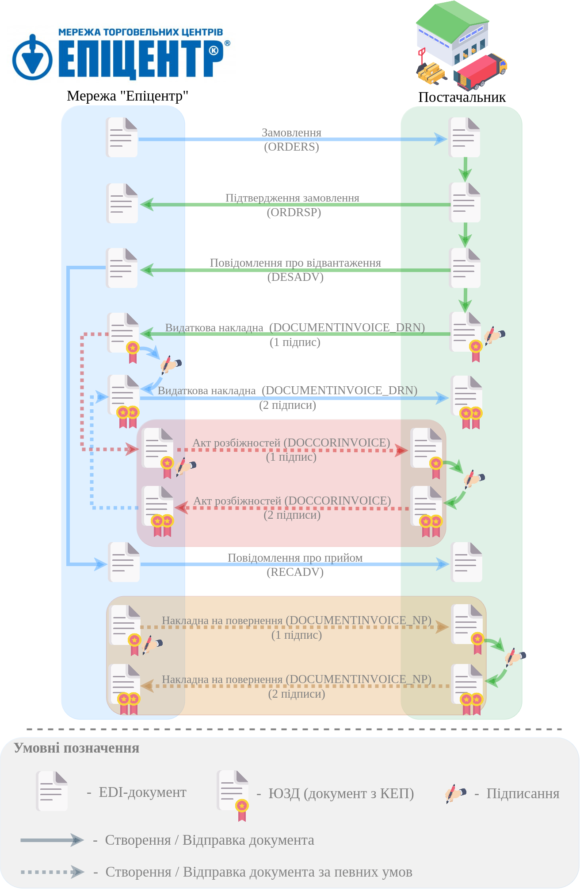
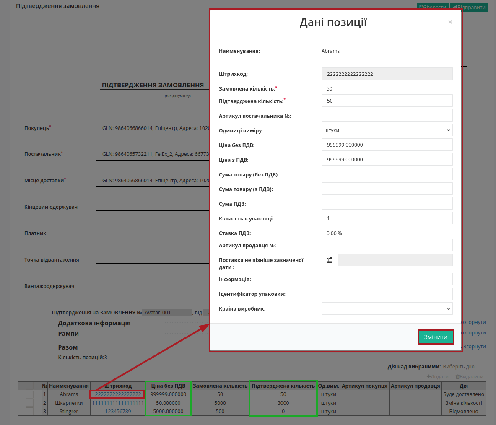

########################################################################################################################
Документообіг з мережею "Епіцентр" на платформі EDI Network 2.0. Інстукція Постачальника
########################################################################################################################

.. сюда закину немного картинок для текста

.. |лупа| image:: /_constant/icons/magnifying_glass.png

.. |будинок| image:: /_constant/icons/house.png

.. role:: red

.. contents:: Зміст:
   :depth: 2

---------

Вступ
====================================

Дана інструкція описує порядок документообігу з мережею "Епіцентр" на платформі EDI Network 2.0. В документообігу приймають участь наступні документи:

- `Замовлення (ORDERS) <https://wiki.edin.ua/uk/latest/EDIN_Specs/XML/ORDER_x.html>`__
- `Підтвердження замовлення (ORDRSP) <https://wiki.edin.ua/uk/latest/EDIN_Specs/XML/ORDRSP_x.html>`__
- `Повідомлення про відвантаження (DESADV) <https://wiki.edin.ua/uk/latest/EDIN_Specs/XML/DESADV_x.html>`__
- `Видаткова накладна (DOCUMENTINVOICE_DRN) <https://wiki.edin.ua/uk/latest/ClientProcesses/Epicentr/Epicentr_XML/DOCUMENTINVOICE_DRN_x.html>`__
- `Акт розбіжностей (DOCCORINVOICE) <https://wiki.edin.ua/uk/latest/ClientProcesses/Epicentr/Epicentr_XML/DOCCORINVOICE_x.html>`__
- `Повідомлення про прийом (RECADV) <https://wiki.edin.ua/uk/latest/EDIN_Specs/XML/RECADV_x.html>`__
- `Накладна на повернення (DOCUMENTINVOICE_NP) <https://wiki.edin.ua/uk/latest/ClientProcesses/Epicentr/Epicentr_XML/DOCUMENTINVOICE_NP_x.html>`__

**Загальна схема документообігу:**

1 Вхід на платформу
====================================

.. include:: /general_2_0/rabota_s_platformoj_EDIN_2.0.rst
   :start-after: .. початок блоку для Enter
   :end-before: .. кінець блоку для Enter

Після успішної авторизації відкриється основне меню, де у вкладці **"Продукти та рішення"** EDIN потрібно обрати сервіс **"EDI Network"**:

.. image:: /_constant/pics_landing/landing_edi.png
   :align: center

.. _ordrsp-create:

2 Формування "Підтвердження замовлення" (ORDRSP) на підставі вхідного "Замовлення" (ORDER)
==============================================================================================================

Мережа є ініціатором документообігу і надсилає "Замовлення" (ORDER). Для формування "Підтвердження замовлення" (ORDRSP) потрібно у папці **"Вхідні"** обрати "Замовлення" (ORDER), за яким потрібно зробити підтвердження (для зручності можливо скористатись `пошуком <https://wiki.edin.ua/uk/latest/general_2_0/rabota_s_platformoj_EDIN_2.0.html#doc-search>`__):

Потрібно відкрити вхідне "Замовлення" (ORDER) лівою кнопкою миші та створити "Підтвердження замовлення" (ORDRSP) в блоці `ланцюжка документів <https://wiki.edin.ua/uk/latest/_constant/chain/chain.html>`__ для Мережі за допомогою кнопки **"Створити документ"**:

У відкритій формі "Підтвердження замовлення" (ORDRSP) деякі поля заповнюються автоматично з пов'язаного "Замовлення" (обов'язкові до заповнення поля позначені червоною зірочкою :red:`*`):

Дані **Відправника** / **Одержувача** заповнюються автоматично з документа-підстави та обраної компанії і не підлягають редагуванню. Підтип документа **Підтвердження замовлення** (*Підтвердження замовлення*, *Заміна підтвердження замовлення*, *Видалення підтвердження замовлення*), **Номер**, **Дата** / час документа заповнюються автоматично, але доступні до редагування за потреби. Дані **Покупець**, **Постачальник**, **Місце доставки** також заповнюються автоматично - їх можливо редагувати за допомогою кнопок "Пошук контрагента" (|лупа|) чи "Вказати себе" (|будинок|);

.. hint::
   За допомогою кнопки **"Пошук контрагента"** (|лупа|) або ж за допомогою кнопки **"Вказати себе"** (|будинок|) можливо вказати чи змінити дані контрагентів. При **"Пошуку контрагента"** (|лупа|) у виникаючому вікні введіть назву компанії, GLN або ІПН:

   .. image:: pics_Epicentr_EDI_instruction/Epicentr_EDI_instruction_005.png
      :align: center

В такий же спосіб можливо опціонально додати інформацію про **Кінцевого одержувача**, **Платника**, **Точку відвантаження**, **Вантажоодержувача**. Дані з "Замовлення" переносяться автоматично і недоступні до редагування.

Блоки **Додаткова інформація** та **Рампи** необов'язкові для заповнення і "згорнуті" за замовчуванням. Блок **Разом** розраховується автоматично після заповнення табличних позицій.

В табличній частині відображається основна інформація по замовлених **товарних позиціях**. **Товарні позиції** переносяться з "Замовлення" і за замовчуванням мають статус "Буде доставлено". Можливо коригувати значення **Підтверджена кількість** товару прямо в таблиці (при цьому в товарній позиції автоматично проставляється "Зміна кількості"):

.. attention::
   Підтверджена кількість товарних позицій не може перевищувати зазначену в "Замовленні"!

Також можливо обрати (відмітити чекером) позиції, за якими потрібно змінити статус доставки на **Буде доставлено** (**Підтверджена кількість** = **Замовлена кількість**) або **Відмовлено** (**Підтверджена кількість** =0) за допомогою кнопки **"Дії над вибраними"**:

:red:`Всі зміни за позиціями проводяться тільки після узгодження з мережею!`

Постачальник може редагувати "Підтверджену кількість" та "Ціну без ПДВ" прямо в таблиці чи **"Змінити"** дані позиції в розширеній формі "Дані товару" після натискання на штрихкод позиції:

Якщо по якійсь з позицій не буде поставки її необхідно відзначити галочкою і **"Видалити"**. Також можливо **"+Додати"** нові товарні позиції, але ці дії потрібно узгоджувати з мережею.

Після внесення всіх даних в документ, натисніть кнопку **"Зберегти"** (1), потім **"Відправити"** (2):

Відправлений документ автоматично потрапляє в папку **"Надіслані"** і буде знаходиться в `ланцюжку <https://wiki.edin.ua/uk/latest/_constant/chain/chain.html>`__ документів разом із "Замовленням":

.. _desadv-create:

3 Формування "Повідомлення про відвантаження" (DESADV)
=========================================================================================================================

.. include:: /retail_2.0/formirovanie_otpravka_dokumenta_Uvedomlenie_ob_otgruzke_DESADV_na_EDI_Network_2.0.rst
   :start-after: .. початок блоку для Desadv_from_Ordrsp
   :end-before: .. кінець блоку для Desadv_from_Ordrsp

.. _documentinvoice-create:

4 Формування "Видаткової накладної" (DOCUMENTINVOICE)
=========================================================================================================================

Для формування "Видаткової накладної" (DOCUMENTINVOICE) потрібно у папці **"Надіслані"** обрати "Повідомлення про відвантаження" (DESADV) (для зручності можливо скористатись `пошуком <https://wiki.edin.ua/uk/latest/general_2_0/rabota_s_platformoj_EDIN_2.0.html#doc-search>`__):

Потрібно відкрити надіслане "Повідомлення про відвантаження" (DESADV) лівою кнопкою миші та створити "Видаткову накладну" (DOCUMENTINVOICE) в блоці `ланцюжка документів <https://wiki.edin.ua/uk/latest/_constant/chain/chain.html>`__ для Мережі за допомогою кнопки **"Створити документ"**:

У відкритій формі "Видаткової накладної" (DOCUMENTINVOICE) багато даних автоматично переносяться з пов'язаного документа-підстави (обов'язкові до заповнення поля позначені червоною зірочкою :red:`*`):

Дані **Відправника** та **Одержувача** заповнюються автоматично з обраної компанії та документа-підстави відповідно і не підлягають редагуванню. **Номер** документа співпадає з номером документа-підстави, **Дата** документа заповнюються автоматично поточною датою, але доступна до редагування за потреби. Дані **Точки доставки** також заповнюються автоматично з документа-підстави.

.. include:: /ClientProcesses/BOX_Market/BOX_Market_Instructions/BOX_Market_Standard.rst
   :start-after: .. початок блоку для ForAllDOCUMENTINVOICE
   :end-before: .. кінець блоку для ForAllDOCUMENTINVOICE

**Номер** та **Дата** "Замовлення" також переносяться автоматично. Блок **Додаткова інформація** необов'язковий до заповнення і "згорнутий" за замовчуванням. Блок **Разом** розраховується автоматично за табличнии позиціями.

Про необхідність заповнення та інші помилки в табличній частині документа Ви будете проінформовані (вказується номер позиції та невідповідність), а також рядок позиції виділяється помаранчевим кольором:

**"Змінити"** дані позиції можливо в розширеній формі "Дані товару" після натискання на штрихкод позиції:

Якщо по якійсь з позицій не буде поставки її необхідно відзначити галочкою і **"Видалити"**. Лише **після видалення** можливо **"+Додати"** товарні позиції, що були зазначені в **"Замовленні"**:

Після внесення всіх необхідних змін в документ потрібно натиснути кнопку **"Зберегти"** (1), після чого можливо **"Підписати"** (2):

.. there was a scheme DOCUMENTINVOICE from ORDER

   Для формування "Видаткової накладної" (DOCUMENTINVOICE) потрібно у папці **"Вхідні"** обрати "Замовлення" (ORDER), за яким потрібно зробити підтвердження (для зручності можливо скористатись `пошуком <https://wiki.edin.ua/uk/latest/general_2_0/rabota_s_platformoj_EDIN_2.0.html#doc-search>`__):

   .. image:: pics_Epicentr_EDI_instruction/Epicentr_EDI_instruction_002.png
      :align: center

   Потрібно відкрити вхідне "Замовлення" (ORDER) лівою кнопкою миші та створити "Видаткову накладну" (DOCUMENTINVOICE) в блоці `ланцюжка документів <https://wiki.edin.ua/uk/latest/_constant/chain/chain.html>`__ для Мережі за допомогою кнопки **"Створити документ"**:

   .. image:: pics_Epicentr_EDI_instruction/Epicentr_EDI_instruction_012.png
      :align: center

   У відкритій формі "Видаткової накладної" (DOCUMENTINVOICE) багато даних автоматично переносяться з пов'язаного документа-підстави (обов'язкові до заповнення поля позначені червоною зірочкою :red:`*`):

   .. image:: pics_Epicentr_EDI_instruction/Epicentr_EDI_instruction_013.png
      :align: center

   Дані **Відправника** та **Одержувача** заповнюються автоматично з обраної компанії та документа-підстави відповідно і не підлягають редагуванню. **Номер** документа співпадає з номером документа-підстави, **Дата** документа заповнюються автоматично поточною датою, але доступна до редагування за потреби. Дані **Точки доставки** також заповнюються автоматично з документа-підстави.

   .. include:: /ClientProcesses/BOX_Market/BOX_Market_Instructions/BOX_Market_Standard.rst
      :start-after: .. початок блоку для ForAllDOCUMENTINVOICE
      :end-before: .. кінець блоку для ForAllDOCUMENTINVOICE

   **Номер** та **Дата** "Замовлення" також переносяться автоматично. Блок **Додаткова інформація** необов'язковий до заповнення і "згорнутий" за замовчуванням. Блок **Разом** розраховується автоматично за табличнии позиціями.

   Про необхідність заповнення та інші помилки в табличній частині документа Ви будете проінформовані (вказується номер позиції та невідповідність), а також рядок позиції виділяється помаранчевим кольором:

   .. image:: pics_Epicentr_EDI_instruction/Epicentr_EDI_instruction_014.png
      :align: center

   **"Змінити"** дані позиції можливо в розширеній формі "Дані товару" після натискання на штрихкод позиції:

   .. image:: pics_Epicentr_EDI_instruction/Epicentr_EDI_instruction_015.png
      :align: center

   Якщо по якійсь з позицій не буде поставки її необхідно відзначити галочкою і **"Видалити"**. Також можливо **"+Додати"** нові товарні позиції, але ці дії потрібно узгоджувати з мережею.

   .. image:: pics_Epicentr_EDI_instruction/Epicentr_EDI_instruction_016.png
      :align: center

   Після внесення всіх необхідних змін в документ потрібно натиснути кнопку **"Зберегти"** (1), після чого можливо **"Підписати"** (2):

   .. image:: pics_Epicentr_EDI_instruction/Epicentr_EDI_instruction_017.png
      :align: center

.. _sign:

4.1 Підписання та відправка "Видаткової накладної" (DOCUMENTINVOICE)
--------------------------------------------------------------------------------------------------

.. tabs::

   .. tab:: Файловий ключ

      .. include:: /_constant/signing/signing.rst
         :start-after: .. початок блоку для Signing
         :end-before: .. кінець блоку для Signing

   .. tab:: Token

      .. include:: /_constant/token_signing/token_signing.rst
         :start-after: .. початок блоку для TokenSign
         :end-before: .. кінець блоку для TokenSign

   .. tab:: Гряда

      .. include:: /_constant/gryada_signing/gryada_signing.rst
         :start-after: .. початок блоку для GryadaSign
         :end-before: .. кінець блоку для GryadaSign

   .. tab:: Cloud

      .. include:: /_constant/cloud_signing/cloud_signing.rst
         :start-after: .. початок блоку для CloudSign
         :end-before: .. кінець блоку для CloudSign

-------------------------------

Після підписання "Видаткової накладної" (DOCUMENTINVOICE) документ потрібно **"Відправити"**:

Відправлений документ автоматично потрапляє в папку **"Надіслані"** і буде знаходитись в `ланцюжку документів <https://wiki.edin.ua/uk/latest/_constant/chain/chain.html>`__ разом із пов'язаними документами.

.. attention::
   Мережа зі своєї сторони переглядає та підписує документ АБО формує у відповідь "Акт розбіжностей" (DOCCORINVOICE) у разі незгоди - Ви зможете його знайти у вхідних та зможете підписати_ його на платформі EDI Network 2.0. В випадку незгоди Мережа не підписує "Видаткову накладну" (DOCUMENTINVOICE) поки Ви (Постачальник) не підпишете "Акт розбіжностей" (DOCCORINVOICE) зі своєї сторони.

   "Акт розбіжностей" (DOCCORINVOICE) може формуватись Мережею з наступних причин:

   1. Зіпсований/Брак/Нетоварний вигляд
   2. Бій
   3. Невідповідність ціни
   4. Недопоставка
   5. Відсутність обов’язкової інформації (реквізитів): терміну придатності
   6. Відсутність обов’язкової інформації (реквізитів): ветеринарного
   свідоцтва
   7. Відсутність обов’язкової інформації (реквізитів): акцизних марок
   8. Відсутність обов’язкової інформації (реквізитів): штрих коду
   9. Відсутність обов’язкової інформації (реквізитів): дати виготовлення
   10. Відсутність обов’язкової інформації (реквізитів): кінцевого терміну
   реалізації
   11. Надлишки
   12. Малий термін / Протерміновано

Наприкінці позитивного завершення документообігу Ви отримаєте "Повідомлення про прийом" (RECADV).

.. _from-carrier-to-storage:

5 Обробка вхідної "Накладної на повернення" (DOCUMENTINVOICE_NP)
========================================================================================================================

.. note::
   "Накладна на повернення" (DOCUMENTINVOICE_NP) є додатковим (опціональним) документом, що відправляється зі сторони мережі за потреби повернення товарів, що були доставлені в рамках ланцюжка поставки.

Для обробки "Накладної на повернення" (DOCUMENTINVOICE_NP) в сервісі "EDI Network" потрібно перейти у **"Вхідні"** та вибрати **""Накладна на повернення"** в статусі :orange:`"Очікує на підписання отримувачем"` (для зручності можливо скористатись рядком `пошуку <https://wiki.edin.ua/uk/latest/general_2_0/rabota_s_platformoj_EDIN_2.0.html#doc-search>`__):

Відкриється форма документа, де Ви зможете ознайомитись з причинами повернення, позиціями, кількістю (вся доступна інформація за позиціями відкривається при натисканні на кнопку "Показати повністю"):

Якщо Ви згодні зі змістом документа Ви можете **Прийняти** чи **Відхилити** "Накладну на повернення" (DOCUMENTINVOICE_NP). Для того, щоб **Прийняти** документ обов'язково потрібно **"Підписати"**:

.. hint::
   Процес підписання є типовим на платформі EDI Network та описаний в `розділі вище <https://wiki.edin.ua/uk/latest/ClientProcesses/Epicentr/Epicentr_Instructions/Epicentr_consolidated_TTN_instruction_web.html#sign>`__.

-------------------------------------

.. include:: /_constant/kontakti.rst
