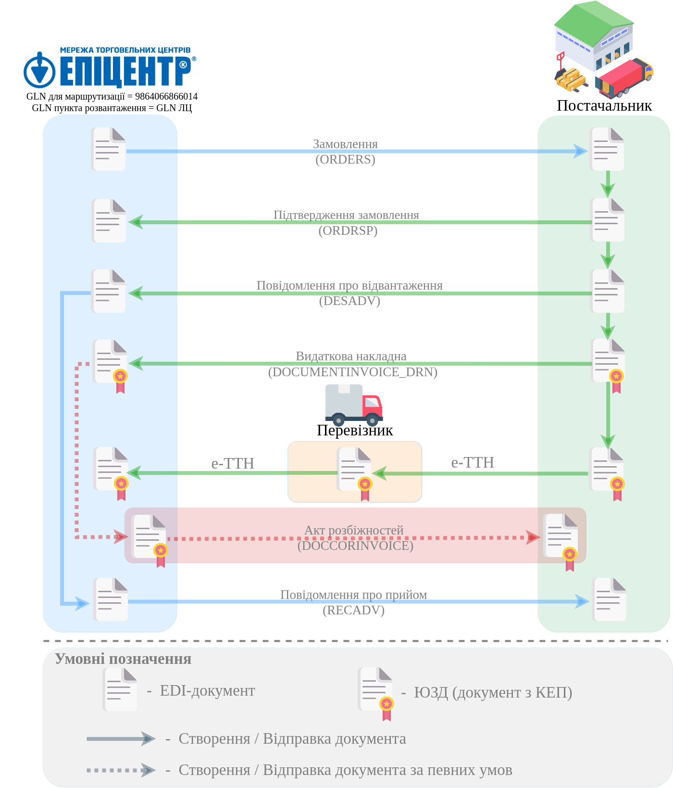

############################################################################################################################
Схема документообігу "Постачальник" - "ЛЦ" (break bulk) на платформі EDI Network 2.0. Інстукція Постачальника
############################################################################################################################

.. картинки в текст

.. |лупа| image:: /_constant/icons/magnifying_glass.png

.. |будинок| image:: /_constant/icons/house.png

.. role:: red

.. role:: orange

.. contents:: Зміст:
   :depth: 2

---------

Вступ
====================================

Дана інструкція описує порядок документообігу Постачальника з логістичним центром ("ЛЦ") мережі "Епіцентр" та Перевізників на платформі EDI Network 2.0. В документообігу приймають участь наступні документи:

- `Замовлення (ORDERS) <https://wiki.edin.ua/uk/latest/EDIN_Specs/XML/ORDER_x.html>`__
- `Підтвердження замовлення (ORDRSP) <https://wiki.edin.ua/uk/latest/EDIN_Specs/XML/ORDRSP_x.html>`__
- `Повідомлення про відвантаження (DESADV) <https://wiki.edin.ua/uk/latest/EDIN_Specs/XML/DESADV_x.html>`__
- `Видаткова накладна (DOCUMENTINVOICE_DRN) <https://wiki.edin.ua/uk/latest/ClientProcesses/Epicentr/Epicentr_XML/DOCUMENTINVOICE_DRN_x.html>`__
- `Електронна товарно-транспортна накладна (е-ТТН) <https://wiki.edin.ua/uk/latest/Docs_ETTNv3/ETTN/ETTNpage_v3.html>`__
- `Акт розбіжностей (DOCCORINVOICE) <https://wiki.edin.ua/uk/latest/ClientProcesses/Epicentr/Epicentr_XML/DOCCORINVOICE_x.html>`__
- `Повідомлення про прийом (RECADV) <https://wiki.edin.ua/uk/latest/EDIN_Specs/XML/RECADV_x.html>`__

**Загальна схема документообігу:**

.. include:: Epicentr_Post_LC_Giper_crossdocking.rst
   :start-after: .. початок блоку для From_crossdocking_to_bulk
   :end-before: .. кінець блоку для From_crossdocking_to_bulk

.. _ettn-create:

5 Створення «е-ТТН» на підставі надісланої «Видаткової накладної» (DOCUMENTINVOICE_DRN)
=====================================================================================================

.. include:: /ETTN_3_0/Create_ETTN_from.rst
   :start-after: .. початок блоку для ETTN_from_documentinvoice_drn
   :end-before: .. кінець блоку для ETTN_from_documentinvoice_drn

------------------------------------------------------------------

Контрагент "Гіпермаркет" (Епіцентр) зі своєї сторони переглядає та підписує документи або формує у відповідь "Акт розбіжностей" (DOCCORINVOICE) у разі незгоди - Ви зможете його знайти у вхідних та зможете підписати_ його в стандартний спосіб платформи EDI Network 2.0.

Наприкінці позитивного завершення документообігу Ви отримаєте "Повідомлення про прийом" (RECADV).

-------------------------------------

.. include:: /_constant/kontakti.rst

