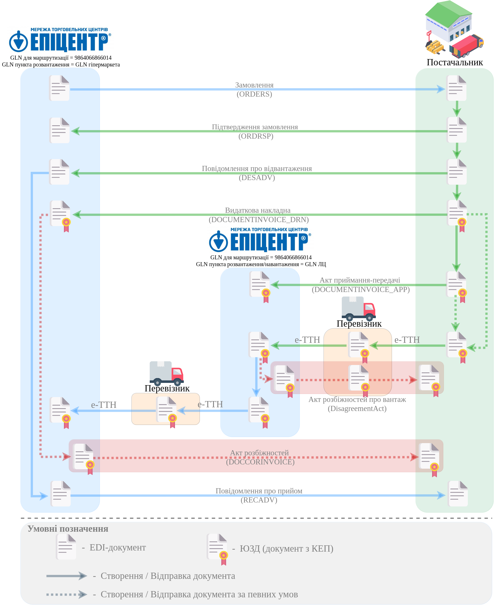

######################################################################################################################################
Схема документообігу "Постачальник" - "ЛЦ" - "Гіпермаркет" (cross docking) на платформі EDI Network 2.0. Інстукція Постачальника
######################################################################################################################################

.. картинки в текст

.. |лупа| image:: /_constant/icons/magnifying_glass.png

.. |будинок| image:: /_constant/icons/house.png

.. role:: red

.. contents:: Зміст:
   :depth: 2

---------

Вступ
====================================

Дана інструкція описує порядок документообігу Постачальника з мережею "Епіцентр" ("ЛЦ" - "Гіпермаркет") та Перевізників на платформі EDI Network 2.0. В документообігу приймають участь наступні документи:

- `Замовлення (ORDERS) <https://wiki.edin.ua/uk/latest/EDIN_Specs/XML/ORDER_x.html>`__
- `Підтвердження замовлення (ORDRSP) <https://wiki.edin.ua/uk/latest/EDIN_Specs/XML/ORDRSP_x.html>`__
- `Повідомлення про відвантаження (DESADV) <https://wiki.edin.ua/uk/latest/EDIN_Specs/XML/DESADV_x.html>`__
- `Видаткова накладна (DOCUMENTINVOICE_DRN) <https://wiki.edin.ua/uk/latest/ClientProcesses/Epicentr/Epicentr_XML/DOCUMENTINVOICE_DRN_x.html>`__
- `Акт приймання-передачі (DOCUMENTINVOICE_APP) <https://wiki.edin.ua/uk/latest/ClientProcesses/Epicentr/Epicentr_XML/DOCUMENTINVOICE_APP_x.html>`__
- `Електронна товарно-транспортна накладна (е-ТТН) <https://wiki.edin.ua/uk/latest/Docs_ETTNv3/ETTN/ETTNpage_v3.html>`__
- `Акт розбіжностей про вантаж (DisagreementAct) <https://wiki.edin.ua/uk/latest/Docs_ETTNv3/DISAGREEMENT_ACT/DISAGREEMENT_ACTpage_v3.html>`__
- `Акт розбіжностей (DOCCORINVOICE) <https://wiki.edin.ua/uk/latest/ClientProcesses/Epicentr/Epicentr_XML/DOCCORINVOICE_x.html>`__
- `Повідомлення про прийом (RECADV) <https://wiki.edin.ua/uk/latest/EDIN_Specs/XML/RECADV_x.html>`__

**Загальна схема документообігу:**

1 Вхід на платформу
====================================

.. include:: /general_2_0/rabota_s_platformoj_EDIN_2.0.rst
   :start-after: .. початок блоку для Enter
   :end-before: .. кінець блоку для Enter

Після успішної авторизації відкриється основне меню, де у вкладці **"Продукти та рішення"** EDIN потрібно обрати сервіс **"EDI Network"**:

.. image:: /_constant/pics_landing/landing_edi.png
   :align: center

.. _ordrsp-create:

2 Створення та відправка «Підтвердження замовлення» (ORDRSP) на підставі вхідного «Замовлення» (ORDERS)
==============================================================================================================

.. include:: /general_2_0/rabota_s_platformoj_EDIN_2.0.rst
   :start-after: .. початок блоку для Ordrsp_from_docs
   :end-before: .. кінець блоку для Ordrsp_from_docs

.. _desadv-create:

3 Створення та відправка "Повідомлення про відвантаження" (DESADV) на підставі надісланого «Підтвердження замовлення» (ORDRSP)
==================================================================================================================================

.. include:: /retail_2.0/formirovanie_otpravka_dokumenta_Uvedomlenie_ob_otgruzke_DESADV_na_EDI_Network_2.0.rst
   :start-after: .. початок блоку для Desadv_from_Ordrsp
   :end-before: .. кінець блоку для Desadv_from_Ordrsp

.. _documentinvoice-drn-create:

4 Створення та відправка "Видаткової накладної" (DOCUMENTINVOICE_DRN) на підставі надісланого "Повідомлення про відвантаження" (DESADV)
================================================================================================================================================

"Видаткова накладна" (DOCUMENTINVOICE.DocumentFunctionCode = DRN) може бути сформована на підставі надісланого "Повідомлення про відвантаження" (DESADV). Для формування "Видаткової накладної" (DOCUMENTINVOICE.DocumentFunctionCode = DRN) потрібно перейти в папку **"Надіслані"** та обрати документ-підставу (для зручності можливо скористатись `пошуком <https://wiki.edin.ua/uk/latest/general_2_0/rabota_s_platformoj_EDIN_2.0.html#doc-search>`__):

Для формування "Видаткової накладної" (DOCUMENTINVOICE.DocumentFunctionCode = DRN) натисніть **"Створити документ"** в блоці `ланцюжка документів <https://wiki.edin.ua/uk/latest/_constant/chain/chain.html>`__:

При цьому автоматично відкривається форма "Видаткової накладної" (DOCUMENTINVOICE.DocumentFunctionCode = DRN):

У відкритій формі "Видаткової накладної" (DOCUMENTINVOICE.DocumentFunctionCode = DRN) майже всі поля документа можуть бути заповнені автоматично з пов'язаного документа-підстави та `Товарного довідника <https://wiki.edin.ua/uk/latest/general_2_0/Directories.html#goods-directory>`__ (обов'язкові до заповнення поля позначені червоною зірочкою :red:`*`).

.. include:: /ClientProcesses/BOX_Market/BOX_Market_Instructions/BOX_Market_Standard.rst
   :start-after: .. початок блоку для ForAllDOCUMENTINVOICE
   :end-before: .. кінець блоку для ForAllDOCUMENTINVOICE

Про необхідність заповнення та інші помилки в табличній частині документа Ви будете проінформовані (вказується номер позиції та невідповідність), а також рядок позиції виділяється помаранчевим кольором:

.. hint::
   Табличне значення поля "Код категорії ПДВ" залежить від "Ставки ПДВ":

   * якщо "Ставка ПДВ"= 20 / 19 / 16 / 14 / 7 / 2 %, то "Код категорії ПДВ"=Стандартний;
   * якщо "Ставка ПДВ"= 0%, то "Код категорії ПДВ"=Нульовий або Звільнений (від податку).

   .. image:: pics_Epicentr_Post_LC_Giper_crossdocking/Epicentr_Post_LC_Giper_crossdocking_005.png
      :align: center

Для внесення змін (коригування) в позиції потрібно натиснути на штрихкод позиції:

.. image:: pics_Epicentr_Post_LC_Giper_crossdocking/Epicentr_Post_LC_Giper_crossdocking_007.png
   :align: center

Якщо по якійсь з позицій не буде поставки її необхідно відзначити галочкою і **"Видалити"** (повернути видалені позиції можливо за допомогою кнопки **"+Додати"**):

.. image:: pics_Epicentr_Post_LC_Giper_crossdocking/Epicentr_Post_LC_Giper_crossdocking_008.png
   :align: center

Після внесення всіх необхідних змін в документ потрібно натиснути кнопку **"Зберегти"** (1), після чого можливо **"Підписати"** (2):

.. _sign:

4.1 Підписання та відправка "Видаткової накладної" (DOCUMENTINVOICE.DocumentFunctionCode = DRN)
--------------------------------------------------------------------------------------------------

.. tabs::

   .. tab:: Файловий ключ

      .. include:: /_constant/signing/signing.rst
         :start-after: .. початок блоку для Signing
         :end-before: .. кінець блоку для Signing

   .. tab:: Token

      .. include:: /_constant/token_signing/token_signing.rst
         :start-after: .. початок блоку для TokenSign
         :end-before: .. кінець блоку для TokenSign

   .. tab:: Гряда

      .. include:: /_constant/gryada_signing/gryada_signing.rst
         :start-after: .. початок блоку для GryadaSign
         :end-before: .. кінець блоку для GryadaSign

   .. tab:: Cloud

      .. include:: /_constant/cloud_signing/cloud_signing.rst
         :start-after: .. початок блоку для CloudSign
         :end-before: .. кінець блоку для CloudSign

Після підписання "Видаткової накладної" (DOCUMENTINVOICE.DocumentFunctionCode = DRN) документ потрібно **"Відправити"**:

Відправлений документ автоматично потрапляє в папку **"Надіслані"** і буде знаходитись в `ланцюжку документів <https://wiki.edin.ua/uk/latest/_constant/chain/chain.html>`__ разом із пов'язаними документами. "Гіпермаркет" Епіцентр зі своєї сторони переглядає та підписує документ.

.. _recadv-create:

5 Створення та відправка "Повідомлення про прийом" (RECADV). Сторона ПрАТ "МХП" Логістика
==============================================================================================================

ПрАТ "МХП" Логістика створює "Повідомлення про прийом" (RECADV), чим підтверджує фактичний прийом товарних позиції до кінцевої точки доставки у зазначеній кількості, згідно замовлення.

.. include:: /retail_2.0/formirovanie_RECADV_na_EDI_Network_2.0.rst
   :start-after: .. початок блоку для Recadv_from_desadv
   :end-before: .. кінець блоку для Recadv_from_desadv

.. _insdes-create:

6 Створення та відправка "Інструкції з доставки" (INSDES). Сторона мережі "Епіцентр"
==============================================================================================================

За потреби отримки товарів зі складів 3pl-оператора (ПрАТ "МХП" Логістика), мережа "Епіцентр" формує "Інструкцію з доставки" (INSDES) з вказанням потрібних товарних позиції та кінцевою точкою доставки для конкретної позиції.

.. include:: /retail_2.0/INSDES_na_EDI_Network.rst
   :start-after: .. початок блоку для Insdes_from_zero
   :end-before: .. кінець блоку для Insdes_from_zero

.. _desscc-create:

7 Створення та відправка "Повідомлення про відвантаження для розподільного центру" (DESSCC). Сторона ПрАТ "МХП" Логістика
=============================================================================================================================

На підставі отриманої "Інструкції з доставки" (INSDES) 3pl-оператор (ПрАТ "МХП" Логістика) створює "Повідомлення про відвантаження для розподільного центру" (DESSCC), де вказує позиції, що будуть поставлені, їх кількість. У цьому документі є можливість внести інформацію по кожній палеті, тому цей документ дуже детально описує кожну поставку.

.. include:: /retail_2.0/DESSCC_na_EDI_Network.rst
   :start-after: .. початок блоку для Desscc_from_Insdes
   :end-before: .. кінець блоку для Desscc_from_Insdes

.. _retann-send:

8 Відправка "Повідомлення про повернення" (RETANN) від мережі "Епіцентр"
==============================================================================================================

Для повернення тари та неприйнятих товарів мережа "Епіцентр" формує "Повідомлення про повернення" (RETANN) та відправляє 3pl-оператору (ПрАТ "МХП" Логістика).

-------------------------------------

.. include:: /_constant/kontakti.rst
