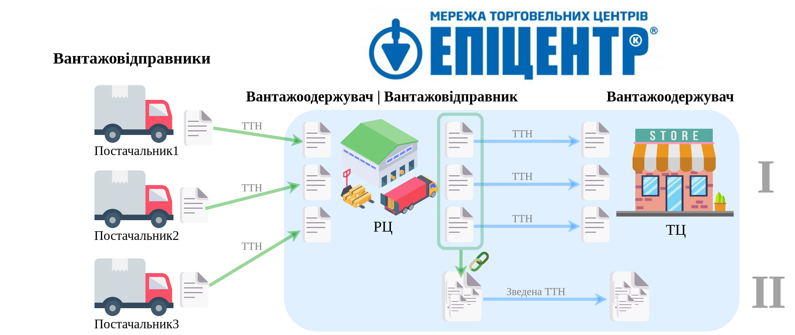

########################################################################################################################
Алгоритм роботи зі «Зведеною ТТН»
########################################################################################################################

.. this instruction not announced

.. role:: green

.. role:: blue

**Постачальники** (Вантажовідправники) відправляють свої ТТН (`за стандартним процесом <https://wiki.edin.ua/uk/latest/API_ETTNv3_1/Work_with_API/ETTNv3_API_work.html>`__) в РЦ мережі "Епіцентр", що виступає Вантажоодержувачем в даних документах. Далі РЦ мережі "Епіцентр" формує нові ТТН та відправляє в свої ТЦ (`за стандартним процесом <https://wiki.edin.ua/uk/latest/API_ETTNv3_1/Work_with_API/ETTNv3_API_work.html>`__).

«Зведена ТТН» дозволяє прив'язати нові ТТН мережі "Епіцентр", що відносяться до одного ТЦ і спростити прийомку товарів на рівні однієї «Зведеної ТТН».

«Зведена ТТН» - є внутрішнім документом і не реєструється в ЦБД!

-----------------------------------------------

**Загальна схема документообігу:**

-----------------------------------------------

**Алгоритм формування «Зведеної ТТН» (API):**

* :green:`1` `Авторизація РЦ <https://wiki.edin.ua/uk/latest/integration_2_0/APIv2/Methods/Authorization.html>`__
* :green:`2` `Створення чернетки Зведеної ТТН <https://wiki.edin.ua/uk/latest/API_ETTNv3_1/Methods/CreateEcmrEttn.html>`__
* :blue:`3` `Прив'язка (додавання) ТТН до Зведеної ТТН <https://wiki.edin.ua/uk/latest/API_ETTNv3_1/Methods/PostLinkDocs.html>`__
   * `Отримання пов'язаних документів Зведеної ТТН <https://wiki.edin.ua/uk/latest/API_ETTNv3_1/Methods/GetLinkDocs.html>`__
   * `Розірвання прив'язки (видалення) ТТН до Зведеної ТТН <https://wiki.edin.ua/uk/latest/API_ETTNv3_1/Methods/DelLinkDocs.html>`__
* :green:`4` `Відправка Зведеної ТТН (РЦ->ТЦ) <https://wiki.edin.ua/uk/latest/API_ETTNv3_1/Methods/SendEcmrDoc.html>`__

-----------------------------------------------

**Технічні моменти:**

1) Створення чернетки «Зведеної ТТН»

Специфікація «Зведеної ТТН» відрізняється від звичайної ТТН (`XML <https://wiki.edin.ua/uk/latest/Docs_ETTNv3/ETTN/ETTNpage_v3.html>`__ / `JSON <https://wiki.edin.ua/uk/latest/Docs_ETTNv3/ETTN/ETTNpage_v3_json.html>`__) значенням тега **ExchangedDocumentContext.GuidelineSpecifiedDocumentContextParameter**:

* ``urn:ua:e-transport.gov.ua:ettn:01:generic:001`` => 1 - (звичайна ТТН).
* ``urn:ua:e-transport.gov.ua:ettn:01:generic:101`` => 101 - ("Зведена ТТН").
2) «Зведена ТТН» може бути створена вже після відправки звичайних ТТН.
3) При створені «Зведеної ТТН» ми рекомендуємо виконувати перевірки на тотожність GLN Вантажовідправника, Перевізник, Водія, Вантажоодержувача, Пунктів навантаження-розвантаження з відповідними даними в звичаних ТТН (помилка при виявленні розбіжності).
4) Перевізник у всіх пов'язаних ТТН документів має бути однаковий (помилка при виявленні розбіжності).
5) ТТН може бути пов'язана лише з однією "Зведеною ТТН" (один зв'язок). Тобто для формування іншого зв'язку попередній потрібно `розірвати <https://wiki.edin.ua/uk/latest/API_ETTNv3_1/Methods/DelLinkDocs.html>`__!
6) Чернетка «Зведеної ТТН» не доступна до редагування (лише для перегляду).
7) До «Зведеної ТТН» можливо прив'язати (додати) до 100 ТТН документів (обмеження).
8) Видалення прив'язки ТТН до «Зведеної ТТН» доступне до та після відправки «Зведеної ТТН».
9) При відправці для «Зведеної ТТН» виконуються додаткові перевірки: всі пов'язані документи мають бути відправлені + перевірки, що і при додаванні ТТН документів.
10) Після відправки «Зведеної ТТН» прив'язувати (додавати) нові ТТН заборонено.
11) При видаленні «Зведеної ТТН» усі прив'язки до ТТН розриваються (видаляються).

