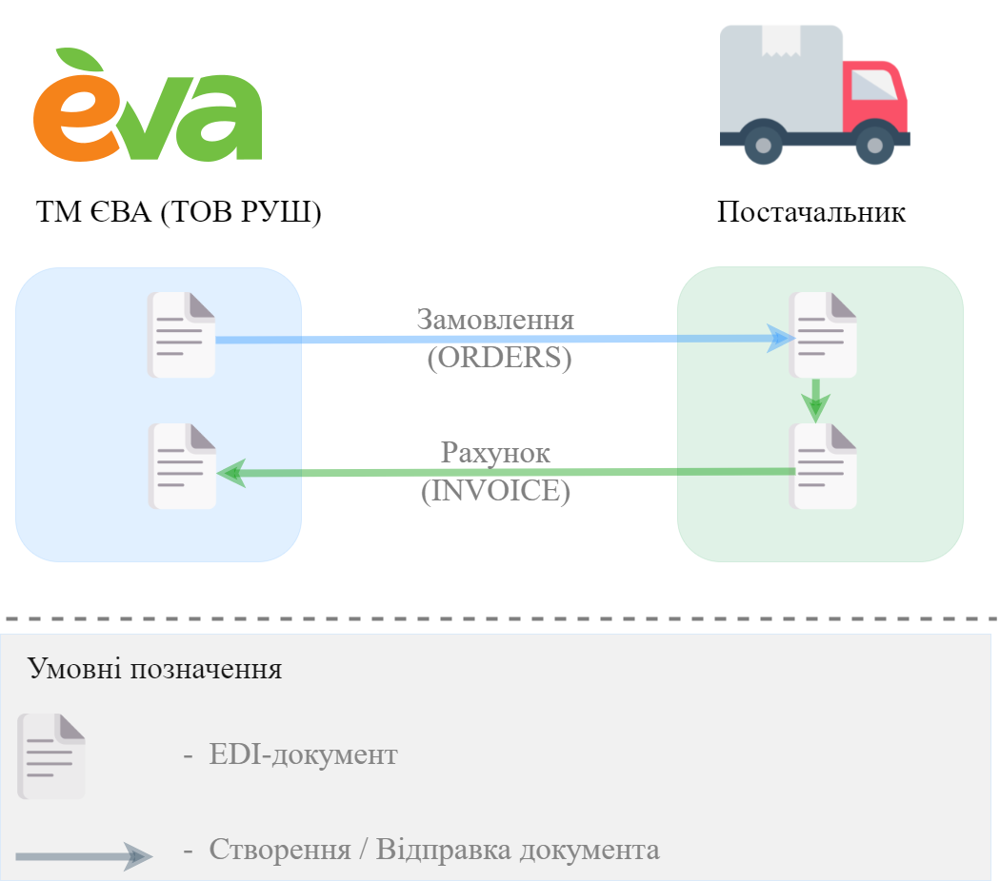

########################################################################################################################
Документообіг з мережею "EVA" (ТОВ "Руш") без ЮЗД на платформі EDI Network 2.0
########################################################################################################################

.. сюда закину немного картинок для текста

.. |лупа| image:: pics_

.. |будинок| image:: pics_

.. role:: red

.. contents:: Зміст:
   :depth: 2

---------

Вступ
====================================

Дана інструкція описує порядок документообігу з мережею "EVA" (ТОВ "Руш") на платформі EDI Network 2.0 за схемою, що не передбачає підписання документів. В документообігу приймають участь наступні документи:

- `Замовлення <https://wiki.edin.ua/uk/latest/XML/XML-structure.html#order>`__
- `Рахунок <https://wiki.edin.ua/uk/latest/XML/XML-structure.html#invoice>`__

**Загальна схема документообігу:**

**Детальна інструкція в процесі написання.**

.. tip::
   `Універсальна інструкція по створенню та відправці "Рахунку" (INVOICE) <https://wiki.edin.ua/uk/latest/retail_2.0/formirovanie_otpravka_dokumenta_Schetfaktura_INVOICE_na_EDI_Network_2.0.html>`__

-------------------------------------

.. include:: /_static/files/kontakti.rst
