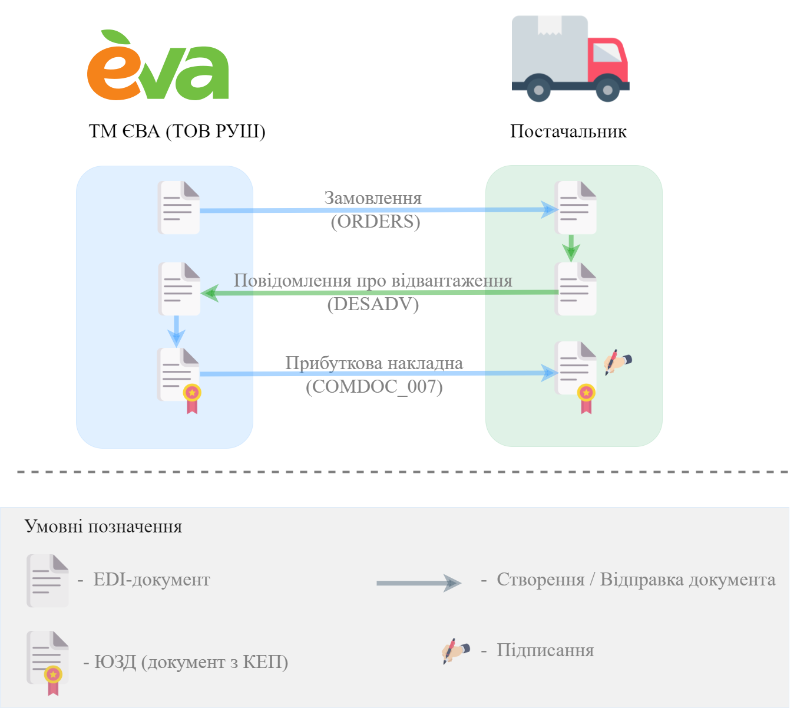
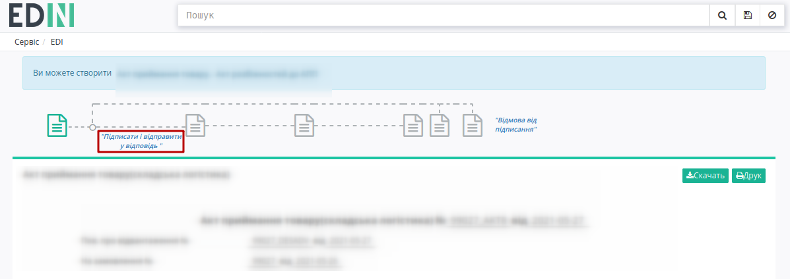

########################################################################################################################
Документообіг з мережею "EVA" (ТОВ "Руш") з ЮЗД на платформі EDI Network 2.0
########################################################################################################################

.. сюда закину немного картинок для текста

.. |лупа| image:: pics_

.. |будинок| image:: pics_

.. role:: red

.. contents:: Зміст:
   :depth: 2

---------

Вступ
====================================

Дана інструкція описує порядок документообігу з мережею "EVA" (ТОВ "Руш") на платформі EDI Network 2.0 за схемою, що передбачає обмін юридично значущими документами (ЮЗД). В документообігу приймають участь наступні документи:

- `Замовлення <https://wiki.edin.ua/uk/latest/EDIN_Specs/XML/ORDER_x.html>`__
- `Повідомлення про відвантаження <https://wiki.edin.ua/uk/latest/EDIN_Specs/XML/DESADV_x.html>`__
- `Прибуткова накладна <https://wiki.edin.ua/uk/latest/EDIN_Specs/XML/COMDOC_007_x.html>`__

**Загальна схема документообігу:**

**Детальна інструкція в процесі написання.**

.. tip::
   `Універсальна інструкція по створенню та відправці "Повідомлення про відвантаження" (DESADV) <https://wiki.edin.ua/uk/latest/retail_2.0/formirovanie_otpravka_dokumenta_Uvedomlenie_ob_otgruzke_DESADV_na_EDI_Network_2.0.html>`__

.. attention::
   Вхідний документ "Прибуткова накладна" (COMDOC_007) для завершення документообігу потребує підписання зі сторони Постачальника!

Для підписання документа необхідно перейти в документ та натинути на кнопку **"Підписати та відправити у відповідь"**:

.. _sign:

Підписання на платформі EDIN 2.0
=========================================================================================================================

.. tabs::

   .. tab:: Файловий ключ

      .. include:: /_constant/signing/signing.rst
         :start-after: .. початок блоку для Signing
         :end-before: .. кінець блоку для Signing

   .. tab:: Token

      .. include:: /_constant/token_signing/token_signing.rst
         :start-after: .. початок блоку для TokenSign
         :end-before: .. кінець блоку для TokenSign

   .. tab:: Гряда

      .. include:: /_constant/gryada_signing/gryada_signing.rst
         :start-after: .. початок блоку для GryadaSign
         :end-before: .. кінець блоку для GryadaSign

   .. tab:: Cloud

      .. include:: /_constant/cloud_signing/cloud_signing.rst
         :start-after: .. початок блоку для CloudSign
         :end-before: .. кінець блоку для CloudSign

-------------------------------------

.. include:: /_constant/kontakti.rst
