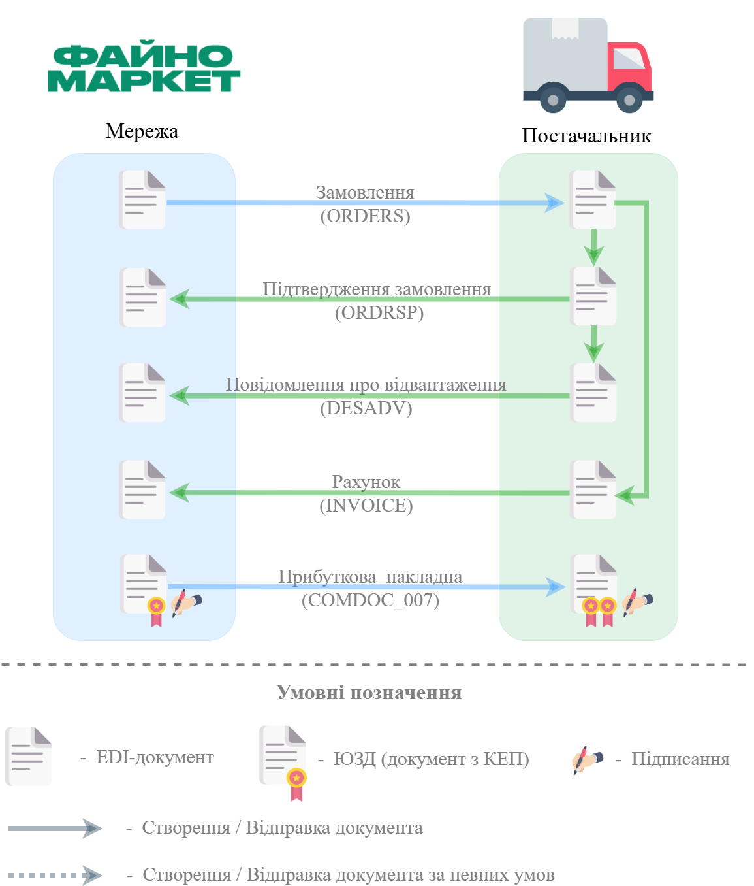

#########################################################################################################################################
Документообіг з мережею "Файно Маркет" на платформі EDI Network 2.0. Схема роботи з Прибутковою накладною. Інструкція для Постачальника
#########################################################################################################################################

.. сюда закину немного картинок для текста

.. |bad_doc| image:: /general_2_0/pics_rabota_s_platformoj_EDIN_2.0/rabota_s_platformoj_066.png

.. |лупа| image:: /_constant/icons/magnifying_glass.png

.. |будинок| image:: /_constant/icons/house.png

.. role:: red

.. role:: green

.. role:: orange

.. role:: underline

.. contents:: Зміст:
   :depth: 5

---------

Вступ
====================================

Дана інструкція описує порядок документообігу з мережею "Файно Маркет" за схемою роботи з Прибутковою накладною на платформі EDI Network 2.0. В документообігу приймають участь наступні документи:

- `Замовлення (ORDER) <https://wiki-v2.edin.ua/books/xml-specifikaciyi-dokumentiv/page/zamovlennia-order>`__
- `Підтвердження замовлення (ORDRSP) <https://wiki-v2.edin.ua/books/xml-specifikaciyi-dokumentiv/page/pidtverdzennia-zamovlennia-ordrsp>`__
- `Повідомлення про відвантаження (DESADV) <https://wiki-v2.edin.ua/books/xml-specifikaciyi-dokumentiv/page/povidomlennia-pro-vidvantazennia-desadv>`__
- `Рахунок (INVOICE) <https://wiki-v2.edin.ua/books/xml-specifikaciyi-dokumentiv/page/raxunok-invoice>`__
- `Прибуткова накладна (COMDOC_007) <https://wiki-v2.edin.ua/books/xml-specifikaciyi-dokumentiv/page/pributkova-nakladna-comdoc-007>`__

**Загальна схема документообігу:**

1. Вхід на платформу
====================================

.. include:: /general_2_0/rabota_s_platformoj_EDIN_2.0.rst
   :start-after: .. початок блоку для Enter
   :end-before: .. кінець блоку для Enter

Після успішної авторизації відкриється основне меню, де у вкладці **"Продукти та рішення"** EDIN потрібно обрати сервіс **"EDI Network"**:

.. image:: /_constant/pics_landing/landing_edi.png
   :align: center

.. _pricat-create:

2. Створення та відправка «Підтвердження замовлення» (ORDRSP) на підставі вхідного «Замовлення» (ORDERS)
==============================================================================================================

.. include:: /retail_2.0/ORDRSP_na_EDI_Network.rst
   :start-after: .. початок блоку для Ordrsp_from_docs
   :end-before: .. кінець блоку для Ordrsp_from_docs

.. _desadv-create:

3. Створення та відправка "Повідомлення про відвантаження" (DESADV) на підставі надісланого «Підтвердження замовлення» (ORDRSP)
==================================================================================================================================

.. include:: /retail_2.0/formirovanie_otpravka_dokumenta_Uvedomlenie_ob_otgruzke_DESADV_na_EDI_Network_2.0.rst
   :start-after: .. початок блоку для Desadv_from_Ordrsp
   :end-before: .. кінець блоку для Desadv_from_Ordrsp

------------------------------------------------------

.. _sign:

Підписання на платформі EDIN 2.0
=========================================================================================================================

.. include:: /_constant/atb_check/atb_check.rst
   :start-after: .. початок блоку для ATB_check
   :end-before: .. кінець блоку для ATB_check

.. tabs::

   .. tab:: Файловий ключ

      .. include:: /_constant/signing/signing.rst
         :start-after: .. початок блоку для Signing
         :end-before: .. кінець блоку для Signing

   .. tab:: Token

      .. include:: /_constant/token_signing/token_signing.rst
         :start-after: .. початок блоку для TokenSign
         :end-before: .. кінець блоку для TokenSign

   .. tab:: Гряда

      .. include:: /_constant/gryada_signing/gryada_signing.rst
         :start-after: .. початок блоку для GryadaSign
         :end-before: .. кінець блоку для GryadaSign

   .. tab:: Cloud

      .. include:: /_constant/cloud_signing/cloud_signing.rst
         :start-after: .. початок блоку для CloudSign
         :end-before: .. кінець блоку для CloudSign

-------------------------------------

.. include:: /_constant/kontakti.rst
