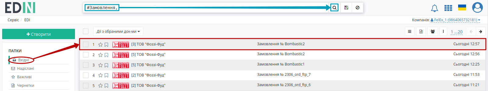

##################################################################################################################################################################################
Формування та відправка "Накладної за кількістю" мережі Фоззі за схемою "Match Invoice". Інструкція для Постачальника.
##################################################################################################################################################################################

.. сюда закину немного картинок для текста

.. role:: red

.. contents:: Зміст:
   :depth: 2

---------

"Накладна за кількістю" (DOCUMENTINVOICE.DocumentFunctionCode = TN) є юридично значущим документом (ЮЗД) і може використовуватись при роботі з мережею Фоззі в схемі документообігу "Match Invoice". "Накладна за кількістю" може бути створена Постачальником на підставі вхідного "Замовлення" (ORDER).

`XML Специфікації для роботи з Фоззі (за схемою «Match Invoice») <https://wiki.edin.ua/uk/latest/ClientProcesses/Fozzy/Fozzy_XML-structure.html>`__

Загальна схема документообігу:

.. image:: pictures/Fozzy_schema_v1_0.png
   :height: 700px
   :align: center

1 Формування "Накладної за кількістю" на підставі вхідного "Замовлення" (ORDER)
====================================================================================================================================

Для формування "Накладної за кількістю" (DOCUMENTINVOICE.DocumentFunctionCode = TN) на підставі "Замовлення" (ORDER) потрібно перейти в розділ "Вхідні" та обрати потрібний документ. Для зручності можливо скористатись пошуком (за типом документа (приклад в зображенні), номером документа чи GLN):

.. prn_pic

У відкритому документі на формі-підказці виберіть зі списку **"Накладна за кількістю"**:

Після чого на підставі "Замовлення" (ORDER) автоматично створюється "Накладна за кількістю" (DOCUMENTINVOICE.DocumentFunctionCode = TN). На формі створюваного документа значення більшості полів заповняться (пененесутся) з документа-підстави. Всі поля, позначені червоною зірочкою :red:`*` - **обов'язкові до заповнення**:

Дані позицій можливо відредагувати та **"Змінити"** через pop-up вікно, що відкривається по кліку на штрихкод товару:

Також можливо **"Видалити"** товарні позиції з табличної частини документа:

До табличної частини "Накладної за кількістю" (DOCUMENTINVOICE.DocumentFunctionCode = TN) можливо додавати лише ті позиції, що були вказані в "Замовленні" (вибрати зі списку). Якщо всі позиції співпадають з позиціями в "Замовленні" (ORDER), то в табличній частині кнопка **"+Додати"** не відображається:

Після внесення всіх необхідних змін в документ потрібно натиснути кнопку **"Зберегти"** (1), після чого можливо **"Підписати"** (2):

.. _sign:

1.1 Підписання та відправка "Накладної за кількістю"
--------------------------------------------------------------------------------------------------

.. tabs::

   .. tab:: Файловий ключ

      .. include:: /_constant/signing/signing.rst
         :start-after: .. початок блоку для Signing
         :end-before: .. кінець блоку для Signing

   .. tab:: Cloud

      .. include:: /_constant/cloud_signing/cloud_signing.rst
         :start-after: .. початок блоку для CloudSign
         :end-before: .. кінець блоку для CloudSign

Після підписання "Накладної за кількістю" (DOCUMENTINVOICE.DocumentFunctionCode = TN) документ потрібно **"Відправити"**:

.. image:: pics_Fozzy_DOCUMENTINVOICE_TN_instruction/Fozzy_DOCUMENTINVOICE_TN_instruction_007.png
   :align: center

Відправлений документ автоматично потрапляє в папку **"Надіслані"** і буде знаходитись в ланцюжку документів разом із пов'язаними документами. Мережа Фоззі зі своєї сторони переглядає та підписує документ.

2 Обробка вхідного документа "Акт невідповідності" (COMDOC_009)
====================================================================================================================================

У випадку розходження між відправленною і фактично прийнятою кількістю товару чи виникненням цінової розбіжності – мережа надсилає Вам "Акт невідповідності" (COMDOC_009):

У вхідному документі будуть зазначені кількісні чи цінові розбіжності по кожному товару та причина невідповідності.

.. image:: pictures/pics_robota_s_Fozzy_14.png
   :align: center

Після ознайомлення з документом необхідно відправити "Коригування до товарної накладної" (DOCCORINVOICE) з правками кількості/ціни згідно розбіжностей вказаних в "Акті невідповідності" (COMDOC 009) мережі Фоззі.

------------------------------------------------

.. include:: /_constant/kontakti.rst