Обмін документами в системі GS1 ("ДжіЕс1 Україна") за допомогою сервісу EDIN "Вільний"
###################################################################################################

.. role:: red

.. role:: green

.. role:: orange

.. role:: olive

.. role:: navy

.. role:: underline

.. сюда закину немного картинок для текста

.. |прокрутка1| image:: /Vilnyi/pics_Work_with_Vilnyi/Work_with_Vilnyi_12.png

.. |прокрутка2| image:: /Vilnyi/pics_Work_with_Vilnyi/Work_with_Vilnyi_11.png

.. contents:: Зміст:
   :depth: 3

---------

Вступ
====================================

Сервіс `"Вільний" <https://wiki.edin.ua/uk/latest/Vilnyi/Work_with_Vilnyi.html>`__ можливо вбудувати в особистий кабінет сайту за допомогою кількох простих кроків і організувати електронний документообіг прямо у Вас на сайті під власним брендом: (`детальніше <https://wiki.edin.ua/uk/latest/Vilnyi/Vilnyi_integration.html>`__). Дана інструкція описує порядок взаємодії з платформою GS1 ("ДжіЕс1 Україна"): https://gs1ua.org/ua для обміну документами в сервісі "Вільний".

.. _gs1-enter:

1 Вхід до особистого кабінету GS1 ("ДжіЕс1 Україна")
==============================================================

На сайті GS1 ("ДжіЕс1 Україна"): https://gs1ua.org/ua потрібно виконати **"Вхід до особистого кабінету"**:

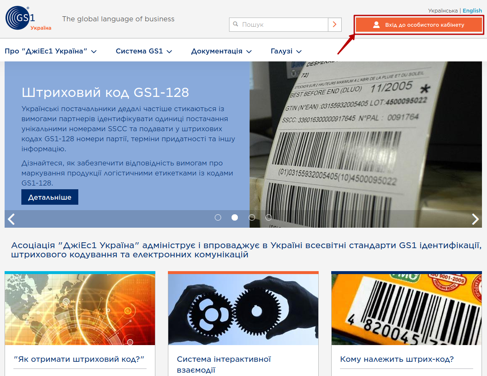

:underline:`Зареєстрованим` учасникам потрібно ввести логін користувача, пароль та натиснути **"Увійти"**:

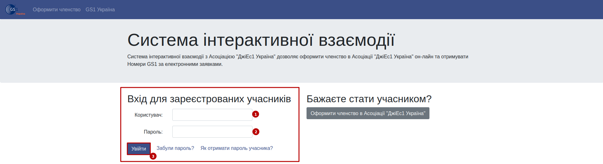

:underline:`Незареєстрованим` учасникам потрібно **"Оформити членство в Асоціації «ДжіЕс1 Україна»"**.

.. _gs1-reg:

1.1 Оформлення членства в Асоціації «ДжіЕс1 Україна»
-------------------------------------------------------------------------------------

Після натискання на кнопку **"Оформити членство в Асоціації «ДжіЕс1 Україна»"**: 

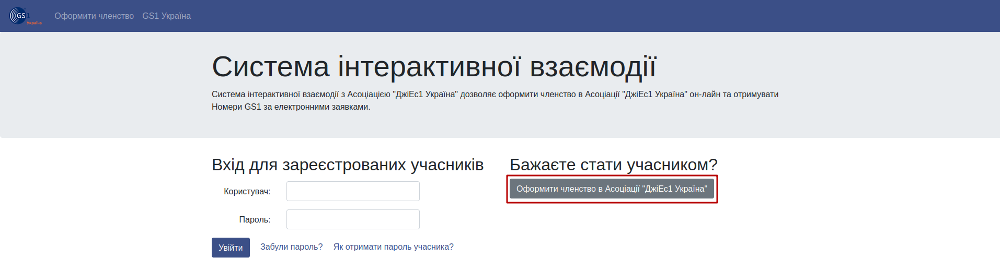

відкриваються умови вступу до Асоціації, з якими потрібно ознайомитись та погодитись, поставивши відмітку, та продовжити реєстрацію (кнопка **"Вперед"**):

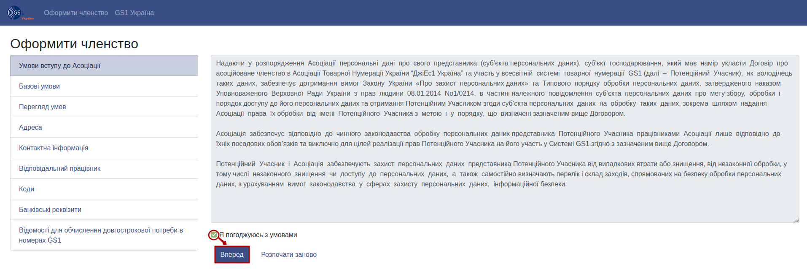

Далі потрібно обрати організаційну форму, спосіб використання Системи GS1 та продовжити реєстрацію (кнопка **"Вперед"**):

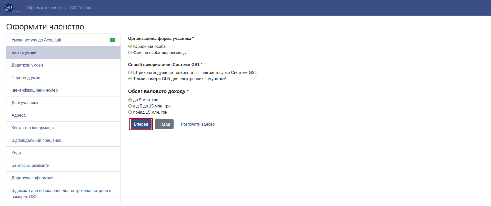

В блоці додаткових умов потрібно уточнити дані, в залежності від раніше обраних значень та продовжити реєстрацію (кнопка **"Вперед"**):

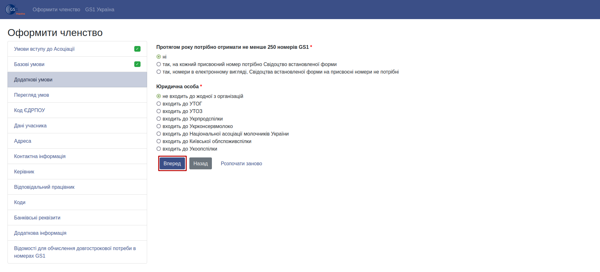

В залежності від обраних значень буде представлена таблиця умов, з якою потрібно ознайомитись та продовжити реєстрацію (кнопка **"Вперед"**):

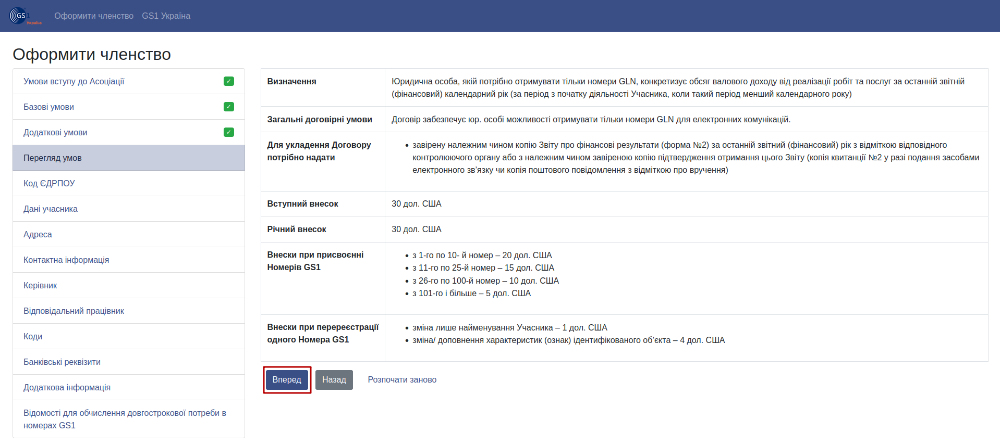

Далі потрібно вказати код ЄДРПОУ чи ІПН в залежності від обраної раніше організаційної форми (юридична особа / ФОП) та продовжити реєстрацію (кнопка **"Вперед"**):

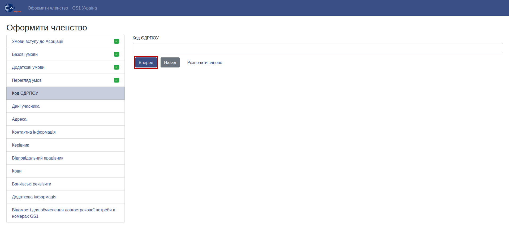

Далі потрібно вказати Прізвище/Ім'я/По-батькові (для ФОП) чи повне та скорочене найменування юр. особи та продовжити реєстрацію (кнопка **"Вперед"**):

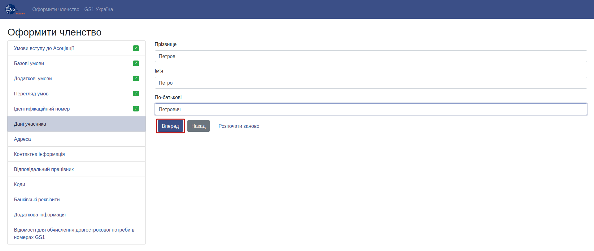

Далі потрібно вказати адреси реєстрації та кореспонденції та продовжити реєстрацію (кнопка **"Вперед"**):

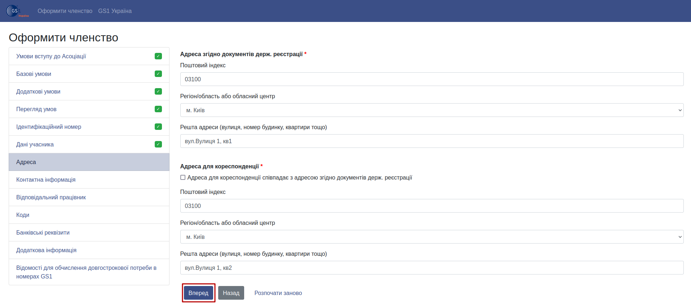

Далі можливо вказати контактну інформацію та продовжити реєстрацію (кнопка **"Вперед"**):

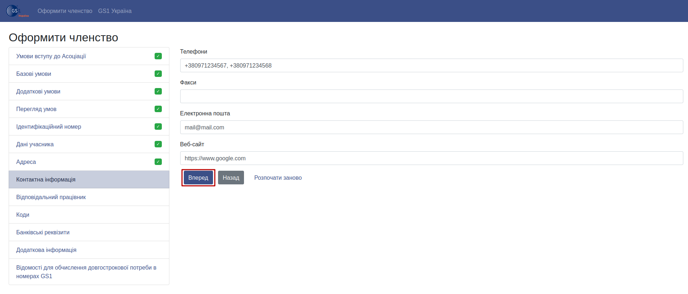

Для юридичної особи вказується Прізвище/Ім'я/По-батькові та посада керівника (для ФОП цей блок відсутній):

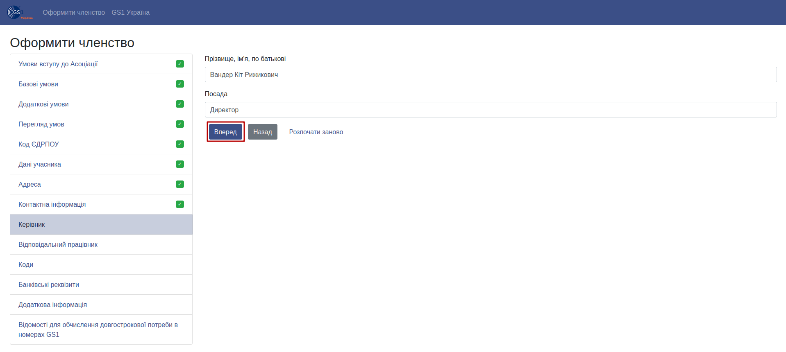

Далі потрібно вказати дані відповідального працівника та продовжити реєстрацію (кнопка **"Вперед"**):

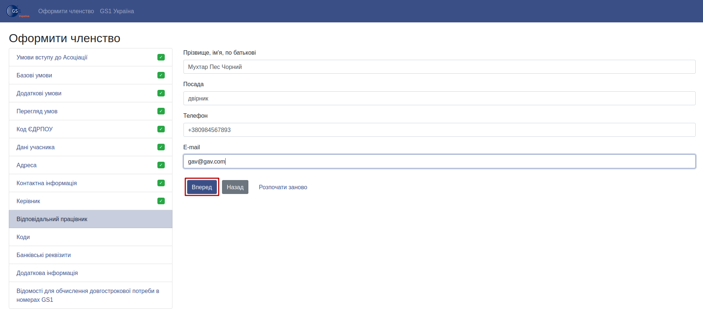

Далі потрібно вказати коди КОАТУУ/КВЕД та продовжити реєстрацію (кнопка **"Вперед"**):

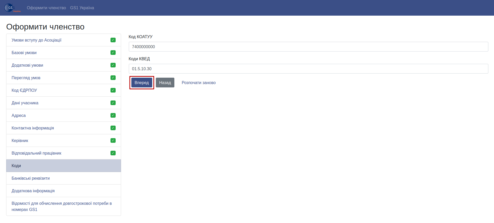

Далі потрібно вказати банківські реквізити та продовжити реєстрацію (кнопка **"Вперед"**):

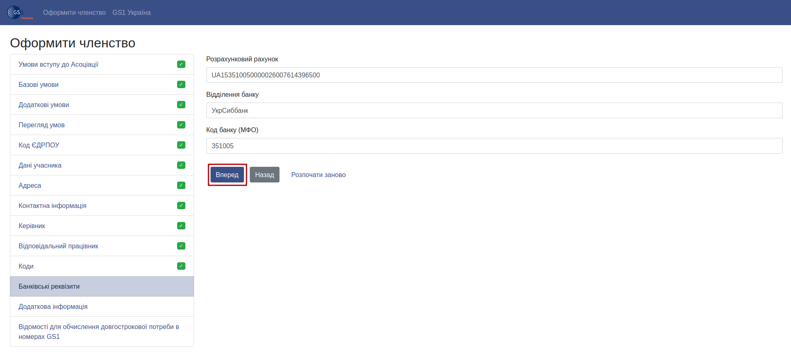

Далі потрібно вказати додаткову інформацію та продовжити реєстрацію (кнопка **"Вперед"**):

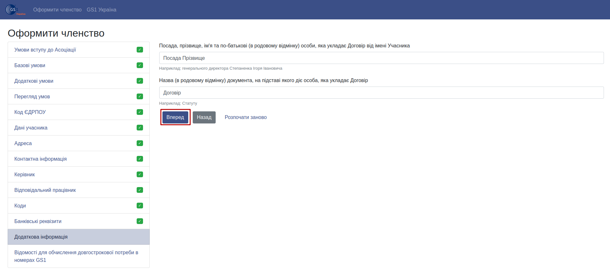

Після заповнення форми відомостей для обчислення довгострокової потреби в номерах GS1 можливо **"Закінчити"** реєстрацію:

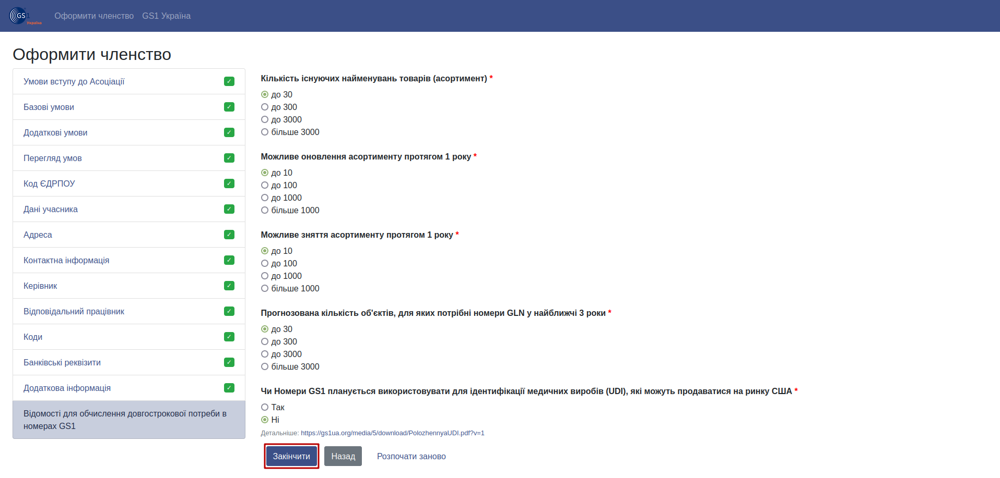

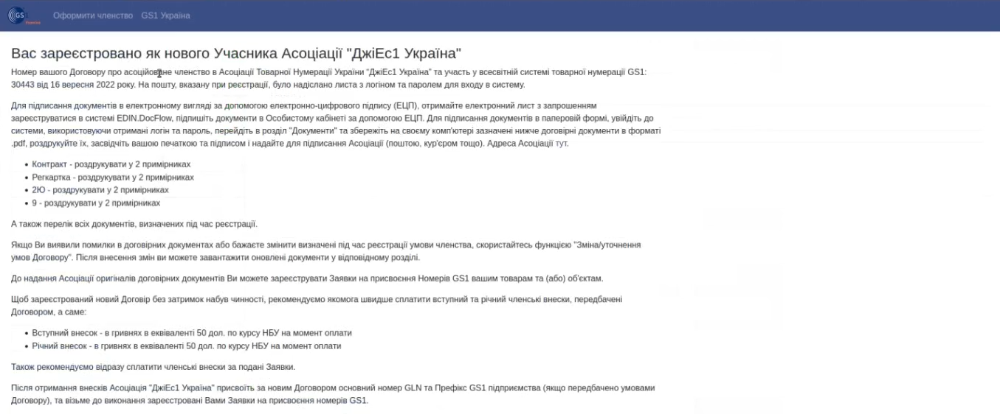

На вказану електронну пошту прийде лист з посиланням для активації облікового запису:

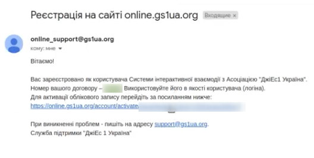

При переході за цим посиланням потрібно **"Встановити"** пароль (не менше 8 символів, з заголовними та рядковими літерами та має містити хоча б один символ):

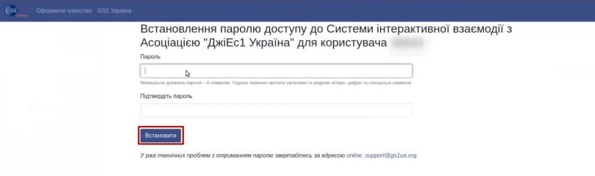

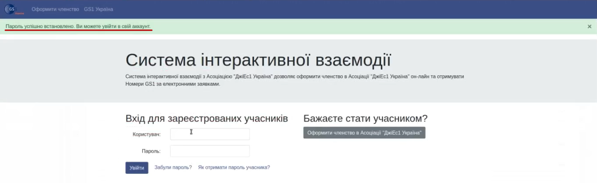

Тепер Ви можете здійснити `вхід до системи GS1 ("ДжіЕс1 Україна") <https://wiki.edin.ua/uk/latest/ClientProcesses/GS1/GS1_Instructions/GS1_Vilnyi.html#gs1-enter>`__.

.. _sign-send:

2 Підписання та подача пакету документів в особистому кабінеті GS1 ("ДжіЕс1 Україна") за допомогою сервісу EDIN "Вільний"
============================================================================================================================

Після того, як Ви пройшли `авторизацію <https://wiki.edin.ua/uk/latest/ClientProcesses/GS1/GS1_Instructions/GS1_Vilnyi.html#gs1-enter>`__ в системі GS1 ("ДжіЕс1 Україна") Вам потрібно пройти до розділу **"Документи"**:

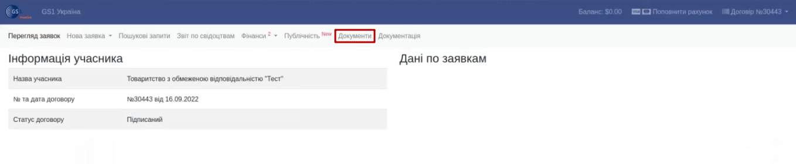

В блоці "Документи згідно вашого договору" можливо **"Завантажити"** та ознайомитись зі створеними документами, а також Вивантажити та **"Передати"** файли для дооформлення документів (розмір файлу не повинен перевищувати 2 Мб):

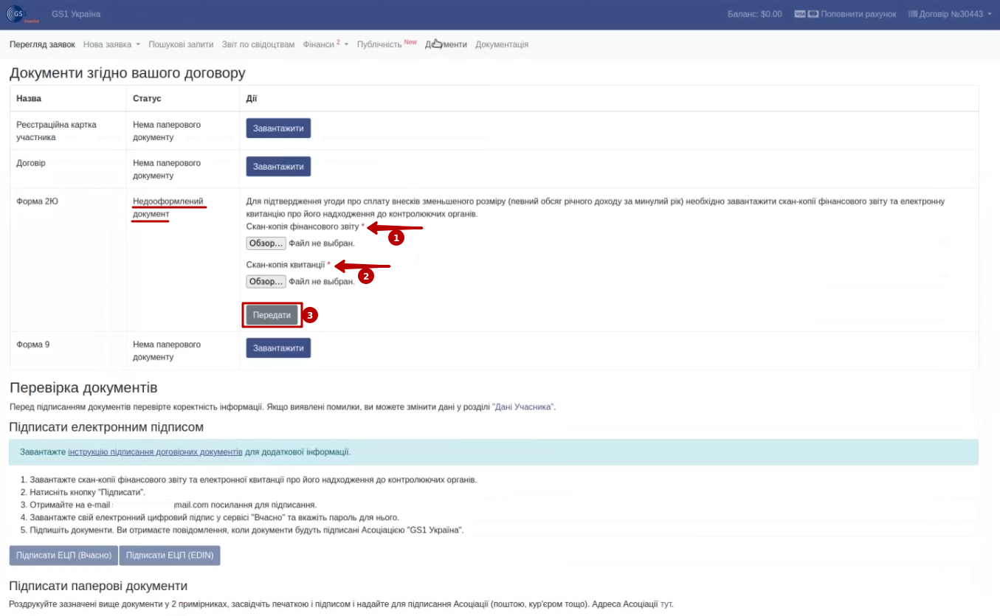

Після того, як всі докумени будуть оформлені їх можливо **"Підписати ЕЦП (EDIN)"**:

.. image:: pics_GS1_Vilnyi/GS1_Vilnyi_024.png
   :align: center

.. hint::
   Підписання та обмін документами здійснюється за допомогою сервісу EDIN "Вільний" (`ознайомитись з загальним виглядом сервісу <https://wiki.edin.ua/uk/latest/Vilnyi/Work_with_Vilnyi.html#main>`__).

Процес підписання ініційовано. Відкриється вікно сервісу EDIN "Вільний" з вхідним документом від GS1 Україна, що очікує підписання:

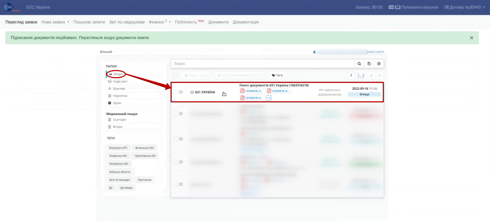

При переході в пакет документів Ви можете ознайомитись з усіма вкладеними файлами прямо в особистому кабінеті GS1 ("ДжіЕс1 Україна").

.. include:: /Vilnyi/Work_with_Vilnyi.rst
   :start-after: .. початок блоку для GS1
   :end-before: .. кінець блоку для GS1

Після того, як Ви перевірили, що всі дані коректні, то цей пакет документів потрібно **"Підписати"**:

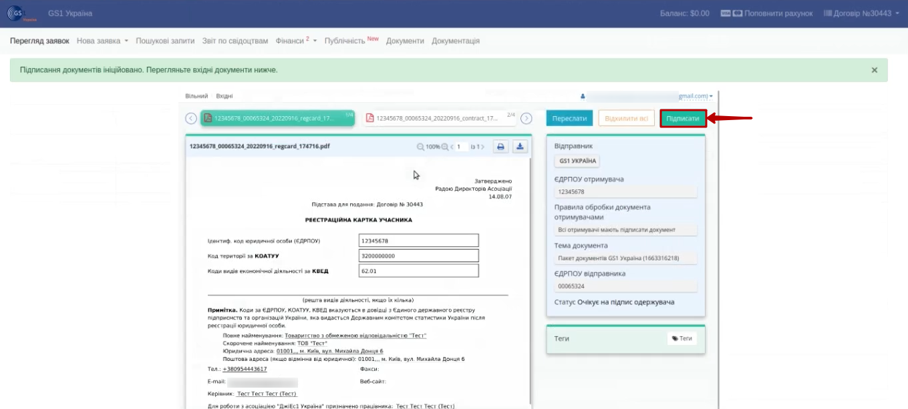

.. include:: /Vilnyi/Work_with_Vilnyi.rst
   :start-after: .. початок блоку для Repeat
   :end-before: .. кінець блоку для Repeat

.. include:: /Vilnyi/Work_with_Vilnyi.rst
   :start-after: .. початок блоку для GS1_sign
   :end-before: .. кінець блоку для GS1_sign

Після підписання під даними документа відображається інформація щодо підписантів, документ змінює свій статус на :olive:`"Підписано"` (`детальніше про статуси документів <https://wiki.edin.ua/uk/latest/Vilnyi/Work_with_Vilnyi.html#doc-statuses>`__):

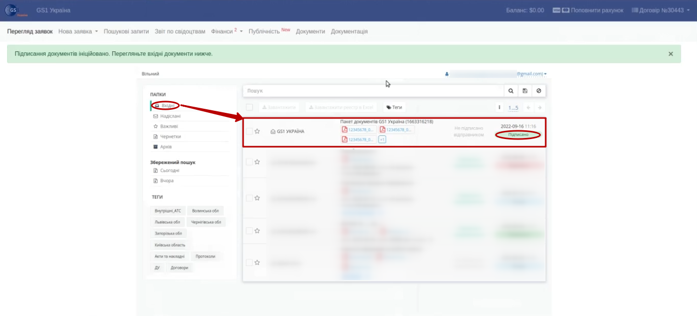

---------------------------------

.. include:: /_constant/kontakti.rst

