Робота з "Метінвест-Шіппінг". Інструкція для "Перевізника"
###################################################################################################

.. сюда закину немного картинок для текста

.. role:: red

.. role:: green

.. role:: underline

.. |фільтр| image:: /ETTN_2_0/pics_Create_act_at_accepted_work_on_Proposal/Create_act_at_accepted_work_on_Proposal_030.png

.. contents:: Зміст:
   :depth: 3

---------

Вступ
====================================

Після перемоги в тендері на перевезення та підписання договору з "Метінвест-Шіппінг" співробітництво на рівні обміну документами продовжується на платформі EDIN в сервісі "Е-ТТН" (`детальніше про сервіс <https://wiki.edin.ua/uk/latest/ETTN_2_0/Work_with_ETTN.html>`__).

**Загальна схема документообігу:**

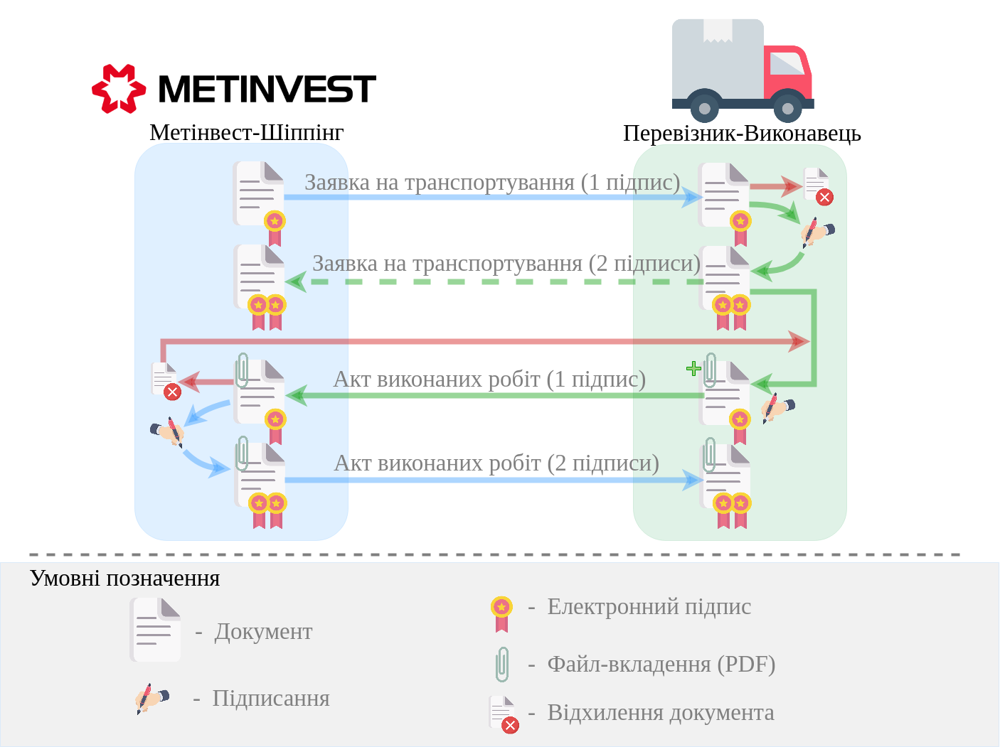

`XML Специфікації для роботи в сервісі "Е-ТТН" <https://wiki.edin.ua/uk/latest/Docs_ETTNv2/Docs_ETTNv2_list.html>`__

1 Вхід на платформу
====================================

.. include:: /general_2_0/rabota_s_platformoj_EDIN_2.0.rst
   :start-after: .. початок блоку для Enter
   :end-before: .. кінець блоку для Enter

.. attention::
   Перед початком роботи переконайтесь, що у Вашому **"Особистому кабінеті"** заповнені платіжні реквізити (розділ `Налаштування -> Компанії <https://wiki.edin.ua/uk/latest/Personal_Cabinet/PCInstruction.html#company>`__) - це важливо для подальшого формування документів.

Після успішної авторизації відкриється основне меню для вибору сервісу платформи EDIN "Е-ТТН":

.. image:: pics_Metinvest_Proposal_Act_at_accepted_work/Metinvest_Proposal_Act_at_accepted_work_005.png
   :align: center

2 Отримання "Заявки на транспортування" "Перевізником"
=================================================================================================================

"Метінвест-Шіппінг" є ініціатором документообігу - надсилає "Заявку на транспортування".

.. hint::
   "Перевізник" буде проінформований про новий вхідний документ листом на email, звідки можливо перейти за посиланням в сервіс одразу до перегляду цього документа.

Документ відображається у "Вхідних" в статусі **"Очікує підписання перевізником"** (для зручності можливо скористатись `пошуком <https://wiki.edin.ua/uk/latest/ETTN_2_0/Work_with_ETTN.html#search>`__):

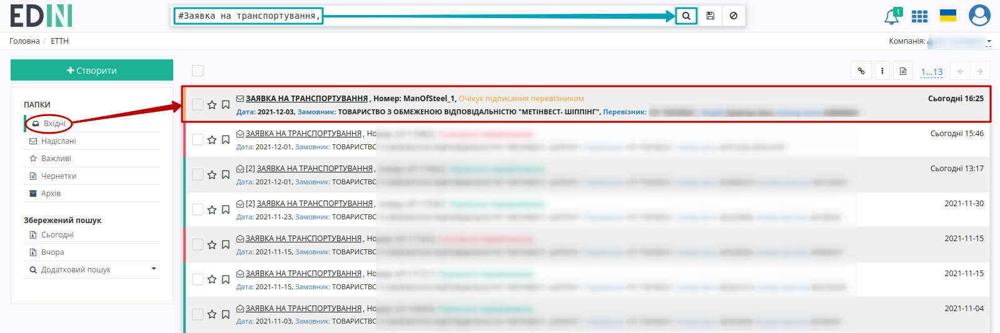

Після ознайомлення зі змістом вхідного документа його потрібно **"Підписати"** (або **"Відхилити"** за потреби).

.. image:: pics_Metinvest_Proposal_Act_at_accepted_work/Metinvest_Proposal_Act_at_accepted_work_007.png
   :align: center

.. attention::
   При формуванні "Заявки на транспортування" "Метінвест-Шіппінг" вказує дані водія, авто, адреси навантаження/розвантаження, вартість перевезення! 

.. _sign:

2.1 Підписання "Заявки на транспортування" "Перевізником" 
-------------------------------------------------------------------------------------

Підписання здійснюється за допомогою кнопки **"Підписати"**:

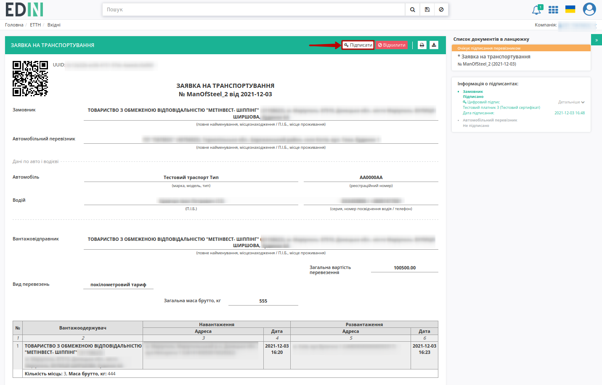

.. загальне підписання на платформі

.. tabs::

   .. tab:: Файловий ключ

      .. include:: /_constant/signing/signing.rst
         :start-after: .. початок блоку для Signing
         :end-before: .. кінець блоку для Signing

   .. tab:: Token

      .. include:: /_constant/token_signing/token_signing.rst
         :start-after: .. початок блоку для TokenSign
         :end-before: .. кінець блоку для TokenSign

   .. tab:: Гряда

      .. include:: /_constant/gryada_signing/gryada_signing.rst
         :start-after: .. початок блоку для GryadaSign
         :end-before: .. кінець блоку для GryadaSign

   .. tab:: Cloud

      .. include:: /_constant/cloud_signing/cloud_signing.rst
         :start-after: .. початок блоку для CloudSign
         :end-before: .. кінець блоку для CloudSign

Після підписання "Заявки на транспортування" її статус змінюється на **"Підписано перевізником"**, в інформації про підписантів відображаються дані двох підписів (обох сторін):

.. image:: pics_Metinvest_Proposal_Act_at_accepted_work/Metinvest_Proposal_Act_at_accepted_work_010.png
   :align: center

Для продовження документообігу потрібно на підставі підписаної "Заявки на транспортування" `створити "Акт виконаних робіт" <https://wiki.edin.ua/uk/latest/ClientProcesses/Metinvest/Metinvest_Instructions/Metinvest_Proposal_Act_at_accepted_work.html#act>`__.

2.2 Відхилення "Заявки на транспортування" "Перевізником"
-------------------------------------------------------------------------------------

У разі виявленння неточностей чи помилок при заповненні "Заявки на транспортування" у "Перевізника" є можливість **"Відхилити"** "Заявку на транспортування":

.. image:: pics_Metinvest_Proposal_Act_at_accepted_work/Metinvest_Proposal_Act_at_accepted_work_009.png
   :align: center

Після чого в модульному вікні обов'язково потрібно заповнити причину відміни документа:

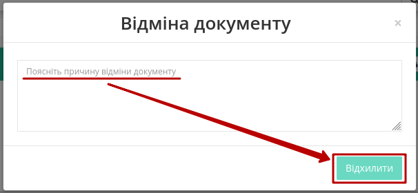

Для відхиленої "Перевізником" "Заявки на транспортування" присвоюється статус **"Скасовано перевізником"**:

.. image:: pics_Metinvest_Proposal_Act_at_accepted_work/Metinvest_Proposal_Act_at_accepted_work_012.png
   :align: center

.. _act:

3 Створення "Акта виконаних робіт" на підставі "Заявки на транспортування" («Виконавець»)
=================================================================================================================

Функціонал створення актів доступний для компанії з роллю "Виконавець" ("Замовником" виступає "Метінвест-Шіппінг") на підставі підписаної з обох сторін "Заявки на транспортування" (в статусі **"Підписано перевізником"**).

Створити "Акт виконаних робіт" можливо:

1) на підставі однієї "Заявки на транспортування";
2) на підставі кількох "Заявок на транспортування" з однаковим номером (на один рейс).

-------------------------------

1) Для того, щоб **"+Створити Акт виконаних робіт"** **на підставі однієї "Заявки на транспортування"** потрібно відкрити документ-підставу та натиснути відповідну кнопку:

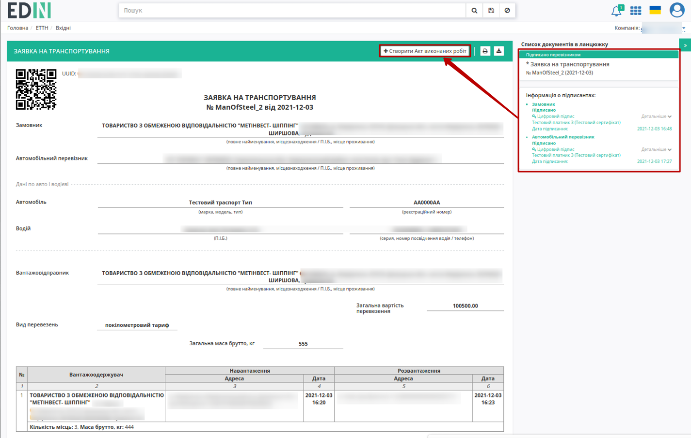

-------------------------------

2) Для того аби **створити "Акт виконаних робіт" підставі кількох "Заявок на транспортування" з однаковим номером (на один рейс)** потрібно перейти до каталогу **"Вхідні"** (1) та в розділі **"Додатковий пошук"** (2) скористатись |фільтр| фільтром **"Для актів виконаних робіт на підставі Заявки на транспортування"** (3), що дозволяє відсортувати "Заявки на транспортування", на підставі яких може бути створено акт (відображення в журналі автоматично змінюється на "Документи"):

.. image:: /ETTN_2_0/pics_Create_act_at_accepted_work_on_Proposal/Create_act_at_accepted_work_on_Proposal_051.png
   :align: center

При створенні "Акту виконаних робіт" можливо вибрати 1 або кілька "Заявок на транспортування" **з однаковими номерами** (:red:`ТІЛЬКИ З ОДНАКОВИМИ НОМЕРАМИ`), на підставі яких він буде створений:

.. image:: /ETTN_2_0/pics_Create_act_at_accepted_work_on_Proposal/Create_act_at_accepted_work_on_Proposal_050.png
   :align: center

-------------------------------

Далі необхідно заповнити форму "Акта виконаних робіт" (обов'язкові поля документа позначені червоною зірочкою :red:`*`). Поле "Дані договору" - номер/дата договору, на підставі якого створено документ (створити та переглянути всі договори можливо в розділі "Компанії" `"Особистого кабінету" <https://wiki.edin.ua/uk/latest/Personal_Cabinet/PCInstruction.html#company-contracts>`__). Якщо договорів кілька, то можливо обрати договір зі списку або створити **"+Новий договір"** прямо в цьому документі, якщо їх поки немає:

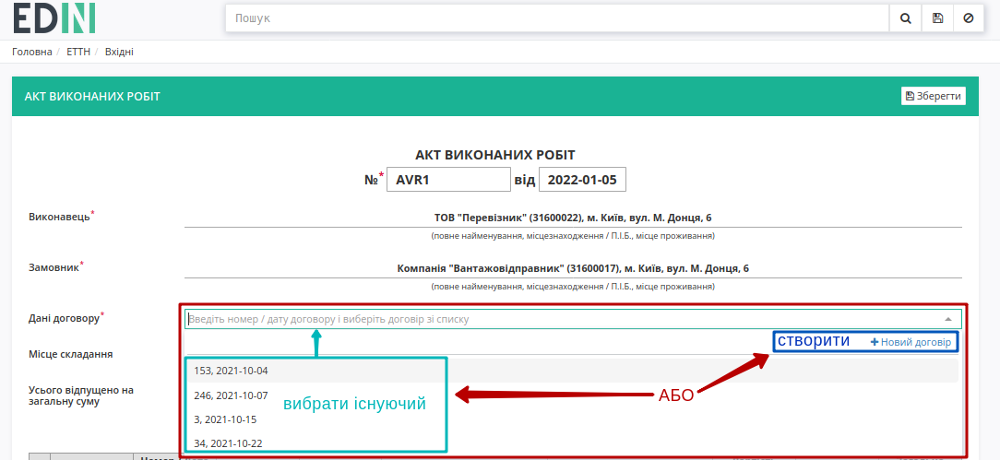

.. image:: pics_Metinvest_Proposal_Act_at_accepted_work/Metinvest_Proposal_Act_at_accepted_work_032.png
   :align: center

.. attention::
   При створенні документа шляхом `клонування <https://wiki.edin.ua/uk/latest/ETTN_2_0/Work_with_ETTN.html#doc-clone>`__ поле "Дані договору" заповнюється автоматично лише за наявності цього договору в `"Особистому кабінеті" <https://wiki.edin.ua/uk/latest/Personal_Cabinet/PCInstruction.html#company-contracts>`__.

В табличній частині потрібно **"Змінити"** Номер та Дату документа-підстави, вказавши там номер та дату "Товарно-транспортної накладної":

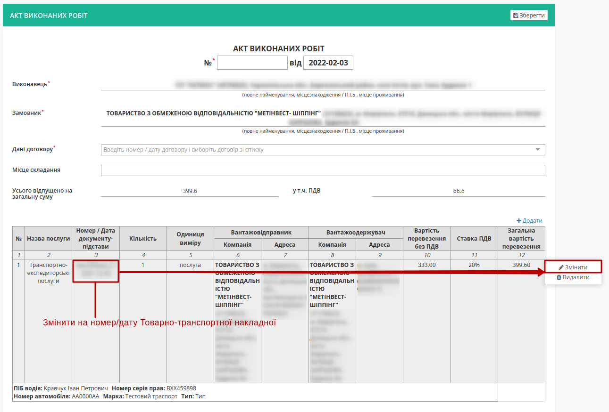

.. image:: pics_Metinvest_Proposal_Act_at_accepted_work/Metinvest_Proposal_Act_at_accepted_work_014.png
   :align: center

:red:`Всі зміни, що стосуються вартості перевезення виконуються тільки після узгодження з "Метінвест-Шіппінг"!`

Після того, як всі обов'язкові поля заповнені можливо **"Зберегти"** документ, в якості чернетки:

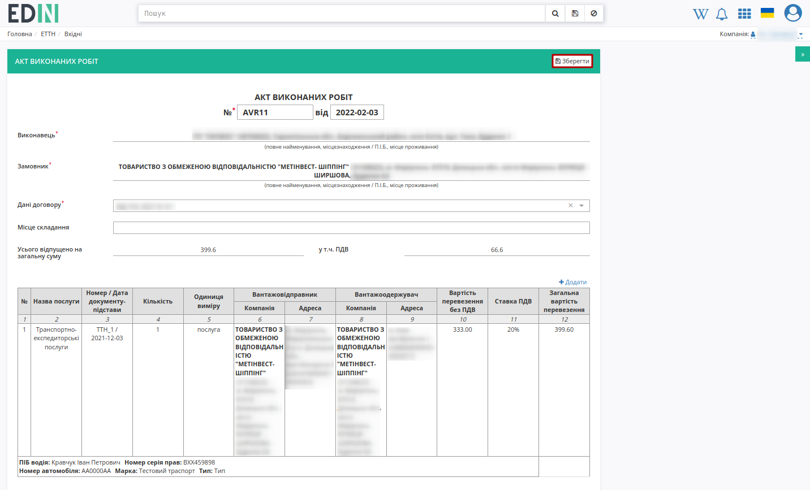

.. important::
   До чернетки потрібно додати скан-копію ТТН в якості супровідних документів на вантаж через кнопку **"Додати файл"**:

   .. image:: pics_Metinvest_Proposal_Act_at_accepted_work/Metinvest_Proposal_Act_at_accepted_work_016.png
      :align: center

Для того щоб видалити доданий файл необхідно натиснути на іконку корзини. Для того щоб зберегти доданий файл необхідно натиснути на його назву. Після того, як обов'язкові поля документа (позначені червоною зірочкою :red:`*`) будуть заповнені документ за потреби можливо повторно **"Зберегти"** (1) та **"Підписати"** (2):

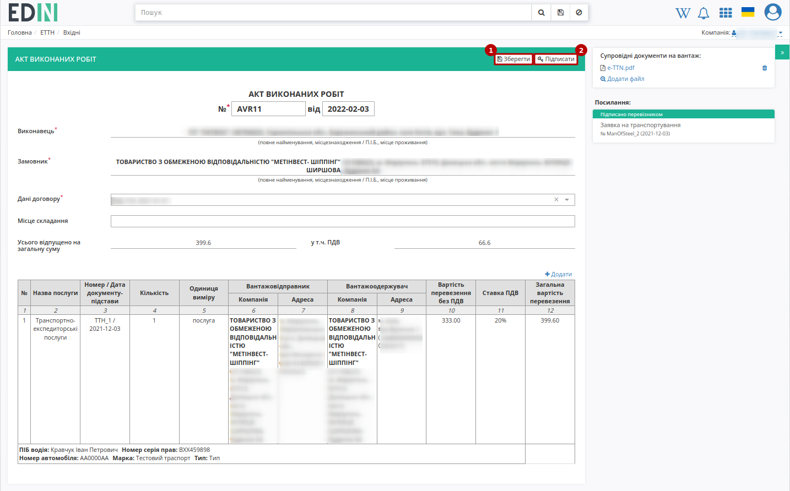

.. _sign:

3.1 Підписання та відправка "Акта виконаних робіт" "Виконавцем"
----------------------------------------------------------------------------

.. hint::
   Процес підписання документа не відрізняється від підписання описаного в `розділі вище <https://wiki.edin.ua/uk/latest/ClientProcesses/Metinvest/Metinvest_Instructions/Metinvest_Proposal_Act_at_accepted_work.html#sign>`__.

Після підписання "Акту виконаних робіт" інформація щодо підписанта відображається в блоці "Підписанти", а документ можливо **"Надіслати"**:

.. image:: pics_Metinvest_Proposal_Act_at_accepted_work/Metinvest_Proposal_Act_at_accepted_work_018.png
   :align: center

У **"Виконавця"** відправлений документ відображається у **"Надіслані"** зі статусом **"Очікує підписання замовником"**.

.. image:: pics_Metinvest_Proposal_Act_at_accepted_work/Metinvest_Proposal_Act_at_accepted_work_019.png
   :align: center

.. important::
   Після того, як "Акт виконаних робіт" буде підписано зі сторони "Метінвест-Шіппінг" документообіг успішно завершено. Однак, якщо "Метінвест-Шіппінг" відхилив "Акт виконаних робіт", то Ви будете проінформовані про це листом на email, звідки можливо перейти за посиланням в сервіс одразу до перегляду цього документа.

4 Відхилення "Акта виконаних робіт" "Замовником" ("Метінвест-Шіппінг")
=================================================================================================================

Відхилений "Акт виконаних робіт" зі сторони "Метінвест-Шіппінг" відображається в **"Надісланих"** в статусі **"Скасовано замовником"** (для зручності можливо скористатись `пошуком <https://wiki.edin.ua/uk/latest/ETTN_2_0/Work_with_ETTN.html#search>`__):

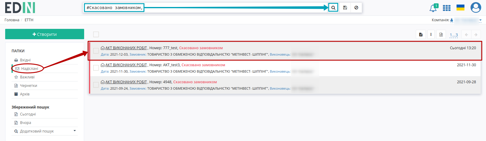

Потрібно перейти в документ, **ознайомитись з причиною скасування** та, враховуючи її, **повторно створити "Акт виконаних робіт" на підставі пов'язаної "Заявки на транспортування"**:

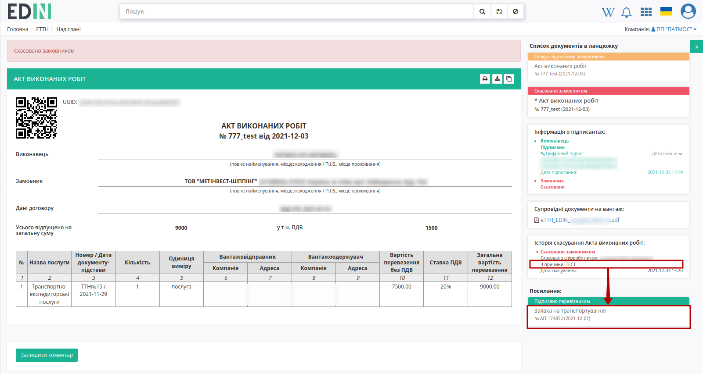

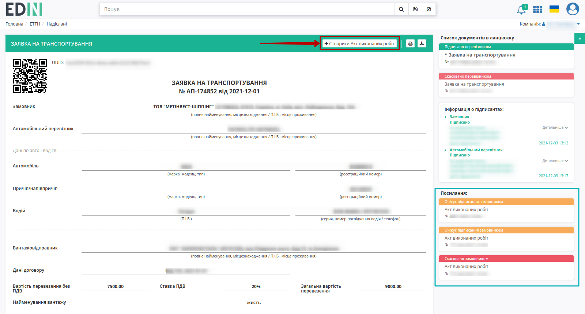

В "Посиланнях" будуть відображатись всі пов'язані документи. Процес створення "Акт виконаних робіт" описаний в `розділі вище <https://wiki.edin.ua/uk/latest/ClientProcesses/Metinvest/Metinvest_Instructions/Metinvest_Proposal_Act_at_accepted_work.html#act>`__.

---------------------------------

.. include:: /_constant/kontakti.rst

