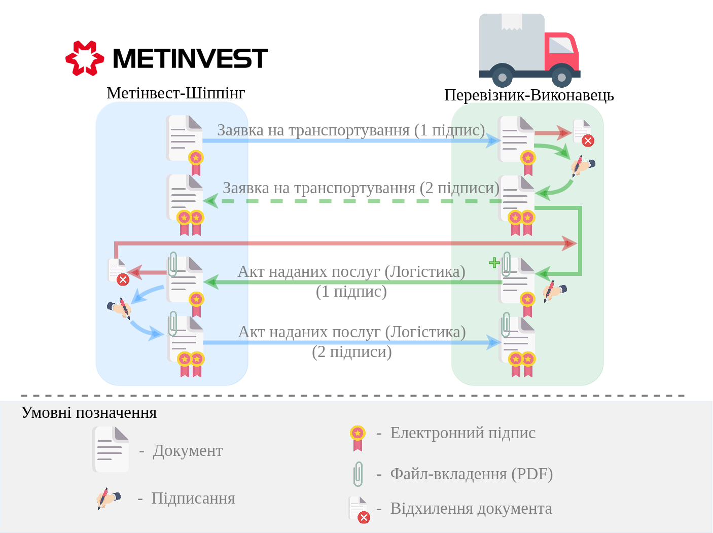
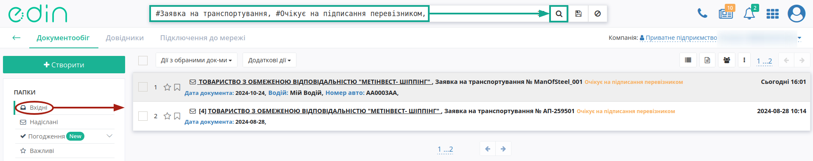
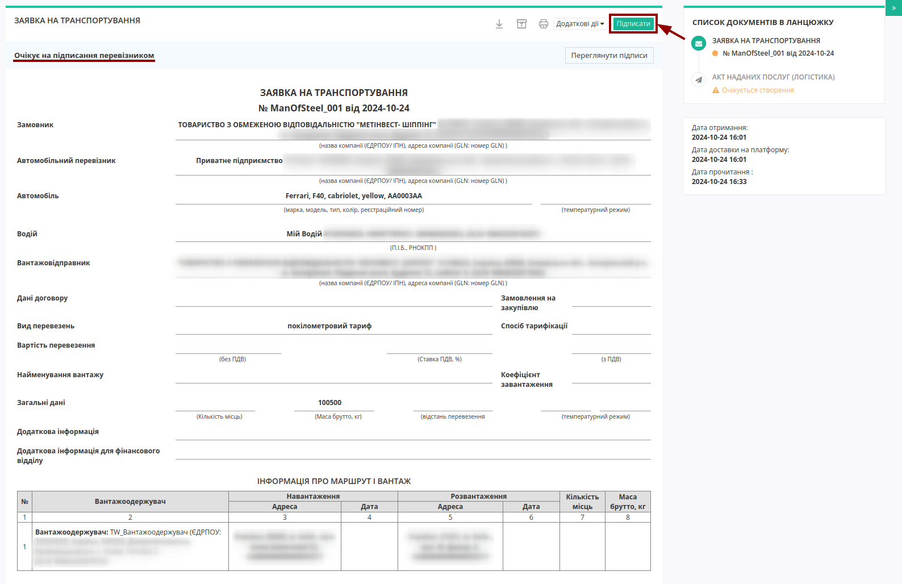
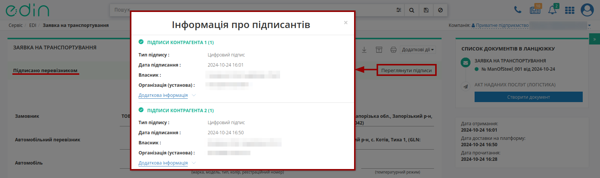
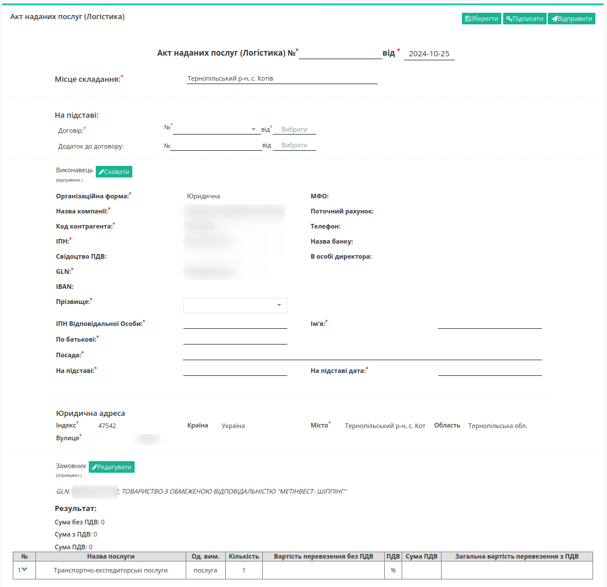
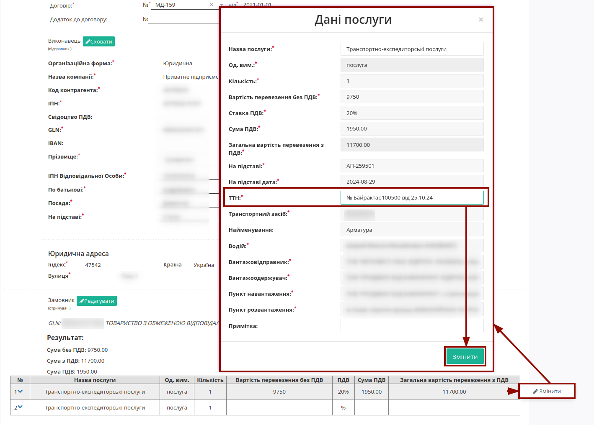
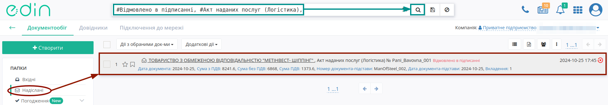
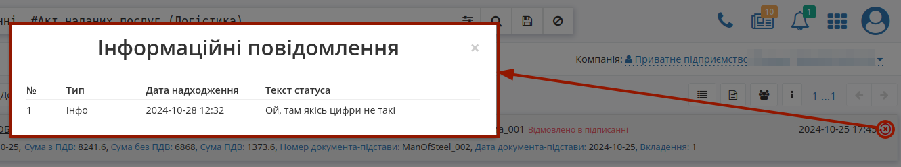
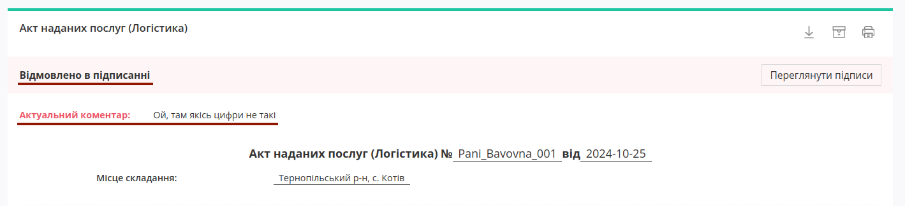

Робота з "Метінвест-Шіппінг". Інструкція для "Перевізника" (new)
###################################################################################################

.. сюди закину трохи картинок для тексту

.. role:: red

.. role:: green

.. role:: orange

.. role:: underline

.. |фільтр| image:: /ETTN_2_0/pics_Create_act_at_accepted_work_on_Proposal/Create_act_at_accepted_work_on_Proposal_030.png

.. |лупа| image:: /_constant/icons/magnifying_glass.png

.. |будинок| image:: /_constant/icons/house.png

.. |trash| image:: /_constant/icons/trash.png

.. |download| image:: /_constant/icons/download.png

.. |info2| image:: /_constant/icons/info2.png

.. contents:: Зміст:
   :depth: 3

---------

Вступ
====================================

Після перемоги в тендері на перевезення та підписання договору з "Метінвест-Шіппінг" співробітництво на рівні обміну документами продовжується в сервісі "EDI Network" (`детальніше про сервіс <https://wiki.edin.ua/uk/latest/general_2_0/rabota_s_platformoj_EDIN_2.0.html>`__).

**Загальна схема документообігу:**

В документообігу приймають участь наступні документи:

- `Заявка на транспортування <https://wiki.edin.ua/uk/latest/Docs_ETTNv3/TRANSPORTATIONORDER/TRANSPORTATIONORDERpage_v3.html>`__
- `Акт наданих послуг (Логістика) <https://wiki.edin.ua/uk/latest/EDIN_Specs/XML/COMDOC_037_x.html>`__

1 Вхід на платформу
====================================

.. include:: /general_2_0/rabota_s_platformoj_EDIN_2.0.rst
   :start-after: .. початок блоку для Enter
   :end-before: .. кінець блоку для Enter

.. attention::
   Перед початком роботи переконайтесь, що у Вашому **"Особистому кабінеті"** заповнені платіжні реквізити (розділ `Налаштування -> Компанії <https://wiki.edin.ua/uk/latest/Personal_Cabinet/PCInstruction.html#company>`__) - це важливо для подальшого формування документів.

Після успішної авторизації відкриється основне меню, де у вкладці **"Продукти та рішення"** EDIN потрібно обрати сервіс **"EDI Network"**:

.. image:: /_constant/pics_landing/landing_edi.png
   :align: center

2 Отримання "Заявки на транспортування" "Перевізником"
=================================================================================================================

"Метінвест-Шіппінг" є ініціатором документообігу - надсилає "Заявку на транспортування".

.. hint::
   Ви, як "Перевізник" будете проінформовані про новий вхідний документ листом на email, звідки можливо перейти за посиланням в сервіс одразу до перегляду цього документа.

Документ відображається у "Вхідних" в статусі :orange:`"Очікує на підписання перевізником"` (для зручності можливо скористатись `пошуком <https://wiki.edin.ua/uk/latest/general_2_0/rabota_s_platformoj_EDIN_2.0.html#doc-search>`__):

.. attention::
   При формуванні "Заявки на транспортування" "Метінвест-Шіппінг" вказує дані водія, авто, адреси навантаження/розвантаження, вартість перевезення!

Після ознайомлення зі змістом вхідного документа його потрібно **"Підписати"** (або `виконати Відмову від підписання "Заявки на транспортування" <https://wiki.edin.ua/uk/latest/ETTN_3_0/Proposal_Reject.html>`__ (**"Додаткові дії"**) за потреби):

.. _sign:

.. загальне підписання на платформі

.. tabs::

   .. tab:: Файловий ключ

      .. include:: /_constant/signing/signing.rst
         :start-after: .. початок блоку для Signing
         :end-before: .. кінець блоку для Signing

   .. tab:: Token

      .. include:: /_constant/token_signing/token_signing.rst
         :start-after: .. початок блоку для TokenSign
         :end-before: .. кінець блоку для TokenSign

   .. tab:: Гряда

      .. include:: /_constant/gryada_signing/gryada_signing.rst
         :start-after: .. початок блоку для GryadaSign
         :end-before: .. кінець блоку для GryadaSign

   .. tab:: Cloud

      .. include:: /_constant/cloud_signing/cloud_signing.rst
         :start-after: .. початок блоку для CloudSign
         :end-before: .. кінець блоку для CloudSign

Після підписання "Заявки на транспортування" її статус змінюється на :green:`"Підписано перевізником"`. Інформацію про всіх підписантів можливо переглянути при натисканні на **"Переглянути підписи"**:

.. seealso::
   У разі виявлення помилки вже після підписання документа за потреби можливо виконати `Анулювання підписаної «Заявки на транспортування» <https://wiki.edin.ua/uk/latest/ETTN_3_0/Proposal_Repeal.html>`__.

Для продовження документообігу потрібно на підставі підписаної "Заявки на транспортування" створити "Акт наданих послуг (Логістика)" (детальніше в наступному розділі).

.. _act-create:

3 Створення "Акта наданих послуг (Логістика)" на підставі "Заявки на транспортування" («Виконавець»)
=================================================================================================================

Функціонал створення актів доступний для компанії з роллю "Виконавець" ("Замовником" виступає "Метінвест-Шіппінг") на підставі підписаної з обох сторін "Заявки на транспортування" (в статусі :green:`"Підписано перевізником"`).

Зазвичай :underline:`один "Акт наданих послуг (Логістика)" формується на підставі однієї "Заявки на транспортування"`, однак якщо Ви отримали кілька "Заявок на транспортування" з однаковим номером (на один рейс), то можна створити :underline:`один "Акт наданих послуг (Логістика)" на підставі кількох "Заявок на транспортування"`.

-------------------------------

Оберіть вкладку з описом потрібного Вам процесу 👇

.. tabs::

   .. tab:: **"Акт наданих послуг (Логістика)" на підставі однієї "Заявки"**

      Для того, щоб створити "Акт наданих послуг (Логістика)" **на підставі однієї "Заявки на транспортування"** потрібно у "Вхідних" відкрити документ-підставу (для зручності можливо скористатись рядком пошуку):

      .. image:: pics_Metinvest_for_Carrier/Metinvest_for_Carrier_004.png
         :align: center

      У відкритому документі натисніть **"Створити документ"** "Акт наданих послуг (Логістика)" в блоці `ланцюжка документів <https://wiki.edin.ua/uk/latest/_constant/chain/chain.html>`__, наприклад:

      .. image:: pics_Metinvest_for_Carrier/Metinvest_for_Carrier_005.png
         :align: center

   .. tab:: **"Акт наданих послуг (Логістика)" на підставі кількох "Заявок"**

      Для того аби **створити "Акт наданих послуг (Логістика)" підставі кількох "Заявок на транспортування" з однаковим номером (на один рейс)** (:red:`ТІЛЬКИ З ОДНАКОВИМИ НОМЕРАМИ`) потрібно перейти до каталогу **"Вхідні"** (1) та обрати документи з однаковим контрагентом (для зручності можливо скористатись рядком `пошуку <https://wiki.edin.ua/uk/latest/general_2_0/rabota_s_platformoj_EDIN_2.0.html#doc-search>`__) та в **"Дії з обраними документами"** обрати **"Створити акт наданих послуг (Логістика)"**:
      
      .. image:: pics_Metinvest_for_Carrier/Metinvest_for_Carrier_008.png
         :align: center

Відкриється форма редагування документа "Акта наданих послуг (Логістика)", що включає в собі дані обраного/обраних документа/-ів:

Всі обов'язкові до заповнення поля позначені червоною зірочкою :red:`*`. Вам необхідно вказати "Номер документа" ("Дата документа" заповнюється автоматично), "Місце складання"...

.. include:: /retail_2.0/formirovanie_otpravka_dokumenta_Vydatkova_Nakladna_na_EDI_Network_2.0.rst
   :start-after: .. початок блоку для ForAllCOMDOC_006/032/037
   :end-before: .. кінець блоку для ForAllCOMDOC_006/032/037

Ваші дані, як контрагента-Перевізника автоматично заповнюються `з Вашого основного GLN <https://wiki.edin.ua/uk/latest/Personal_Cabinet/PCInstruction.html#gln-main>`__.

.. include:: /ClientProcesses/ATB/ATB_Instructions/ATB_external_EDI_instruction_post.rst
   :start-after: .. початок блоку для Prizvusche
   :end-before: .. кінець блоку для Prizvusche

Після того, як всі обов'язкові дані контрагента будуть заповнені блоки можливо згорнути за допомогою кнопки **"Сховати"**. Поки документ не відправлено блок можливо **"Редагувати"** за потреби. Незаповнені поля контрагента-Замовника заповнюються аналогічно.

Блок "Результат" автоматично розраховується з таблиці. Дані позиції в табличній частині частково заповнюються з документа-підстави, для ознайомлення з яким потрібно відкрити детальний перегляд позиції:

.. image:: /ETTN_3_0/pics_Create_COMDOC_037_from/Create_COMDOC_037_from_004.png
   :align: center

.. note::
   Якщо в ланцюжку передаються дані про поставку, то при формуванні "Акта наданих послуг (Логістика)" :underline:`дані про Транспорт та Водія` атоматично доповнюються (додаються без дублів) в табличну частину документа:

   .. image:: /ETTN_3_0/pics_Create_COMDOC_037_from/Create_COMDOC_037_from_013.png
      :align: center

До кожної табличної позиції ("Заявки на транспортування") обов'язково потрібно додати дані про ТТН, навівши курсор на відповідну позицію та натиснувши кнопку **"Змінити"**:

Після того, як всі обов'язкові дані були внесені/змінені (обов'язкові до заповнення поля позначені червоною зірочкою :red:`*`), документ можливо **"Зберегти"**:

.. image:: /ETTN_3_0/pics_Create_COMDOC_037_from/Create_COMDOC_037_from_026.png
   :align: center

.. hint::
   До чернетки (збережений невідправлений документ) потрібно додати скан-копію ТТН в якості супровідних документів на вантаж через кнопку **"+Додати файл"** - супровідний документ (вкладення в pdf форматі не має перевищувати 25MB):

   .. image:: /ETTN_3_0/pics_Create_COMDOC_037_from/Create_COMDOC_037_from_027.png
      :align: center

   Додані файли відображаються в правому верхньому куті документа, їх можливо **переглянути**, натиснувши на назву файлу, **зберегти** (|download|) чи **видалити** (|trash|):

   .. image:: /ETTN_3_0/pics_Create_COMDOC_037_from/Create_COMDOC_037_from_016.png
      :align: center

:underline:`Після Зберігання документа` його потрібно **"Підписати"** та **"Відправити"** контрагентам:

.. image:: /ETTN_3_0/pics_Create_COMDOC_037_from/Create_COMDOC_037_from_028.png
   :align: center

.. hint::
   Якщо в документа є вкладення, то в журналі документів зазначається кількість вкладень, а також документи з вкладеннями (чи без жодних вкладень) можливо відфільтрувати за цією ознакою за допомогою `пошуку <https://wiki.edin.ua/uk/latest/general_2_0/rabota_s_platformoj_EDIN_2.0.html#doc-search>`__:

   .. image:: /general_2_0/pics_rabota_s_platformoj_EDIN_2.0/rabota_s_platformoj_124.png
      :align: center

Процес `Підписання <https://wiki.edin.ua/uk/latest/general_2_0/massovi_operacii_EDIN_2.0.html#sign>`__ є стандартним для всіх документів на платформі та описаний вище.

.. include:: /ETTN_3_0/Create_COMDOC_037_from.rst
   :start-after: .. початок блоку для COMDOC_037_from_transport_003
   :end-before: .. кінець блоку для COMDOC_037_from_transport_002

.. _act-reject:

4 Відхилення "Акта наданих послуг (Логістика)" "Замовником" ("Метінвест-Шіппінг")
=================================================================================================================

Відхилений "Акт наданих послуг (Логістика)" зі сторони "Метінвест-Шіппінг" відображається в **"Надісланих"** в статусі :red:`"Відмовлено в підписанні"` (для зручності можливо скористатись `пошуком <https://wiki.edin.ua/uk/latest/general_2_0/rabota_s_platformoj_EDIN_2.0.html#doc-search>`__):

**Ознайомитись з текстовою причиною скасування від "Метінвест-Шіппінг"** можливо прямо в журналі документів, натиснувши на іконку |info2|:

Також коментар-причина відображається і при перегляді документа:

Ознайомившись з документом та враховуючи причину відмови потрібно **повторно створити "Акт наданих послуг (Логістика)"** на підставі того ж чи тих пов'язаних документів (тобто ще раз `створити, підписати та відправити "Акт наданих послуг (Логістика)" <https://wiki.edin.ua/uk/latest/ClientProcesses/Metinvest/Metinvest_Instructions/Metinvest_for_Carrier.html#act-create>`__).

---------------------------------

.. include:: /_constant/kontakti.rst

