###########################################################################################################################################
Робота з документом "Додаток до договору 7А" (METRO_7A) / "Додаток до договору 7Б" (METRO_7B) для постачальників мережі "МЕТРО"
###########################################################################################################################################

.. сюда закину немного картинок для текста

.. role:: red

.. role:: green

.. role:: underline

.. contents:: Зміст:
   :depth: 2

---------

Вступ
==============================================================

Дана інструкція описує порядок роботи з `"Додатком до договору 7А" (METRO_7A) <https://wiki.edin.ua/uk/latest/EDIN_Specs/XML/METRO_7A_x.html>`__ / `"Додатком до договору 7Б" (METRO_7B) <https://wiki.edin.ua/uk/latest/EDIN_Specs/XML/METRO_7B_x.html>`__ для Постачальників мережі "МЕТРО Кеш енд Кері Україна" на web-платформі EDIN 2.0.

.. note::
   Документообіг "Додатком до договору 7А" та "Додатком до договору 7Б" є ідентичним. В зображеній схемі та покроковому алгоритмі для прикладу було обрано документ "Додатком до договору 7А", однак опис основного функціоналу в даній інструкції стосується й "Додатка до договору 7Б".

Схема взаємодії контагентів:

.. uml::
   :scale: 100 %
   :align: center

   @startuml

   Метро -> Постачальник: "Додаток до договору 7А" (METRO_7A) непідписаний

   == Постачальник може відмовитись від підписання ==

   Метро <- Постачальник: Підписання Постачальника (документ має 1 підпис П)

   == Метро може відмовитись від підписання ==

   Метро -> Постачальник: Підписання Метро (документ має 1 підпис П + 1 підпис М)
   Метро -> Постачальник: Підписання Метро (документ має 1 підпис П + 2 підписи М)

   @enduml

.. warning::
   **Обмін документом "Додаток до договору 7А" (METRO_7A) / "Додаток до договору 7Б" (METRO_7B) передбачає можливість прострочення документа. У цього документа є дедлайн на підписання зі сторони Постачальника - це дата, що вказується в полі ReviewDeadlineDate (`специфікації <https://wiki.edin.ua/uk/latest/EDIN_Specs/XML/METRO_7A_x.html>`__). Якщо значення ReviewDeadlineDate (дати дедлайну) стає менше поточної дати, то документ стає заблокованим (статус документа - "Заблокований") - всі дії з докумемнтом неможливі (документообіг завершено).**

**1 Робота з "Додатком до договору 7А" (METRO_7A) / "Додатком до договору 7Б" (METRO_7B) на стороні Постачальника**
========================================================================================================================================

Мережа Метро відправляє документ "Додаток до договору 7А" (METRO_7A) / "Додаток до договору 7Б" (METRO_7B), про що Ви будете проінформовані повідомленням на e-mail:

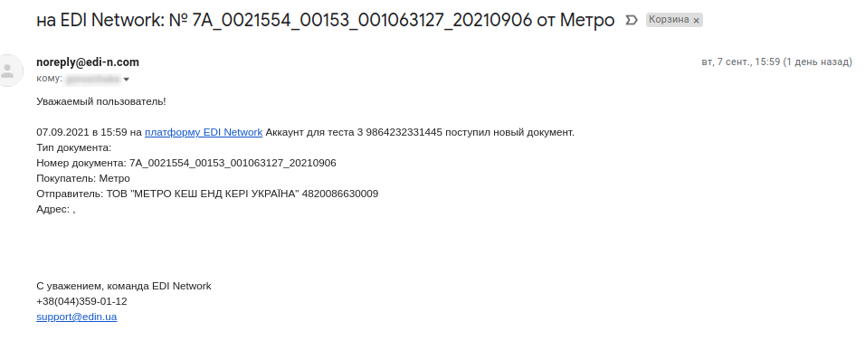

На платформі EDIN 2.0 ці документи відображаються у **Вхідних**:

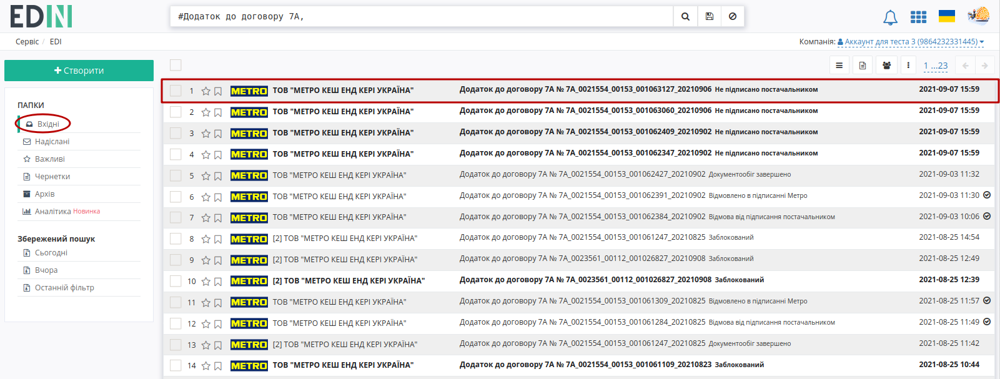

.. tip::
   Для зручності можливо скористатись фільтром документів:

   .. image:: pics_Metro_7a_instruction/Metro_7a_instruction_001.png
      :align: center

При переході до документа відкривається його заповнена форма. Документ перебуває в статусі "Не підписано постачальником". Повна форма документа відкривається після натискання на кнопку в правій частині екрану:

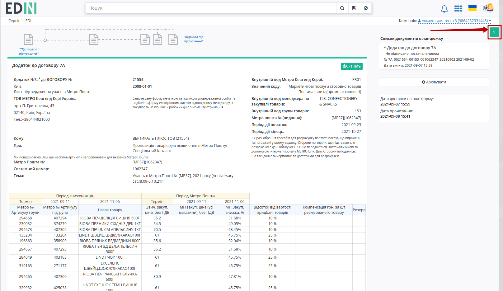

Ви можете ознайомитись з відкритим документом та якщо згодні з його змістом натиснути кнопку **"Підписати та відправити"** або, якщо не згодні - **"Відмова від підписання"**:

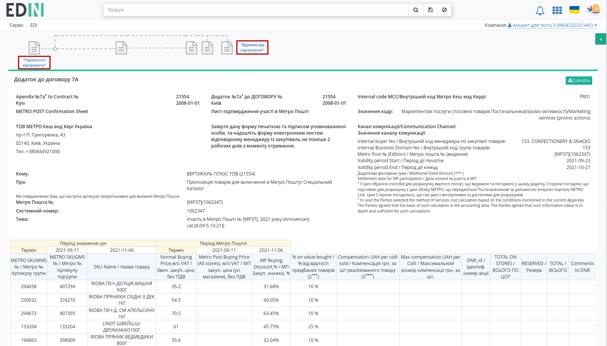

.. _sign:

**1.1 Підписання та відправка "Додатка до договору 7А" / "Додатка до договору 7Б" Постачальником**
---------------------------------------------------------------------------------------------------------

.. загальне підписання на платформі не підходить, бо тут не використовується перевірка на ЄДРПОУ/ІПН (блок урізаний)

.. |del_key| image:: /_constant/signing/del_key.png

.. _підписання:

Після ініціалізації бібліотеки підписання, система надасть можливість додати ключ для підписання. При :underline:`першому` підписанні у модальному вікні потрібно обрати файл чи токен (1), ввести пароль (2) та натиснути **"Зчитати"** (3) ключ для підписання:

.. image:: /_constant/signing/file1.png
   :align: center

.. hint::
   **Види файлів електронно-цифрового підпису:**

   Якщо Ви використовуєте ключі від **АЦСК "Україна"**, файли підписів секретних ключів мають розширення **.ZS2** і наступні значення в іменах файлів:

   * Директор «DS»
   * Бухгалтер «BS»
   * Співробітник «SS»
   * Печатка «S»
   * Шифрування «C»
   * Універсальний ключ печатки і шифрування «U»

   Якщо Ви використовуєте ключі від **АЦСК “ПриватБанк”**, файли підписів секретних ключів мають розширення **.jks**. Якщо Ви використовуєте ключі від будь-яких інших **АЦСК**, файли підписів секретних ключів мають найменування **Key-6.dat**.

.. image:: /_constant/signing/file2.png
   :align: center

При успішному додаванні ключа автоматично відобразиться особа, від імені якої буде здійснено підписання. У користувача може бути додано кілька ключів - для вибору потрібного для здійснення операції підписання потрібно проставити відмітку лівою кнопкою миші і натиснути **"Підписати"**:

.. image:: /_constant/signing/file3.gif
   :align: center

Додатково в вікні підписання можливо натиснути **"Детальніше"** для того, щоб переглянути інформацію про підписанта. За допомогою кнопки з іконкою смітничка (|del_key|) можливо видалити помилкові ключі.

При подальшій роботі з раніше доданим ключем/-ами потрібно вводити лише пароль для обраного ключа:

.. image:: /_constant/signing/file4.png
   :align: center

.. image:: /_constant/signing/file5.png
   :align: center

Після підписання на схемі документ позначається зеленим кольором, а інформація щодо цього етапу відображається, якщо клікнути на іконку цього документа:

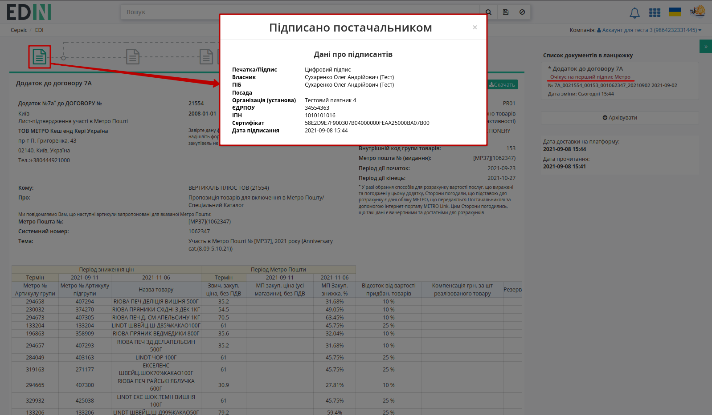

Документ перебуває в статусі "Очікує на перший підпис Метро".

**1.2 Відмова від підписання "Додатка до договору 7А" / "Додатка до договору 7А" Постачальником**
--------------------------------------------------------------------------------------------------------

.. important::
   **Відмова від підписання** може бути виконана Постачальником за умови, що документ до цього не був підписаний та прострочений (дедлайн на підписання)! Відмова від підписання завершує документообіг документом!

**Відмова від підписання** потребує підтвердження за допомогою підпису (`підписання описано в попредньому розділі <https://wiki.edin.ua/uk/latest/ClientProcesses/Metro/Metro_Instructions/Metro_7a_instruction.html#sign>`__) і відрізняється лише тим, що ця дія вимагає вказати **причину** відмови від підписання документа: 

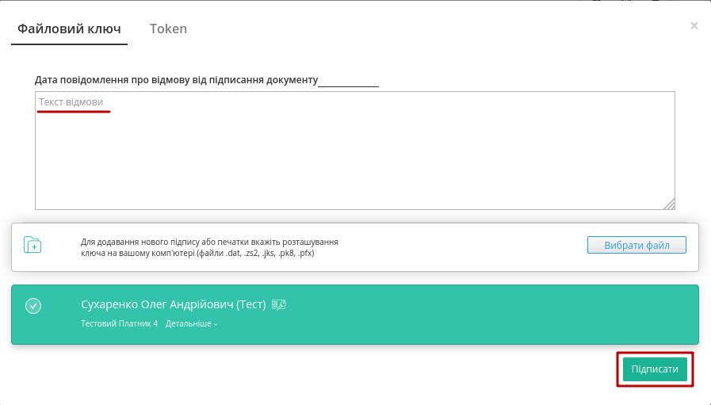

Після чого на схемі документ відзначається червоним кольором, а інформація щодо цього етапу відображається, якщо клікнути на іконку цього документа:

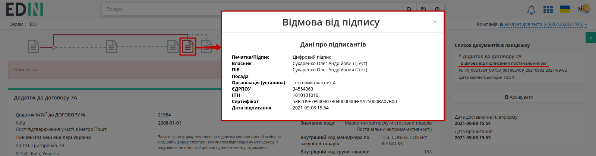

Цей документ відображається у **Вхідних** і має відмітку про відхилення від підписання:

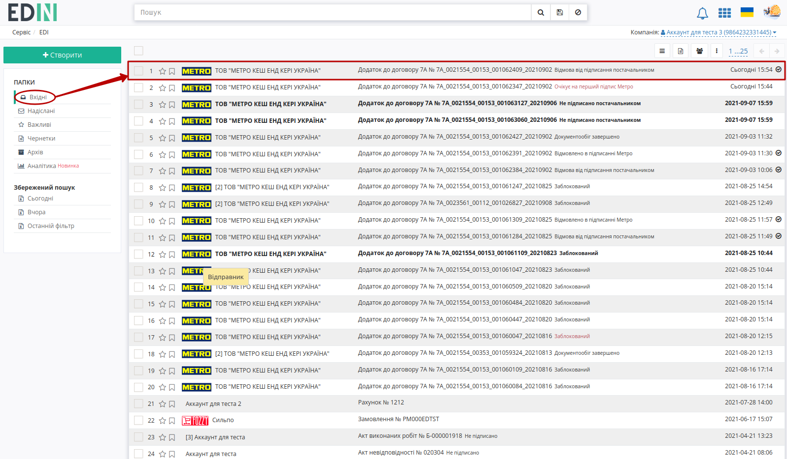

.. hint::
   Якщо один з контрагентів відмовився від підписання документообіг припиняється і цей документ має відмітку. З причиною відмови від підписання можливо ознайомитись, не переходячи до документа, клікнувши на цю відмітку: 

   .. image:: pics_Metro_7a_instruction/Metro_7a_instruction_003.png
      :align: center

Документ отримує статус "Відмова від підписання постачальником". Документообіг завершено.

**2 Робота з "Додатком до договору 7А" (METRO_7A) / "Додатком до договору 7Б" (METRO_7B) на стороні Метро**
==================================================================================================================

Підписаний Постачальником "Додаток до договору 7А" (METRO_7A) проходить два етапи підписання на стороні Метро:

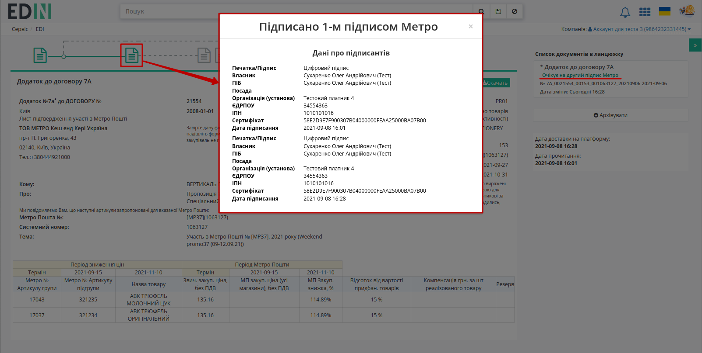

Документ отримує статус "Очікує на другий підпис Метро".

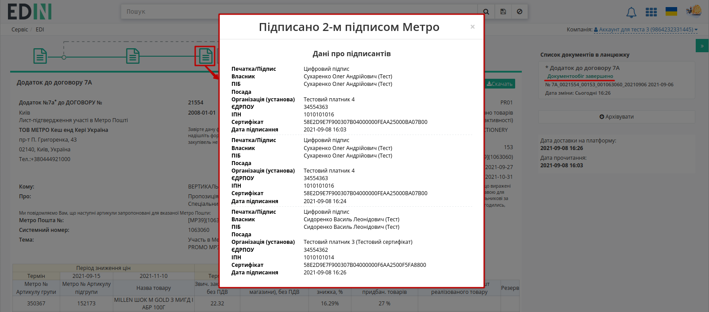

Документ отримує статус "Документообіг завершено". Також документ може бути відмовленим від підписання зі сторони Метро: 

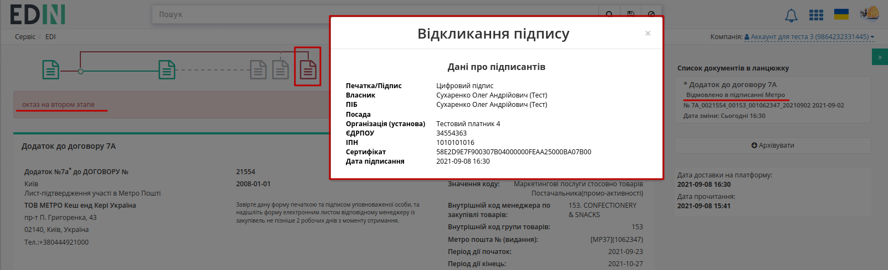

Документ отримує статус "Відмовлено в підписанні Метро".

Про всі ці дії Постачальник інформується повідомленням на e-mail:

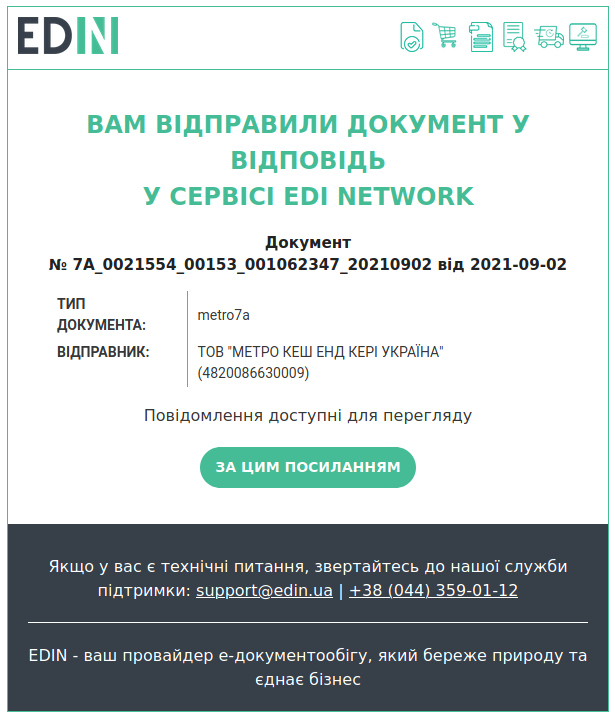

---------------------------------

.. include:: /_constant/kontakti.rst
