###########################################################################################################################################
Формування Коригувальних Товарної і Податкової накладних (РКТН и РКПН). Інструкція для Постачальників мережі "МЕТРО"
###########################################################################################################################################

.. сюда закину немного картинок для текста

.. role:: red

.. role:: green

.. role:: underline

.. |лупа| image:: pics_Metro_DOCCORINVOICE_DECLARJ12_instruction/Metro_DOCCORINVOICE_DECLARJ12_instruction_004.png

.. |будинок| image:: pics_Metro_DOCCORINVOICE_DECLARJ12_instruction/Metro_DOCCORINVOICE_DECLARJ12_instruction_005.png

.. contents:: Зміст:
   :depth: 2

---------

Вступ
==============================================================

Дана інструкція описує порядок роботи з `"Коригування до товарної накладної" (DOCCORINVOICE) <https://wiki.edin.ua/uk/latest/XML/XML-structure.html#doccorinvoice>`__ (далі **РКТН**) та `"Коригування до податкової накладної" (DECLARj12) <https://wiki.edin.ua/uk/latest/XML/XML-structure.html#declarj12>`__ (далі **РКПН**) для Постачальників мережі "МЕТРО Кеш енд Кері Україна" на web-платформі EDIN 2.0.

**Загальна схема документообігу:**

.. image:: /ClientProcesses/Metro/Metro_schema.png
   :height: 500px
   :align: center

Інструкція описує порядок формування цих документів, як то передбачено процесом: завершеним `ланцюжком <https://wiki.edin.ua/uk/latest/_constant/chain/chain.html>`__ документообігу з мережею "МЕТРО" є відправлений документ "Коригування до товарної накладної" (DOCCORINVOICE) з коректним статусом, а також створений на його підставі документ "Коригування до податкової накладної" (DECLARj12).

**1 Вхід на платформу**
====================================

.. include:: /general_2_0/rabota_s_platformoj_EDIN_2.0.rst
   :start-after: .. початок блоку для Enter
   :end-before: .. кінець блоку для Enter

Після успішної авторизації відкриється основне меню, де у вкладці **"Продукти та рішення"** EDIN потрібно обрати сервіс **"EDI+ЮЗД"**:

.. image:: /_constant/pics_landing/landing_edi.png
   :align: center

.. attention::
   Перед початком роботи з даними документами необхідно заповнити всі реквізити компанії в **"Особистому кабінеті"** -> **"Налаштування"** -> `"Компанії" <https://wiki.edin.ua/uk/latest/_constant/chain/chain.html>`__.

**2 Формування "Коригування до товарної накладної" (DOCCORINVOICE)**
====================================================================================================================

У випадку коли Постачальник чи Мережа знайшли помилки в підписаній "Товарній накладній" (DOCUMENTINVOICE), Постачальнику потрібно формувати "Коригування до товарної накладної" (DOCCORINVOICE).

Для формування "Коригування до товарної накладної" (DOCCORINVOICE) на підставі "Товарної накладної" (DOCUMENTINVOICE.DocumentFunctionCode = TN) потрібно у папці **"Надіслані"** обрати відповідний документ (для зручності можливо скористатись `пошуком <https://wiki.edin.ua/uk/latest/general_2_0/rabota_s_platformoj_EDIN_2.0.html#doc-search>`__):

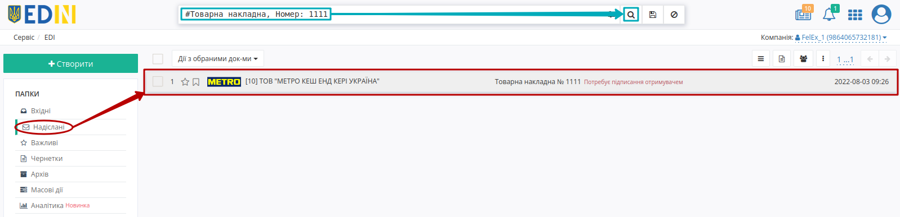

Для формування "Коригування до товарної накладної" (DOCCORINVOICE) натисніть **"Створити документ"** в блоці `ланцюжка документів <https://wiki.edin.ua/uk/latest/_constant/chain/chain.html>`__ для мережі "МЕТРО" - документ створиться автоматично.

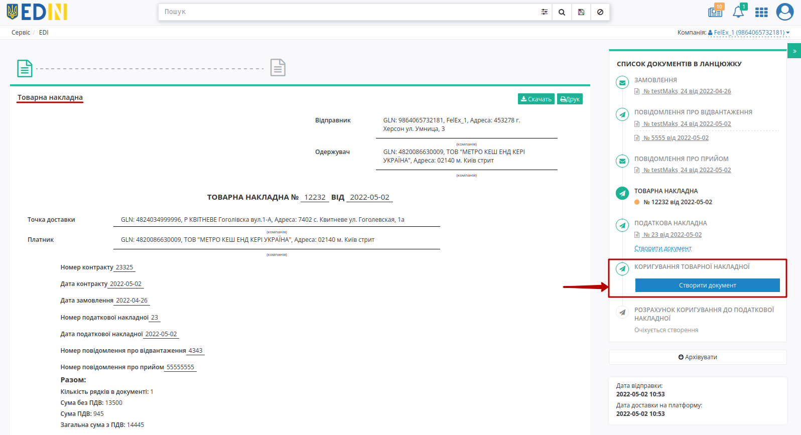

У відкритій формі "Коригування до товарної накладної" (DOCCORINVOICE) обов'язкові до заповнення поля (позначені червоною зірочкою :red:`*`) частково заповнюються автоматично з пов'язаної "Товарної накладної" (DOCUMENTINVOICE):

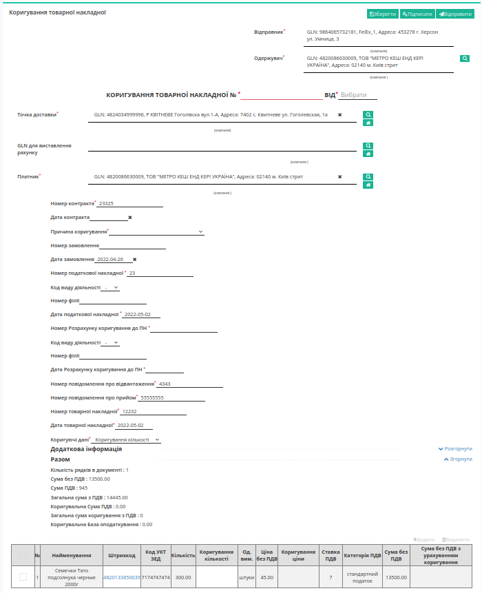

#. **Одержувач** - дані одержувача (мережі); заповнюється автоматично, можливо змінити за допомогою кнопки "Пошук контрагента" (|лупа|);
#. **Коригування товарної накладної №** - номер "Повідомлення про відвантаження";
#. **від** - дата "Коригування до товарної накладної" (DOCCORINVOICE);
#. **Точка доставки** - ідентифікатори місця доставки (GLN, адреса); заповнюється автоматично або за допомогою кнопки "Пошук контрагента" (|лупа|), або за допомогою кнопки "Вказати себе" (|будинок|);
#. **Платник** - заповнюється автоматично або за допомогою кнопки "Пошук контрагента" (|лупа|), або за допомогою кнопки "Вказати себе" (|будинок|);
#. **Номер контракту** - заповнюється автоматично з документа-підстави;
#. **Причина коригування** - потрібно обрати значення з випадаючого списку доступних варіантів (Коригування прийомки на «-» / Коригування повернення на «-» / Коригування прийомки на «+» / Коригування повернення на «+»);
   * **Коригування прийомки на «-»** / **Коригування повернення на «-»** - в блоці товарних позицій в поле "Коригування кількості" чи "Коригування ціни" потрібно вказувати значення зі знаком "-". Поля "Кількість товару за накладною" і "Ціна без ПДВ" повинні залишатися незмінними.
   * **Коригування прийомки на «+»** / **Коригування повернення на «+»** - в блоці товарних позицій в поле "Коригування кількості" чи "Коригування ціни" потрібно вказувати значення без знаків. Поля "Кількість товару за накладною" і "Ціна без ПДВ" повинні залишатися незмінними.
#. **Номер податкової накладної** - заповнюється автоматично з пов'язаного документа;
#. **Дата податкової накладної** - заповнюється автоматично з пов'язаного документа;
#. **Номер Розрахунку коригування до ПН** - номер пов'язаного "Коригування до податкової накладної" (DECLARj12);
#. **Дата Розрахунку коригування до ПН** - дата пов'язаного "Коригування до податкової накладної" (DECLARj12);
#. **Номер повідомлення про відвантаження** - заповнюється автоматично з пов'язаного документа;
#. **Номер повідомлення про прийом** - заповнюється автоматично з пов'язаного документа;
#. **Номер товарної накладної** - заповнюється автоматично з пов'язаного документа;
#. **Дата товарної накладної** - заповнюється автоматично з пов'язаного документа;
#. **Коригуючі дані** - потрібно обрати значення до коригування (Коригування ціни / Коригування кількості).

.. important::
   **Увага!** Номер вказаної накладної повинен повністю збігатися з номером оригіналу паперової накладної.

.. hint::
   За допомогою кнопки **"Пошук контрагента"** (|лупа|) або ж за допомогою кнопки **"Вказати себе"** (|будинок|) можливо вказати чи змінити дані. Для пошуку введіть назву компанії, GLN або ІПН:

   .. image:: pics_Metro_DOCCORINVOICE_DECLARJ12_instruction/Metro_DOCCORINVOICE_DECLARJ12_instruction_006.png
      :align: center

Блоки **Додаткова інформація** необов'язковий для заповнення та "згорнутий" за замовчуванням. Блок **Разом** розраховується автоматично після заповнення позицій.

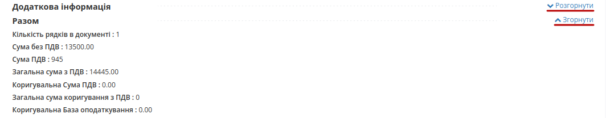

В табличній частині, в залежності від обраного значення поля "Коригуючі дані", до швидкого редагування доступне поле "Коригування кількості" або "Коригування ціни": 

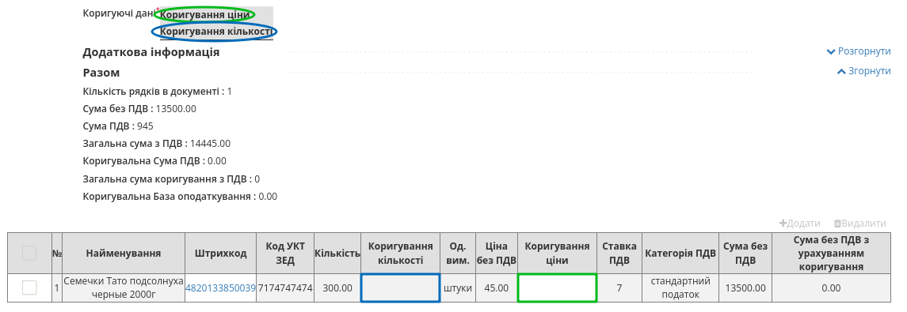

Повне редагування даних позиції доступне по натисканню на штрихкод позиції:

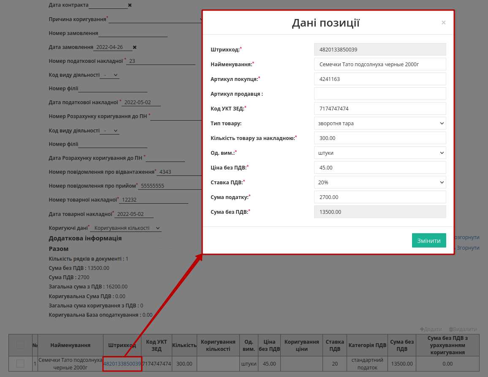

Для того, щоб поле **Код УКТ ЗЕД** при додаванні товарної позиції заповнювалось автоматично, необхідно, щоб дані були заповнені в `Товарному довіднику <https://wiki.edin.ua/uk/latest/retail_2.0/formirovanie_Tovarnogo_dovidnyka.html>`__.

Після внесення всіх даних в документ, натисніть кнопку **"Зберегти"** (1), потім **"Підписати"** (2):

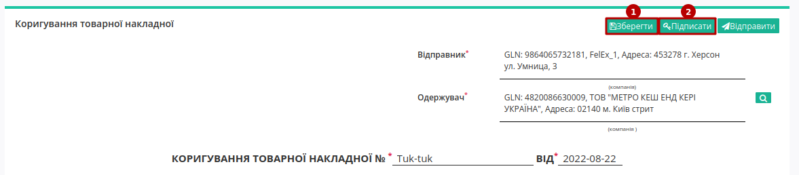

.. _sign:

**2.1 Підписання та відправка "Коригування до товарної накладної" (DOCCORINVOICE) Постачальником**
---------------------------------------------------------------------------------------------------------

.. tabs::

   .. tab:: Файловий ключ

      .. include:: /_constant/signing/signing.rst
         :start-after: .. початок блоку для Signing
         :end-before: .. кінець блоку для Signing

   .. tab:: Token

      .. include:: /_constant/token_signing/token_signing.rst
         :start-after: .. початок блоку для TokenSign
         :end-before: .. кінець блоку для TokenSign

   .. tab:: Cloud

      .. include:: /_constant/cloud_signing/cloud_signing.rst
         :start-after: .. початок блоку для CloudSign
         :end-before: .. кінець блоку для CloudSign

Після підписання "Коригування до товарної накладної" (DOCCORINVOICE) документ потрібно **"Відправити"**:

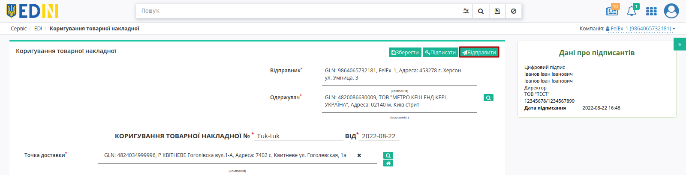

Відправлений документ автоматично потрапляє в папку **"Надіслані"** і буде знаходитись в `ланцюжку документів <https://wiki.edin.ua/uk/latest/_constant/chain/chain.html>`__ разом із пов'язаними документами. Мережа "МЕТРО" зі своєї сторони обробляє документ та надає їм статуси:

- «**Документ переданий партнеру**» - товарна накладна коректна.
- «**Документ переданий на ящик партнера**» - товарна накладна коректна.
- «**Правильний канал не знайдено. Немає з'єднання з партнером**» - в товарній накладній зазначений некоректний GLN одержувача і покупця.
- «**Помилка конвертації на вихідний формат**» - є помилка у формі заповнення товарної накладної. Деякі поля були не заповнені або заповнені некоректно.

**3 Формування "Коригування до податкової накладної" (DECLARj12)**
====================================================================================================================

"Коригування до податкової накладної" (DECLARj12) можливо створити на підставі відправленого "Коригування до товарної накладної" (DOCCORINVOICE). Для цього потрібно у папці **"Надіслані"** обрати відповідний документ (для зручності можливо скористатись `пошуком <https://wiki.edin.ua/uk/latest/general_2_0/rabota_s_platformoj_EDIN_2.0.html#doc-search>`__):

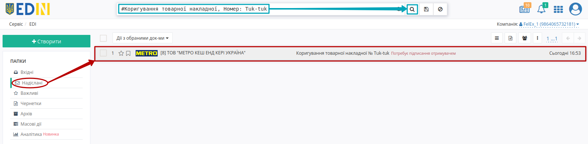

Для формування "Коригування до податкової накладної" (DECLARj12) натисніть **"Створити документ"** в блоці `ланцюжка документів <https://wiki.edin.ua/uk/latest/_constant/chain/chain.html>`__ для мережі "МЕТРО" та оберіть ставку ПДВ - документ створиться автоматично:

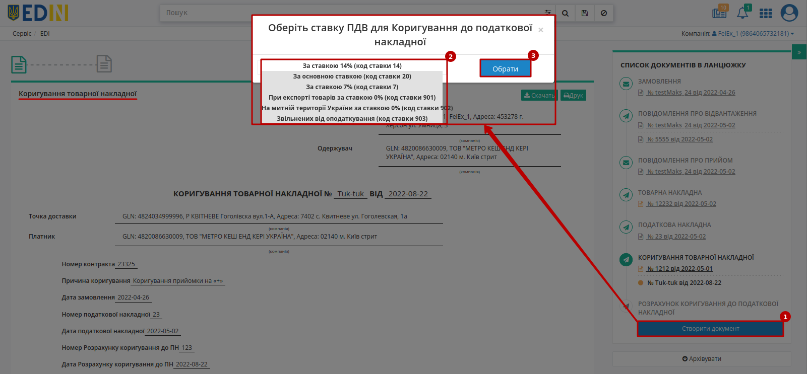

У відкритій формі "Коригування до податкової накладної" (DECLARj12) обов'язкові до заповнення поля (позначені червоною зірочкою :red:`*`) частково заповнюються автоматично з пов'язаного "Коригування до товарної накладної" (DOCCORINVOICE):

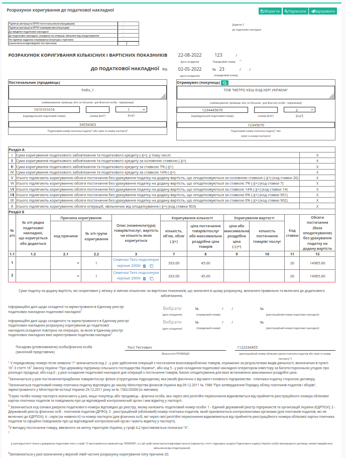

В нижній частині документа знаходиться перелік товарних позицій, які переносяться з "Коригування до товарної накладної" (DOCCORINVOICE):

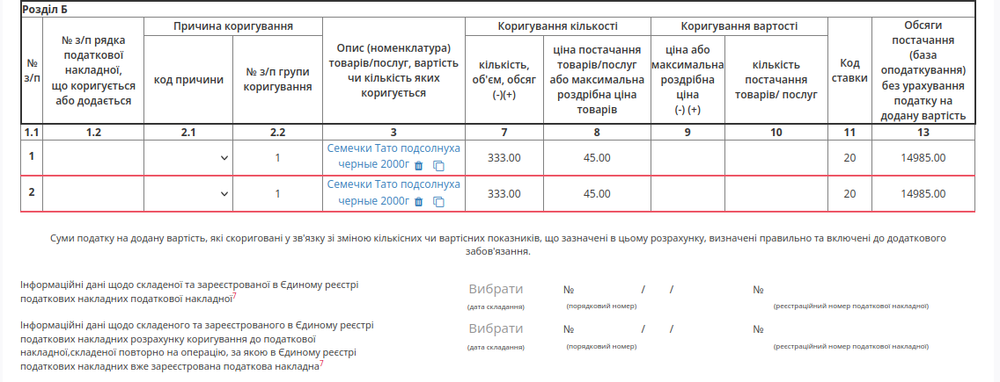

Після заповнення всіх даних документ потрібно (1) **"Зберегти"**, (2) **"Підписати"** (процес описаний в `розділі вище <https://wiki.edin.ua/uk/latest/ClientProcesses/Metro/Metro_Instructions/Metro_DOCCORINVOICE_DECLARJ12_instruction.html#sign>`__) та (3) **"Відправити"**:

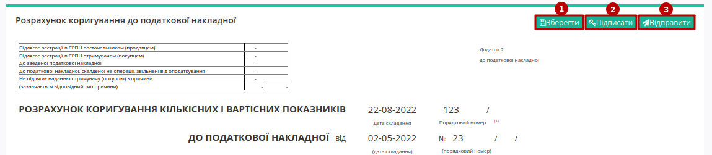

Після перевірки документа органом Державної Податкової Інспекції, йому буде присвоєно статус:

* На коректний документ надійде статус **"Зареєстровано в ЄРПН і відправлено покупцеві"**.
* На некоректний документ надійде статус  **"Помилка при реєстрації в ЄРПН"**.

---------------------------------

.. include:: /_constant/kontakti.rst
